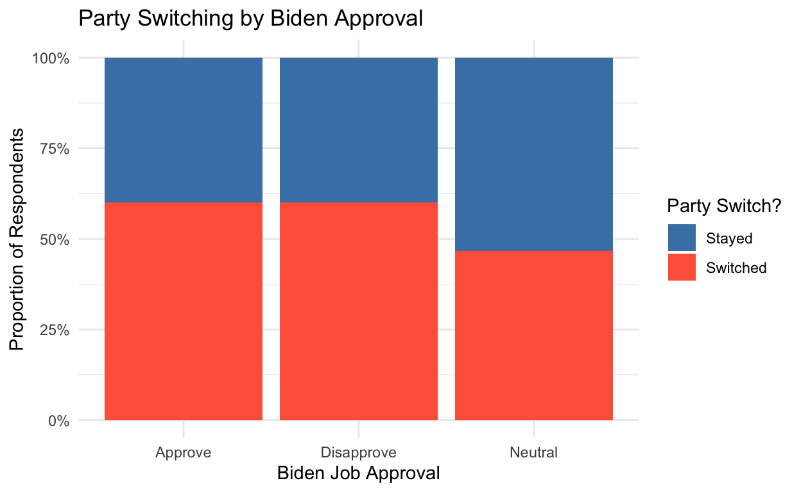
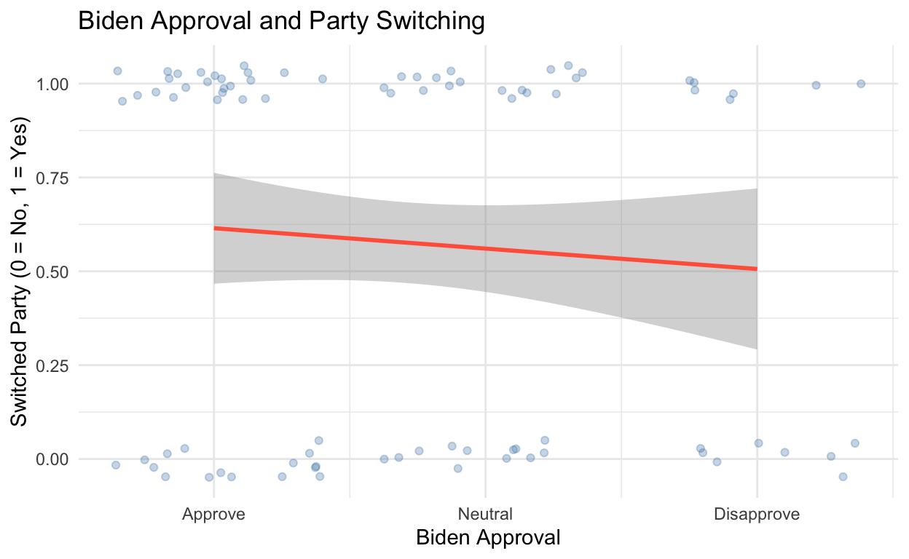

## R Markdown


Some ideas could be something that has to do with radicals and how that effects elections. 

- Did the Biden administration affect whether people voted for the same party in 2020 than they did in 2024?

Extra Stuff
- outcome variable -> party vote consistency
- explanatory variable -> perceptions toward Biden admin
- control variables -> age, education, income, race 

<div class="layout-chunk" data-layout="l-body">
<div class="sourceCode"><pre class="sourceCode r"><code class="sourceCode r"><span><span class='kw'><a href='https://rdrr.io/r/base/library.html'>library</a></span><span class='op'>(</span><span class='va'><a href='https://tidyverse.tidyverse.org'>tidyverse</a></span><span class='op'>)</span></span>
<span><span class='va'>data_2020</span> <span class='op'>&lt;-</span> <span class='fu'><a href='https://readr.tidyverse.org/reference/read_delim.html'>read_csv</a></span><span class='op'>(</span><span class='st'>"~/Downloads/anes_timeseries_2020_csv_20220210/anes_timeseries_2020_csv_20220210.csv"</span><span class='op'>)</span></span>
<span><span class='va'>data_2024</span> <span class='op'>&lt;-</span> <span class='fu'><a href='https://readr.tidyverse.org/reference/read_delim.html'>read_csv</a></span><span class='op'>(</span><span class='st'>"~/Downloads/anes_timeseries_2024_csv_20250808/anes_timeseries_2024_csv_20250808.csv"</span><span class='op'>)</span></span></code></pre></div>

</div>

## Milestone 3

Cleaning the data set and making graph with variables of the Biden administration and party voting consistency:

<div class="layout-chunk" data-layout="l-body">
<div class="sourceCode"><pre class="sourceCode r"><code class="sourceCode r"><span><span class='co'># colnames(data_2020)</span></span>
<span><span class='co'># colnames(data_2024)</span></span></code></pre></div>

</div>


Milestone 3

<div class="layout-chunk" data-layout="l-body">
<div class="sourceCode"><pre class="sourceCode r"><code class="sourceCode r"><span><span class='va'>merged_data</span> <span class='op'>&lt;-</span> <span class='fu'><a href='https://dplyr.tidyverse.org/reference/mutate-joins.html'>full_join</a></span><span class='op'>(</span><span class='va'>data_2020</span>, <span class='va'>data_2024</span>, by <span class='op'>=</span> <span class='fu'><a href='https://rdrr.io/r/base/c.html'>c</a></span><span class='op'>(</span><span class='st'>"V200001"</span> <span class='op'>=</span> <span class='st'>"V240001"</span><span class='op'>)</span><span class='op'>)</span></span>
<span><span class='va'>merged_data</span> <span class='op'>&lt;-</span> <span class='va'>merged_data</span> <span class='op'>|&gt;</span></span>
<span>  <span class='fu'><a href='https://dplyr.tidyverse.org/reference/distinct.html'>distinct</a></span><span class='op'>(</span><span class='op'>)</span></span>
<span></span>
<span><span class='va'>merged_data</span> <span class='op'>&lt;-</span> <span class='va'>merged_data</span> <span class='op'>|&gt;</span></span>
<span>  <span class='fu'><a href='https://dplyr.tidyverse.org/reference/filter.html'>filter</a></span><span class='op'>(</span><span class='va'>V202110x</span> <span class='op'>&gt;</span> <span class='fl'>0</span> <span class='op'>&amp;</span> <span class='va'>V242096x</span> <span class='op'>&gt;</span> <span class='fl'>0</span><span class='op'>)</span></span>
<span></span>
<span><span class='va'>merged_data</span> <span class='op'>&lt;-</span> <span class='va'>merged_data</span> <span class='op'>|&gt;</span></span>
<span>  <span class='fu'><a href='https://dplyr.tidyverse.org/reference/mutate.html'>mutate</a></span><span class='op'>(</span></span>
<span>    party_2020 <span class='op'>=</span> <span class='fu'><a href='https://dplyr.tidyverse.org/reference/case_when.html'>case_when</a></span><span class='op'>(</span></span>
<span>      <span class='va'>V202110x</span> <span class='op'>==</span> <span class='fl'>1</span> <span class='op'>~</span> <span class='st'>"Democrat"</span>,</span>
<span>      <span class='va'>V202110x</span> <span class='op'>==</span> <span class='fl'>2</span> <span class='op'>~</span> <span class='st'>"Republican"</span>,</span>
<span>      <span class='cn'>TRUE</span> <span class='op'>~</span> <span class='st'>"Other"</span><span class='op'>)</span>,</span>
<span>    party_2024 <span class='op'>=</span> <span class='fu'><a href='https://dplyr.tidyverse.org/reference/case_when.html'>case_when</a></span><span class='op'>(</span></span>
<span>      <span class='va'>V242096x</span> <span class='op'>==</span> <span class='fl'>1</span> <span class='op'>~</span> <span class='st'>"Democrat"</span>,</span>
<span>      <span class='va'>V242096x</span> <span class='op'>==</span> <span class='fl'>2</span> <span class='op'>~</span> <span class='st'>"Republican"</span>,</span>
<span>      <span class='cn'>TRUE</span> <span class='op'>~</span> <span class='st'>"Other"</span><span class='op'>)</span><span class='op'>)</span></span>
<span></span>
<span><span class='va'>merged_data</span> <span class='op'>&lt;-</span> <span class='va'>merged_data</span> <span class='op'>|&gt;</span></span>
<span>  <span class='fu'><a href='https://dplyr.tidyverse.org/reference/mutate.html'>mutate</a></span><span class='op'>(</span>party_switch <span class='op'>=</span> <span class='fu'><a href='https://dplyr.tidyverse.org/reference/case_when.html'>case_when</a></span><span class='op'>(</span></span>
<span>    <span class='va'>party_2020</span> <span class='op'>==</span> <span class='va'>party_2024</span> <span class='op'>~</span> <span class='st'>"Same Party"</span>,</span>
<span>    <span class='va'>party_2020</span> <span class='op'>!=</span> <span class='va'>party_2024</span> <span class='op'>~</span> <span class='st'>"Switched Party"</span>,</span>
<span>    <span class='cn'>TRUE</span> <span class='op'>~</span> <span class='cn'>NA_character_</span></span>
<span>  <span class='op'>)</span><span class='op'>)</span></span>
<span></span>
<span><span class='fu'><a href='https://pillar.r-lib.org/reference/glimpse.html'>glimpse</a></span><span class='op'>(</span><span class='va'>merged_data</span><span class='op'>)</span></span></code></pre></div>

```
Rows: 93
Columns: 3,495
$ version.x       <chr> "ANES2020TimeSeries_20220210", "ANES2020Time…
$ V200001         <dbl> 201186, 201216, 201407, 202530, 202660, 2034…
$ V160001_orig.x  <dbl> 405933, 401094, 404841, 406119, 400282, 3014…
$ V200002         <dbl> 3, 3, 3, 3, 3, 3, 3, 3, 3, 3, 3, 3, 3, 3, 3,…
$ V200003         <dbl> 2, 2, 2, 2, 2, 2, 2, 2, 2, 2, 2, 2, 2, 2, 2,…
$ V200004         <dbl> 3, 3, 3, 3, 3, 3, 3, 3, 3, 3, 3, 3, 3, 3, 3,…
$ V200005         <dbl> 0, 0, 0, 0, 0, 0, 0, 0, 0, 0, 0, 0, 0, 0, 0,…
$ V200006         <dbl> -2, -2, 3, -2, -2, -2, -2, -2, -2, -2, 4, -2…
$ V200007         <dbl> -2, -2, 4, -2, -2, -2, -2, -2, -2, -2, -1, -…
$ V200008         <dbl> -2, -2, 2, -2, -2, -2, -2, -2, -2, -2, 3, -2…
$ V200009         <dbl> 0, 0, 0, 0, 0, 0, 0, 0, 0, 0, 0, 0, 0, 0, 0,…
$ V200010a        <dbl> 2.3737168, 0.7873475, 0.6452881, 0.7256203, …
$ V200010b        <dbl> 3.2452337, 0.6513737, 0.5838382, 0.6405953, …
$ V200010c        <dbl> 1, 2, 1, 1, 2, 2, 2, 2, 2, 1, 3, 2, 1, 2, 2,…
$ V200010d        <dbl> 17, 47, 21, 10, 41, 17, 6, 9, 7, 25, 1, 17, …
$ V200011a        <dbl> 1.9259051, 0.8065025, 0.6018378, 0.6508103, …
$ V200011b        <dbl> 2.0008857, 0.7761531, 0.6196903, 0.6452233, …
$ V200011c        <dbl> 1, 2, 1, 1, 2, 2, 2, 2, 2, 1, 3, 2, 1, 2, 2,…
$ V200011d        <dbl> 17, 47, 21, 10, 41, 17, 6, 9, 7, 25, 1, 17, …
$ V200012a        <dbl> NA, NA, NA, NA, NA, NA, NA, NA, NA, NA, NA, …
$ V200012b        <dbl> NA, NA, NA, NA, NA, NA, NA, NA, NA, NA, NA, …
$ V200012c        <dbl> NA, NA, NA, NA, NA, NA, NA, NA, NA, NA, NA, …
$ V200012d        <dbl> NA, NA, NA, NA, NA, NA, NA, NA, NA, NA, NA, …
$ V200013a        <dbl> NA, NA, NA, NA, NA, NA, NA, NA, NA, NA, NA, …
$ V200013b        <dbl> NA, NA, NA, NA, NA, NA, NA, NA, NA, NA, NA, …
$ V200013c        <dbl> NA, NA, NA, NA, NA, NA, NA, NA, NA, NA, NA, …
$ V200013d        <dbl> NA, NA, NA, NA, NA, NA, NA, NA, NA, NA, NA, …
$ V200014a        <dbl> NA, NA, NA, NA, NA, NA, NA, NA, NA, NA, NA, …
$ V200014b        <dbl> NA, NA, NA, NA, NA, NA, NA, NA, NA, NA, NA, …
$ V200014c        <dbl> NA, NA, NA, NA, NA, NA, NA, NA, NA, NA, NA, …
$ V200014d        <dbl> NA, NA, NA, NA, NA, NA, NA, NA, NA, NA, NA, …
$ V200015a        <dbl> NA, NA, NA, NA, NA, NA, NA, NA, NA, NA, NA, …
$ V200015b        <dbl> NA, NA, NA, NA, NA, NA, NA, NA, NA, NA, NA, …
$ V200015c        <dbl> NA, NA, NA, NA, NA, NA, NA, NA, NA, NA, NA, …
$ V200015d        <dbl> NA, NA, NA, NA, NA, NA, NA, NA, NA, NA, NA, …
$ V200016a        <dbl> 2.3830303, 0.7800920, 0.6400810, 0.7261412, …
$ V200016b        <dbl> 3.2469022, 0.6490297, 0.5648920, 0.6241902, …
$ V200016c        <dbl> 1, 2, 1, 1, 2, 2, 2, 2, 2, 1, 3, 2, 1, 2, 2,…
$ V200016d        <dbl> 17, 47, 21, 10, 41, 17, 6, 9, 7, 25, 1, 17, …
$ V201001         <dbl> 1, 1, 1, 1, 1, 1, 1, 1, 1, 1, 1, 1, 1, 1, 1,…
$ V201002a        <dbl> -1, -1, -1, -1, -1, -1, -1, -1, -1, -1, -1, …
$ V201002b        <dbl> -1, -1, -1, -1, -1, -1, -1, -1, -1, -1, -1, …
$ V201003         <dbl> -1, -1, -1, -1, -1, -1, -1, -1, -1, -1, -1, …
$ V201004         <dbl> -1, -1, -1, -1, -1, -1, -1, -1, -1, -1, -1, …
$ V201005         <dbl> 3, 1, 2, 1, 2, 1, 2, 1, 4, 2, 1, 1, 3, 3, 1,…
$ V201006         <dbl> 3, 1, 1, 1, 3, 1, 1, 1, 3, 3, 1, 1, 2, 2, 1,…
$ V201007a        <dbl> 1, 1, 2, 2, 1, 2, 1, 2, 2, 1, 2, 2, 1, 1, 1,…
$ V201007b        <dbl> 1, 1, 1, 1, 1, 1, 1, 1, 1, 1, 1, 1, 1, 1, 1,…
$ V201007c        <dbl> 1, 1, 1, 1, 1, 1, 1, 1, 1, 1, 0, 1, 1, 1, 1,…
$ V201008         <dbl> 2, 1, 1, 1, 1, 1, 1, 1, 1, 3, 1, 1, 1, 1, 1,…
$ V201009         <dbl> -1, -1, -1, -1, -1, -1, -1, -1, -1, -1, -1, …
$ V201010         <dbl> 1, -1, -1, -1, -1, -1, -1, -1, -1, -1, -1, -…
$ V201011         <dbl> 1, -1, -1, -1, -1, -1, -1, -1, -1, -1, -1, -…
$ V201012         <dbl> 1, -1, -1, -1, -1, -1, -1, -1, -1, -1, -1, -…
$ V201013a        <dbl> 36, -1, -1, -1, -1, -1, -1, -1, -1, -1, -1, …
$ V201013b        <dbl> -1, -1, -1, -1, -1, -1, -1, -1, -1, -1, -1, …
$ V201014a        <dbl> 0, 1, 1, 1, 1, 1, 1, 1, 1, -1, 1, 1, 1, 1, 1…
$ V201014b        <dbl> 36, 15, 6, 6, 6, 37, 8, 17, 27, -1, 25, 8, 3…
$ V201014c        <dbl> 0, 0, 0, 0, 0, 1, 1, 1, 1, -2, 1, 1, 0, 1, 1…
$ V201014d        <dbl> 0, 0, 0, 0, 0, 1, 0, 0, 0, -2, 0, 0, 0, 0, 0…
$ V201014e        <dbl> 1, 0, 1, 1, 1, 1, 1, 0, 0, -2, 1, 1, 1, 1, 1…
$ V201015         <dbl> -1, -1, -1, -1, -1, -1, -1, -1, -1, -1, -1, …
$ V201015z        <dbl> -3, -3, -3, -3, -3, -3, -3, -3, -3, -3, -3, …
$ V201016         <dbl> 1, 1, 3, 3, 3, 3, 3, 3, 3, -1, 3, 2, 3, 2, 3…
$ V201017         <dbl> -3, -3, -3, -3, -3, -3, -3, -3, -3, -3, -3, …
$ V201018         <dbl> 2, -1, 2, 1, 4, 4, 4, -1, -1, -1, 2, 2, 1, 4…
$ V201018z        <dbl> -3, -3, -3, -3, -3, -3, -3, -3, -3, -3, -3, …
$ V201019         <dbl> -1, -1, -1, -1, -1, -1, -1, -1, -1, 2, -1, -…
$ V201020         <dbl> 1, 1, 1, 1, 1, 1, 1, 1, 2, 2, 2, 1, 2, 2, 1,…
$ V201021         <dbl> 8, 8, 8, 1, 10, 8, 1, 1, -1, -1, -1, 8, -1, …
$ V201022         <dbl> 2, 2, 2, 2, 2, 2, 2, 2, 2, 2, 2, 2, 2, 2, 2,…
$ V201023         <dbl> -1, -1, -1, -1, -1, -1, -1, -1, -1, -1, -1, …
$ V201024         <dbl> -1, -1, -1, -1, -1, -1, -1, -1, -1, -1, -1, …
$ V201025x        <dbl> 3, 3, 3, 3, 3, 3, 3, 3, 3, 1, 3, 3, 3, 3, 3,…
$ V201026         <dbl> -1, -1, -1, -1, -1, -1, -1, -1, -1, -1, -1, …
$ V201028         <dbl> -1, -1, -1, -1, -1, -1, -1, -1, -1, -1, -1, …
$ V201029         <dbl> -1, -1, -1, -1, -1, -1, -1, -1, -1, -1, -1, …
$ V201029z        <dbl> -2, -2, -2, -2, -2, -2, -2, -2, -2, -2, -2, …
$ V201030         <dbl> -1, -1, -1, -1, -1, -1, -1, -1, -1, -1, -1, …
$ V201031         <dbl> -2, -2, -2, -2, -2, -2, -2, -2, -2, -2, -2, …
$ V201031y        <dbl> -1, -1, -1, -1, -1, -1, -1, -1, -1, -1, -1, …
$ V201032         <dbl> 1, 1, 1, 1, 1, 1, 1, 1, 1, 2, 1, 1, 1, 1, 1,…
$ V201033         <dbl> 2, 2, 2, 1, 11, 2, 1, 1, 2, -1, 2, 2, 1, 2, …
$ V201033z        <dbl> -2, -2, -2, -2, -2, -2, -2, -2, -2, -2, -2, …
$ V201034         <dbl> 1, 1, 1, 1, 2, 1, 1, 1, 1, -1, 1, 1, 2, 2, 1…
$ V201035         <dbl> -1, -1, -1, -1, -1, -1, -1, -1, -1, 2, -1, -…
$ V201036         <dbl> -1, -1, -1, -1, -1, -1, -1, -1, -1, -1, -1, …
$ V201036z        <dbl> -2, -2, -2, -2, -2, -2, -2, -2, -2, -2, -2, …
$ V201037         <dbl> -1, -1, -1, -1, -1, -1, -1, -1, -1, -1, -1, …
$ V201038         <dbl> -1, -1, -1, -1, -1, -1, -1, -1, -1, -1, -1, …
$ V201039         <dbl> -1, -1, -1, -1, -1, -1, -1, -1, -1, -1, -1, …
$ V201039z        <dbl> -2, -2, -2, -2, -2, -2, -2, -2, -2, -2, -2, …
$ V201040         <dbl> -2, -2, -2, -2, -2, -2, -2, -2, -2, -2, -2, …
$ V201040y        <dbl> -1, -1, -1, -1, -1, -1, -1, -1, -1, -1, -1, …
$ V201041         <dbl> 2, 1, 1, 1, 1, 1, 1, 1, 1, 2, 1, 1, 1, 1, 1,…
$ V201042         <dbl> -1, 1, 2, 1, 1, 2, 1, 1, 7, -1, -1, 2, 1, 2,…
$ V201042z        <dbl> -2, -2, -2, -2, -2, -2, -2, -2, -2, -2, -2, …
$ V201043         <dbl> -2, -2, -2, -2, -2, -2, -2, -2, -2, -2, -2, …
$ V201043y        <dbl> -1, -1, -1, -1, -1, -1, -1, -1, -1, -1, 7, -…
$ V201044         <dbl> 2, -1, -1, -1, -1, -1, -1, -1, -1, 2, -1, -1…
$ V201045         <dbl> -1, -1, -1, -1, -1, -1, -1, -1, -1, -1, -1, …
$ V201045z        <dbl> -2, -2, -2, -2, -2, -2, -2, -2, -2, -2, -2, …
$ V201046         <dbl> -2, -2, -2, -2, -2, -2, -2, -2, -2, -2, -2, …
$ V201046y        <dbl> -1, -1, -1, -1, -1, -1, -1, -1, -1, -1, -1, …
$ V201047x        <dbl> 1, 1, 1, 1, 1, 31, 11, 11, 11, 10, 11, 11, 1…
$ V201048         <dbl> -1, -1, -1, -1, -1, -1, -1, -1, -1, -1, -1, …
$ V201049         <dbl> -1, -1, -1, -1, -1, -1, -1, -1, -1, -1, -1, …
$ V201049z        <dbl> -2, -2, -2, -2, -2, -2, -2, -2, -2, -2, -2, …
$ V201050         <dbl> -2, -2, -2, -2, -2, -2, -2, -2, -2, -2, -2, …
$ V201050y        <dbl> -1, -1, -1, -1, -1, -1, -1, -1, -1, -1, -1, …
$ V201051         <dbl> -1, -1, -1, -1, -1, 1, 1, 1, 1, 2, 1, 1, -1,…
$ V201052         <dbl> -1, -1, -1, -1, -1, 2, 1, 1, 7, -1, -1, 2, -…
$ V201052z        <dbl> -2, -2, -2, -2, -2, -2, -2, -2, -2, -2, -2, …
$ V201053         <dbl> -2, -2, -2, -2, -2, -2, -2, -2, -2, -2, -2, …
$ V201053y        <dbl> -1, -1, -1, -1, -1, -1, -1, -1, -1, -1, 7, -…
$ V201054         <dbl> -1, -1, -1, -1, -1, -1, -1, -1, -1, 2, -1, -…
$ V201055         <dbl> -1, -1, -1, -1, -1, -1, -1, -1, -1, -1, -1, …
$ V201055z        <dbl> -2, -2, -2, -2, -2, -2, -2, -2, -2, -2, -2, …
$ V201056         <dbl> -2, -2, -2, -2, -2, -2, -2, -2, -2, -2, -2, …
$ V201056y        <dbl> -1, -1, -1, -1, -1, -1, -1, -1, -1, -1, -1, …
$ V201057         <dbl> -1, -1, -1, -1, -1, -1, -1, -1, -1, -1, -1, …
$ V201058         <dbl> -1, -1, -1, -1, -1, -1, -1, -1, -1, -1, -1, …
$ V201058z        <dbl> -2, -2, -2, -2, -2, -2, -2, -2, -2, -2, -2, …
$ V201059         <dbl> -2, -2, -2, -2, -2, -2, -2, -2, -2, -2, -2, …
$ V201059y        <dbl> -1, -1, -1, -1, -1, -1, -1, -1, -1, -1, -1, …
$ V201060         <dbl> -1, -1, -1, -1, -1, -1, -1, -1, -1, -1, -1, …
$ V201061         <dbl> -1, -1, -1, -1, -1, -1, -1, -1, -1, -1, -1, …
$ V201061z        <dbl> -2, -2, -2, -2, -2, -2, -2, -2, -2, -2, -2, …
$ V201062         <dbl> -2, -2, -2, -2, -2, -2, -2, -2, -2, -2, -2, …
$ V201062y        <dbl> -1, -1, -1, -1, -1, -1, -1, -1, -1, -1, -1, …
$ V201063         <dbl> -1, -1, -1, -1, -1, -1, -1, -1, -1, -1, -1, …
$ V201064         <dbl> -1, -1, -1, -1, -1, -1, -1, -1, -1, -1, -1, …
$ V201064z        <dbl> -2, -2, -2, -2, -2, -2, -2, -2, -2, -2, -2, …
$ V201065         <dbl> -2, -2, -2, -2, -2, -2, -2, -2, -2, -2, -2, …
$ V201065y        <dbl> -1, -1, -1, -1, -1, -1, -1, -1, -1, -1, -1, …
$ V201066         <dbl> -1, -1, -1, -1, -1, -1, -1, -1, -1, -1, -1, …
$ V201067         <dbl> -1, -1, -1, -1, -1, -1, -1, -1, -1, -1, -1, …
$ V201067z        <dbl> -2, -2, -2, -2, -2, -2, -2, -2, -2, -2, -2, …
$ V201068         <dbl> -2, -2, -2, -2, -2, -2, -2, -2, -2, -2, -2, …
$ V201069         <dbl> -1, -1, -1, -1, -1, 1, -1, -1, -1, -1, -1, -…
$ V201070         <dbl> -1, -1, -1, -1, -1, 2, -1, -1, -1, -1, -1, -…
$ V201070z        <dbl> -2, -2, -2, -2, -2, -2, -2, -2, -2, -2, -2, …
$ V201071         <dbl> -2, -2, -2, -2, -2, -2, -2, -2, -2, -2, -2, …
$ V201071y        <dbl> -1, -1, -1, -1, -1, -1, -1, -1, -1, -1, -1, …
$ V201072         <dbl> -1, -1, -1, -1, -1, -1, -1, -1, -1, -1, -1, …
$ V201073         <dbl> -1, -1, -1, -1, -1, -1, -1, -1, -1, -1, -1, …
$ V201073z        <dbl> -2, -2, -2, -2, -2, -2, -2, -2, -2, -2, -2, …
$ V201074         <dbl> -2, -2, -2, -2, -2, -2, -2, -2, -2, -2, -2, …
$ V201074y        <dbl> -1, -1, -1, -1, -1, -1, -1, -1, -1, -1, -1, …
$ V201075x        <dbl> 21, 21, 21, 20, -1, 21, 20, 20, 21, -1, 21, …
$ V201076x        <dbl> -1, 20, 21, 20, 20, 21, 20, 20, 21, -1, 21, …
$ V201077x        <dbl> -1, -1, -1, -1, -1, 21, 20, 20, 21, -1, 21, …
$ V201078x        <dbl> -1, -1, -1, -1, -1, 21, -1, -1, -1, -1, -1, …
$ V201100         <dbl> 1, 1, 1, 1, 1, 1, 1, 1, 1, 5, 1, 1, 1, 2, 1,…
$ V201101         <dbl> 1, -1, 1, -1, 1, 1, 1, -1, -1, 2, 1, -1, 1, …
$ V201102         <dbl> -1, 1, -1, 1, -1, -1, -1, 1, 1, -1, -1, 1, -…
$ V201103         <dbl> 2, 2, 2, 1, 5, 2, 1, 1, 2, -1, 2, 2, 1, 2, 2…
$ V201103z        <dbl> -2, -2, -2, -2, -2, -2, -2, -2, -2, -2, -2, …
$ V201104         <dbl> 2, 1, 1, 1, 1, 1, 1, 1, 1, 2, 2, 2, 1, 1, 1,…
$ V201105         <dbl> -1, 1, 2, 1, 2, 2, 1, 1, 2, -1, -1, -1, 1, 1…
$ V201105z        <dbl> -2, -2, -2, -2, -2, -2, -2, -2, -2, -2, -2, …
$ V201106         <dbl> 2, 2, 2, 1, 1, 2, 1, 1, 2, 2, 2, 2, 2, 2, 2,…
$ V201107         <dbl> -2, -2, -2, -2, -2, -2, -2, -2, -2, -2, -2, …
$ V201108         <dbl> 2, 1, 1, 2, 1, 1, 2, 2, 2, 1, 1, 1, 2, 1, 1,…
$ V201109         <dbl> -2, -2, -2, -2, -2, -2, -2, -2, -2, -2, -2, …
$ V201110         <dbl> 1, 1, 1, 2, 1, 1, 2, 2, 2, 2, 1, 1, 2, 1, 1,…
$ V201111         <dbl> -2, -2, -2, -2, -2, -2, -2, -2, -2, -2, -2, …
$ V201112         <dbl> 2, 1, 2, 1, 2, 2, 1, 1, 2, 2, 2, 2, 2, 1, 2,…
$ V201113         <dbl> -2, -2, -2, -2, -2, -2, -2, -2, -2, -2, -2, …
$ V201114         <dbl> 2, 2, 2, 2, 2, 2, 2, 2, 1, 2, 1, 1, 1, 1, 2,…
$ V201115         <dbl> 3, 1, 2, 1, 3, 1, 1, 1, 1, 2, 5, 4, 3, 3, 3,…
$ V201116         <dbl> 5, 4, 4, 5, 3, 4, 4, 4, 4, 4, 2, 2, 5, 2, 4,…
$ V201117         <dbl> 5, 4, 4, 5, 3, 5, 5, 5, 4, 4, 3, 2, 5, 3, 5,…
$ V201118         <dbl> 4, 4, 4, 5, 3, 5, 4, 5, 4, 4, 3, 2, 5, 3, 5,…
$ V201119         <dbl> 1, 1, 1, 1, 3, 2, 1, 1, 1, 2, 4, 3, 1, 3, 3,…
$ V201120         <dbl> 5, 5, 3, 5, 3, 4, 5, 5, 4, 4, 2, 2, 5, 2, 4,…
$ V201121         <dbl> 1, 1, 1, 1, 3, 3, 1, 1, 1, 1, 3, 5, 1, 3, 3,…
$ V201122         <dbl> 5, 4, 3, 5, 5, 5, 5, 5, 4, 3, 5, 3, 5, 3, 5,…
$ V201123         <dbl> 5, 5, 3, 5, 4, 4, 4, 5, 4, 4, 4, 3, 5, 2, 4,…
$ V201124         <dbl> 1, 2, 2, 2, 2, 2, 2, 2, 2, 2, 2, 2, 2, 2, 2,…
$ V201125         <dbl> 2, 1, 1, 1, 1, 1, 1, 1, 1, 1, 1, 1, 1, 1, 1,…
$ V201126x        <dbl> 2, 4, 4, 4, 4, 4, 4, 4, 4, 4, 4, 4, 4, 4, 4,…
$ V201127         <dbl> 1, 1, 1, 2, 2, 1, 2, 2, 1, 2, 1, 1, 1, 1, 1,…
$ V201128         <dbl> 1, 2, 1, 1, 2, 1, 1, 2, 1, 1, 1, 1, 1, 2, 1,…
$ V201129x        <dbl> 1, 2, 1, 4, 3, 1, 4, 3, 1, 4, 1, 1, 1, 2, 1,…
$ V201130         <dbl> 1, 1, 1, 2, 1, 1, 2, 2, 1, 2, 1, 1, 1, 1, 1,…
$ V201131         <dbl> 1, 1, 1, 1, 1, 1, 1, 1, 1, 1, 1, 1, 1, 1, 1,…
$ V201132x        <dbl> 1, 1, 1, 4, 1, 1, 4, 4, 1, 4, 1, 1, 1, 1, 1,…
$ V201133         <dbl> 1, 1, 1, 2, 1, 1, 2, 2, 1, 2, 1, 1, 1, 1, 1,…
$ V201134         <dbl> 1, 2, 1, 1, 2, 1, 1, 1, 1, 1, 1, 1, 1, 1, 1,…
$ V201135x        <dbl> 1, 2, 1, 4, 2, 1, 4, 4, 1, 4, 1, 1, 1, 1, 1,…
$ V201136         <dbl> 1, 1, 1, 2, 1, 1, 2, 2, 1, 2, 1, 1, 1, 1, 1,…
$ V201137         <dbl> 1, 2, 1, 1, 2, 1, 1, 1, 2, 1, 1, 2, 2, 2, 1,…
$ V201138x        <dbl> 1, 2, 1, 4, 2, 1, 4, 4, 2, 4, 1, 2, 2, 2, 1,…
$ V201139         <dbl> 1, 1, 1, 2, 2, 1, 2, 2, 1, 2, 1, 1, 2, 1, 1,…
$ V201140         <dbl> 1, 1, 1, 1, 2, 1, 1, 1, 1, 1, 1, 1, 1, 2, 1,…
$ V201141x        <dbl> 1, 1, 1, 4, 3, 1, 4, 4, 1, 4, 1, 1, 4, 2, 1,…
$ V201142         <dbl> 1, 2, 1, 2, 1, 1, 2, 2, 1, 2, 1, 1, 1, 1, 1,…
$ V201143         <dbl> 1, 2, 1, 1, 2, 1, 1, 1, 1, 1, 1, 1, 1, 2, 1,…
$ V201144x        <dbl> 1, 3, 1, 4, 2, 1, 4, 4, 1, 4, 1, 1, 1, 2, 1,…
$ V201145         <dbl> 1, 2, 1, 1, 1, 2, 1, 1, 2, 2, 2, 2, 1, 1, 2,…
$ V201146         <dbl> 2, 2, 2, 1, 2, 1, 1, 1, 1, 1, 2, 1, 1, 1, 1,…
$ V201147x        <dbl> 2, 3, 2, 1, 2, 4, 1, 1, 4, 4, 3, 4, 1, 1, 4,…
$ V201148         <dbl> 2, 2, 1, 1, 1, 2, 1, 1, 2, 2, 2, 2, 1, 1, 2,…
$ V201149         <dbl> 1, 1, 2, 1, 1, 1, 1, 1, 2, 1, 2, 1, 1, 1, 1,…
$ V201150x        <dbl> 4, 4, 2, 1, 1, 4, 1, 1, 3, 4, 3, 4, 1, 1, 4,…
$ V201151         <dbl> 0, 30, 15, 100, 60, 0, 85, 100, 0, 100, 0, 0…
$ V201152         <dbl> 85, 60, 100, 0, 60, 85, 0, 0, 100, 0, 100, 1…
$ V201153         <dbl> 50, 0, 0, 100, 30, 0, 70, 100, 50, 100, 0, 0…
$ V201154         <dbl> 50, 70, 85, 0, 60, 85, 30, 0, 60, 70, 85, 10…
$ V201155         <dbl> 40, 60, 15, 100, 60, 0, 100, 100, 0, 100, 0,…
$ V201156         <dbl> 0, 0, 0, 100, 50, 0, 60, 70, 15, 100, 0, 0, …
$ V201157         <dbl> 100, 60, 70, 0, 50, 70, 0, 0, 85, 0, 70, 70,…
$ V201158         <dbl> 2, 2, 2, 1, 1, 2, 1, 1, 2, 1, 2, 2, 1, 1, 2,…
$ V201159         <dbl> -2, -2, -2, -2, -2, -2, -2, -2, -2, -2, -2, …
$ V201160         <dbl> 1, 1, 1, 2, 1, 1, 1, 1, 2, 2, 1, 1, 2, 1, 1,…
$ V201161         <dbl> -2, -2, -2, -2, -2, -2, -2, -2, -2, -2, -2, …
$ V201162         <dbl> 1, 1, 1, 2, 1, 1, 2, 2, 1, 2, 2, 1, 2, 1, 1,…
$ V201163         <dbl> -2, -2, -2, -2, -2, -2, -2, -2, -2, -2, -2, …
$ V201164         <dbl> 2, 1, 1, 2, 1, 1, 1, 1, 2, 2, 1, 1, 2, 1, 1,…
$ V201165         <dbl> -2, -2, -2, -2, -2, -2, -2, -2, -2, -2, -2, …
$ V201200         <dbl> 2, 5, 6, 2, 4, 6, 4, 4, 99, 7, 6, 7, 99, 5, …
$ V201201         <dbl> -1, -1, -1, -1, 2, -1, 1, 1, 2, -1, -1, -1, …
$ V201202         <dbl> 2, 2, 6, 2, 4, 1, 4, 2, 7, 7, 2, 1, 4, 3, 1,…
$ V201203         <dbl> 6, 6, 6, 7, 6, 5, 7, 6, 3, 1, 6, 7, 3, 6, 6,…
$ V201204         <dbl> 4, 4, 6, 2, 3, 2, 3, 2, 4, 5, -1, 2, 4, 3, 4…
$ V201205         <dbl> 4, 4, 6, 7, -9, 7, 6, 3, 4, 7, -1, 6, 4, 5, …
$ V201206         <dbl> 1, 1, 6, 2, 1, 1, 2, 2, 6, 7, 1, 1, 5, 2, 1,…
$ V201207         <dbl> 7, 6, 6, 7, 7, 4, 7, 7, 2, 1, 6, 6, 3, 6, 5,…
$ V201208         <dbl> 5, 5, 5, 1, 4, 5, 2, 1, 4, 1, 5, 5, 5, 4, 5,…
$ V201209         <dbl> 5, 4, 5, 1, 4, 5, 1, 1, 1, 1, 5, 5, 4, 4, 5,…
$ V201210         <dbl> 4, 5, 5, 1, 3, 5, 1, 3, 3, 1, 4, 5, 3, 3, 5,…
$ V201211         <dbl> 5, 5, 4, 1, 4, 5, 1, 2, 3, 1, 5, 5, 3, 4, 5,…
$ V201212         <dbl> 1, 3, 2, 5, 4, 4, 5, 5, 1, 5, 1, 1, 2, 3, 1,…
$ V201213         <dbl> 2, 3, 3, 5, 3, 1, 5, 5, 1, 5, 1, 1, 2, 3, 1,…
$ V201214         <dbl> 1, 4, 2, 5, 3, 2, 5, 5, 1, 5, 2, 2, 3, 3, 2,…
$ V201215         <dbl> 3, 3, 2, 5, 5, 2, 5, 5, 4, 5, 2, 1, 2, 5, 2,…
$ V201216         <dbl> 1, 1, 1, 1, 1, 1, 1, 1, 1, 2, 1, 1, 3, 2, 1,…
$ V201217         <dbl> 2, 1, 2, 1, 2, 2, 1, 1, 2, 1, 2, 2, 2, 2, 2,…
$ V201217z        <dbl> -2, -2, -2, -2, -2, -2, -2, -2, -2, -2, -2, …
$ V201218         <dbl> 1, 2, 1, 1, 1, 2, 1, 2, 1, 2, 2, 2, 2, 1, 1,…
$ V201219         <dbl> 2, 1, 1, 1, 1, 2, 1, 1, 2, 1, 1, 2, 2, 2, 1,…
$ V201219z        <dbl> -2, -2, -2, -2, -2, -2, -2, -2, -2, -2, -2, …
$ V201220         <dbl> 2, 2, 2, 2, 2, 1, 1, 2, 1, 2, 1, 1, 2, 1, 1,…
$ V201221         <dbl> 2, 1, 1, -1, -1, -1, -1, -1, -1, -1, -1, 1, …
$ V201222         <dbl> -1, -1, -1, 2, 2, 2, 1, 2, 1, 3, 1, -1, 1, -…
$ V201223         <dbl> -1, 2, 1, 1, 1, 1, -1, 1, -1, -1, -1, 1, -1,…
$ V201224         <dbl> 3, -1, -1, -1, -1, -1, 2, -1, 2, -1, 1, -1, …
$ V201225x        <dbl> 5, 2, 1, 1, 1, 1, 6, 1, 6, 4, 7, 1, 7, 1, 1,…
$ V201226         <dbl> 2, 3, 2, 1, 3, 2, 1, 1, 3, 1, 2, 3, 3, 3, 3,…
$ V201227         <dbl> 2, 3, 1, 1, 2, 2, 1, 1, 2, 2, 1, 1, 2, 2, 1,…
$ V201228         <dbl> 2, 3, 2, 1, 3, 3, 3, 1, 3, 1, 2, 2, 1, 3, 3,…
$ V201228z        <dbl> -2, -2, -2, -2, -2, -2, -2, -2, -2, -2, -2, …
$ V201229         <dbl> 1, -1, 1, 1, -1, -1, -1, 1, -1, 1, 1, 1, 2, …
$ V201230         <dbl> -1, 2, -1, -1, 1, 1, 3, -1, 1, -1, -1, -1, -…
$ V201231x        <dbl> 7, 4, 7, 1, 5, 5, 3, 1, 5, 1, 7, 7, 2, 5, 5,…
$ V201232         <dbl> 4, 2, 5, 1, 5, 2, 2, 5, 2, 2, 2, 5, 3, 3, 4,…
$ V201233         <dbl> 3, 4, 3, 4, 4, 4, 4, 4, 3, 2, 4, 5, 4, 4, 4,…
$ V201234         <dbl> 1, 1, 1, 1, 1, 1, 1, 1, 1, 1, 1, 1, 1, 1, 1,…
$ V201235         <dbl> 2, 1, 1, 1, 1, 1, 1, 1, 1, 1, 1, 1, 2, 1, 1,…
$ V201236         <dbl> 2, 3, 3, 4, 3, 2, 2, 3, 2, 2, 3, 2, 3, 2, 2,…
$ V201237         <dbl> 2, 3, 4, 2, 2, 2, 4, 3, 4, 5, 2, 3, 4, 2, 2,…
$ V201238         <dbl> 2, 2, 2, 1, 2, 2, 2, 2, 2, 1, 2, 2, 1, 2, 2,…
$ V201239         <dbl> 4, 4, 5, 1, 5, 5, 3, 2, 4, 1, 5, 5, 5, 4, 5,…
$ V201240         <dbl> 4, 4, 4, 1, 2, 5, 2, 1, 3, 2, 5, 5, 2, 4, 4,…
$ V201241         <dbl> 5, 5, 5, 1, 3, 5, 2, 1, 5, 2, 5, 5, 2, 3, 5,…
$ V201242         <dbl> 5, 5, 4, 1, 3, 5, 2, 1, 4, 2, 5, 5, 5, 4, 5,…
$ V201243         <dbl> 3, 2, 4, 1, 3, 3, 2, 1, 3, 3, 5, 4, 2, 2, 4,…
$ V201244         <dbl> 5, 3, 5, 1, 3, 5, 1, 1, 5, 2, 5, 4, 3, 3, 5,…
$ V201246         <dbl> 5, 4, 3, 6, 4, 3, 4, 5, 99, 7, 5, 2, 6, 4, 2…
$ V201247         <dbl> 1, 7, 7, 7, 6, 7, 4, 7, 4, 6, 7, 7, 4, 5, 7,…
$ V201248         <dbl> 5, 4, 4, 1, 2, 3, 1, 1, 4, 2, 5, 1, 7, 3, 2,…
$ V201249         <dbl> 99, 5, 4, 4, 4, 6, 3, 3, 99, 99, 6, 5, 6, 4,…
$ V201250         <dbl> 2, 3, 2, 5, 4, 1, 4, 2, 4, 6, 2, 1, 3, 3, 1,…
$ V201251         <dbl> 6, 6, 7, 7, 4, 6, 6, 7, 6, 5, 7, 6, 7, 5, 7,…
$ V201252         <dbl> 6, 3, 7, 1, 3, 7, 4, 4, 4, 99, 6, 6, 1, 4, 7…
$ V201253         <dbl> 1, 2, 2, 1, 4, 1, 4, 1, 4, 4, 1, 1, 3, 2, 1,…
$ V201254         <dbl> 7, 5, 5, 7, 4, 6, 7, 7, 3, 4, 5, 7, 7, 6, 7,…
$ V201255         <dbl> 5, 5, 4, 3, 7, 7, 2, 3, 99, 99, 6, 6, 4, 6, …
$ V201256         <dbl> 1, 2, 3, 2, 4, 1, 3, 2, 4, 2, 2, 1, 4, 2, 1,…
$ V201257         <dbl> 7, 6, 5, 7, 4, 7, 7, 7, 4, 6, 6, 6, 5, 7, 7,…
$ V201258         <dbl> 99, 7, 4, 2, 4, 7, 4, 3, 7, 99, 6, 7, 5, 6, …
$ V201259         <dbl> 1, 1, 2, 3, 4, 1, 4, 2, 4, 2, 3, 1, 3, 2, 1,…
$ V201260         <dbl> 4, 4, 5, 7, 4, 7, 7, 7, 4, 7, 3, 7, 4, 6, 6,…
$ V201262         <dbl> 2, 5, 7, 1, 4, 6, 1, 1, 99, 99, 6, 6, 1, 4, …
$ V201263         <dbl> 4, 2, 2, 1, 4, 1, 2, 1, 4, 1, 1, 1, 2, 2, 1,…
$ V201264         <dbl> 2, 4, 5, 7, 5, 7, 7, 7, 4, 7, 7, 7, 1, 7, 7,…
$ V201300         <dbl> 3, 3, 3, 1, 3, 1, 3, 1, 3, 1, 3, 1, 1, 1, 3,…
$ V201301         <dbl> -1, -1, -1, 1, -1, 1, -1, 1, -1, 1, -1, 2, 1…
$ V201302x        <dbl> 3, 3, 3, 1, 3, 1, 3, 1, 3, 1, 3, 2, 1, 2, 3,…
$ V201303         <dbl> 1, 2, 3, 1, 3, 2, 3, 1, 3, 1, 3, 2, 3, 3, 2,…
$ V201304         <dbl> 1, 1, -1, 1, -1, 1, -1, 1, -1, 1, -1, 1, -1,…
$ V201305x        <dbl> 1, 5, 3, 1, 3, 5, 3, 1, 3, 1, 3, 5, 3, 3, 5,…
$ V201306         <dbl> 1, 1, 1, 2, 1, 1, 1, 3, 3, 3, 1, 1, 3, 1, 1,…
$ V201307         <dbl> 1, 1, 2, 2, 2, 1, 2, -1, -1, -1, 1, 1, -1, 2…
$ V201308x        <dbl> 1, 1, 2, 4, 2, 1, 2, 3, 3, 3, 1, 1, 3, 2, 1,…
$ V201309         <dbl> 1, 1, 1, 1, 1, 1, 3, 1, 3, 3, 1, 1, 1, 3, 1,…
$ V201310         <dbl> 1, 1, 2, 1, 2, 1, -1, 1, -1, -1, 1, 2, 1, -1…
$ V201311x        <dbl> 1, 1, 2, 1, 2, 1, 3, 1, 3, 3, 1, 2, 1, 3, 2,…
$ V201312         <dbl> 2, 2, 2, 1, 3, 2, 3, 3, 3, 2, 3, 2, 2, 3, 2,…
$ V201313         <dbl> 2, 1, 2, 1, -1, 1, -1, -1, -1, 2, -1, 1, 1, …
$ V201314x        <dbl> 4, 5, 4, 1, 3, 5, 3, 3, 3, 4, 3, 5, 5, 3, 5,…
$ V201315         <dbl> 3, 1, 1, 1, 3, 1, 1, 1, 3, 1, 1, 1, 1, 1, 1,…
$ V201316         <dbl> -1, 2, 2, 1, -1, 1, 1, 1, -1, 1, 1, 1, 1, 1,…
$ V201317x        <dbl> 3, 2, 2, 1, 3, 1, 1, 1, 3, 1, 1, 1, 1, 1, 2,…
$ V201318         <dbl> 3, 2, 3, 1, 3, 2, 3, 1, 3, 1, 3, 3, 3, 3, 2,…
$ V201319         <dbl> -1, 1, -1, 1, -1, 1, -1, 1, -1, 1, -1, -1, -…
$ V201320x        <dbl> 3, 5, 3, 1, 3, 5, 3, 1, 3, 1, 3, 3, 3, 3, 5,…
$ V201321         <dbl> 1, 3, 2, 1, 3, 2, 1, 1, 3, 1, 2, 2, 3, 1, 2,…
$ V201322         <dbl> 1, -1, 1, 1, -1, 2, 1, 2, -1, 1, 1, 2, -1, 2…
$ V201323x        <dbl> 1, 3, 5, 1, 3, 4, 1, 2, 3, 1, 5, 4, 3, 2, 5,…
$ V201324         <dbl> 4, 5, 4, 4, 1, 2, 5, 4, 4, 3, 2, 2, 4, 2, 2,…
$ V201325         <dbl> 1, 3, 1, 3, 2, 2, 3, 3, 3, 3, 3, 1, 2, 3, 3,…
$ V201326         <dbl> 1, 1, 2, 1, -1, -1, 1, 2, 1, 2, 2, 1, -1, 2,…
$ V201327x        <dbl> 1, 5, 2, 5, 3, 3, 5, 4, 5, 4, 4, 1, 3, 4, 4,…
$ V201328         <dbl> 3, 1, 1, 1, 2, 1, 2, 3, 2, 3, 1, 1, 2, 2, 1,…
$ V201329         <dbl> 1, 1, 2, 2, -1, 2, -1, 2, -1, 2, 1, 2, -1, -…
$ V201330x        <dbl> 5, 1, 2, 2, 3, 2, 3, 4, 3, 4, 1, 2, 3, 3, 1,…
$ V201331         <dbl> 1, 3, 2, 3, 3, 3, 3, 3, 3, 3, 1, 3, 3, 3, 3,…
$ V201332         <dbl> 1, 1, -1, 1, 1, 1, 1, 1, 2, 2, 2, 2, 1, 1, 1…
$ V201333x        <dbl> 1, 5, 3, 5, 5, 5, 5, 5, 4, 4, 2, 4, 5, 5, 5,…
$ V201334         <dbl> 1, 2, 2, 2, 3, 2, 2, 1, 2, 2, 3, 3, 1, 2, 3,…
$ V201335         <dbl> 4, 4, 2, 5, 3, 2, 4, 3, 4, 1, 2, 1, 5, 2, 4,…
$ V201336         <dbl> 5, 4, 3, 4, 4, 3, 5, 4, 3, 1, 2, 2, 4, 5, 3,…
$ V201336z        <dbl> -2, -2, -2, -2, -2, -2, -2, -2, -2, -2, -2, …
$ V201337         <dbl> 3, 3, 2, 4, 5, 4, 3, 1, 4, 5, 4, 5, 5, 2, 3,…
$ V201338         <dbl> 4, 3, 4, 4, 4, 4, 4, 4, -9, 1, 4, 4, 4, 4, 4…
$ V201339         <dbl> 2, 3, 2, 1, 2, 2, 1, 1, -9, 2, 2, 2, 4, 3, 3…
$ V201340         <dbl> 1, 2, 3, 2, 2, 1, 2, 2, 1, 3, 1, 1, 2, 3, 1,…
$ V201341         <dbl> 2, 2, -1, 1, 1, 2, 1, 2, 2, -1, 1, 1, 2, -1,…
$ V201342x        <dbl> 2, 6, 4, 7, 7, 2, 7, 6, 2, 4, 1, 1, 6, 4, 2,…
$ V201343         <dbl> 2, 1, 1, 1, 1, 1, 1, 1, -9, 2, 1, 1, 2, 1, 1…
$ V201344         <dbl> 2, 1, 1, 1, 2, 1, 2, 1, -1, 2, 2, 1, 1, 1, 1…
$ V201345x        <dbl> 3, 1, 1, 1, 2, 1, 2, 1, -2, 3, 2, 1, 4, 1, 1…
$ V201346         <dbl> 3, 1, 3, 1, 2, 3, 1, 1, 2, 2, 3, 3, 3, 2, 3,…
$ V201347         <dbl> 2, 1, 2, 2, 2, 1, 2, 2, 1, 1, 2, 2, 1, 2, 2,…
$ V201348         <dbl> 1, 1, 1, 1, 1, 2, 1, 1, 1, 1, 1, 2, 1, 1, 1,…
$ V201349x        <dbl> 4, 1, 4, 4, 4, 2, 4, 4, 1, 1, 4, 3, 1, 4, 4,…
$ V201350         <dbl> 2, 4, 4, 2, 4, 4, 5, 4, 4, 4, 3, 2, 5, 2, 2,…
$ V201351         <dbl> 2, 3, 3, 4, 4, 1, 1, 5, 3, 4, 1, 3, 2, 4, 3,…
$ V201352         <dbl> 1, 2, 3, 5, 4, 1, 1, 5, 3, 3, 3, 3, 4, 5, 3,…
$ V201353         <dbl> 2, 2, 3, 4, 1, 2, 4, 5, -9, 2, 1, 2, 2, 1, 2…
$ V201354         <dbl> 2, 2, 2, 1, 3, 2, 1, 1, 2, 3, 2, 2, 2, 3, 2,…
$ V201355         <dbl> 1, 2, 2, 1, -1, 1, 1, 1, 2, -1, 1, 1, 1, -1,…
$ V201356x        <dbl> 7, 6, 6, 1, 4, 7, 1, 1, 6, 4, 7, 7, 7, 4, 7,…
$ V201357         <dbl> 1, 1, 1, 3, 1, 1, 1, 2, 1, 3, 1, 1, 1, 1, 1,…
$ V201358         <dbl> 1, 1, 2, -1, 1, 1, 1, 2, 1, -1, 1, 1, 1, 1, …
$ V201359x        <dbl> 1, 1, 2, 4, 1, 1, 1, 6, 1, 4, 1, 1, 1, 1, 1,…
$ V201360         <dbl> 1, 2, 1, 1, 3, 2, 3, 1, 1, 3, 2, 1, 3, 1, 3,…
$ V201361         <dbl> 3, 1, 2, 1, -1, 1, -1, 1, 1, -1, 2, 1, -1, 2…
$ V201362x        <dbl> 3, 7, 2, 1, 4, 7, 4, 1, 1, 4, 6, 1, 4, 2, 4,…
$ V201363         <dbl> 3, 3, 3, 2, 3, 1, 1, 2, 1, 3, 2, 1, 1, 3, 2,…
$ V201364         <dbl> -1, -1, -1, -1, -1, 3, 1, -1, 1, -1, -1, 3, …
$ V201365         <dbl> 3, 3, 3, 2, 2, 3, 2, 3, 3, 3, 3, 4, 3, 3, 3,…
$ V201366         <dbl> 3, 2, 3, 4, 5, 4, 5, 4, 3, 2, 5, 1, 5, 4, 5,…
$ V201367         <dbl> 5, 2, 3, 5, 5, 5, 5, 5, 5, 4, 5, 4, 5, 5, 5,…
$ V201368         <dbl> 5, 4, 4, 5, 5, 5, 5, 5, 5, 5, 5, 5, 5, 5, 5,…
$ V201369         <dbl> 5, 4, 3, 3, 5, 4, 5, 5, 4, 5, 5, 1, 5, 4, 5,…
$ V201370         <dbl> 3, 1, 2, 2, 2, 2, 2, 2, -9, 3, 3, 1, 2, 3, 2…
$ V201371         <dbl> -1, 1, 2, 1, 1, 1, 1, 1, -1, -1, -1, 1, 1, -…
$ V201372x        <dbl> 4, 1, 6, 7, 7, 7, 7, 7, -2, 4, 4, 1, 7, 4, 7…
$ V201373         <dbl> 2, 3, 3, 2, 3, 1, 2, 2, 2, 3, 2, 1, 1, 2, 1,…
$ V201374         <dbl> 3, -1, -1, 1, -1, 2, 1, 2, 2, -1, 2, 1, 2, 1…
$ V201375x        <dbl> 5, 4, 4, 7, 4, 2, 7, 6, 6, 4, 6, 1, 2, 7, 1,…
$ V201376         <dbl> 3, 1, 2, 5, 1, 1, 5, 4, 4, 1, 2, 1, 5, 1, 4,…
$ V201377         <dbl> 1, 1, 2, 5, 1, 1, 4, 2, 3, 1, 1, 1, 5, 1, 1,…
$ V201378         <dbl> 3, 4, 5, 5, 5, 3, 5, 1, 5, 3, 3, 2, 4, 1, 3,…
$ V201379         <dbl> 2, 1, 1, 1, 2, 1, 1, 2, 2, 2, 1, 2, 2, 1, 1,…
$ V201380         <dbl> 2, 1, 2, 1, 3, 3, 1, 1, 3, 3, 1, 2, 3, 3, 3,…
$ V201381         <dbl> 2, 2, 3, 1, -1, -1, 1, 1, -1, -1, 1, 2, -1, …
$ V201382x        <dbl> 6, 2, 5, 1, 4, 4, 1, 1, 4, 4, 1, 6, 4, 4, 4,…
$ V201383         <dbl> 3, 3, 2, 1, 3, 2, 1, 1, 3, 3, 2, 2, 3, 1, 2,…
$ V201384         <dbl> 2, 2, 2, 1, 2, 2, 1, 1, 2, 3, 2, 2, 3, 2, 2,…
$ V201385         <dbl> 1, 1, 1, 1, 1, 1, 1, 1, 1, -1, 1, 1, -1, 1, …
$ V201386x        <dbl> 7, 7, 7, 1, 7, 7, 1, 1, 7, 4, 7, 7, 4, 7, 7,…
$ V201387         <dbl> 1, 2, 1, 2, 1, 1, 2, 2, 1, 3, 1, 1, 3, 1, 1,…
$ V201388         <dbl> 1, 1, 1, 1, 1, 1, 1, 1, 1, -1, 1, 1, -1, 1, …
$ V201389x        <dbl> 1, 7, 1, 7, 1, 1, 7, 7, 1, 4, 1, 1, 4, 1, 1,…
$ V201390         <dbl> 3, 2, 1, 1, 2, 3, 2, 2, 3, 2, 3, 3, 2, 3, 3,…
$ V201391         <dbl> -1, 1, 2, 1, 2, -1, 1, 1, -1, 1, -1, -1, 1, …
$ V201392x        <dbl> 3, 5, 2, 1, 4, 3, 5, 5, 3, 5, 3, 3, 5, 3, 3,…
$ V201393         <dbl> 1, 5, 4, 5, 3, 1, 3, 3, 3, 3, 2, 2, 5, 3, 1,…
$ V201394         <dbl> 1, 3, 2, 2, 3, 2, 3, 3, 2, 3, 2, 2, 1, 3, 2,…
$ V201395         <dbl> 2, -1, 2, 2, -1, 1, -1, -1, 1, -1, 1, 2, 1, …
$ V201396x        <dbl> 2, 3, 4, 4, 3, 5, 3, 3, 5, 3, 5, 4, 1, 3, 5,…
$ V201397         <dbl> 1, 1, 1, 1, 1, 1, 1, 1, 1, 3, 2, 3, 1, 1, 1,…
$ V201398         <dbl> 1, 1, 1, 1, 1, 1, 1, 1, 2, -1, -1, -1, 1, 2,…
$ V201399         <dbl> -1, -1, -1, -1, -1, -1, -1, -1, -1, -1, 2, -…
$ V201400x        <dbl> 1, 1, 1, 1, 1, 1, 1, 1, 2, 3, 4, 3, 1, 2, 2,…
$ V201401         <dbl> 1, 1, 2, 1, 3, 2, 1, 1, 3, 1, 2, 3, 1, 3, 3,…
$ V201402         <dbl> 2, 2, 3, 1, -1, 1, 1, 2, -1, 1, 2, -1, 1, -1…
$ V201403         <dbl> 1, 2, 3, 1, 3, 2, 1, 1, 1, 1, 1, 3, 1, 1, 3,…
$ V201404         <dbl> 1, 1, -1, 1, -1, 2, 2, 2, 3, 1, 2, -1, 1, 2,…
$ V201405x        <dbl> 1, 7, 4, 1, 4, 6, 2, 2, 3, 1, 2, 4, 1, 2, 4,…
$ V201406         <dbl> 2, 1, 1, 2, 1, 1, 2, 2, 1, 2, 1, 1, 2, 1, 1,…
$ V201407         <dbl> 2, 3, 2, 1, 3, 1, 1, 3, 1, 3, 1, 1, 2, 1, 1,…
$ V201408x        <dbl> 5, 3, 2, 6, 3, 1, 6, 4, 1, 4, 1, 1, 5, 1, 1,…
$ V201409         <dbl> 1, 1, 1, 1, 1, 1, 2, 1, 1, 2, 1, 1, 1, 1, 1,…
$ V201410         <dbl> 3, 3, 1, 2, 3, 1, 1, 1, 1, 2, 1, 1, 1, 1, 1,…
$ V201411x        <dbl> 3, 3, 1, 2, 3, 1, 6, 1, 1, 5, 1, 1, 1, 1, 1,…
$ V201412         <dbl> 1, 2, 2, 1, 1, 2, 1, 1, 1, 2, 2, 2, 2, 1, 2,…
$ V201413         <dbl> 1, 1, 2, 1, 1, 1, 1, 2, 1, 2, 2, 1, 1, 1, 1,…
$ V201414x        <dbl> 1, 4, 3, 1, 1, 4, 1, 2, 1, 3, 3, 4, 4, 1, 4,…
$ V201415         <dbl> 1, 2, 1, 1, 1, 1, 1, 2, 1, 2, 2, 2, 2, 1, 1,…
$ V201416         <dbl> 1, 2, 2, 1, 1, 2, 1, 3, 1, 2, 2, 3, 2, 2, 2,…
$ V201417         <dbl> 1, 2, 3, 4, 2, 3, 3, 3, 3, 3, 1, 1, 3, 3, 2,…
$ V201418         <dbl> 3, 1, 3, 1, 3, 1, 1, 2, 1, 2, 1, 1, 2, 3, 1,…
$ V201419         <dbl> -1, 1, -1, 1, -1, 1, 1, 1, 2, 2, 1, 1, 1, -1…
$ V201420x        <dbl> 4, 1, 4, 1, 4, 1, 1, 7, 2, 6, 1, 1, 7, 4, 1,…
$ V201421         <dbl> 2, 2, 2, 2, 2, 2, 2, 2, 2, 2, 2, 1, 2, 2, 1,…
$ V201422         <dbl> 3, 2, 2, 1, 1, 3, 2, 1, 2, 1, 1, 1, 1, 1, 2,…
$ V201423x        <dbl> 4, 5, 5, 6, 6, 4, 5, 6, 5, 6, 6, 1, 6, 6, 2,…
$ V201424         <dbl> 1, 1, 1, 2, 3, 1, 2, 2, 1, 2, 1, 1, 3, 1, 1,…
$ V201425         <dbl> 3, 1, 1, 1, -1, 1, 1, 1, 1, 2, 1, 1, -1, 2, …
$ V201426x        <dbl> 3, 1, 1, 7, 4, 1, 7, 7, 1, 6, 1, 1, 4, 2, 1,…
$ V201427         <dbl> 2, 1, 2, 3, 2, 2, 1, 1, 1, 1, 2, 1, 1, 1, 1,…
$ V201428         <dbl> 4, 5, 5, 1, 4, 4, 1, 2, -9, 2, 4, 5, 3, 5, 4…
$ V201429         <dbl> 6, 7, 7, 5, 3, 7, 1, 1, 1, 99, 7, 7, 7, 4, 7…
$ V201430         <dbl> 1, 1, 1, 3, 3, 1, 2, 3, 3, 1, 1, 1, 1, 3, 1,…
$ V201431         <dbl> 1, 1, 1, -1, -1, 2, 1, -1, -1, 1, 1, 1, 1, -…
$ V201432x        <dbl> 1, 1, 1, 3, 3, 2, 5, 3, 3, 1, 1, 1, 1, 3, 1,…
$ V201433         <dbl> 4, 5, 5, 2, 3, 2, 5, 1, 1, 1, 3, 1, 3, 3, 5,…
$ V201434         <dbl> 5, 3, 3, 2, 2, 2, 5, 1, 1, 1, 2, 1, 2, 2, 3,…
$ V201434z        <dbl> -2, -2, -2, -2, -2, -2, -2, -2, -2, -2, -2, …
$ V201435         <dbl> 12, 9, 12, 1, 1, 2, 12, 11, 2, 2, 2, 11, 11,…
$ V201436         <dbl> 4, -1, 4, -1, -1, -1, 4, -1, -1, -1, -1, -1,…
$ V201437         <dbl> -3, -3, -3, -3, -3, -3, -3, -3, -3, -3, -3, …
$ V201437z        <dbl> -3, -3, -3, -3, -3, -3, -3, -3, -3, -3, -3, …
$ V201438         <dbl> -3, -3, -3, -3, -3, -3, -3, -3, -3, -3, -3, …
$ V201438z        <dbl> -3, -3, -3, -3, -3, -3, -3, -3, -3, -3, -3, …
$ V201439         <dbl> -3, -3, -3, -3, -3, -3, -3, -3, -3, -3, -3, …
$ V201439z        <dbl> -3, -3, -3, -3, -3, -3, -3, -3, -3, -3, -3, …
$ V201440         <dbl> -3, -3, -3, -3, -3, -3, -3, -3, -3, -3, -3, …
$ V201440z        <dbl> -3, -3, -3, -3, -3, -3, -3, -3, -3, -3, -3, …
$ V201441         <dbl> -3, -3, -3, -3, -3, -3, -3, -3, -3, -3, -3, …
$ V201441z        <dbl> -3, -3, -3, -3, -3, -3, -3, -3, -3, -3, -3, …
$ V201442         <dbl> -3, -3, -3, -3, -3, -3, -3, -3, -3, -3, -3, …
$ V201442z        <dbl> -3, -3, -3, -3, -3, -3, -3, -3, -3, -3, -3, …
$ V201443         <dbl> -3, -3, -3, -3, -3, -3, -3, -3, -3, -3, -3, …
$ V201443z        <dbl> -3, -3, -3, -3, -3, -3, -3, -3, -3, -3, -3, …
$ V201444         <dbl> -3, -3, -3, -3, -3, -3, -3, -3, -3, -3, -3, …
$ V201444z        <dbl> -3, -3, -3, -3, -3, -3, -3, -3, -3, -3, -3, …
$ V201445         <dbl> -3, -3, -3, -3, -3, -3, -3, -3, -3, -3, -3, …
$ V201445z        <dbl> -3, -3, -3, -3, -3, -3, -3, -3, -3, -3, -3, …
$ V201446         <dbl> -3, -3, -3, -3, -3, -3, -3, -3, -3, -3, -3, …
$ V201447         <dbl> -3, -3, -3, -3, -3, -3, -3, -3, -3, -3, -3, …
$ V201447z        <dbl> -3, -3, -3, -3, -3, -3, -3, -3, -3, -3, -3, …
$ V201448         <dbl> -3, -3, -3, -3, -3, -3, -3, -3, -3, -3, -3, …
$ V201449         <dbl> -3, -3, -3, -3, -3, -3, -3, -3, -3, -3, -3, …
$ V201450         <dbl> -3, -3, -3, -3, -3, -3, -3, -3, -3, -3, -3, …
$ V201451         <dbl> -3, -3, -3, -3, -3, -3, -3, -3, -3, -3, -3, …
$ V201451z        <dbl> -3, -3, -3, -3, -3, -3, -3, -3, -3, -3, -3, …
$ V201452         <dbl> 2, 2, 2, 1, 2, 2, 2, 2, 1, 1, 2, 1, 1, 1, 2,…
$ V201453         <dbl> -1, -1, -1, 1, -1, -1, -1, -1, 1, 1, -1, 1, …
$ V201454         <dbl> -1, -1, -1, 1, -1, -1, -1, -1, 1, 2, -1, 2, …
$ V201456         <dbl> -1, -1, -1, 2, 2, 2, -1, 1, -9, 2, 2, 1, 1, …
$ V201457x        <dbl> 880, 881, 880, 270, 220, 400, 880, 292, 400,…
$ V201458x        <dbl> 9, 9, 9, 1, 1, 5, 9, 2, 5, 5, 5, 6, 2, 5, 6,…
$ V201459         <dbl> 4, -1, 4, 4, 4, 4, 4, 4, -9, 4, 4, 1, 4, 4, …
$ V201460         <dbl> -1, -1, -1, -1, -1, -1, -1, -1, -1, -1, -1, …
$ V201461         <dbl> -1, -1, -1, -1, -1, -1, -1, -1, -1, -1, -1, …
$ V201462         <dbl> 12, 13, 13, 6, 13, 5, 12, 13, 13, 13, 5, 5, …
$ V201501         <dbl> 1, 1, 1, 1, 1, 1, 0, 3, 0, 0, 0, 1, 2, 1, 1,…
$ V201502         <dbl> 3, 3, 3, 3, 3, 3, 3, 5, 3, 3, 3, 3, 3, 3, 3,…
$ V201503         <dbl> 3, 4, 3, 3, 3, 3, 3, 2, 4, 3, 3, 2, 3, 3, 3,…
$ V201504         <dbl> -3, -3, -3, -3, -3, -3, -3, -3, -3, -3, -3, …
$ V201505         <dbl> -3, -3, -3, -3, -3, -3, -3, -3, -3, -3, -3, …
$ V201506         <dbl> -3, -3, -3, -3, -3, -3, -3, -3, -3, -3, -3, …
$ V201507x        <dbl> 24, 61, 80, 78, -9, 69, 74, 55, 80, 80, 57, …
$ V201508         <dbl> 6, 1, 1, 1, 1, 1, 3, 6, 3, 3, 4, 1, 1, 1, 1,…
$ V201509         <dbl> 1, -1, -1, -1, -1, -1, 2, 2, 2, 2, 2, -1, -1…
$ V201510         <dbl> 6, 6, 8, 7, 6, 7, 3, 7, 3, 1, 6, 3, 2, 7, 7,…
$ V201510z        <dbl> -2, -2, -2, -2, -2, -2, -2, -2, -2, -2, -2, …
$ V201511x        <dbl> 4, 4, 5, 5, 4, 5, 3, 5, 3, 1, 4, 3, 2, 5, 5,…
$ V201512         <dbl> -1, -1, -1, -1, -1, -1, -1, -1, -1, -1, -1, …
$ V201513         <dbl> 5, 7, 7, 5, 6, 5, -1, -1, -1, -1, -1, 4, 2, …
$ V201513z        <dbl> -3, -3, -3, -3, -3, -3, -3, -3, -3, -3, -3, …
$ V201514x        <dbl> 4, 5, 5, 4, 5, 4, -1, -1, -1, -1, -1, 3, 2, …
$ V201515         <dbl> -1, -1, -1, -1, -1, -1, -1, -1, -1, -1, -1, …
$ V201516         <dbl> 3, 3, 3, 3, 3, 3, 3, 3, 3, 3, 2, 2, 3, 3, 3,…
$ V201517         <dbl> 1, 2, 2, 2, 1, 2, 2, 2, 2, 2, 2, 2, 1, 1, 2,…
$ V201518         <dbl> -1, 2, 2, 2, -1, 2, 2, 2, 2, 2, 2, 2, -1, -1…
$ V201519         <dbl> -1, 2, 2, 2, -1, 2, 2, 2, 2, 2, 2, 2, -1, -1…
$ V201520         <dbl> -1, 2, 2, 2, -1, 2, 2, 2, 2, 2, 2, 2, -1, -1…
$ V201521         <dbl> -1, -1, -1, -1, -1, -1, -1, -1, -1, -1, -1, …
$ V201522         <dbl> -1, 2, 2, 2, -1, 2, 2, 1, 2, 2, 2, 2, -1, -1…
$ V201523         <dbl> -1, -1, -1, -1, -1, -1, -1, 1, -1, -1, -1, -…
$ V201524         <dbl> -1, 2, 3, 2, -1, 3, 3, 1, 3, 3, 3, 3, -1, -1…
$ V201525         <dbl> 1, -1, -1, -1, 2, -1, -1, 1, -1, -1, -1, -1,…
$ V201526         <dbl> -1, -1, -1, -1, 15, -1, -1, -1, -1, -1, -1, …
$ V201527         <dbl> 40, -1, -1, -1, 4, -1, -1, 40, -1, -1, -1, -…
$ V201528         <dbl> 3, -1, -1, -1, 3, -1, -1, 3, -1, -1, -1, -1,…
$ V201529         <dbl> 1, 1, 7, 3, 7, 2, -9, 1, -9, 1, 2, 7, 1, 1, …
$ V201530         <dbl> -3, -3, -3, -3, -3, -3, -3, -3, -3, -3, -3, …
$ V201530y        <dbl> -3, -3, -3, -3, -3, -3, -3, -3, -3, -3, -3, …
$ V201531         <dbl> -3, -3, -3, -3, -3, -3, -3, -3, -3, -3, -3, …
$ V201531y        <dbl> -3, -3, -3, -3, -3, -3, -3, -3, -3, -3, -3, …
$ V201532         <dbl> -3, -3, -3, -3, -3, -3, -3, -3, -3, -3, -3, …
$ V201533x        <dbl> 17, 50, 50, 50, 10, 50, 50, 10, 50, 50, 60, …
$ V201534x        <dbl> 1, 5, 5, 5, 1, 5, 5, 1, 5, 5, 6, 5, 1, 1, 5,…
$ V201537a        <dbl> 1, 0, 0, 0, 0, 0, 0, 0, 0, 0, 0, 0, 0, 0, 0,…
$ V201537b        <dbl> 0, 1, 1, 1, 0, 1, 1, 0, 1, 1, 0, 1, 0, 0, 1,…
$ V201537c        <dbl> 0, 0, 0, 0, 0, 0, 0, 0, 0, 0, 1, 1, 0, 0, 0,…
$ V201537d        <dbl> 0, 0, 0, 0, 0, 0, 0, 0, 0, 0, 0, 0, 0, 0, 0,…
$ V201537e        <dbl> 0, 0, 0, 0, 1, 0, 0, 1, 0, 0, 0, 0, 1, 1, 0,…
$ V201538         <dbl> -1, 5, 2, 2, -1, 3, 4, -1, 1, 1, -1, 1, -1, …
$ V201539         <dbl> 2, -1, -1, -1, 2, -1, -1, 1, -1, -1, -1, -1,…
$ V201540         <dbl> 1, -1, -1, -1, 1, -1, -1, 5, -1, -1, -1, -1,…
$ V201541         <dbl> 2, -1, -1, -1, 2, -1, -1, 1, -1, -1, -1, -1,…
$ V201542         <dbl> 1, 1, 5, 5, 5, 5, -1, -1, -1, -1, -1, 1, 2, …
$ V201543         <dbl> -3, -3, -3, -3, -3, -3, -3, -3, -3, -3, -3, …
$ V201544         <dbl> 2, 1, 2, 2, 2, 2, 2, 2, 2, 2, 2, 2, 1, 2, 2,…
$ V201545         <dbl> -1, 1, -1, -1, -1, -1, -1, -1, -1, -1, -1, -…
$ V201546         <dbl> 2, 2, 2, 2, 2, 2, 2, 2, 2, 1, 2, 2, 1, 2, 2,…
$ V201547a        <dbl> -3, -3, -3, -3, -3, -3, -3, -3, -3, -3, -3, …
$ V201547b        <dbl> -3, -3, -3, -3, -3, -3, -3, -3, -3, -3, -3, …
$ V201547c        <dbl> -3, -3, -3, -3, -3, -3, -3, -3, -3, -3, -3, …
$ V201547d        <dbl> -3, -3, -3, -3, -3, -3, -3, -3, -3, -3, -3, …
$ V201547e        <dbl> -3, -3, -3, -3, -3, -3, -3, -3, -3, -3, -3, …
$ V201547z        <dbl> -3, -3, -3, -3, -3, -3, -3, -3, -3, -3, -3, …
$ V201549x        <dbl> 1, 5, 4, 1, 1, 1, 1, 2, 1, 3, 1, 6, 3, 1, 1,…
$ V201550         <dbl> -3, -3, -3, -3, -3, -3, -3, -3, -3, -3, -3, …
$ V201551         <dbl> -1, -1, -1, -1, -1, -1, -1, -1, -1, -1, -1, …
$ V201552         <dbl> -3, -3, -3, -3, -3, -3, -3, -3, -3, -3, -3, …
$ V201553         <dbl> 1, 1, 3, 1, 1, 1, 3, 1, 1, 3, 1, 1, 3, 1, 1,…
$ V201554         <dbl> 1, 1, 4, 1, 1, 1, 4, 1, 1, 1, 1, 1, 4, 1, 1,…
$ V201554z        <dbl> -3, -3, -3, -3, -3, -3, -3, -3, -3, -3, -3, …
$ V201555         <dbl> 1, 4, 2, 1, 0, 4, 4, 0, 0, 4, 0, 4, 4, 0, 4,…
$ V201556         <dbl> -3, -3, -3, -3, -3, -3, -3, -3, -3, -3, -3, …
$ V201556z        <dbl> -3, -3, -3, -3, -3, -3, -3, -3, -3, -3, -3, …
$ V201557         <dbl> -3, -3, -3, -3, -3, -3, -3, -3, -3, -3, -3, …
$ V201558x        <dbl> 7, 7, 7, 7, 7, 7, 7, 7, 7, 1, 7, 7, 3, 7, 7,…
$ V201559         <dbl> -1, -1, -1, -1, -1, -1, -1, -1, -1, -1, -1, …
$ V201560         <dbl> -3, -3, -3, -3, -3, -3, -3, -3, -3, -3, -3, …
$ V201561         <dbl> -3, -3, -3, -3, -3, -3, -3, -3, -3, -3, -3, …
$ V201562         <dbl> -1, -1, -1, -1, -1, -1, -1, -1, -1, 3, -1, -…
$ V201563         <dbl> 2, 2, 2, 2, 2, 2, 2, -1, 2, 1, 2, 2, 1, 2, 2…
$ V201564a        <dbl> -3, -3, -3, -3, -3, -3, -3, -3, -3, -3, -3, …
$ V201564b        <dbl> -3, -3, -3, -3, -3, -3, -3, -3, -3, -3, -3, …
$ V201564c        <dbl> -3, -3, -3, -3, -3, -3, -3, -3, -3, -3, -3, …
$ V201564d        <dbl> -3, -3, -3, -3, -3, -3, -3, -3, -3, -3, -3, …
$ V201564e        <dbl> -3, -3, -3, -3, -3, -3, -3, -3, -3, -3, -3, …
$ V201565x        <dbl> 1, 1, 4, 1, 1, 1, 1, -1, -9, 3, 1, 1, 3, 1, …
$ V201566         <dbl> 1, 2, 2, 1, 1, 1, 1, -1, 1, 1, 2, 2, 2, 1, 2…
$ V201567         <dbl> 0, 0, 0, 0, 0, 0, 0, 0, 0, 0, 0, 0, 0, 0, 0,…
$ V201568a        <dbl> -1, -1, -1, -1, -1, -1, -1, -1, -1, -1, -1, …
$ V201568b        <dbl> -1, -1, -1, -1, -1, -1, -1, -1, -1, -1, -1, …
$ V201568c        <dbl> -1, -1, -1, -1, -1, -1, -1, -1, -1, -1, -1, …
$ V201568d        <dbl> -1, -1, -1, -1, -1, -1, -1, -1, -1, -1, -1, …
$ V201568e        <dbl> -1, -1, -1, -1, -1, -1, -1, -1, -1, -1, -1, …
$ V201569         <dbl> 1, 1, 1, 1, 1, 1, 1, 1, 2, 2, 1, 1, 1, 1, 1,…
$ V201570         <dbl> -1, -1, -1, -1, -1, -1, -1, -1, 2, 2, -1, -1…
$ V201571         <dbl> 2, 2, 1, 1, 2, 1, 1, 1, 1, 1, 2, 2, 2, 1, 2,…
$ V201572         <dbl> 1, 1, 1, 1, 1, 1, 1, 1, 1, 1, 1, 1, 2, 1, 1,…
$ V201573         <dbl> -1, -1, -1, -1, -1, -1, -1, -1, -1, -1, -1, …
$ V201574         <dbl> 1, 1, 1, 1, 1, 1, 2, 1, 1, 2, 1, 1, 1, 1, 1,…
$ V201575         <dbl> 4, 26, 59, 6, 16, 36, 59, 17, 27, 48, 25, 8,…
$ V201575z        <dbl> -3, -3, -3, -3, -3, -3, -3, -3, -3, -3, -3, …
$ V201576         <dbl> 3, 1, 15, 40, 28, 25, 36, 18, 8, 40, 40, 5, …
$ V201577         <dbl> -3, -3, -3, -3, -3, -3, -3, -3, -3, -3, -3, …
$ V201579         <dbl> -3, -3, -3, -3, -3, -3, -3, -3, -3, -3, -3, …
$ V201580         <dbl> -3, -3, -3, -3, -3, -3, -3, -3, -3, -3, -3, …
$ V201581         <dbl> -1, -1, 3, 2, -1, 2, 1, -1, -1, -1, -1, 2, -…
$ V201582         <dbl> 2, 1, -1, -1, 1, -1, -1, 2, -9, -9, 2, -1, 2…
$ V201583         <dbl> -1, 2, -1, -1, 2, -1, -1, -1, -1, -1, -1, -1…
$ V201584         <dbl> 2, 2, 2, 1, 1, 2, 1, 2, -9, 1, 2, 2, 2, 2, 2…
$ V201585         <dbl> -3, -3, -3, -3, -3, -3, -3, -3, -3, -3, -3, …
$ V201586         <dbl> 2, 2, 2, 2, 1, 1, 1, 2, -9, 2, 2, 2, 2, 2, 2…
$ V201587         <dbl> 0, 1, 15, 19, 28, 17, 10, 18, 40, 40, 4, 5, …
$ V201588         <dbl> -3, -3, -3, -3, -3, -3, -3, -3, -3, -3, -3, …
$ V201589         <dbl> 1, 1, 1, 1, 1, 1, 1, 1, 1, 1, 2, 1, 1, 1, 1,…
$ V201590         <dbl> 1, 1, 1, 1, 1, 2, 1, 1, 2, 2, 2, 1, 1, 1, 1,…
$ V201591         <dbl> -1, -1, -1, -1, -1, -1, -1, -1, -1, -1, 1, -…
$ V201592         <dbl> 2, 2, 2, 2, 2, 2, 2, 1, 2, 2, 2, 2, 2, 2, 2,…
$ V201593         <dbl> 1, 5, 1, 1, 1, 2, 3, 4, 5, 1, 2, 1, 1, 2, 1,…
$ V201594         <dbl> 5, 3, 5, 5, 5, 4, 4, 1, 1, 5, 5, 5, 3, 4, 4,…
$ V201595         <dbl> 1, -1, -1, 5, -1, 1, 2, 4, -1, -1, 1, 1, 3, …
$ V201596         <dbl> 1, 1, 2, 2, 1, 2, 1, 1, 1, 1, 2, 2, 2, 2, 2,…
$ V201600         <dbl> 2, 1, 1, 2, 2, 2, 2, 2, 2, 2, 1, 1, 1, 2, 1,…
$ V201601         <dbl> 1, 1, 1, 1, 1, 1, 3, 1, -9, 1, 1, 1, 1, 1, 1…
$ V201601z        <dbl> -2, -2, -2, -2, -2, -2, -2, -2, -2, -2, -2, …
$ V201602         <dbl> 1, 1, 5, 1, 1, 1, 1, 1, 1, 1, 1, 5, 1, 1, 1,…
$ V201603         <dbl> 1, 1, 1, 1, 1, 1, 1, 1, 3, 1, 1, 1, 3, 1, 1,…
$ V201604         <dbl> 2, 1, 1, 1, 1, 1, 1, 1, -1, 1, 1, 1, -1, 3, …
$ V201605x        <dbl> 2, 1, 1, 1, 1, 1, 1, 1, 4, 1, 1, 1, 4, 3, 1,…
$ V201606         <dbl> 1, 1, 1, 1, 1, 1, 2, 1, -9, 2, 2, 2, 2, 1, 1…
$ V201607         <dbl> -3, -3, -3, -3, -3, -3, -3, -3, -3, -3, -3, …
$ V201608         <dbl> -3, -3, -3, -3, -3, -3, -3, -3, -3, -3, -3, …
$ V201609         <dbl> -3, -3, -3, -3, -3, -3, -3, -3, -3, -3, -3, …
$ V201610         <dbl> -3, -3, -3, -3, -3, -3, -3, -3, -3, -3, -3, …
$ V201611         <dbl> -3, -3, -3, -3, -3, -3, -3, -3, -3, -3, -3, …
$ V201612         <dbl> -3, -3, -3, -3, -3, -3, -3, -3, -3, -3, -3, …
$ V201613         <dbl> -3, -3, -3, -3, -3, -3, -3, -3, -3, -3, -3, …
$ V201614         <dbl> -3, -3, -3, -3, -3, -3, -3, -3, -3, -3, -3, …
$ V201615         <dbl> -3, -3, -3, -3, -3, -3, -3, -3, -3, -3, -3, …
$ V201616         <dbl> -3, -3, -3, -3, -3, -3, -3, -3, -3, -3, -3, …
$ V201617x        <dbl> 20, 13, 22, 20, -9, 17, 2, 15, 2, 1, 7, 20, …
$ V201618         <dbl> 3, 3, 4, 5, 4, 2, 4, 3, 5, 3, 3, 5, 3, 3, 4,…
$ V201619         <dbl> 2, 2, 4, 5, 5, 2, 4, 2, 5, 4, 3, 3, 3, 3, 3,…
$ V201620         <dbl> 1, 1, 1, 1, 1, 1, 1, 2, 1, 1, 1, 1, 1, 1, 1,…
$ V201621         <dbl> 1, 2, 1, 1, 1, 1, 3, -1, 5, 4, 1, 1, 3, 2, 1…
$ V201622         <dbl> 1, 2, 1, 1, 1, 1, 3, 5, 5, 4, 1, 1, 3, 2, 1,…
$ V201623         <dbl> 1, 3, 4, 2, 2, 2, 4, 3, 4, 3, 3, 2, 3, 2, 1,…
$ V201624         <dbl> 2, 2, 2, 2, 2, 2, 2, 2, 2, 2, 2, 2, 2, 2, 2,…
$ V201625         <dbl> 1, 2, 2, 2, 2, 2, 2, 1, 2, 2, 2, 2, 2, 2, 2,…
$ V201626         <dbl> 2, 4, 3, 1, 2, 4, 3, 1, -9, 3, 4, 4, 1, 3, 4…
$ V201627         <dbl> 2, 4, 1, 3, 1, 3, 1, 2, -9, 1, 3, 1, 2, 2, 1…
$ V201628         <dbl> 1, 3, 0, 0, -9, -9, 0, 0, -9, 0, -9, 0, 0, 5…
$ V201629a        <dbl> 1, 1, 0, 1, 1, 1, 1, 1, -9, 1, 1, 0, 1, 1, 1…
$ V201629b        <dbl> 0, 0, 0, 1, 0, 1, 0, 0, -9, 0, 0, 0, 1, 1, 1…
$ V201629c        <dbl> 1, 1, 1, 1, 1, 1, 1, 1, -9, 0, 1, 0, 1, 1, 1…
$ V201629d        <dbl> 1, 1, 1, 1, 0, 1, 0, 1, -9, 1, 0, 0, 0, 1, 1…
$ V201629e        <dbl> 0, 0, 0, 0, 0, 0, 0, 0, -9, 0, 0, 1, 0, 0, 0…
$ V201630a        <dbl> 0, 0, -1, 0, 0, 0, 0, 0, -1, 0, 0, -1, 0, 0,…
$ V201630b        <dbl> 0, 0, -1, 0, 0, 0, 0, 0, -1, 0, 1, -1, 0, 0,…
$ V201630c        <dbl> 0, 1, -1, 0, 0, 0, 0, 0, -1, 0, 1, -1, 0, 0,…
$ V201630d        <dbl> 0, 0, -1, 1, 0, 0, 0, 1, -1, 0, 0, -1, 0, 0,…
$ V201630e        <dbl> 0, 0, -1, 0, 0, 0, 0, 0, -1, 0, 0, -1, 0, 0,…
$ V201630f        <dbl> 0, 0, -1, 0, 0, 0, 0, 0, -1, 0, 1, -1, 0, 0,…
$ V201630g        <dbl> 0, 1, -1, 0, 0, 0, 0, 0, -1, 0, 1, -1, 0, 0,…
$ V201630h        <dbl> 0, 1, -1, 0, 0, 0, 0, 0, -1, 0, 1, -1, 0, 0,…
$ V201630i        <dbl> 0, 0, -1, 0, 0, 0, 0, 0, -1, 0, 0, -1, 0, 0,…
$ V201630j        <dbl> 0, 1, -1, 0, 0, 0, 0, 0, -1, 0, 0, -1, 0, 0,…
$ V201630k        <dbl> 0, 0, -1, 0, 0, 0, 0, 0, -1, 0, 0, -1, 0, 0,…
$ V201630m        <dbl> 0, 0, -1, 0, 0, 0, 0, 0, -1, 0, 0, -1, 0, 0,…
$ V201630n        <dbl> 0, 0, -1, 1, 0, 0, 0, 1, -1, 0, 0, -1, 0, 0,…
$ V201630p        <dbl> 0, 0, -1, 1, 0, 0, 0, 0, -1, 0, 0, -1, 0, 0,…
$ V201630q        <dbl> 0, 0, -1, 0, 0, 0, 0, 0, -1, 0, 0, -1, 0, 0,…
$ V201630r        <dbl> 0, 0, -1, 0, 0, 0, 0, 0, -1, 0, 0, -1, 0, 1,…
$ V201630s        <dbl> 1, 0, -1, 0, 0, 1, 1, 0, -1, 1, 0, -1, 0, 0,…
$ V201631a        <dbl> 0, 0, -1, 0, 0, 0, 0, 0, -1, 0, 0, -1, 0, 0,…
$ V201631b        <dbl> 0, 0, -1, 0, 0, 0, 0, 0, -1, 0, 0, -1, 0, 0,…
$ V201631c        <dbl> 0, 0, -1, 0, 1, 0, 0, 0, -1, 0, 0, -1, 0, 0,…
$ V201631d        <dbl> 0, 0, -1, 0, 0, 0, 0, 0, -1, 0, 0, -1, 0, 0,…
$ V201631e        <dbl> 0, 0, -1, 0, 1, 0, 0, 0, -1, 0, 0, -1, 0, 0,…
$ V201631f        <dbl> 0, 0, -1, 1, 0, 0, 0, 0, -1, 0, 0, -1, 0, 0,…
$ V201631g        <dbl> 0, 0, -1, 0, 0, 0, 0, 0, -1, 0, 0, -1, 0, 0,…
$ V201631h        <dbl> 0, 0, -1, 0, 0, 0, 0, 0, -1, 0, 0, -1, 0, 0,…
$ V201631i        <dbl> 0, 0, -1, 0, 0, 0, 0, 0, -1, 0, 0, -1, 0, 0,…
$ V201631j        <dbl> 0, 0, -1, 0, 0, 0, 0, 0, -1, 0, 0, -1, 1, 0,…
$ V201631k        <dbl> 0, 1, -1, 0, 0, 0, 0, 0, -1, 0, 1, -1, 0, 0,…
$ V201631m        <dbl> 0, 0, -1, 0, 0, 0, 0, 0, -1, 0, 0, -1, 0, 0,…
$ V201631n        <dbl> 0, 0, -1, 1, 0, 0, 0, 0, -1, 0, 0, -1, 0, 0,…
$ V201631p        <dbl> 0, 0, -1, 0, 0, 0, 0, 0, -1, 0, 0, -1, 0, 0,…
$ V201631q        <dbl> 0, 0, -1, 0, 0, 0, 0, 0, -1, 0, 0, -1, 0, 0,…
$ V201631r        <dbl> 0, 0, -1, 0, 0, 0, 0, 0, -1, 0, 0, -1, 0, 0,…
$ V201631s        <dbl> 1, 0, -1, 0, 0, 0, 0, 0, -1, 1, 1, -1, 0, 1,…
$ V201632a        <dbl> -1, -1, -1, -1, -1, -1, -1, -1, -1, 0, -1, -…
$ V201632b        <dbl> -1, -1, -1, -1, -1, -1, -1, -1, -1, 0, -1, -…
$ V201632c        <dbl> -1, -1, -1, -1, -1, -1, -1, -1, -1, 0, -1, -…
$ V201632d        <dbl> -1, -1, -1, -1, -1, -1, -1, -1, -1, 0, -1, -…
$ V201632e        <dbl> -1, -1, -1, -1, -1, -1, -1, -1, -1, 0, -1, -…
$ V201632f        <dbl> -1, -1, -1, -1, -1, -1, -1, -1, -1, 0, -1, -…
$ V201632g        <dbl> -1, -1, -1, -1, -1, -1, -1, -1, -1, 0, -1, -…
$ V201632h        <dbl> -1, -1, -1, -1, -1, -1, -1, -1, -1, 0, -1, -…
$ V201632i        <dbl> -1, -1, -1, -1, -1, -1, -1, -1, -1, 0, -1, -…
$ V201632j        <dbl> -1, -1, -1, -1, -1, -1, -1, -1, -1, 0, -1, -…
$ V201632k        <dbl> -1, -1, -1, -1, -1, -1, -1, -1, -1, 0, -1, -…
$ V201632m        <dbl> -1, -1, -1, -1, -1, -1, -1, -1, -1, 0, -1, -…
$ V201632n        <dbl> -1, -1, -1, -1, -1, -1, -1, -1, -1, 0, -1, -…
$ V201632p        <dbl> -1, -1, -1, -1, -1, -1, -1, -1, -1, 0, -1, -…
$ V201632q        <dbl> -1, -1, -1, -1, -1, -1, -1, -1, -1, 0, -1, -…
$ V201632r        <dbl> -1, -1, -1, -1, -1, -1, -1, -1, -1, 0, -1, -…
$ V201632s        <dbl> -1, -1, -1, -1, -1, -1, -1, -1, -1, 1, -1, -…
$ V201633a        <dbl> 0, 0, 1, 0, -1, 0, -1, 0, -1, 0, -1, -1, -1,…
$ V201633b        <dbl> 0, 1, 1, 0, -1, 0, -1, 0, -1, 0, -1, -1, -1,…
$ V201633c        <dbl> 0, 0, 0, 0, -1, 0, -1, 0, -1, 0, -1, -1, -1,…
$ V201633d        <dbl> 0, 1, 0, 0, -1, 0, -1, 0, -1, 0, -1, -1, -1,…
$ V201633e        <dbl> 0, 0, 0, 0, -1, 0, -1, 0, -1, 0, -1, -1, -1,…
$ V201633f        <dbl> 0, 0, 0, 0, -1, 0, -1, 0, -1, 0, -1, -1, -1,…
$ V201633g        <dbl> 0, 0, 0, 0, -1, 0, -1, 0, -1, 0, -1, -1, -1,…
$ V201633h        <dbl> 0, 0, 0, 0, -1, 0, -1, 0, -1, 0, -1, -1, -1,…
$ V201633i        <dbl> 0, 0, 0, 0, -1, 0, -1, 0, -1, 0, -1, -1, -1,…
$ V201633j        <dbl> 0, 0, 0, 0, -1, 0, -1, 0, -1, 0, -1, -1, -1,…
$ V201633k        <dbl> 0, 0, 0, 0, -1, 0, -1, 0, -1, 0, -1, -1, -1,…
$ V201633m        <dbl> 0, 0, 0, 0, -1, 0, -1, 0, -1, 0, -1, -1, -1,…
$ V201633n        <dbl> 0, 0, 0, 0, -1, 0, -1, 0, -1, 0, -1, -1, -1,…
$ V201633p        <dbl> 0, 0, 0, 0, -1, 0, -1, 0, -1, 0, -1, -1, -1,…
$ V201633q        <dbl> 0, 0, 0, 0, -1, 0, -1, 0, -1, 0, -1, -1, -1,…
$ V201633r        <dbl> 0, 0, 0, 0, -1, 0, -1, 0, -1, 0, -1, -1, -1,…
$ V201634a        <dbl> 0, 1, 0, 0, 0, 0, 0, 1, -1, -1, 1, -1, 1, 1,…
$ V201634b        <dbl> 0, 0, 0, 0, 0, 0, 0, 1, -1, -1, 0, -1, 0, 0,…
$ V201634c        <dbl> 0, 0, 0, 0, 0, 0, 0, 1, -1, -1, 0, -1, 0, 0,…
$ V201634d        <dbl> 0, 0, 0, 0, 0, 0, 0, 0, -1, -1, 0, -1, 0, 0,…
$ V201634e        <dbl> 0, 1, 0, 0, 0, 1, 0, 0, -1, -1, 1, -1, 0, 0,…
$ V201634f        <dbl> 1, 0, 1, 0, 0, 0, 0, 0, -1, -1, 1, -1, 0, 0,…
$ V201634g        <dbl> 0, 0, 0, 1, 0, 0, 0, 0, -1, -1, 0, -1, 0, 0,…
$ V201634h        <dbl> 0, 0, 0, 0, 0, 0, 0, 0, -1, -1, 0, -1, 0, 0,…
$ V201634i        <dbl> 0, 0, 0, 0, 0, 0, 0, 1, -1, -1, 1, -1, 0, 0,…
$ V201634j        <dbl> 0, 0, 0, 0, 1, 0, 0, 0, -1, -1, 0, -1, 0, 1,…
$ V201634k        <dbl> 0, 0, 0, 0, 0, 0, 0, 0, -1, -1, 0, -1, 0, 1,…
$ V201634m        <dbl> 0, 0, 0, 0, 0, 0, 0, 0, -1, -1, 1, -1, 0, 0,…
$ V201634n        <dbl> 0, 0, 0, 0, 0, 0, 0, 0, -1, -1, 0, -1, 0, 0,…
$ V201634p        <dbl> 0, 0, 0, 0, 0, 0, 0, 0, -1, -1, 0, -1, 0, 0,…
$ V201634q        <dbl> 0, 0, 0, 0, 0, 0, 0, 0, -1, -1, 0, -1, 0, 0,…
$ V201634r        <dbl> 0, 0, 1, 0, 0, 0, 0, 0, -1, -1, 0, -1, 0, 1,…
$ V201634s        <dbl> 0, 0, 0, 0, 0, 0, 0, 0, -1, -1, 0, -1, 0, 0,…
$ V201635a        <dbl> -1, -1, -1, 1, -1, 0, -1, -1, -1, -1, -1, -1…
$ V201635b        <dbl> -1, -1, -1, 0, -1, 0, -1, -1, -1, -1, -1, -1…
$ V201635c        <dbl> -1, -1, -1, 1, -1, 0, -1, -1, -1, -1, -1, -1…
$ V201635d        <dbl> -1, -1, -1, 1, -1, 0, -1, -1, -1, -1, -1, -1…
$ V201635e        <dbl> -3, -3, -3, -3, -3, -3, -3, -3, -3, -3, -3, …
$ V201635f        <dbl> -3, -3, -3, -3, -3, -3, -3, -3, -3, -3, -3, …
$ V201635g        <dbl> -3, -3, -3, -3, -3, -3, -3, -3, -3, -3, -3, …
$ V201635h        <dbl> -3, -3, -3, -3, -3, -3, -3, -3, -3, -3, -3, …
$ V201635i        <dbl> -3, -3, -3, -3, -3, -3, -3, -3, -3, -3, -3, …
$ V201635j        <dbl> -3, -3, -3, -3, -3, -3, -3, -3, -3, -3, -3, …
$ V201635k        <dbl> -1, -1, -1, 0, -1, 1, -1, -1, -1, -1, -1, -1…
$ V201636a        <dbl> -1, -1, -1, 1, -1, 0, -1, -1, -1, -1, -1, -1…
$ V201636b        <dbl> -1, -1, -1, 0, -1, 0, -1, -1, -1, -1, -1, -1…
$ V201636c        <dbl> -1, -1, -1, 0, -1, 1, -1, -1, -1, -1, -1, -1…
$ V201636d        <dbl> -1, -1, -1, 1, -1, 0, -1, -1, -1, -1, -1, -1…
$ V201636e        <dbl> -3, -3, -3, -3, -3, -3, -3, -3, -3, -3, -3, …
$ V201636f        <dbl> -3, -3, -3, -3, -3, -3, -3, -3, -3, -3, -3, …
$ V201636g        <dbl> -3, -3, -3, -3, -3, -3, -3, -3, -3, -3, -3, …
$ V201636h        <dbl> -3, -3, -3, -3, -3, -3, -3, -3, -3, -3, -3, …
$ V201636i        <dbl> -3, -3, -3, -3, -3, -3, -3, -3, -3, -3, -3, …
$ V201636j        <dbl> -3, -3, -3, -3, -3, -3, -3, -3, -3, -3, -3, …
$ V201636k        <dbl> -1, -1, -1, 0, -1, 0, -1, -1, -1, -1, -1, -1…
$ V201637x        <dbl> 0, 1, 0, 0, 0, 0, 0, 0, 0, 0, 0, 0, 0, 0, 0,…
$ V201639         <dbl> 3, 1, 3, 2, 3, 3, 3, 5, -9, 2, 1, 3, 3, 2, 3…
$ V201640         <dbl> 4, 2, 3, 5, 3, 3, 4, 5, -9, 2, 2, 2, 3, 4, 3…
$ V201641         <dbl> 1, 1, 1, 1, 1, 1, 1, 1, 1, 1, 1, 1, 1, 1, 1,…
$ V201642         <dbl> 1999, 1970, 1967, 1994, 1900, 1955, -9, 1990…
$ V201643         <dbl> -1, -1, -1, -1, -1, -1, -1, -1, -1, -1, -1, …
$ V201644         <dbl> 4, 4, 6, 6, 4, 7, 6, 4, 4, 2, 6, 6, 8, 2, 6,…
$ V201645         <dbl> 4, 1, 1, 2, 2, 4, 1, 4, 4, 4, 1, 2, 3, 1, 1,…
$ V201646         <dbl> 2, 1, 1, 1, 1, 1, 1, 1, 1, 1, 1, 1, 2, 1, 1,…
$ V201647         <dbl> 2, 2, 2, 2, 2, 2, 2, 2, 1, 1, 2, 2, 2, 2, 2,…
$ V201648         <dbl> 5, 4, 4, 5, 5, 5, 5, 5, 4, 3, 5, 5, 5, 5, 5,…
$ V201649         <dbl> 3, 4, 4, 1, 2, 2, 1, 2, 7, 6, 4, 4, 1, 4, 2,…
$ V201650         <dbl> 5, 5, 5, 5, 5, 5, 5, 5, 5, 5, 5, 5, 5, 5, 5,…
$ V201651         <dbl> 4, 3, 3, 1, 2, 2, 2, 2, 3, 3, 3, 1, 2, 3, 1,…
$ V201652         <dbl> -2, -2, -2, -2, -2, -2, -2, -2, -2, -2, -2, …
$ V201653         <dbl> -1, -1, -1, -1, -1, -1, -1, -1, -1, -1, -1, …
$ V201654         <dbl> -1, -1, -1, -1, -1, -1, -1, -1, -1, -1, -1, …
$ V201655         <dbl> -1, -1, -1, -1, -1, -1, -1, -1, -1, -1, -1, …
$ V201656         <dbl> -1, -1, -1, -1, -1, -1, -1, -1, -1, -1, -1, …
$ V201657         <dbl> -1, -1, -1, -1, -1, -1, -1, -1, -1, -1, -1, …
$ V201658a        <dbl> -1, -1, -1, -1, -1, -1, -1, -1, -1, -1, -1, …
$ V201658b        <dbl> -1, -1, -1, -1, -1, -1, -1, -1, -1, -1, -1, …
$ V201658c        <dbl> -1, -1, -1, -1, -1, -1, -1, -1, -1, -1, -1, …
$ V201658d        <dbl> -1, -1, -1, -1, -1, -1, -1, -1, -1, -1, -1, …
$ V201658e        <dbl> -1, -1, -1, -1, -1, -1, -1, -1, -1, -1, -1, …
$ V201658f        <dbl> -1, -1, -1, -1, -1, -1, -1, -1, -1, -1, -1, …
$ V201658g        <dbl> -1, -1, -1, -1, -1, -1, -1, -1, -1, -1, -1, …
$ V201658h        <dbl> -1, -1, -1, -1, -1, -1, -1, -1, -1, -1, -1, …
$ V201658i        <dbl> -1, -1, -1, -1, -1, -1, -1, -1, -1, -1, -1, …
$ V201658j        <dbl> -1, -1, -1, -1, -1, -1, -1, -1, -1, -1, -1, …
$ V201658k        <dbl> -1, -1, -1, -1, -1, -1, -1, -1, -1, -1, -1, …
$ V201658m        <dbl> -1, -1, -1, -1, -1, -1, -1, -1, -1, -1, -1, …
$ V201658n        <dbl> -1, -1, -1, -1, -1, -1, -1, -1, -1, -1, -1, …
$ V201658p        <dbl> -1, -1, -1, -1, -1, -1, -1, -1, -1, -1, -1, …
$ V202001         <dbl> 1, 1, 1, 1, 1, 1, 1, 1, 1, 1, 1, 1, 1, 1, 1,…
$ V202002a        <dbl> -1, -1, -1, -1, -1, -1, -1, -1, -1, -1, -1, …
$ V202002b        <dbl> -1, -1, -1, -1, -1, -1, -1, -1, -1, -1, -1, …
$ V202003         <dbl> -1, -1, -1, -1, -1, -1, -1, -1, -1, -1, -1, …
$ V202004         <dbl> 1, -1, -1, 1, -1, -1, 1, 2, -1, 2, -1, 2, -1…
$ V202005         <dbl> -1, 1, 2, -1, 2, 1, -1, -1, 2, -1, 2, -1, 1,…
$ V202006         <dbl> 3, 3, -1, 1, -1, 2, 3, -1, -1, -1, -1, -1, 1…
$ V202007         <dbl> 2, 1, 2, 2, 2, 1, 1, 2, 2, 2, 2, 1, 2, 1, 2,…
$ V202008         <dbl> 2, 1, 2, 1, 1, 1, 1, 2, 2, 2, 2, 2, 1, 1, 2,…
$ V202009         <dbl> 1, 1, 2, 2, 2, 1, 1, 1, 2, 2, 2, 1, 2, 2, 1,…
$ V202010         <dbl> -1, -1, -1, -1, -1, 1, -1, -1, -1, 2, -1, -1…
$ V202011         <dbl> -1, -1, -1, -1, -1, 1, -1, -1, -1, -1, -1, -…
$ V202012         <dbl> -1, -1, -1, -1, -1, -1, -1, -1, -1, -1, -1, …
$ V202013         <dbl> 2, 2, 2, 2, 2, 1, 2, 2, 2, 2, 1, 1, 1, 2, 1,…
$ V202014         <dbl> 2, 2, 2, 2, 2, 2, 2, 2, 2, 2, 2, 2, 2, 2, 2,…
$ V202015         <dbl> 2, 2, 2, 1, 2, 2, 2, 2, 2, 2, 2, 1, 2, 2, 1,…
$ V202016         <dbl> 2, 2, 2, 2, 2, 2, 2, 2, 2, 2, 2, 1, 2, 2, 2,…
$ V202017         <dbl> 2, 2, 2, 2, 2, 1, 1, 1, 2, 2, 1, 1, 2, 2, 1,…
$ V202018         <dbl> -3, -3, -3, -3, -3, -3, -3, -3, -3, -3, -3, …
$ V202019         <dbl> 2, 2, 2, 2, 2, 2, 2, 1, 2, 2, 1, 2, 2, 2, 2,…
$ V202020         <dbl> -3, -3, -3, -3, -3, -3, -3, -3, -3, -3, -3, …
$ V202021         <dbl> 2, 2, 2, 2, 2, 2, 2, 2, 2, 2, 2, 1, 2, 2, 2,…
$ V202022         <dbl> 1, 1, 2, 1, 1, 1, 1, 1, 2, 1, 1, 1, 1, 1, 1,…
$ V202023         <dbl> 7, 7, -1, 7, 3, 7, 2, 2, -1, 1, 7, 4, 5, 4, …
$ V202024         <dbl> 1, 1, 2, 1, 1, 1, 1, 1, 2, 2, 1, 1, 1, 1, 1,…
$ V202025         <dbl> 2, 2, 2, 2, 2, 2, 2, 2, 2, 2, 2, 2, 2, 2, 2,…
$ V202026         <dbl> 2, 2, 2, 2, 2, 2, 1, 2, 2, 2, 2, 1, 2, 2, 2,…
$ V202027         <dbl> 2, 2, 2, 2, 1, 1, 2, 1, 1, 2, 2, 1, 2, 1, 2,…
$ V202028         <dbl> 2, 2, 2, 2, 2, 2, 1, 2, 2, 2, 1, 1, 2, 1, 2,…
$ V202029         <dbl> 2, 1, 2, 2, 2, 1, 1, 2, 2, 2, 2, 1, 2, 2, 1,…
$ V202030         <dbl> 2, 2, 2, 2, 1, 2, 2, 2, 2, 2, 2, 2, 2, 1, 2,…
$ V202031         <dbl> 2, 1, 2, 2, 2, 2, 2, 2, 2, 2, 2, 1, 2, 1, 2,…
$ V202032         <dbl> 2, 2, 2, 2, 2, 2, 2, 2, 2, 2, 2, 2, 2, 1, 2,…
$ V202033         <dbl> 2, 2, 2, 2, 1, 2, 1, 1, 2, 2, 2, 1, 2, 1, 2,…
$ V202034         <dbl> 2, 2, 2, 2, 1, 1, 1, 2, 2, 2, 2, 1, 2, 1, 2,…
$ V202035         <dbl> -2, -2, -2, -2, -2, -2, -2, -2, -2, -2, -2, …
$ V202036         <dbl> 2, 2, 2, 2, 2, 2, 2, 2, 2, 2, 2, 2, 2, 2, 2,…
$ V202037         <dbl> -2, -2, -2, -2, -2, -2, -2, -2, -2, -2, -2, …
$ V202038         <dbl> 2, 2, 2, 2, 2, 2, 2, 2, 2, 2, 2, 2, 2, 1, 2,…
$ V202039         <dbl> -2, -2, -2, -2, -2, -2, -2, -2, -2, -2, -2, …
$ V202040         <dbl> 2, 2, 2, 2, 2, 2, 1, 2, 2, 2, 2, 2, 2, 2, 2,…
$ V202041         <dbl> -2, -2, -2, -2, -2, -2, -2, -2, -2, -2, -2, …
$ V202042         <dbl> 2, 3, 1, 2, 2, 5, 2, 5, 1, 2, 4, 4, 1, 2, 2,…
$ V202043         <dbl> 2, -1, -1, -1, -1, 2, -1, -1, -1, -1, -1, -1…
$ V202044         <dbl> -1, -1, -1, -1, -1, -1, -1, -1, -1, -1, -1, …
$ V202045         <dbl> -1, -1, -1, -1, -1, -1, -1, -1, -1, -1, -1, …
$ V202050a        <dbl> 1, 1, 2, 2, 1, 2, 1, 2, 2, 1, 2, 2, 1, 1, 1,…
$ V202050b        <dbl> 1, 1, 1, 1, 1, 1, 1, 1, 1, 1, 1, 1, 1, 1, 1,…
$ V202050c        <dbl> 1, 1, 1, 1, 1, 1, 1, 1, 1, 1, 1, 1, 1, 1, 1,…
$ V202051         <dbl> -1, -1, -1, -1, -1, -1, -1, -1, -1, 1, -1, -…
$ V202052         <dbl> -1, -1, -1, -1, -1, -1, -1, -1, -1, -1, -1, …
$ V202053a        <dbl> -1, -1, -1, -1, -1, -1, -1, -1, -1, -1, -1, …
$ V202053b        <dbl> -1, -1, -1, -1, -1, -1, -1, -1, -1, -1, -1, …
$ V202053c        <dbl> -1, -1, -1, -1, -1, -1, -1, -1, -1, -1, -1, …
$ V202054a        <dbl> -1, -1, -1, -1, -1, -1, -1, -1, -1, -1, -1, …
$ V202054b        <dbl> -1, -1, -1, -1, -1, -1, -1, -1, -1, -1, -1, …
$ V202054c        <dbl> -1, -1, -1, -1, -1, -1, -1, -1, -1, 48, -1, …
$ V202054x        <dbl> 36, 15, 6, 6, 6, 37, 8, 17, 27, 48, 25, 8, 3…
$ V202055a        <dbl> -1, -1, -1, -1, -1, -1, -1, -1, -1, 1, -1, -…
$ V202055b        <dbl> -1, -1, -1, -1, -1, -1, -1, -1, -1, 1, -1, -…
$ V202055c        <dbl> -1, -1, -1, -1, -1, -1, -1, -1, -1, 0, -1, -…
$ V202055d        <dbl> -1, -1, -1, -1, -1, -1, -1, -1, -1, 0, -1, -…
$ V202056         <dbl> 3, 4, 4, 4, 4, 4, 4, 4, 4, 4, 4, 4, 4, 4, 4,…
$ V202060         <dbl> -1, -1, -1, -1, -1, -1, -1, -1, -1, -1, -1, …
$ V202060z        <dbl> -3, -3, -3, -3, -3, -3, -3, -3, -3, -3, -3, …
$ V202061         <dbl> -1, -1, -1, -1, -1, -1, -1, -1, -1, 3, -1, -…
$ V202061x        <dbl> 1, 1, 3, 3, 3, 3, 3, 3, 3, 3, 3, 2, 3, 2, 3,…
$ V202062         <dbl> -3, -3, -3, -3, -3, -3, -3, -3, -3, -3, -3, …
$ V202063x        <dbl> 1, 1, 1, 1, 1, 1, 1, 1, 1, 1, 1, 1, 1, 1, 1,…
$ V202064         <dbl> -1, -1, -1, -1, -1, -1, -1, -1, -1, -1, -1, …
$ V202064z        <dbl> -3, -3, -3, -3, -3, -3, -3, -3, -3, -3, -3, …
$ V202065x        <dbl> 2, -1, 2, 1, 4, 4, 4, -1, -1, -1, 2, 2, 1, 4…
$ V202066         <dbl> 4, 4, 4, 4, 4, 4, 4, 4, 4, 4, 4, 4, 4, 4, 4,…
$ V202068x        <dbl> 2, 2, 2, 2, 2, 2, 2, 2, 2, 2, 2, 2, 2, 2, 2,…
$ V202072         <dbl> 1, 1, 1, 1, 1, 1, 1, 1, 1, 1, 1, 1, 1, 1, 1,…
$ V202073         <dbl> 2, 2, 2, 1, 2, 2, 1, 1, 2, 1, 2, 2, 1, 2, 2,…
$ V202073z        <dbl> -2, -2, -2, -2, -2, -2, -2, -2, -2, -2, -2, …
$ V202074         <dbl> 1, 1, 1, 1, 2, 1, 1, 1, 1, 1, 1, 1, 2, 2, 1,…
$ V202075         <dbl> -2, -2, -2, -2, -2, -2, -2, -2, -2, -2, -2, …
$ V202075y        <dbl> 11, 11, 12, 9, 2, 11, 11, 11, 11, 13, 11, 11…
$ V202076         <dbl> -1, -1, -1, -1, -1, -1, -1, -1, -1, -1, -1, …
$ V202077         <dbl> -1, -1, -1, -1, -1, -1, -1, -1, -1, -1, -1, …
$ V202077z        <dbl> -2, -2, -2, -2, -2, -2, -2, -2, -2, -2, -2, …
$ V202078         <dbl> -1, -1, -1, -1, -1, -1, -1, -1, -1, -1, -1, …
$ V202079x        <dbl> -1, -1, -1, -1, -1, -1, -1, -1, -1, -1, -1, …
$ V202080         <dbl> 1, 1, 1, 1, 1, 1, 1, 1, 1, 2, 1, 1, 1, 1, 1,…
$ V202081         <dbl> -1, 11, 2, 1, 1, 5, 1, 1, 7, -1, 5, 2, 1, 2,…
$ V202081z        <dbl> -2, -2, -2, -2, -2, -2, -2, -2, -2, -2, -2, …
$ V202082         <dbl> -2, -2, -2, -2, -2, -2, -2, -2, -2, -2, -2, …
$ V202082y        <dbl> 7, -1, -1, -1, -1, -1, -1, -1, -1, -1, -1, -…
$ V202083         <dbl> -1, -1, -1, -1, -1, -1, -1, -1, -1, -1, -1, …
$ V202084         <dbl> -1, -1, -1, -1, -1, -1, -1, -1, -1, -1, -1, …
$ V202084z        <dbl> -2, -2, -2, -2, -2, -2, -2, -2, -2, -2, -2, …
$ V202085         <dbl> -2, -2, -2, -2, -2, -2, -2, -2, -2, -2, -2, …
$ V202085y        <dbl> -1, -1, -1, -1, -1, -1, -1, -1, -1, -1, -1, …
$ V202087         <dbl> -1, -1, -1, -1, -1, 1, 1, 1, 1, 2, 1, 1, -1,…
$ V202088         <dbl> -1, -1, -1, -1, -1, 2, 1, 1, 7, -1, 5, 2, -1…
$ V202088z        <dbl> -2, -2, -2, -2, -2, -2, -2, -2, -2, -2, -2, …
$ V202089         <dbl> -2, -2, -2, -2, -2, -2, -2, -2, -2, -2, -2, …
$ V202089y        <dbl> -1, -1, -1, -1, -1, -1, -1, -1, -1, -1, -1, …
$ V202090         <dbl> -1, -1, -1, -1, -1, -1, -1, -1, -1, -1, -1, …
$ V202091         <dbl> -1, -1, -1, -1, -1, -1, -1, -1, -1, -1, -1, …
$ V202091z        <dbl> -2, -2, -2, -2, -2, -2, -2, -2, -2, -2, -2, …
$ V202092         <dbl> -2, -2, -2, -2, -2, -2, -2, -2, -2, -2, -2, …
$ V202092y        <dbl> -1, -1, -1, -1, -1, -1, -1, -1, -1, -1, -1, …
$ V202093         <dbl> -1, -1, -1, -1, -1, -1, -1, -1, -1, -1, -1, …
$ V202094         <dbl> -1, -1, -1, -1, -1, -1, -1, -1, -1, -1, -1, …
$ V202094z        <dbl> -2, -2, -2, -2, -2, -2, -2, -2, -2, -2, -2, …
$ V202095         <dbl> -2, -2, -2, -2, -2, -2, -2, -2, -2, -2, -2, …
$ V202095y        <dbl> -1, -1, -1, -1, -1, -1, -1, -1, -1, -1, -1, …
$ V202096         <dbl> -1, -1, -1, -1, -1, -1, -1, -1, -1, -1, -1, …
$ V202097         <dbl> -1, -1, -1, -1, -1, -1, -1, -1, -1, -1, -1, …
$ V202097z        <dbl> -2, -2, -2, -2, -2, -2, -2, -2, -2, -2, -2, …
$ V202098         <dbl> -2, -2, -2, -2, -2, -2, -2, -2, -2, -2, -2, …
$ V202098y        <dbl> -1, -1, -1, -1, -1, -1, -1, -1, -1, -1, -1, …
$ V202099         <dbl> -1, -1, -1, -1, -1, 1, -1, -1, -1, -1, -1, -…
$ V202100         <dbl> -1, -1, -1, -1, -1, 2, -1, -1, -1, -1, -1, -…
$ V202100z        <dbl> -2, -2, -2, -2, -2, -2, -2, -2, -2, -2, -2, …
$ V202101         <dbl> -2, -2, -2, -2, -2, -2, -2, -2, -2, -2, -2, …
$ V202101y        <dbl> -1, -1, -1, -1, -1, -1, -1, -1, -1, -1, -1, …
$ V202102         <dbl> -1, -1, -1, -1, -1, -1, -1, -1, -1, -1, -1, …
$ V202103         <dbl> -1, -1, -1, -1, -1, -1, -1, -1, -1, -1, -1, …
$ V202103z        <dbl> -2, -2, -2, -2, -2, -2, -2, -2, -2, -2, -2, …
$ V202104         <dbl> -2, -2, -2, -2, -2, -2, -2, -2, -2, -2, -2, …
$ V202104y        <dbl> -1, -1, -1, -1, -1, -1, -1, -1, -1, -1, -1, …
$ V202105x        <dbl> 11, 11, 11, 10, 11, 11, 10, 10, 11, 10, 11, …
$ V202106x        <dbl> 11, -1, 11, 10, 10, 12, 10, 10, 11, -1, 12, …
$ V202107x        <dbl> -1, -1, -1, -1, -1, 11, 10, 10, 11, -1, 12, …
$ V202108x        <dbl> -1, -1, -1, -1, -1, 11, -1, -1, -1, -1, -1, …
$ V202109x        <dbl> 1, 1, 1, 1, 1, 1, 1, 1, 1, 1, 1, 1, 1, 1, 1,…
$ V202110x        <dbl> 2, 2, 2, 1, 2, 2, 1, 1, 2, 1, 2, 2, 1, 2, 2,…
$ V202111x        <dbl> 2, -8, 2, 1, 1, 3, 1, 1, 2, -1, 3, 2, 1, 2, …
$ V202112x        <dbl> -1, -1, -1, -1, -1, 2, 1, 1, 2, -1, 3, 2, -1…
$ V202113x        <dbl> -1, -1, -1, -1, -1, 2, -1, -1, -1, -1, -1, -…
$ V202114a        <dbl> -1, -1, -1, -1, -1, -1, -1, -1, -1, -1, -1, …
$ V202114b        <dbl> -1, -1, -1, -1, -1, -1, -1, -1, -1, -1, -1, …
$ V202114c        <dbl> -1, -1, -1, -1, -1, -1, -1, -1, -1, -1, -1, …
$ V202114d        <dbl> -1, -1, -1, -1, -1, -1, -1, -1, -1, -1, -1, …
$ V202114e        <dbl> -1, -1, -1, -1, -1, -1, -1, -1, -1, -1, -1, …
$ V202114f        <dbl> -1, -1, -1, -1, -1, -1, -1, -1, -1, -1, -1, …
$ V202114g        <dbl> -1, -1, -1, -1, -1, -1, -1, -1, -1, -1, -1, …
$ V202114h        <dbl> -1, -1, -1, -1, -1, -1, -1, -1, -1, -1, -1, …
$ V202114i        <dbl> -1, -1, -1, -1, -1, -1, -1, -1, -1, -1, -1, …
$ V202114j        <dbl> -1, -1, -1, -1, -1, -1, -1, -1, -1, -1, -1, …
$ V202114k        <dbl> -1, -1, -1, -1, -1, -1, -1, -1, -1, -1, -1, …
$ V202114z        <dbl> -2, -2, -2, -2, -2, -2, -2, -2, -2, -2, -2, …
$ V202115         <dbl> -2, -2, -2, -2, -2, -2, -2, -2, -2, -2, -2, …
$ V202116         <dbl> 1, 3, 3, 3, 3, 2, 3, 3, 1, 3, 1, 3, 1, 2, 1,…
$ V202117         <dbl> -1, -1, -1, -1, -1, -1, -1, -1, -1, -1, -1, …
$ V202118         <dbl> 2, 1, 2, 2, 2, 1, 2, 1, 1, 1, 1, 2, 1, 1, 1,…
$ V202119         <dbl> 1, 1, 1, 1, 5, 1, 1, 1, 1, 2, 1, 1, 1, 1, 1,…
$ V202120a        <dbl> 0, 0, 0, 0, 0, 0, 0, 0, 0, 0, 0, 0, 0, 0, 0,…
$ V202120b        <dbl> 0, 0, 0, 0, 0, 0, 0, 0, 0, 0, 0, 0, 0, 0, 0,…
$ V202120c        <dbl> 0, 0, 0, 0, 0, 0, 0, 0, 0, 0, 0, 0, 0, 0, 0,…
$ V202120d        <dbl> 0, 0, 0, 0, 0, 0, 0, 0, 0, 0, 0, 0, 0, 0, 0,…
$ V202120e        <dbl> 0, 0, 0, 0, 0, 0, 0, 0, 0, 0, 0, 0, 0, 0, 0,…
$ V202120f        <dbl> 0, 0, 0, 0, 0, 0, 0, 0, 0, 0, 0, 0, 0, 0, 0,…
$ V202120g        <dbl> 0, 0, 0, 0, 0, 0, 0, 0, 0, 0, 0, 0, 0, 0, 0,…
$ V202120h        <dbl> 0, 0, 0, 0, 0, 0, 0, 0, 0, 0, 0, 0, 0, 0, 0,…
$ V202120i        <dbl> 0, 0, 0, 0, 0, 0, 0, 0, 0, 0, 0, 0, 0, 0, 0,…
$ V202120j        <dbl> 0, 0, 0, 0, 0, 0, 0, 0, 0, 0, 0, 0, 0, 0, 0,…
$ V202120k        <dbl> 1, 1, 1, 1, 1, 1, 1, 1, 1, 1, 1, 1, 1, 1, 1,…
$ V202120z        <dbl> -2, -2, -2, -2, -2, -2, -2, -2, -2, -2, -2, …
$ V202121         <dbl> 2, -1, -1, -1, -1, 1, -1, -1, 1, 1, 1, 1, 1,…
$ V202122         <dbl> 1, -1, -1, -1, -1, 1, -1, -1, 1, 1, 1, 1, 1,…
$ V202123         <dbl> -1, -1, -1, -1, -1, -1, -1, -1, -1, -1, -1, …
$ V202123z        <dbl> -2, -2, -2, -2, -2, -2, -2, -2, -2, -2, -2, …
$ V202124         <dbl> -1, -1, -1, -1, -1, -1, -1, -1, -1, -1, -1, …
$ V202124z        <dbl> -2, -2, -2, -2, -2, -2, -2, -2, -2, -2, -2, …
$ V202125         <dbl> -2, -2, -2, -2, -2, -2, -2, -2, -2, -2, -2, …
$ V202135         <dbl> 1, 1, 1, 1, 1, 1, 1, 1, 1, 1, 1, 1, 1, 1, 1,…
$ V202136         <dbl> -2, -2, -2, -2, -2, -2, -2, -2, -2, -2, -2, …
$ V202136y        <dbl> 0, 0, 0, 0, 0, 0, 0, 0, 0, 0, 0, 0, 0, 0, 0,…
$ V202137         <dbl> -1, -1, -1, -1, -1, -1, -1, -1, -1, -1, -1, …
$ V202138         <dbl> -2, -2, -2, -2, -2, -2, -2, -2, -2, -2, -2, …
$ V202138y        <dbl> 1, 1, 1, 1, 1, 1, 1, 1, 1, 1, 1, 1, 1, 1, 1,…
$ V202139         <dbl> -2, -2, -2, -2, -2, -2, -2, -2, -2, -2, -2, …
$ V202139y1       <dbl> 1, 1, 0, 1, 1, 1, 1, 1, 1, 1, 1, 1, 0, 1, 1,…
$ V202139y2       <dbl> 2, 2, 1, 2, 1, 2, 2, 2, 2, 2, 2, 2, 0, 2, 2,…
$ V202140         <dbl> -2, -2, -2, -2, -2, -2, -2, -2, -2, -2, -2, …
$ V202140y1       <dbl> 0, 1, 0, 1, 1, 1, 1, 1, 0, 0, 1, 0, 0, 1, 1,…
$ V202140y2       <dbl> 0, 1, 0, 1, 1, 1, 1, 1, 0, 0, 0, 0, 0, 0, 1,…
$ V202141         <dbl> -2, -2, -2, -2, -2, -2, -2, -2, -2, -2, -2, …
$ V202141y1       <dbl> 0, 1, 1, 1, 1, 1, 1, 1, 0, 0, 1, 1, 1, 1, 1,…
$ V202141y2       <dbl> 0, 1, 1, 1, 1, 0, 1, 1, 0, 0, 0, 1, 1, 0, 1,…
$ V202142         <dbl> -2, -2, -2, -2, -2, -2, -2, -2, -2, -2, -2, …
$ V202142y1       <dbl> 0, 1, 0, 2, 0, 2, 0, 0, 0, 0, 2, 0, 0, 1, 2,…
$ V202142y2       <dbl> 0, 0, 0, 1, 0, 1, 0, 0, 0, 0, 1, 0, 0, 0, 1,…
$ V202143         <dbl> 15, 0, 0, 100, 30, 0, 85, 100, 0, 100, 0, 0,…
$ V202144         <dbl> 100, 70, 85, 0, 40, 85, 0, 0, 100, 0, 100, 1…
$ V202145         <dbl> -1, 50, 50, 100, 40, 15, 70, 100, 50, 40, 15…
$ V202146         <dbl> -1, 50, 60, 0, -9, 85, 50, 0, 50, 80, -1, 85…
$ V202147         <dbl> -1, -1, -1, -1, -1, -1, -1, -1, -1, -1, -1, …
$ V202148         <dbl> -1, -1, -1, -1, -1, 0, 85, 100, 50, 30, 0, 0…
$ V202149         <dbl> -1, -1, -1, -1, -1, 70, 15, 0, 50, 80, 0, 85…
$ V202150         <dbl> -1, -1, -1, -1, -1, -1, -1, -1, -1, -1, -1, …
$ V202151         <dbl> -1, -1, -1, -1, -1, -1, -1, -1, -1, -1, -1, …
$ V202152         <dbl> -1, -1, -1, -1, -1, -1, -1, -1, -1, -1, -1, …
$ V202152oth      <dbl> -1, -1, -1, -1, -1, -1, -1, -1, -1, -1, -1, …
$ V202153         <dbl> -1, 50, 50, 100, 30, -1, -1, -1, -1, -1, -1,…
$ V202154         <dbl> -1, 50, -1, -1, -1, -1, -1, -1, -1, -1, -1, …
$ V202155         <dbl> -1, -1, -1, -1, -1, 60, 70, 100, 50, 40, 0, …
$ V202156         <dbl> 15, 0, 15, 100, 15, 0, 100, 100, 0, 85, 0, 0…
$ V202157         <dbl> 85, 85, 100, 0, 60, 85, 0, 0, 100, 50, 90, 1…
$ V202158         <dbl> 15, 50, 70, 100, 70, 40, 85, 100, 50, 70, 15…
$ V202159         <dbl> 50, 30, 50, 0, 40, 70, 0, 0, 50, 80, 70, 95,…
$ V202160         <dbl> 50, 50, 50, 100, 70, 40, 50, 70, 50, 60, 0, …
$ V202161         <dbl> 15, 15, 30, 85, 70, 0, 15, 60, 50, 20, 5, 15…
$ V202162         <dbl> 60, 30, 50, 100, 0, 30, 60, 70, 50, 50, 40, …
$ V202163         <dbl> 50, 60, 30, 50, 100, 85, 40, 15, 50, 40, 0, …
$ V202164         <dbl> 85, 70, 85, 0, 70, 85, 0, 15, 50, 80, 70, 85…
$ V202165         <dbl> 50, 70, 70, 70, 100, 85, 15, 60, 85, 50, 85,…
$ V202166         <dbl> 50, 50, 50, 100, 100, 50, 60, 60, 50, 30, 50…
$ V202167         <dbl> 50, 0, 60, 30, 15, 40, 50, 30, 30, 40, 10, 3…
$ V202168         <dbl> 50, 0, 50, 70, 100, 40, 50, 50, 50, 50, 40, …
$ V202169         <dbl> 50, 50, 50, 70, 70, 100, 15, 100, 50, 100, 7…
$ V202170         <dbl> 60, 50, 50, 85, 100, 70, 50, 40, 50, 50, 80,…
$ V202171         <dbl> 100, 70, 70, 85, 100, 85, 50, 15, 100, 80, 7…
$ V202172         <dbl> 50, 30, 50, 85, 100, 50, 60, 50, 50, 40, 50,…
$ V202173         <dbl> 85, 85, 85, 100, 85, 70, 85, 100, 50, 50, 50…
$ V202174         <dbl> 0, 0, 15, 70, 70, 0, 85, 85, 0, 50, 0, 15, 1…
$ V202175         <dbl> 50, 0, 40, 85, 0, 15, 70, 70, 50, 50, 0, 15,…
$ V202176         <dbl> 999, 30, 60, 60, 100, 40, 50, 60, 50, 999, 5…
$ V202177         <dbl> 50, 15, 30, 60, 85, 15, 60, 70, 50, 50, 10, …
$ V202178         <dbl> 50, 60, 60, 0, 50, 100, 0, 70, 100, 100, 50,…
$ V202179         <dbl> 999, 0, 40, 85, 40, 0, 50, 15, 999, 999, 0, …
$ V202180         <dbl> 999, 85, 70, 50, 70, 100, 50, 0, 999, 50, 70…
$ V202181         <dbl> 85, 30, 50, 100, 85, 40, 60, 100, 100, 999, …
$ V202182         <dbl> 50, 100, 70, 15, 85, 70, 15, 0, 50, 50, 85, …
$ V202183         <dbl> 70, 0, 999, 100, 60, 0, 50, 60, 999, 50, 50,…
$ V202184         <dbl> 50, 100, 85, 70, 100, 85, 40, 60, 999, 80, 7…
$ V202185         <dbl> 50, 70, 40, 100, 40, 15, 60, 85, 50, 50, 0, …
$ V202186         <dbl> 50, 0, 30, 85, 40, 30, 70, 30, 999, 999, 30,…
$ V202187         <dbl> 60, 30, 70, 85, 40, 60, 70, 15, 50, 999, 60,…
$ V202200         <dbl> -1, 1, 1, 2, 2, 1, 1, 1, -9, 1, 2, 1, 1, 1, …
$ V202201         <dbl> -1, 1, 2, -1, -1, 1, 2, 1, -1, 1, -1, 1, 2, …
$ V202202         <dbl> -1, -1, -1, 1, 2, -1, -1, -1, -1, -1, 2, -1,…
$ V202203x        <dbl> -1, 1, 2, 4, 3, 1, 2, 1, -2, 1, 3, 1, 2, 2, …
$ V202204         <dbl> -1, 1, 2, 4, 2, 1, 2, 1, -9, 2, 4, 1, 3, 2, …
$ V202205         <dbl> -2, -2, -2, -2, -2, -2, -2, -2, -2, -2, -2, …
$ V202205y1       <dbl> 82, 31, 64, 82, 69, 49, 32, 32, 49, 82, 78, …
$ V202205y2       <dbl> 31, 49, -1, -1, -1, 43, 81, 82, -1, -1, 12, …
$ V202205y3       <dbl> 50, 32, -1, -1, -1, -1, 800, 48, -1, -1, -1,…
$ V202205y4       <dbl> -1, 800, -1, -1, -1, -1, 35, -1, -1, -1, -1,…
$ V202205y5       <dbl> -1, -1, -1, -1, -1, -1, 24, -1, -1, -1, -1, …
$ V202205y6       <dbl> -1, -1, -1, -1, -1, -1, 37, -1, -1, -1, -1, …
$ V202205y7       <dbl> -1, -1, -1, -1, -1, -1, 47, -1, -1, -1, -1, …
$ V202205y8       <dbl> -1, -1, -1, -1, -1, -1, 13, -1, -1, -1, -1, …
$ V202205y9       <dbl> -1, -1, -1, -1, -1, -1, 41, -1, -1, -1, -1, …
$ V202205y10      <dbl> -1, -1, -1, -1, -1, -1, -1, -1, -1, -1, -1, …
$ V202205y11      <dbl> -1, -1, -1, -1, -1, -1, -1, -1, -1, -1, -1, …
$ V202205y12      <dbl> -1, -1, -1, -1, -1, -1, -1, -1, -1, -1, -1, …
$ V202205y13      <dbl> -1, -1, -1, -1, -1, -1, -1, -1, -1, -1, -1, …
$ V202205y14      <dbl> -1, -1, -1, -1, -1, -1, -1, -1, -1, -1, -1, …
$ V202205y15      <dbl> -1, -1, -1, -1, -1, -1, -1, -1, -1, -1, -1, …
$ V202205y16      <dbl> -1, -1, -1, -1, -1, -1, -1, -1, -1, -1, -1, …
$ V202206         <dbl> 2, 2, 2, 1, 3, 2, 1, 1, 2, 1, 2, 2, 1, 3, 2,…
$ V202207         <dbl> -2, -2, -2, -2, -2, -2, -2, -2, -2, -2, -2, …
$ V202207y1       <dbl> -1, 800, -1, -1, 800, 81, 48, 41, 41, -1, 55…
$ V202207y2       <dbl> -1, -1, -1, -1, -1, -1, 4, 24, -1, -1, 82, -…
$ V202207y3       <dbl> -1, -1, -1, -1, -1, -1, -1, -1, -1, -1, -1, …
$ V202207y4       <dbl> -1, -1, -1, -1, -1, -1, -1, -1, -1, -1, -1, …
$ V202207y5       <dbl> -1, -1, -1, -1, -1, -1, -1, -1, -1, -1, -1, …
$ V202207y6       <dbl> -1, -1, -1, -1, -1, -1, -1, -1, -1, -1, -1, …
$ V202207y7       <dbl> -1, -1, -1, -1, -1, -1, -1, -1, -1, -1, -1, …
$ V202207y8       <dbl> -1, -1, -1, -1, -1, -1, -1, -1, -1, -1, -1, …
$ V202207y9       <dbl> -1, -1, -1, -1, -1, -1, -1, -1, -1, -1, -1, …
$ V202207y10      <dbl> -1, -1, -1, -1, -1, -1, -1, -1, -1, -1, -1, …
$ V202207y11      <dbl> -1, -1, -1, -1, -1, -1, -1, -1, -1, -1, -1, …
$ V202207y12      <dbl> -1, -1, -1, -1, -1, -1, -1, -1, -1, -1, -1, …
$ V202207y13      <dbl> -1, -1, -1, -1, -1, -1, -1, -1, -1, -1, -1, …
$ V202208         <dbl> -1, 2, -1, -1, 3, 2, 1, 1, 2, -1, 2, 2, 1, -…
$ V202209         <dbl> -2, -2, -2, -2, -2, -2, -2, -2, -2, -2, -2, …
$ V202209y1       <dbl> -1, 34, -1, -1, 48, 34, 32, -1, -1, -1, 69, …
$ V202209y2       <dbl> -1, 800, -1, -1, -1, -1, 52, -1, -1, -1, -1,…
$ V202209y3       <dbl> -1, -1, -1, -1, -1, -1, -1, -1, -1, -1, -1, …
$ V202209y4       <dbl> -1, -1, -1, -1, -1, -1, -1, -1, -1, -1, -1, …
$ V202209y5       <dbl> -1, -1, -1, -1, -1, -1, -1, -1, -1, -1, -1, …
$ V202209y6       <dbl> -1, -1, -1, -1, -1, -1, -1, -1, -1, -1, -1, …
$ V202209y7       <dbl> -1, -1, -1, -1, -1, -1, -1, -1, -1, -1, -1, …
$ V202209y8       <dbl> -1, -1, -1, -1, -1, -1, -1, -1, -1, -1, -1, …
$ V202209y9       <dbl> -1, -1, -1, -1, -1, -1, -1, -1, -1, -1, -1, …
$ V202210         <dbl> -1, 2, -1, -1, 3, 2, 1, -1, -1, -1, 2, 2, 1,…
$ V202211         <dbl> -2, -2, -2, -2, -2, -2, -2, -2, -2, -2, -2, …
$ V202211y1       <dbl> -1, 800, -1, -1, 49, 43, 78, 32, 49, -1, 78,…
$ V202211y2       <dbl> -1, -1, -1, -1, -1, 49, 49, -1, -1, -1, -1, …
$ V202211y3       <dbl> -1, -1, -1, -1, -1, -1, -1, -1, -1, -1, -1, …
$ V202211y4       <dbl> -1, -1, -1, -1, -1, -1, -1, -1, -1, -1, -1, …
$ V202211y5       <dbl> -1, -1, -1, -1, -1, -1, -1, -1, -1, -1, -1, …
$ V202211y6       <dbl> -1, -1, -1, -1, -1, -1, -1, -1, -1, -1, -1, …
$ V202211y7       <dbl> -1, -1, -1, -1, -1, -1, -1, -1, -1, -1, -1, …
$ V202211y8       <dbl> -1, -1, -1, -1, -1, -1, -1, -1, -1, -1, -1, …
$ V202211y9       <dbl> -1, -1, -1, -1, -1, -1, -1, -1, -1, -1, -1, …
$ V202212         <dbl> 4, 1, 3, 2, 1, 3, 2, 1, 1, 1, 1, 1, 2, 1, 1,…
$ V202213         <dbl> 4, 1, 4, 4, 1, 4, 2, 4, 1, 1, 1, 2, 1, 1, 2,…
$ V202214         <dbl> 3, 4, 3, 5, 5, 2, 4, 5, 2, 1, 2, 4, 3, 4, 4,…
$ V202215         <dbl> 4, 1, 4, 1, 1, 2, 2, 2, 3, 4, 1, 2, 3, 3, 2,…
$ V202216         <dbl> 1, 1, 1, 1, 1, 1, 1, 1, 1, 1, 1, 1, 1, 1, 1,…
$ V202217         <dbl> 1, 1, 1, 1, 1, 1, 1, 1, -9, 1, 1, 1, 1, 1, 1…
$ V202218         <dbl> 2, 2, 2, 2, 2, 2, 2, 2, -1, 1, 2, 2, 1, 2, 2…
$ V202219         <dbl> 3, 3, 3, 1, 2, 4, 2, 1, 5, 1, 4, 3, 3, 2, 2,…
$ V202220         <dbl> 3, 5, 5, 2, 2, 3, 2, 1, 5, 1, 4, 5, 3, 5, 3,…
$ V202221         <dbl> 3, 5, 5, 2, 3, 5, 2, 1, 5, 3, 4, 5, 3, 5, 3,…
$ V202222         <dbl> 3, 4, 5, 2, 3, 3, 2, 5, 5, 3, 4, 5, 3, 5, 3,…
$ V202223         <dbl> 3, 5, 5, 2, 3, 5, 2, 3, 5, 5, 4, 5, 5, 5, 3,…
$ V202224         <dbl> 3, 5, 5, 1, 3, 3, 2, 1, 5, 1, 4, 5, 3, 5, 3,…
$ V202225         <dbl> 3, 1, 1, 1, 1, 1, 1, 1, 1, 2, 1, 1, 1, 1, 2,…
$ V202226         <dbl> 4, 4, 3, 3, 5, 4, 2, 2, 2, 3, 5, 4, 3, 2, 2,…
$ V202227         <dbl> 5, 4, 3, 4, 5, 5, 1, 1, 2, 4, 4, 5, 3, 2, 1,…
$ V202228         <dbl> 3, 5, 3, 4, 4, 3, 5, 4, 5, 3, 4, 3, 3, 5, 3,…
$ V202229         <dbl> 2, 1, 1, 1, 1, 1, 2, 2, -9, 1, 1, 1, 1, 1, -…
$ V202230         <dbl> 2, 1, 1, 1, 2, 2, 2, 2, -1, 1, 1, 1, 1, 2, -…
$ V202231x        <dbl> 3, 1, 1, 1, 2, 2, 3, 3, -2, 1, 1, 1, 1, 2, -…
$ V202232         <dbl> 3, 3, 3, 1, 3, 4, 3, 3, -9, 2, 5, 3, 3, 3, 3…
$ V202233         <dbl> 4, 2, 3, 4, 4, 3, 4, 4, 1, 2, 2, 2, 3, 3, 2,…
$ V202234         <dbl> 3, 2, 1, 1, 1, 3, 1, 3, 3, 1, 1, 2, 1, 3, 3,…
$ V202235         <dbl> -1, 1, 3, 2, 1, -1, 2, -1, -1, 1, 2, 1, 2, -…
$ V202236x        <dbl> 4, 7, 3, 2, 1, 4, 2, 4, 4, 1, 2, 7, 2, 4, 4,…
$ V202237         <dbl> 3, 1, 1, 3, 1, 1, 3, 3, 1, 3, 1, 1, 1, 1, 1,…
$ V202238         <dbl> -1, 1, 2, -1, 2, 1, -1, -1, 1, -1, 1, 1, 1, …
$ V202239x        <dbl> 4, 1, 2, 4, 2, 1, 4, 4, 1, 4, 1, 1, 1, 2, 2,…
$ V202240         <dbl> 1, 3, 2, 1, 3, 3, 1, 1, 1, 1, 2, 2, 1, 1, 2,…
$ V202241         <dbl> 3, -1, 3, 1, -1, -1, 1, 1, 2, 1, 1, 1, 1, 2,…
$ V202242x        <dbl> 3, 4, 5, 1, 4, 4, 1, 1, 2, 1, 7, 7, 1, 2, 7,…
$ V202243         <dbl> 1, 3, 1, 3, 3, 3, 3, 1, 1, 1, 1, 1, 1, 3, 1,…
$ V202244         <dbl> 3, -1, 2, -1, -1, -1, -1, 2, 1, 1, 2, 1, 1, …
$ V202245x        <dbl> 3, 4, 2, 4, 4, 4, 4, 2, 1, 1, 2, 1, 1, 4, 2,…
$ V202246         <dbl> 2, 3, 2, 2, 3, 3, 2, 2, 2, 3, 1, 1, 2, 3, 2,…
$ V202247         <dbl> 2, -1, 2, 1, -1, -1, 1, 1, 1, -1, 1, 1, 1, -…
$ V202248x        <dbl> 6, 4, 6, 7, 4, 4, 7, 7, 7, 4, 1, 1, 7, 4, 6,…
$ V202249         <dbl> 2, 2, 2, 1, 2, 2, 2, 1, 2, 2, 2, 2, 2, 2, 2,…
$ V202250         <dbl> -1, -1, -1, 1, -1, -1, -1, 1, -1, -1, -1, -1…
$ V202251         <dbl> 2, 1, 1, -1, 2, 1, 2, -1, 1, 1, 1, 1, 1, 1, …
$ V202252x        <dbl> 3, 4, 4, 1, 3, 4, 3, 1, 4, 4, 4, 4, 4, 4, 4,…
$ V202253         <dbl> 2, 1, 1, 2, 2, 1, 2, 1, 2, 2, 1, 1, 2, 1, 1,…
$ V202254         <dbl> 3, 2, 1, 1, 2, 1, 3, 3, 2, 1, 1, 1, 1, 1, 1,…
$ V202255x        <dbl> 4, 2, 1, 6, 5, 1, 4, 3, 5, 6, 1, 1, 6, 1, 1,…
$ V202256         <dbl> 5, 4, 7, 1, 6, 7, 4, 7, -9, 6, 6, 7, 1, 4, 7…
$ V202257         <dbl> 2, 2, 2, 1, 2, 2, 1, 1, 2, 1, 2, 2, 1, 3, 2,…
$ V202258         <dbl> 2, 1, 1, 2, 1, 1, 3, 1, 2, 1, 1, 1, 1, -1, 2…
$ V202259x        <dbl> 6, 7, 7, 2, 7, 7, 3, 1, 6, 1, 7, 7, 1, 4, 6,…
$ V202260         <dbl> 2, 4, 1, 1, 1, 5, 1, 1, 1, 1, 2, 2, 1, 3, 1,…
$ V202261         <dbl> 4, 2, 1, 5, 3, 2, 3, 5, 1, 4, 1, 2, 1, 3, 1,…
$ V202262         <dbl> 4, 3, 2, 5, 5, 1, 3, 5, 2, 5, 3, 4, 1, 3, 2,…
$ V202263         <dbl> 1, 3, 5, 1, 3, 5, 2, 4, 2, 1, 3, 5, 1, 3, 3,…
$ V202264         <dbl> 2, 3, 3, 4, 5, 5, 2, 2, 4, 3, 5, 5, 1, 3, 4,…
$ V202265         <dbl> 4, 2, 1, 2, 2, 2, 2, 4, 2, 1, 1, 1, 1, 3, 2,…
$ V202266         <dbl> 1, 2, 1, 1, 1, 2, 2, 2, 2, 2, 2, 2, 2, 2, -9…
$ V202267         <dbl> 1, 2, 1, 1, 1, 1, 1, 2, 2, 2, 2, 2, 2, 2, 1,…
$ V202268         <dbl> 2, 1, 2, 2, 2, 1, 2, 2, 1, 2, 1, 2, 1, 2, -9…
$ V202269         <dbl> 1, 2, 1, 1, 1, 1, 1, 1, 1, 2, 2, 2, 2, 1, -9…
$ V202270         <dbl> 4, 3, 2, 5, 3, 3, 3, 2, 2, 1, 3, 3, 4, 3, 3,…
$ V202271         <dbl> 2, 3, 3, 1, 1, 1, 2, 1, 1, 1, 1, 1, 1, 1, 1,…
$ V202272         <dbl> 2, -1, -1, 2, 1, 1, 2, 2, 2, 1, 1, 1, 2, 2, …
$ V202273x        <dbl> 4, 3, 3, 2, 1, 1, 4, 2, 2, 1, 1, 1, 2, 2, 1,…
$ V202274         <dbl> 2, 2, 2, 2, 3, 3, 2, 3, 3, 2, 3, 3, 3, 2, 2,…
$ V202275         <dbl> -1, -1, -1, -1, 1, 1, -1, 1, 2, -1, 1, 1, 3,…
$ V202276x        <dbl> 4, 4, 4, 4, 7, 7, 4, 7, 6, 4, 7, 7, 5, 4, 4,…
$ V202277         <dbl> 2, 2, 1, 3, 2, 2, 2, 3, 2, 3, 2, 2, 2, 3, 3,…
$ V202278         <dbl> 3, 1, 1, -1, 1, 1, 3, -1, 2, -1, 3, 1, 3, -1…
$ V202279x        <dbl> 5, 7, 1, 4, 7, 7, 5, 4, 6, 4, 5, 7, 5, 4, 4,…
$ V202280         <dbl> 2, 2, 3, 3, 3, 2, 3, 2, 2, 2, 2, 2, 2, 3, 2,…
$ V202281         <dbl> 3, 1, -1, -1, -1, 1, -1, 2, 1, 3, 1, 1, 3, -…
$ V202282x        <dbl> 5, 7, 4, 4, 4, 7, 4, 6, 7, 5, 7, 7, 5, 4, 7,…
$ V202283         <dbl> 3, 2, 2, 3, 3, 3, 2, 3, 2, 2, 3, 2, 2, 3, 2,…
$ V202284         <dbl> -1, -1, -1, -1, -1, -1, -1, -1, -1, -1, -1, …
$ V202285         <dbl> -1, 2, 1, -1, -1, -1, 2, -1, 2, 1, -1, 1, 1,…
$ V202286x        <dbl> 4, 6, 7, 4, 4, 4, 6, 4, 6, 7, 4, 7, 7, 4, 7,…
$ V202287         <dbl> 3, 1, 3, 2, 3, 3, 3, 3, 1, 1, 1, 1, 3, 3, -9…
$ V202288         <dbl> -1, 2, -1, -1, -1, -1, -1, -1, 1, 1, 1, 1, -…
$ V202289         <dbl> -1, -1, -1, 2, -1, -1, -1, -1, -1, -1, -1, -…
$ V202290x        <dbl> 4, 2, 4, 6, 4, 4, 4, 4, 1, 1, 1, 1, 4, 4, -2…
$ V202291         <dbl> 4, 4, 4, 5, 5, 3, 3, 5, 5, 2, 2, 2, 4, 5, 4,…
$ V202292         <dbl> 4, 4, 4, 4, 4, 4, 4, 5, 3, 2, 2, 3, 4, 4, 4,…
$ V202300         <dbl> 3, 1, 1, 5, 3, 1, 4, 5, 1, 3, 3, 1, 1, 3, 1,…
$ V202301         <dbl> 4, 5, 5, 1, 3, 5, 1, 1, 4, 2, 5, 5, 1, 4, 5,…
$ V202302         <dbl> 4, 2, 4, 2, 3, 5, 1, 1, 4, 4, 5, 5, 2, 4, 5,…
$ V202303         <dbl> 4, 1, 2, 5, 3, 2, 3, 5, 1, 2, 3, 1, 1, 3, 1,…
$ V202304         <dbl> 1, 4, 4, 4, 5, 3, 3, 5, 5, 4, 5, 4, 4, 4, 3,…
$ V202305         <dbl> 2, 2, 2, 3, 1, 2, 4, 4, 5, 3, 3, 2, 5, 2, 1,…
$ V202306         <dbl> 3, 3, 1, 3, 2, 1, 3, 2, 3, 3, 1, 1, 3, 3, 1,…
$ V202307         <dbl> -1, -1, 2, -1, 2, 2, -1, 1, -1, -1, 1, 1, -1…
$ V202308x        <dbl> 3, 3, 2, 3, 4, 2, 3, 5, 3, 3, 1, 1, 3, 3, 1,…
$ V202309         <dbl> 4, 2, 3, 4, 3, 3, 3, 2, 5, 3, 3, 3, 3, 3, 4,…
$ V202310         <dbl> 3, 3, 4, 5, 5, 4, 4, 5, 5, 5, 3, 2, 5, 5, 3,…
$ V202311         <dbl> 3, 3, 4, 4, 2, 3, 4, 4, 3, 4, 3, 3, 3, 3, 3,…
$ V202312         <dbl> 3, 5, 3, 1, 2, 4, 2, 1, 3, 3, 5, 5, 3, 3, 4,…
$ V202313         <dbl> 2, 1, 2, 2, 1, 2, 3, 1, 3, 1, 1, 1, 3, 3, 2,…
$ V202314         <dbl> 1, 2, 3, 1, 2, 1, 1, 2, 2, 3, 2, 2, 1, 1, 1,…
$ V202315         <dbl> 4, 1, 1, 1, 4, 1, 2, 2, 2, 1, 4, 1, 1, 2, 4,…
$ V202316         <dbl> 1, 3, 2, 4, 2, 4, 4, 3, 1, 3, 1, 3, 3, 1, 1,…
$ V202317         <dbl> 2, 2, 4, 2, 1, 2, 3, 3, 3, 3, 1, 2, 3, 3, 1,…
$ V202318         <dbl> 1, 2, 2, 2, 3, 2, 2, 2, 2, 2, 3, 1, 2, 3, 3,…
$ V202319         <dbl> 2, 1, 1, 2, -1, 1, 2, 1, 3, 1, -1, 2, 3, -1,…
$ V202320x        <dbl> 2, 7, 7, 6, 4, 7, 6, 7, 5, 7, 4, 2, 5, 4, 4,…
$ V202321         <dbl> 3, 3, 2, 1, 1, 2, 2, 1, -9, 1, 2, 2, 2, 2, 2…
$ V202322         <dbl> 2, -1, -1, -1, 1, -1, -1, -1, -1, 2, -1, -1,…
$ V202323         <dbl> -1, -1, -1, -1, 1, -1, -1, -1, -1, -1, -1, -…
$ V202324         <dbl> -1, 3, -1, -1, -1, -1, 3, -1, -1, -1, -1, -1…
$ V202325         <dbl> 2, 2, 2, 1, 2, 2, 1, 1, 1, 1, 3, 2, 1, 1, 2,…
$ V202326         <dbl> 3, 3, 2, 1, 3, 2, 1, 1, -9, 3, 2, 2, 1, 3, 2…
$ V202327         <dbl> -1, -1, 1, 1, -1, 1, 1, 1, -1, -1, 1, 1, 1, …
$ V202328x        <dbl> 4, 4, 7, 1, 4, 7, 1, 1, -2, 4, 7, 7, 1, 4, 7…
$ V202329         <dbl> 1, 1, 1, 1, 1, 1, 1, 1, 1, 1, 3, 1, 1, 1, 1,…
$ V202330         <dbl> 1, 1, 1, 1, 1, 2, 1, 1, 1, 1, -1, 2, 1, 1, 1…
$ V202331x        <dbl> 1, 1, 1, 1, 1, 2, 1, 1, 1, 1, 4, 2, 1, 1, 1,…
$ V202332         <dbl> 3, 3, 2, 5, 3, 1, 5, 3, 3, 4, 1, 2, 5, 3, 2,…
$ V202333         <dbl> 3, 2, 2, 4, 4, 1, 4, 4, 3, 5, 1, 1, 5, 3, 2,…
$ V202334         <dbl> 1, 3, 2, 1, 1, 2, 1, 1, 3, 1, 2, 2, 1, 3, 2,…
$ V202335         <dbl> 2, -1, 1, 1, 2, 2, 1, 2, -1, 1, 1, 1, 1, -1,…
$ V202336x        <dbl> 2, 4, 7, 1, 2, 6, 1, 2, 4, 1, 7, 7, 1, 4, 6,…
$ V202337         <dbl> 3, 3, 3, 1, 3, 3, 1, 1, 3, 2, 2, 2, 1, 3, 3,…
$ V202338         <dbl> 3, 3, 4, 1, 2, 1, 1, 1, 2, 2, 2, 5, 1, 2, 3,…
$ V202339         <dbl> 1, 1, 1, 1, 1, 1, 1, 1, 1, 1, 1, 2, 1, 1, 3,…
$ V202340         <dbl> 3, 1, 1, 1, 1, 2, 1, 1, 1, 2, 3, 1, 1, 2, -1…
$ V202341x        <dbl> 3, 1, 1, 1, 1, 2, 1, 1, 1, 2, 3, 7, 1, 2, 4,…
$ V202342         <dbl> 3, 2, 1, 1, 1, 2, 1, 1, 1, 1, 2, 2, 1, 3, 3,…
$ V202343         <dbl> -1, 1, 1, 1, 1, 1, 1, 1, 1, 2, 1, 1, 1, -1, …
$ V202344x        <dbl> 4, 7, 1, 1, 1, 7, 1, 1, 1, 2, 7, 7, 1, 4, 4,…
$ V202345         <dbl> 2, 2, 3, 3, 3, 2, 1, 3, 1, 1, 2, 2, 1, 3, 2,…
$ V202346         <dbl> 1, 1, -1, -1, -1, 1, 1, -1, 1, 2, 1, 1, 1, -…
$ V202347x        <dbl> 7, 7, 4, 4, 4, 7, 1, 4, 1, 2, 7, 7, 1, 4, 7,…
$ V202348         <dbl> 1, 3, 1, 1, 1, 1, 3, 1, 3, 3, 3, 1, 1, 3, -9…
$ V202349         <dbl> 2, -1, 1, 1, 1, 3, -1, 1, -1, -1, -1, 1, 1, …
$ V202350x        <dbl> 2, 4, 1, 1, 1, 3, 4, 1, 4, 4, 4, 1, 1, 4, -2…
$ V202351         <dbl> 2, 2, 2, 3, 2, 2, 4, 5, 2, 3, 2, 2, 5, 2, 2,…
$ V202352         <dbl> 3, 3, 2, 4, 3, 3, 2, 2, 1, 3, 3, 3, 2, 3, 3,…
$ V202353         <dbl> 2, 3, -1, -1, 3, 3, -1, -1, -1, 1, 1, 1, -1,…
$ V202354         <dbl> -1, -1, -1, -1, -1, -1, -1, -1, -1, 2, -1, -…
$ V202355         <dbl> 3, 2, 2, 4, 2, 3, 3, 3, 2, 4, 4, 2, 4, 2, 3,…
$ V202356         <dbl> 2, 3, 3, 1, 2, 2, 1, 2, 4, 1, 1, 4, 1, 3, 2,…
$ V202356z        <dbl> -2, -2, -2, -2, -2, -2, -2, -2, -2, -2, -2, …
$ V202357         <dbl> 3, 2, 1, 2, 1, 1, 1, 1, 3, 2, 1, 5, 1, 4, 1,…
$ V202358         <dbl> 2, 3, 4, 3, 3, 4, 4, 5, 4, 3, 2, 5, 3, 3, 4,…
$ V202359         <dbl> 3, 2, 3, 1, 1, 3, 1, 1, 3, 3, 1, 2, 3, 3, 3,…
$ V202360         <dbl> -1, 2, -1, 1, 2, -1, 3, 3, -1, -1, 1, 1, -1,…
$ V202361x        <dbl> 4, 6, 4, 1, 2, 4, 3, 3, 4, 4, 1, 7, 4, 4, 4,…
$ V202362         <dbl> 1, 3, 1, 1, 3, 1, 3, 1, 3, 1, 3, 3, 3, 3, -9…
$ V202363         <dbl> 1, -1, 2, 1, -1, 2, -1, 1, -1, 2, -1, -1, -1…
$ V202364x        <dbl> 1, 3, 2, 1, 3, 2, 3, 1, 3, 2, 3, 3, 3, 3, -2…
$ V202365         <dbl> 3, 2, 3, 3, 3, 3, 2, 2, 2, 2, 3, 2, 1, 3, 2,…
$ V202366         <dbl> -1, 1, -1, -1, -1, -1, 1, 1, 2, 1, -1, 1, 2,…
$ V202367x        <dbl> 3, 5, 3, 3, 3, 3, 5, 5, 4, 5, 3, 5, 2, 3, 4,…
$ V202368         <dbl> 3, 1, 3, 3, 3, 1, 1, 2, -9, 3, 2, 3, 1, 3, -…
$ V202369         <dbl> -1, 1, -1, -1, -1, 1, 1, 2, -1, -1, 2, -1, 2…
$ V202370x        <dbl> 3, 1, 3, 3, 3, 1, 1, 4, -2, 3, 4, 3, 2, 3, -…
$ V202371         <dbl> 3, 2, 3, 1, 1, 3, 3, 1, 3, 1, 3, 3, 3, 3, -9…
$ V202372         <dbl> -1, 1, -1, 1, 1, -1, -1, 1, -1, 2, -1, -1, -…
$ V202373x        <dbl> 3, 5, 3, 1, 1, 3, 3, 1, 3, 2, 3, 3, 3, 3, -2…
$ V202374         <dbl> 2, 2, 2, 1, 2, 2, 2, 1, 2, 1, 2, 2, 2, 2, 2,…
$ V202375         <dbl> 1, 1, 1, 2, 1, 1, 1, 1, 2, 1, 1, 1, 2, 1, 1,…
$ V202376x        <dbl> 7, 7, 7, 2, 7, 7, 7, 1, 6, 1, 7, 7, 6, 7, 7,…
$ V202377         <dbl> 3, 2, 4, 1, 1, 4, 2, 1, -9, 2, 2, 4, 1, 1, 4…
$ V202378         <dbl> 3, 3, 3, 1, 3, 3, 3, 1, 3, 3, 2, 3, 3, 1, 3,…
$ V202379         <dbl> -1, -1, -1, 1, -1, -1, -1, 2, -1, -1, 2, -1,…
$ V202380x        <dbl> 4, 4, 4, 1, 4, 4, 4, 2, 4, 4, 6, 4, 4, 3, 4,…
$ V202381         <dbl> 1, 1, 1, 1, 1, 1, 1, 1, 2, 1, 1, 3, 1, 1, 1,…
$ V202382         <dbl> 1, 1, 1, 1, 1, 3, 1, 1, 2, 1, 1, -1, 2, 2, 1…
$ V202383x        <dbl> 1, 1, 1, 1, 1, 3, 1, 1, 6, 1, 1, 4, 2, 2, 1,…
$ V202384         <dbl> 3, 1, 1, 2, 1, 1, 3, 2, 2, 2, 1, 1, 3, 3, 3,…
$ V202385         <dbl> -1, 1, 2, -1, 2, 1, -1, -1, -1, -1, 1, 1, -1…
$ V202386         <dbl> -1, -1, -1, 1, -1, -1, -1, 2, 1, 2, -1, -1, …
$ V202387x        <dbl> 3, 1, 2, 5, 2, 1, 3, 4, 5, 4, 1, 1, 3, 3, 3,…
$ V202388         <dbl> 3, 2, 3, 1, 1, 2, 3, 2, 2, 2, 2, 2, 2, 3, 2,…
$ V202389         <dbl> -1, 1, -1, 1, 1, 1, -1, 2, 2, 2, 1, 1, 1, -1…
$ V202390x        <dbl> 4, 7, 4, 1, 1, 7, 4, 6, 6, 6, 7, 7, 7, 4, 6,…
$ V202400         <dbl> 4, 5, 5, 5, 5, 5, 3, 5, 5, 5, 5, 5, 3, 5, 5,…
$ V202401         <dbl> 3, 3, 3, 5, 4, 4, 4, 4, 5, 5, 4, 4, 4, 3, 2,…
$ V202402         <dbl> 2, 2, 2, 1, 2, 3, 1, 1, 1, 2, 2, 5, 2, 3, 2,…
$ V202403         <dbl> 3, 4, 3, 4, 4, 4, 2, 5, 5, 5, 5, 3, 3, 3, 3,…
$ V202404         <dbl> 1, 1, 3, 1, 1, 1, 1, 1, 5, 2, 1, 4, 3, 1, 1,…
$ V202405         <dbl> 1, 2, 1, 1, 1, 1, 1, 1, 5, 2, 2, 1, 4, 1, 1,…
$ V202406         <dbl> 3, 2, 3, 1, 2, 2, 2, 2, 1, 3, 2, 1, 3, 2, 1,…
$ V202407         <dbl> 3, 1, 2, 1, 1, 2, 3, 2, 2, 2, 2, 1, 3, 3, 1,…
$ V202408         <dbl> 4, 1, 2, 1, 1, 1, 1, 1, 4, 4, 2, 1, 3, 2, 1,…
$ V202409         <dbl> 3, 2, 3, 5, 5, 4, 5, 5, 2, 1, 3, 1, 2, 4, 3,…
$ V202410         <dbl> 4, 2, 2, 4, 2, 2, 2, 4, 2, 2, 4, 4, 2, 2, 2,…
$ V202411         <dbl> 4, 2, 4, 4, 4, 5, 4, 4, 4, 4, 5, 3, 2, 5, 4,…
$ V202412         <dbl> 4, 1, 2, 4, 2, 2, 1, 1, 2, 3, 5, 2, 3, 1, 3,…
$ V202413         <dbl> 2, 2, 2, 5, 3, 3, 4, 5, 2, 4, 3, 1, 2, 2, 3,…
$ V202414         <dbl> 4, 1, 2, 3, 2, 1, 3, 5, 5, 2, 1, 1, 3, 3, 3,…
$ V202415         <dbl> 3, 2, 4, 2, 5, 5, 1, 1, 2, 1, 1, 3, 1, 1, 2,…
$ V202416         <dbl> 3, 1, 2, 4, 3, 1, 3, 4, 2, 3, 3, 1, 2, 1, 1,…
$ V202417         <dbl> 3, 2, 3, 5, 5, 3, 4, 2, 4, 1, 3, 5, 3, 3, 5,…
$ V202418         <dbl> 2, 3, 2, 2, 1, 2, 3, 4, 2, 3, 5, 5, 3, 1, 3,…
$ V202419         <dbl> 4, 2, 4, 5, 5, 4, 4, 4, 5, 2, 2, 3, 2, 4, 3,…
$ V202420         <dbl> 4, 2, 3, 5, 3, 2, 5, 4, 2, 2, 2, 4, 2, 3, 3,…
$ V202421         <dbl> 3, 3, 4, 1, 4, 2, 4, 1, 4, 1, 1, 1, 1, 2, 2,…
$ V202422         <dbl> 3, 3, 4, 2, 4, 3, 4, 1, 4, 2, 2, 3, 2, 3, 4,…
$ V202423         <dbl> 3, 1, 2, 1, 3, 1, 2, 1, 1, 1, 2, 1, 1, 1, 1,…
$ V202424         <dbl> 2, 2, 3, 1, 2, 1, 3, 2, 1, 1, 1, 1, 2, 2, 1,…
$ V202425         <dbl> 2, 1, 3, 3, 2, 3, 2, 2, 2, 1, 1, 2, 3, 1, 2,…
$ V202426         <dbl> 4, 5, 5, 5, 5, 5, 3, 2, 5, 1, 5, 5, 2, 3, 5,…
$ V202427         <dbl> 1, 2, 2, 3, 4, 3, 4, 4, 1, 2, 3, 1, 2, 2, 2,…
$ V202428         <dbl> 1, 2, 1, 1, 2, 1, 2, 2, -9, 1, 1, 1, 1, 1, 1…
$ V202429         <dbl> 5, -1, 5, 1, -1, 5, -1, -1, -1, 1, 5, 5, 1, …
$ V202429z        <dbl> -2, -2, -2, -2, -2, -2, -2, -2, -2, -2, -2, …
$ V202430         <dbl> 2, 5, 1, 4, 3, 2, 5, 3, 5, 2, 2, 3, 4, 2, 4,…
$ V202431         <dbl> 3, 5, 5, 5, 3, 5, 4, 5, 5, 5, 5, 5, 5, 4, 5,…
$ V202432         <dbl> 3, 4, 5, 5, 2, 5, 4, 5, 5, 5, 3, 1, 3, 5, 5,…
$ V202433         <dbl> 2, 3, 2, 10, 0, 0, 6, 9, 0, 10, 0, 0, 10, 4,…
$ V202434         <dbl> 8, 4, 9, 0, 1, 8, 0, 0, 10, 5, 10, 10, 5, 8,…
$ V202435         <dbl> 1, 0, 0, 10, 3, 0, 8, 10, 0, 10, 0, 0, 9, 5,…
$ V202436         <dbl> 9, 7, 9, 0, 3, 8, 0, 0, 10, 0, 10, 10, 5, 6,…
$ V202437         <dbl> 9, 1, 1, 8, 2, 0, 2, 6, 0, 10, 0, 0, 8, 2, 0…
$ V202438         <dbl> 10, 9, 8, 2, 8, 8, 10, 1, 10, -9, 8, 8, 4, 7…
$ V202439         <dbl> 7, 8, 8, 9, 6, 9, 4, 6, 8, 5, 8, 10, 6, 6, 8…
$ V202440         <dbl> 2, 5, 5, 2, 4, 2, 2, 4, 2, 1, 2, 1, 1, 2, 2,…
$ V202441         <dbl> 5, 5, 1, 1, 5, 1, 1, 1, 5, 1, 1, 1, 5, 1, 5,…
$ V202442         <dbl> 1, 5, -1, -1, 1, -1, -1, -1, 1, -1, -1, -1, …
$ V202443         <dbl> 3, -1, 3, 1, 7, 3, 1, 1, 7, 1, 3, 3, -1, 3, …
$ V202443z        <dbl> -2, -2, -2, -2, -2, -2, -2, -2, -2, -2, -2, …
$ V202444         <dbl> 2, -1, 1, 1, 3, 2, 3, 3, -9, 1, 1, 2, -1, 2,…
$ V202450a        <dbl> 0, 0, 1, 0, 0, 0, 1, 1, 1, 1, 1, 1, 1, 0, 1,…
$ V202450b        <dbl> 0, 0, 1, 1, 1, 0, 0, 0, 1, 1, 1, 1, 1, 1, 0,…
$ V202450c        <dbl> 1, 1, 0, 0, 0, 1, 0, 0, 0, 0, 0, 0, 0, 0, 0,…
$ V202451         <dbl> 5, 3, 5, 5, 5, 3, 1, 4, 5, 3, 4, 5, 5, 5, 4,…
$ V202452         <dbl> 1, 4, 4, 2, 1, 4, 2, 4, -9, 2, 3, 2, 3, 3, 4…
$ V202453         <dbl> 1, 5, 3, 2, 2, 3, 2, 3, -9, 1, 3, 4, 2, 2, 3…
$ V202454         <dbl> 1, 5, 3, 2, 1, 3, 1, 3, -9, 1, 4, 5, 2, 2, 1…
$ V202455         <dbl> 3, 3, 3, 2, 1, 4, 2, 2, 2, 2, 4, 3, 2, 3, 2,…
$ V202456         <dbl> 1, 2, 2, 2, 2, 2, 2, 2, -9, 2, 1, 1, 2, 2, 2…
$ V202457         <dbl> 2, 1, 2, 2, 2, 2, 2, 2, 2, 2, 1, 1, 2, 2, 2,…
$ V202458         <dbl> -3, -3, -3, -3, -3, -3, -3, -3, -3, -3, -3, …
$ V202459         <dbl> -3, -3, -3, -3, -3, -3, -3, -3, -3, -3, -3, …
$ V202460         <dbl> -3, -3, -3, -3, -3, -3, -3, -3, -3, -3, -3, …
$ V202461         <dbl> -3, -3, -3, -3, -3, -3, -3, -3, -3, -3, -3, …
$ V202462         <dbl> -3, -3, -3, -3, -3, -3, -3, -3, -3, -3, -3, …
$ V202463         <dbl> -3, -3, -3, -3, -3, -3, -3, -3, -3, -3, -3, …
$ V202464         <dbl> -3, -3, -3, -3, -3, -3, -3, -3, -3, -3, -3, …
$ V202465         <dbl> -3, -3, -3, -3, -3, -3, -3, -3, -3, -3, -3, …
$ V202466         <dbl> -3, -3, -3, -3, -3, -3, -3, -3, -3, -3, -3, …
$ V202467         <dbl> -3, -3, -3, -3, -3, -3, -3, -3, -3, -3, -3, …
$ V202468x        <dbl> 20, 13, 22, 20, 21, 17, 2, 15, 2, 1, 7, 20, …
$ V202469         <dbl> 2, 2, 2, 2, 1, 2, 1, 2, 2, 2, 1, 1, 2, 2, 2,…
$ V202470         <dbl> -1, -1, -1, -1, 3, -1, 3, -1, -1, -1, 1, 3, …
$ V202471         <dbl> 1, 1, 1, 1, 1, 2, 2, 1, 2, 2, 2, 1, 1, 1, 1,…
$ V202472a        <dbl> 0, 0, 1, 1, 1, -1, -1, 0, -1, -1, -1, 0, 1, …
$ V202472b        <dbl> 1, 1, 0, 0, 1, -1, -1, 1, -1, -1, -1, 1, 0, …
$ V202472c        <dbl> 0, 1, 0, 0, 1, -1, -1, 0, -1, -1, -1, 0, 0, …
$ V202472d        <dbl> 1, 1, 0, 0, 1, -1, -1, 0, -1, -1, -1, 0, 1, …
$ V202472e        <dbl> 1, 0, 0, 0, 1, -1, -1, 0, -1, -1, -1, 0, 0, …
$ V202472f        <dbl> 0, 0, 0, 0, 0, -1, -1, 0, -1, -1, -1, 0, 0, …
$ V202473         <dbl> 1, 2, 2, 2, 2, 2, 2, 1, 2, 2, 2, 1, 2, 2, 2,…
$ V202474a        <dbl> 1, -1, -1, -1, -1, -1, -1, 1, -1, -1, -1, 1,…
$ V202474b        <dbl> 1, -1, -1, -1, -1, -1, -1, 0, -1, -1, -1, 1,…
$ V202474c        <dbl> 0, -1, -1, -1, -1, -1, -1, 0, -1, -1, -1, 0,…
$ V202474d        <dbl> 0, -1, -1, -1, -1, -1, -1, 0, -1, -1, -1, 0,…
$ V202474e        <dbl> 0, -1, -1, -1, -1, -1, -1, 0, -1, -1, -1, 0,…
$ V202474f        <dbl> 0, -1, -1, -1, -1, -1, -1, 0, -1, -1, -1, 0,…
$ V202475         <dbl> 3, 3, 3, 1, 3, 3, 3, 3, 3, 3, 3, 2, 3, 3, 3,…
$ V202476         <dbl> -1, -1, -1, 1, -1, -1, -1, -1, -1, -1, -1, -…
$ V202477         <dbl> -1, 100, 85, 85, -1, -1, -1, -1, 100, -1, -1…
$ V202478         <dbl> 70, -1, -1, -1, 50, 70, -9, 15, -1, 60, 70, …
$ V202479         <dbl> 70, 85, 85, 85, 50, 50, 60, 70, 100, 100, 60…
$ V202480         <dbl> 70, 0, 50, 85, 50, 40, 60, 100, 100, 50, 60,…
$ V202481         <dbl> 70, 0, 50, 60, 40, 15, 50, 70, -9, 70, 40, 0…
$ V202482         <dbl> 70, 85, 70, 100, 50, 85, 50, 15, 100, 100, 1…
$ V202483         <dbl> 3, -1, -1, 5, 1, 3, 5, -1, 1, -1, 2, -1, -1,…
$ V202484         <dbl> -1, -1, -1, -1, -1, -1, -1, 1, -1, -1, -1, -…
$ V202485         <dbl> -1, -1, -1, -1, -1, -1, -1, -1, -1, 1, -1, -…
$ V202486         <dbl> -1, -1, 4, -1, -1, -1, -1, -1, -1, -1, -1, -…
$ V202487         <dbl> 5, 1, 5, 4, 5, 4, 5, 5, -9, 4, 3, 2, 4, 3, 4…
$ V202488         <dbl> 2, 3, 2, 1, 2, 3, 1, 1, 2, 1, 3, 3, 1, 2, -9…
$ V202489         <dbl> -1, 1, -1, 2, -1, 2, 1, 1, -1, 2, 1, 3, 2, -…
$ V202490x        <dbl> 4, 7, 4, 2, 4, 6, 1, 1, 4, 2, 7, 5, 2, 4, -2…
$ V202491         <dbl> 2, 2, 2, 1, 1, 2, 1, 1, 2, 1, 3, 2, 1, 1, -9…
$ V202492         <dbl> -1, -1, -1, 1, 3, -1, 1, 1, -1, 1, 3, -1, 1,…
$ V202493x        <dbl> 4, 4, 4, 1, 3, 4, 1, 1, 4, 1, 5, 4, 1, 3, -2…
$ V202494         <dbl> 2, 2, 2, 1, 2, 3, 1, 1, 3, 1, 2, 3, 1, 2, 2,…
$ V202495         <dbl> 2, 1, 2, 2, 2, 1, 3, 3, 3, 1, 1, 3, 3, 2, 2,…
$ V202496         <dbl> 2, 2, 2, 2, 3, 2, 3, 3, -9, 3, 1, 3, 3, 2, 2…
$ V202497         <dbl> 2, 3, 2, 2, 2, 2, 3, 2, -9, 3, 3, 3, 2, 2, 2…
$ V202498         <dbl> -3, -3, -3, -3, -3, -3, -3, -3, -3, -3, -3, …
$ V202498x        <dbl> -1, -1, -1, -1, -1, -1, -1, -1, -1, 1, -1, -…
$ V202499         <dbl> -3, -3, -3, -3, -3, -3, -3, -3, -3, -3, -3, …
$ V202499x        <dbl> 1, -1, -1, 1, 5, 4, 5, -1, 1, -1, 2, 3, -1, …
$ V202500         <dbl> -3, -3, -3, -3, -3, -3, -3, -3, -3, -3, -3, …
$ V202500x        <dbl> -1, -1, -1, -1, -1, -1, -1, 3, -1, -1, -1, -…
$ V202501         <dbl> -3, -3, -3, -3, -3, -3, -3, -3, -3, -3, -3, …
$ V202501x        <dbl> -1, -1, -1, -1, -1, -1, -1, -1, -1, -1, -1, …
$ V202502_asian   <dbl> -3, -3, -3, -3, -3, -3, -3, -3, -3, -3, -3, …
$ V202502_pacific <dbl> -3, -3, -3, -3, -3, -3, -3, -3, -3, -3, -3, …
$ V202502x        <dbl> -1, -1, 4, -1, -1, -1, -1, -1, -1, -1, -1, -…
$ V202504         <dbl> 1, 5, 4, 1, 2, 1, 2, 2, 1, 1, 2, 1, 1, 1, 2,…
$ V202505         <dbl> 3, -1, -1, 3, 4, 2, 1, -1, 2, -1, 1, 2, -1, …
$ V202506         <dbl> -1, -1, -1, -1, -1, -1, -1, -1, -1, 1, -1, -…
$ V202507         <dbl> -1, -1, -1, -1, -1, -1, -1, 2, -1, -1, -1, -…
$ V202508         <dbl> -1, -1, 3, -1, -1, -1, -1, -1, -1, -1, -1, -…
$ V202515         <dbl> 4, 1, 2, 2, 4, 3, 4, 3, 4, 1, 3, 5, 5, 4, 5,…
$ V202516         <dbl> 4, 7, 6, 3, 4, 4, 4, 2, 4, 3, 3, 5, 5, 4, 5,…
$ V202517         <dbl> 4, -1, 2, 2, -1, -1, -1, 1, -1, 1, -1, -1, -…
$ V202518         <dbl> -1, 1, -1, -1, 2, 3, 3, -1, 2, -1, 3, 5, 1, …
$ V202519         <dbl> 4, -1, 1, 2, -1, -1, -1, 5, -1, 1, -1, -1, -…
$ V202520         <dbl> -1, 1, -1, -1, 2, 2, 3, -1, 3, -1, 3, 6, 3, …
$ V202521         <dbl> 4, 3, 2, 2, 4, 2, 6, 7, -9, 4, 2, 2, 6, 3, 2…
$ V202522         <dbl> 4, 7, 6, 3, 4, 3, 4, 3, -9, 6, 4, 3, 6, 3, 2…
$ V202523         <dbl> 4, -1, 3, 2, -1, -1, -1, 1, -1, 4, -1, -1, -…
$ V202524         <dbl> -1, 2, -1, -1, 4, 2, 3, -1, -9, -1, 2, 2, 4,…
$ V202525         <dbl> 4, -1, 2, 3, -1, -1, -1, 1, -1, 1, -1, -1, -…
$ V202526         <dbl> -1, 1, -1, -1, 4, 2, 4, -1, -9, -1, 2, 2, 4,…
$ V202527         <dbl> 4, 5, 4, 2, 3, 4, 3, 1, -9, 1, 4, 4, 4, 3, 4…
$ V202528         <dbl> 4, 5, 4, 2, 3, 4, 2, 1, -9, 1, 5, 3, 4, 4, 4…
$ V202529         <dbl> 4, 4, 4, 3, 3, 4, 3, 5, -9, 2, 5, 3, 3, 4, 4…
$ V202530         <dbl> 4, 4, 5, 4, 3, 3, 5, 5, -9, 3, 1, 4, 5, 4, 4…
$ V202531         <dbl> 3, 5, 4, 4, 3, 3, 1, 1, -9, 1, 5, 1, 3, 4, 4…
$ V202532         <dbl> 4, 4, 4, 5, 3, 2, 4, 4, -9, 3, 1, 2, 4, 4, 4…
$ V202533         <dbl> 4, 4, 4, 3, 3, 3, 2, 1, -9, 1, 4, 5, 2, 3, 4…
$ V202534         <dbl> 4, 4, 4, 1, 4, 4, 2, 3, -9, 1, 5, 3, 3, 4, 4…
$ V202535         <dbl> 4, 2, 5, 4, 4, 4, 4, 5, -9, 1, 1, 3, 3, 4, 4…
$ V202536         <dbl> 3, 4, 4, 1, 3, 3, 2, 1, -9, 1, 4, 5, 2, 3, 4…
$ V202537         <dbl> 4, 3, 4, 5, 3, 4, 5, 4, 5, 3, 1, 4, 3, 5, 4,…
$ V202538         <dbl> 4, 4, 5, 4, 4, 3, 5, 4, 5, 4, 2, 5, 5, 5, 4,…
$ V202539         <dbl> 2, 2, 2, 2, 1, 1, 2, 1, 2, 2, 1, 2, 2, 2, 2,…
$ V202540         <dbl> -1, -1, -1, -1, 2, 2, -1, 1, -1, -1, 3, -1, …
$ V202541a        <dbl> 1, 0, 0, 1, 1, 1, 1, 1, 1, 0, 0, 1, 1, 1, 1,…
$ V202541b        <dbl> 0, 0, 0, 0, 1, 0, 0, 0, 0, 0, 0, 1, 0, 0, 0,…
$ V202541c        <dbl> 1, 0, 0, 1, 1, 1, 0, 1, 0, 0, 0, 1, 0, 1, 1,…
$ V202541d        <dbl> 0, 0, 0, 0, 1, 0, 0, 0, 0, 0, 0, 0, 0, 0, 0,…
$ V202541e        <dbl> 0, 1, 1, 0, 1, 1, 0, 1, 0, 0, 0, 1, 1, 1, 1,…
$ V202541f        <dbl> 1, 0, 0, 0, 0, 0, 0, 0, 0, 0, 0, 0, 0, 1, 0,…
$ V202541g        <dbl> 0, 0, 0, 0, 0, 0, 0, 0, 0, 0, 0, 0, 0, 0, 0,…
$ V202541h        <dbl> 0, 0, 0, 0, 0, 0, 0, 0, 0, 0, 0, 0, 0, 0, 0,…
$ V202541i        <dbl> 0, 0, 0, 0, 0, 0, 0, 0, 0, 1, 1, 0, 0, 0, 0,…
$ V202542         <dbl> 1, -1, -1, 2, 2, 2, 2, 2, 3, -1, -1, 7, 4, 3…
$ V202543         <dbl> 5, -1, -1, 5, 5, 4, 3, 5, 5, -1, -1, 4, 5, 5…
$ V202544         <dbl> -1, -1, -1, -1, 7, -1, -1, -1, -1, -1, -1, 7…
$ V202545         <dbl> -1, -1, -1, -1, 5, -1, -1, -1, -1, -1, -1, 5…
$ V202546         <dbl> -1, -1, -1, -1, 7, -1, -1, -1, -1, -1, -1, -…
$ V202547         <dbl> -1, -1, -1, -1, 5, -1, -1, -1, -1, -1, -1, -…
$ V202548         <dbl> 3, 2, 2, 4, 2, 1, 4, 4, -9, 1, 2, 2, 2, 2, 1…
$ V202549         <dbl> 1, 2, 2, 1, 1, 2, 1, 1, 1, 1, 1, 2, 1, 1, 2,…
$ V202550         <dbl> 1, 3, 4, 5, 3, 3, 5, 4, 1, 2, 3, 4, 3, 1, 4,…
$ V202551         <dbl> 2, 2, 1, 1, 2, 2, 1, 1, -9, 1, 2, 1, 2, 2, 2…
$ V202552         <dbl> 2, 2, 3, 5, 3, 2, 4, 2, -1, 2, 3, 4, 3, 3, 2…
$ V202553         <dbl> 2, 2, 2, 2, 2, 2, 2, 2, -9, 2, 2, 2, 2, 2, 2…
$ V202554         <dbl> 5, 3, 2, 5, 4, 4, 4, 5, -1, 2, 3, 3, 3, 5, 5…
$ V202555         <dbl> 1, 1, 1, 1, 1, 2, 1, 1, 1, 1, 2, 1, 1, 1, 1,…
$ V202556         <dbl> 3, 3, 4, 5, 4, 3, 5, 4, 2, 4, 3, 5, 5, 5, 2,…
$ V202557         <dbl> 1, 1, 1, 2, 2, 1, 2, 1, -9, 1, 1, 1, 1, 2, 2…
$ V202558         <dbl> 4, 4, 4, 4, 4, 4, 2, 4, -1, 3, 4, 4, 4, 3, 3…
$ V202559         <dbl> 2, 2, 1, 2, 2, 1, 2, 2, -9, 2, 1, 1, 2, 2, -…
$ V202560         <dbl> 1, 1, 3, 5, 2, 3, 4, 4, -1, 3, 5, 3, 4, 2, -…
$ V202561         <dbl> 1, 1, 2, 2, 1, 1, 1, 1, 2, 2, 2, 2, 1, 1, 1,…
$ V202562         <dbl> 1, 2, 2, 2, 2, 2, 2, 2, 2, 2, 2, 2, 2, 2, 2,…
$ V202563         <dbl> 2, 2, 2, 2, 2, 2, 1, 2, 1, 2, 1, 1, 2, 2, 2,…
$ V202564         <dbl> 1, 1, 1, 1, 1, 1, 1, 1, 2, 2, 2, 2, 1, 1, 1,…
$ V202565         <dbl> 2, 1, 2, 1, 2, 1, 2, 1, 2, 1, 2, 1, 2, 1, 1,…
$ V202566         <dbl> 1, 2, 2, 1, 1, 1, 1, 2, 2, 1, 1, 1, 2, 1, 2,…
$ V202567         <dbl> 1, 1, 2, 2, 2, 2, 2, 2, 2, 2, 2, 2, 1, 2, 2,…
$ V202568         <dbl> 2, 2, 2, 2, 2, 2, 1, 2, 2, 2, 1, 2, 1, 1, 1,…
$ V202569         <dbl> 2, 2, 2, 2, 2, 2, 2, 2, 2, 2, 2, 2, 2, 2, 2,…
$ V202575         <dbl> -1, -1, -1, -1, -1, -1, -1, -1, -1, -1, -1, …
$ V202576         <dbl> -1, -1, -1, -1, -1, -1, -1, -1, -1, -1, -1, …
$ V202577         <dbl> -1, -1, -1, -1, -1, -1, -1, -1, -1, -1, -1, …
$ V202578         <dbl> -1, -1, -1, -1, -1, -1, -1, -1, -1, -1, -1, …
$ V202579         <dbl> -1, -1, -1, -1, -1, -1, -1, -1, -1, -1, -1, …
$ V202580         <dbl> -1, -1, -1, -1, -1, -1, -1, -1, -1, -1, -1, …
$ V202581         <dbl> -1, -1, -1, -1, -1, -1, -1, -1, -1, -1, -1, …
$ V202582         <dbl> -1, -1, -1, -1, -1, -1, -1, -1, -1, -1, -1, …
$ V202583x        <dbl> -1, -1, -1, -1, -1, -1, -1, -1, -1, -1, -1, …
$ V202584         <dbl> -1, -1, -1, -1, -1, -1, -1, -1, -1, -1, -1, …
$ V202585         <dbl> -1, -1, -1, -1, -1, -1, -1, -1, -1, -1, -1, …
$ V202586x        <dbl> -1, -1, -1, -1, -1, -1, -1, -1, -1, -1, -1, …
$ V202587         <dbl> -1, -1, -1, -1, -1, -1, -1, -1, -1, -1, -1, …
$ V202588         <dbl> -1, -1, -1, -1, -1, -1, -1, -1, -1, -1, -1, …
$ V202589         <dbl> -1, -1, -1, -1, -1, -1, -1, -1, -1, -1, -1, …
$ V202590         <dbl> -1, -1, -1, -1, -1, -1, -1, -1, -1, -1, -1, …
$ V202591         <dbl> -1, -1, -1, -1, -1, -1, -1, -1, -1, -1, -1, …
$ V202592         <dbl> -1, -1, -1, -1, -1, -1, -1, -1, -1, -1, -1, …
$ V202593         <dbl> -1, -1, -1, -1, -1, -1, -1, -1, -1, -1, -1, …
$ V202594         <dbl> -1, -1, -1, -1, -1, -1, -1, -1, -1, -1, -1, …
$ V202595         <dbl> -1, -1, -1, -1, -1, -1, -1, -1, -1, -1, -1, …
$ V202596x        <dbl> -1, -1, -1, -1, -1, -1, -1, -1, -1, -1, -1, …
$ V202597         <dbl> -1, -1, -1, -1, -1, -1, -1, -1, -1, -1, -1, …
$ V202598         <dbl> -1, -1, -1, -1, -1, -1, -1, -1, -1, -1, -1, …
$ V202599         <dbl> -1, -1, -1, -1, -1, -1, -1, -1, -1, -1, -1, …
$ V202600         <dbl> -1, -1, -1, -1, -1, -1, -1, -1, -1, -1, -1, …
$ V202601         <dbl> -1, -1, -1, -1, -1, -1, -1, -1, -1, -1, -1, …
$ V202602         <dbl> -1, -1, -1, -1, -1, -1, -1, -1, -1, -1, -1, …
$ V202603x        <dbl> -1, -1, -1, -1, -1, -1, -1, -1, -1, -1, -1, …
$ V202604         <dbl> -1, -1, -1, -1, -1, -1, -1, -1, -1, -1, -1, …
$ V202605         <dbl> -1, -1, -1, -1, -1, -1, -1, -1, -1, -1, -1, …
$ V202606x        <dbl> -1, -1, -1, -1, -1, -1, -1, -1, -1, -1, -1, …
$ V202607         <dbl> -1, -1, -1, -1, -1, -1, -1, -1, -1, -1, -1, …
$ V202608         <dbl> -1, -1, -1, -1, -1, -1, -1, -1, -1, -1, -1, …
$ V202609x        <dbl> -1, -1, -1, -1, -1, -1, -1, -1, -1, -1, -1, …
$ V202610         <dbl> -1, -1, -1, -1, -1, -1, -1, -1, -1, -1, -1, …
$ V202611         <dbl> -1, -1, -1, -1, -1, -1, -1, -1, -1, -1, -1, …
$ V202612x        <dbl> -1, -1, -1, -1, -1, -1, -1, -1, -1, -1, -1, …
$ V202613         <dbl> -1, -1, -1, -1, -1, -1, -1, -1, -1, -1, -1, …
$ V202614         <dbl> -1, -1, -1, -1, -1, -1, -1, -1, -1, -1, -1, …
$ V202615         <dbl> -1, -1, -1, -1, -1, -1, -1, -1, -1, -1, -1, …
$ V202616x        <dbl> -1, -1, -1, -1, -1, -1, -1, -1, -1, -1, -1, …
$ V202617         <dbl> -1, -1, -1, -1, -1, -1, -1, -1, -1, -1, -1, …
$ V202618         <dbl> -1, -1, -1, -1, -1, -1, -1, -1, -1, -1, -1, …
$ V202619         <dbl> -1, -1, -1, -1, -1, -1, -1, -1, -1, -1, -1, …
$ V202620x        <dbl> -1, -1, -1, -1, -1, -1, -1, -1, -1, -1, -1, …
$ V202621         <dbl> -1, -1, -1, -1, -1, -1, -1, -1, -1, -1, -1, …
$ V202622         <dbl> -1, -1, -1, -1, -1, -1, -1, -1, -1, -1, -1, …
$ V202623         <dbl> -1, -1, -1, -1, -1, -1, -1, -1, -1, -1, -1, …
$ V202624         <dbl> -1, -1, -1, -1, -1, -1, -1, -1, -1, -1, -1, …
$ V202625         <dbl> -1, -1, -1, -1, -1, -1, -1, -1, -1, -1, -1, …
$ V202626         <dbl> -1, -1, -1, -1, -1, -1, -1, -1, -1, -1, -1, …
$ V202627         <dbl> -1, -1, -1, -1, -1, -1, -1, -1, -1, -1, -1, …
$ V202628         <dbl> -1, -1, -1, -1, -1, -1, -1, -1, -1, -1, -1, …
$ V202629         <dbl> -1, -1, -1, -1, -1, -1, -1, -1, -1, -1, -1, …
$ V202630         <dbl> -1, -1, -1, -1, -1, -1, -1, -1, -1, -1, -1, …
$ V202631         <dbl> -1, -1, -1, -1, -1, -1, -1, -1, -1, -1, -1, …
$ V202632         <dbl> -1, -1, -1, -1, -1, -1, -1, -1, -1, -1, -1, …
$ V202633         <dbl> -1, -1, -1, -1, -1, -1, -1, -1, -1, -1, -1, …
$ V202634         <dbl> -1, -1, -1, -1, -1, -1, -1, -1, -1, -1, -1, …
$ V202635         <dbl> -1, -1, -1, -1, -1, -1, -1, -1, -1, -1, -1, …
$ V202636a        <dbl> -1, -1, -1, -1, -1, -1, -1, -1, -1, -1, -1, …
$ V202636b        <dbl> -1, -1, -1, -1, -1, -1, -1, -1, -1, -1, -1, …
$ V202636c        <dbl> -1, -1, -1, -1, -1, -1, -1, -1, -1, -1, -1, …
$ V202636d        <dbl> -1, -1, -1, -1, -1, -1, -1, -1, -1, -1, -1, …
$ V202636e        <dbl> -1, -1, -1, -1, -1, -1, -1, -1, -1, -1, -1, …
$ V202636f        <dbl> -1, -1, -1, -1, -1, -1, -1, -1, -1, -1, -1, …
$ V202636g        <dbl> -1, -1, -1, -1, -1, -1, -1, -1, -1, -1, -1, …
$ V202637         <dbl> -1, -1, -1, -1, -1, -1, -1, -1, -1, -1, -1, …
$ V202638         <dbl> -1, -1, -1, -1, -1, -1, -1, -1, -1, -1, -1, …
$ V202639         <dbl> -1, -1, -1, -1, -1, -1, -1, -1, -1, -1, -1, …
$ V202640         <dbl> -1, -1, -1, -1, -1, -1, -1, -1, -1, -1, -1, …
$ V202641         <dbl> -1, -1, -1, -1, -1, -1, -1, -1, -1, -1, -1, …
$ V202642         <dbl> -1, -1, -1, -1, -1, -1, -1, -1, -1, -1, -1, …
$ V202643         <dbl> -1, -1, -1, -1, -1, -1, -1, -1, -1, -1, -1, …
$ V202644         <dbl> -1, -1, -1, -1, -1, -1, -1, -1, -1, -1, -1, …
$ V202645a        <dbl> -1, -1, -1, -1, -1, -1, -1, -1, -1, -1, -1, …
$ V202645b        <dbl> -1, -1, -1, -1, -1, -1, -1, -1, -1, -1, -1, …
$ V202645c        <dbl> -1, -1, -1, -1, -1, -1, -1, -1, -1, -1, -1, …
$ V202645d        <dbl> -1, -1, -1, -1, -1, -1, -1, -1, -1, -1, -1, …
$ V202645e        <dbl> -1, -1, -1, -1, -1, -1, -1, -1, -1, -1, -1, …
$ V202645f        <dbl> -1, -1, -1, -1, -1, -1, -1, -1, -1, -1, -1, …
$ V202645g        <dbl> -1, -1, -1, -1, -1, -1, -1, -1, -1, -1, -1, …
$ V202645h        <dbl> -1, -1, -1, -1, -1, -1, -1, -1, -1, -1, -1, …
$ V202645i        <dbl> -1, -1, -1, -1, -1, -1, -1, -1, -1, -1, -1, …
$ V202645j        <dbl> -1, -1, -1, -1, -1, -1, -1, -1, -1, -1, -1, …
$ V202645k        <dbl> -1, -1, -1, -1, -1, -1, -1, -1, -1, -1, -1, …
$ V202645m        <dbl> -1, -1, -1, -1, -1, -1, -1, -1, -1, -1, -1, …
$ V202645n        <dbl> -1, -1, -1, -1, -1, -1, -1, -1, -1, -1, -1, …
$ V203000         <dbl> 4, 15, 6, 6, 6, 37, 8, 17, 27, 48, 25, 8, 36…
$ V203001         <chr> "AZ", "HI", "CA", "CA", "CA", "NC", "CO", "I…
$ V203002         <dbl> 9, 2, 42, 22, 14, 5, 1, 11, 6, 15, 8, 5, 8, …
$ V203003         <dbl> 4, 4, 4, 4, 4, 3, 4, 2, 2, 3, 1, 4, 1, 2, 1,…
$ V203004         <dbl> 3, 6, 4, 4, 4, 1, 3, 2, 2, 2, 1, 3, 1, 2, 1,…
$ V203005         <dbl> -3, -3, -3, -3, -3, -3, -3, -3, -3, -3, -3, …
$ V203006         <dbl> -3, -3, -3, -3, -3, -3, -3, -3, -3, -3, -3, …
$ V203007         <dbl> -3, -3, -3, -3, -3, -3, -3, -3, -3, -3, -3, …
$ V203008         <dbl> -3, -3, -3, -3, -3, -3, -3, -3, -3, -3, -3, …
$ V203050         <dbl> 1, 0, 0, 0, 0, 0, 0, 0, 1, 0, 0, 0, 0, 0, 0,…
$ V203051         <dbl> 0, 0, 0, 0, 0, 0, 1, 0, 0, 0, 0, 0, 0, 0, 0,…
$ V203052         <dbl> 0, 1, 1, 1, 1, 1, 0, 1, 0, 1, 1, 1, 1, 1, 1,…
$ V203053         <dbl> 20201005, 20200818, 20200818, 20200820, 2020…
$ V203054         <chr> "100131", "123703", "150819", "190500", "180…
$ V203055         <dbl> 20201005, 20200818, 20200818, 20200820, 2020…
$ V203056         <chr> "110315", "135313", "180523", "200646", "194…
$ V203057         <dbl> 60.92, 74.12, 175.62, 61.00, 100.31, 50.90, …
$ V203059         <dbl> 1, 0, 1, 0, 1, 0, 0, 1, 1, 1, 0, 0, 1, 0, 1,…
$ V203060         <dbl> -1, -1, -1, -1, -1, -1, -1, -1, -1, -1, -1, …
$ V203061         <dbl> 100, 40, 40, 40, 40, 40, 40, 40, 40, 40, 40,…
$ V203075         <dbl> 1, 1, 0, 0, 0, 0, 0, 0, 0, 0, 0, 0, 1, 0, 0,…
$ V203076         <dbl> 0, 0, 0, 0, 0, 0, 1, 0, 0, 0, 0, 0, 0, 0, 0,…
$ V203077         <dbl> 0, 0, 1, 1, 1, 1, 0, 1, 1, 1, 1, 1, 0, 1, 1,…
$ V203078         <chr> "20201110", "20201109", "20201109", "2020111…
$ V203079         <chr> "100417", "132654", "214718", "190733", "183…
$ V203080         <chr> "20201110", "20201109", "20201110", "2020111…
$ V203081         <chr> "123358", "145501", "010030", "200719", "173…
$ V203082         <dbl> 50.72, 83.85, 179.94, 57.00, 71.84, 84.08, 8…
$ V203084         <dbl> 100, 40, 40, 40, 40, 40, 40, 40, 100, 40, 10…
$ V203100         <dbl> -2, -2, -2, -2, -2, -2, -2, -2, -2, -2, -2, …
$ V203101         <dbl> -2, -2, -2, -2, -2, -2, -2, -2, -2, -2, -2, …
$ V203102         <dbl> -2, -2, -2, -2, -2, -2, -2, -2, -2, -2, -2, …
$ V203150         <dbl> 2, 1, 2, 1, 2, 2, 1, 1, 2, 1, 2, 1, 2, 1, 1,…
$ V203151         <dbl> 1, 1, 2, 2, 1, 2, 1, 2, 2, 1, 2, 2, 1, 1, 1,…
$ V203152         <dbl> 1, 2, 1, 2, 1, 1, 1, 2, 2, 1, 1, 2, 1, 2, 1,…
$ V203153         <dbl> 1, 1, 1, 2, 2, 2, 2, 2, 2, 2, 2, 1, 2, 1, 1,…
$ V203154         <dbl> 1, 2, 1, 2, 2, 2, 1, 2, 1, 2, 1, 2, 2, 2, 1,…
$ V203155         <dbl> 2, 1, 1, 2, 2, 2, 2, 2, 2, 2, 2, 1, 1, 1, 1,…
$ V203156         <dbl> 2, 1, 1, 1, 2, 2, 1, 1, 1, 2, 1, 2, 2, 2, 2,…
$ V203157         <dbl> 1, 1, 2, 2, 2, 1, 1, 1, 2, 1, 2, 1, 1, 2, 1,…
$ V203158         <dbl> 1, 2, 1, 2, 2, 1, 2, 1, 1, 2, 1, 1, 1, 2, 1,…
$ V203159         <dbl> 2, 2, 2, 2, 2, 1, 1, 2, 2, 2, 2, 1, 1, 1, 2,…
$ V203160         <dbl> 1, 2, 1, 1, 2, 2, 2, 1, 1, 1, 1, 1, 2, 1, 2,…
$ V203161         <dbl> 2, 1, 2, 1, 1, 1, 2, 2, 1, 2, 2, 2, 2, 1, 2,…
$ V203162         <dbl> 2, 2, 3, 1, 4, 4, 3, 2, 1, 3, 3, 1, 2, 3, 2,…
$ V203163         <dbl> 3, 1, 2, 3, 2, 3, 1, 3, 2, 2, 2, 3, 3, 2, 3,…
$ V203164         <dbl> 1, 4, 1, 4, 1, 1, 2, 4, 4, 1, 1, 2, 4, 4, 1,…
$ V203165         <dbl> 4, 3, 4, 2, 3, 2, 4, 1, 3, 4, 4, 4, 1, 1, 4,…
$ V203166         <dbl> 4, 2, 2, 4, 9, 1, 6, 8, 7, 7, 8, 1, 4, 7, 7,…
$ V203167         <dbl> 7, 3, 7, 5, 5, 8, 7, 3, 8, 1, 9, 2, 7, 5, 2,…
$ V203168         <dbl> 6, 8, 9, 3, 7, 4, 8, 7, 6, 5, 7, 7, 5, 3, 3,…
$ V203169         <dbl> 3, 4, 6, 9, 3, 3, 5, 4, 2, 9, 3, 6, 9, 9, 4,…
$ V203170         <dbl> 2, 6, 3, 1, 2, 9, 1, 5, 9, 8, 6, 5, 6, 8, 6,…
$ V203171         <dbl> 9, 1, 4, 6, 1, 6, 4, 1, 1, 6, 1, 4, 1, 1, 1,…
$ V203172         <dbl> 8, 5, 1, 7, 6, 5, 2, 6, 4, 3, 5, 3, 3, 2, 9,…
$ V203173         <dbl> 1, 7, 8, 8, 8, 7, 3, 9, 5, 4, 2, 9, 8, 6, 8,…
$ V203174         <dbl> 5, 9, 5, 2, 4, 2, 9, 2, 3, 2, 4, 8, 2, 4, 5,…
$ V203175         <dbl> 2, 2, 2, 2, 2, 1, 1, 1, 1, 1, 2, 1, 2, 1, 2,…
$ V203176         <dbl> 3, 6, 6, 2, 4, 8, 2, 3, 5, 4, 2, 1, 5, 7, 2,…
$ V203177         <dbl> 2, 3, 2, 7, 1, 4, 1, 8, 7, 7, 3, 7, 2, 6, 6,…
$ V203178         <dbl> 8, 8, 3, 6, 6, 2, 7, 7, 8, 8, 7, 2, 8, 8, 7,…
$ V203179         <dbl> 5, 2, 4, 1, 2, 6, 8, 6, 3, 6, 6, 5, 4, 3, 1,…
$ V203180         <dbl> 4, 4, 5, 4, 7, 5, 5, 2, 6, 2, 1, 6, 6, 5, 3,…
$ V203181         <dbl> 1, 5, 8, 8, 3, 1, 3, 5, 4, 3, 8, 4, 7, 4, 4,…
$ V203182         <dbl> 7, 1, 1, 5, 5, 3, 6, 1, 1, 5, 4, 8, 3, 1, 8,…
$ V203183         <dbl> 6, 7, 7, 3, 8, 7, 4, 4, 2, 1, 5, 3, 1, 2, 5,…
$ V203184         <dbl> 1, 2, 1, 2, 1, 1, 1, 1, 2, 2, 2, 2, 1, 1, 2,…
$ V203185         <dbl> 1, 2, 2, 1, 2, 1, 2, 2, 2, 2, 2, 1, 2, 2, 2,…
$ V203186         <dbl> 1, 1, 1, 2, 2, 1, 2, 2, 2, 2, 1, 2, 2, 2, 1,…
$ V203187         <dbl> 3, 4, 2, 4, 4, 1, 4, 1, 3, 2, 2, 1, 2, 2, 2,…
$ V203188         <dbl> 2, 2, 4, 2, 2, 3, 2, 3, 4, 4, 3, 3, 4, 4, 3,…
$ V203189         <dbl> 4, 1, 1, 1, 3, 4, 1, 4, 2, 1, 1, 4, 1, 3, 1,…
$ V203190         <dbl> 1, 3, 3, 3, 1, 2, 3, 2, 1, 3, 4, 2, 3, 1, 4,…
$ V203191         <dbl> 2, 2, 1, 2, 1, 1, 2, 1, 2, 1, 2, 1, 2, 2, 1,…
$ V203192         <dbl> 1, 1, 2, 2, 2, 2, 2, 2, 1, 1, 1, 2, 2, 1, 1,…
$ V203193         <dbl> 2, 2, 2, 1, 2, 2, 2, 1, 2, 2, 2, 2, 2, 2, 2,…
$ V203194         <dbl> 3, 2, 1, 3, 2, 2, 1, 1, 1, 1, 3, 2, 1, 1, 2,…
$ V203195         <dbl> 2, 3, 2, 1, 1, 3, 3, 3, 3, 3, 1, 1, 3, 3, 3,…
$ V203196         <dbl> 1, 1, 3, 2, 3, 1, 2, 2, 2, 2, 2, 3, 2, 2, 1,…
$ V203197         <dbl> 4, 4, 14, 8, -1, 9, -1, 15, -1, 15, -1, -1, …
$ V203198         <dbl> 12, 6, 5, 10, -1, 3, -1, 11, -1, 11, -1, -1,…
$ V203199         <dbl> 7, 7, 12, 1, -1, 12, -1, 2, -1, 2, -1, -1, -…
$ V203200         <dbl> 11, 12, 4, 14, -1, 1, -1, 1, -1, 6, -1, -1, …
$ V203201         <dbl> 14, 9, 2, 15, -1, 6, -1, 3, -1, 14, -1, -1, …
$ V203202         <dbl> 13, 11, 11, 4, -1, 7, -1, 4, -1, 5, -1, -1, …
$ V203203         <dbl> 3, 10, 10, 3, -1, 8, -1, 10, -1, 4, -1, -1, …
$ V203204         <dbl> 9, 13, 6, 11, -1, 11, -1, 5, -1, 13, -1, -1,…
$ V203205         <dbl> 2, 15, 13, 6, -1, 4, -1, 7, -1, 7, -1, -1, -…
$ V203206         <dbl> 6, 8, 3, 2, -1, 2, -1, 6, -1, 1, -1, -1, -1,…
$ V203207         <dbl> 15, 2, 1, 13, -1, 13, -1, 12, -1, 12, -1, -1…
$ V203208         <dbl> 5, 5, 7, 9, -1, 10, -1, 14, -1, 9, -1, -1, -…
$ V203209         <dbl> 1, 1, 9, 12, -1, 14, -1, 9, -1, 10, -1, -1, …
$ V203210         <dbl> 10, 14, 15, 5, -1, 5, -1, 13, -1, 8, -1, -1,…
$ V203211         <dbl> 8, 3, 8, 7, -1, 15, -1, 8, -1, 3, -1, -1, -1…
$ V203212         <dbl> 3, 4, 6, 14, 10, 14, 8, 3, -1, -1, 9, -1, 1,…
$ V203213         <dbl> 14, 13, 9, 6, 8, 2, 12, 4, -1, -1, 5, -1, 9,…
$ V203214         <dbl> 12, 6, 10, 15, 3, 13, 6, 13, -1, -1, 12, -1,…
$ V203215         <dbl> 7, 5, 4, 10, 15, 1, 3, 8, -1, -1, 1, -1, 6, …
$ V203216         <dbl> 1, 8, 12, 13, 4, 4, 7, 6, -1, -1, 13, -1, 11…
$ V203217         <dbl> 4, 1, 3, 3, 11, 15, 2, 12, -1, -1, 10, -1, 5…
$ V203218         <dbl> 2, 7, 8, 12, 9, 7, 10, 11, -1, -1, 11, -1, 1…
$ V203219         <dbl> 13, 10, 7, 9, 1, 12, 1, 15, -1, -1, 15, -1, …
$ V203220         <dbl> 9, 9, 5, 2, 5, 3, 13, 1, -1, -1, 14, -1, 12,…
$ V203221         <dbl> 10, 14, 1, 1, 13, 11, 15, 9, -1, -1, 3, -1, …
$ V203222         <dbl> 5, 11, 2, 4, 12, 6, 11, 2, -1, -1, 4, -1, 7,…
$ V203223         <dbl> 8, 3, 13, 5, 14, 8, 5, 7, -1, -1, 6, -1, 2, …
$ V203224         <dbl> 11, 12, 14, 7, 7, 10, 14, 10, -1, -1, 2, -1,…
$ V203225         <dbl> 6, 2, 11, 8, 6, 9, 9, 14, -1, -1, 8, -1, 10,…
$ V203226         <dbl> 15, 15, 15, 11, 2, 5, 4, 5, -1, -1, 7, -1, 1…
$ V203227         <dbl> -1, -1, -1, 1, -1, 13, -1, -1, -1, -1, -1, -…
$ V203228         <dbl> -1, -1, -1, 9, -1, 2, -1, -1, -1, -1, -1, -1…
$ V203229         <dbl> -1, -1, -1, 13, -1, 3, -1, -1, -1, -1, -1, -…
$ V203230         <dbl> -1, -1, -1, 15, -1, 4, -1, -1, -1, -1, -1, -…
$ V203231         <dbl> -1, -1, -1, 4, -1, 16, -1, -1, -1, -1, -1, -…
$ V203232         <dbl> -1, -1, -1, 5, -1, 9, -1, -1, -1, -1, -1, -1…
$ V203233         <dbl> -1, -1, -1, 12, -1, 5, -1, -1, -1, -1, -1, -…
$ V203234         <dbl> -1, -1, -1, 16, -1, 6, -1, -1, -1, -1, -1, -…
$ V203235         <dbl> -1, -1, -1, 3, -1, 14, -1, -1, -1, -1, -1, -…
$ V203236         <dbl> -1, -1, -1, 7, -1, 7, -1, -1, -1, -1, -1, -1…
$ V203237         <dbl> -1, -1, -1, 6, -1, 11, -1, -1, -1, -1, -1, -…
$ V203238         <dbl> -1, -1, -1, 10, -1, 15, -1, -1, -1, -1, -1, …
$ V203239         <dbl> -1, -1, -1, 11, -1, 10, -1, -1, -1, -1, -1, …
$ V203240         <dbl> -1, -1, -1, 14, -1, 12, -1, -1, -1, -1, -1, …
$ V203241         <dbl> -1, -1, -1, 2, -1, 8, -1, -1, -1, -1, -1, -1…
$ V203242         <dbl> -1, -1, -1, 8, -1, 1, -1, -1, -1, -1, -1, -1…
$ V203243         <dbl> -1, -1, -1, 1, -1, 13, -1, -1, -1, -1, -1, -…
$ V203244         <dbl> -1, -1, -1, 9, -1, 2, -1, -1, -1, -1, -1, -1…
$ V203245         <dbl> -1, -1, -1, 13, -1, 3, -1, -1, -1, -1, -1, -…
$ V203246         <dbl> -1, -1, -1, 15, -1, 4, -1, -1, -1, -1, -1, -…
$ V203247         <dbl> -1, -1, -1, 4, -1, 16, -1, -1, -1, -1, -1, -…
$ V203248         <dbl> -1, -1, -1, 5, -1, 9, -1, -1, -1, -1, -1, -1…
$ V203249         <dbl> -1, -1, -1, 12, -1, 5, -1, -1, -1, -1, -1, -…
$ V203250         <dbl> -1, -1, -1, 16, -1, 6, -1, -1, -1, -1, -1, -…
$ V203251         <dbl> -1, -1, -1, 3, -1, 14, -1, -1, -1, -1, -1, -…
$ V203252         <dbl> -1, -1, -1, 7, -1, 7, -1, -1, -1, -1, -1, -1…
$ V203253         <dbl> -1, -1, -1, 6, -1, 11, -1, -1, -1, -1, -1, -…
$ V203254         <dbl> -1, -1, -1, 10, -1, 15, -1, -1, -1, -1, -1, …
$ V203255         <dbl> -1, -1, -1, 11, -1, 10, -1, -1, -1, -1, -1, …
$ V203256         <dbl> -1, -1, -1, 14, -1, 12, -1, -1, -1, -1, -1, …
$ V203257         <dbl> -1, -1, -1, 2, -1, 8, -1, -1, -1, -1, -1, -1…
$ V203258         <dbl> -1, -1, -1, 8, -1, 1, -1, -1, -1, -1, -1, -1…
$ V203259         <dbl> 3, 4, 9, 1, 3, 7, 8, 9, 7, 3, 9, 5, 2, 2, 9,…
$ V203260         <dbl> 3, 4, 9, 1, 3, 7, 8, 9, 7, 3, 9, 5, 2, 2, 9,…
$ V203261         <dbl> 1, 2, 2, 1, 2, 2, 1, 1, 2, 1, 2, 1, 2, 2, 1,…
$ V203262         <dbl> 1, 1, 2, 2, 1, 2, 1, 1, 1, 2, 2, 1, 2, 1, 1,…
$ V203263         <dbl> 2, 1, 1, 1, 2, 2, 2, 2, 1, 2, 2, 2, 1, 2, 1,…
$ V203264         <dbl> 1, 2, 1, 1, 2, 2, 2, 1, 2, 1, 2, 2, 2, 1, 2,…
$ V203265         <dbl> 1, 2, 2, 1, 1, 1, 1, 1, 1, 1, 2, 1, 1, 1, 2,…
$ V203266         <dbl> 1, 2, 2, 2, 2, 2, 2, 2, 1, 1, 2, 1, 1, 2, 2,…
$ V203267         <dbl> 1, 1, 2, 2, 1, 1, 1, 1, 2, 1, 2, 2, 2, 1, 2,…
$ V203268         <dbl> 3, 4, 8, 1, 3, 6, 7, 8, 6, 3, 8, 4, 2, 2, 8,…
$ V203269         <dbl> 2, 5, 4, 3, 5, 1, 5, 4, 5, 6, 4, 1, 6, 1, 1,…
$ V203270         <dbl> 6, 1, 2, 1, 6, 2, 2, 2, 3, 2, 5, 6, 1, 5, 6,…
$ V203271         <dbl> 1, 2, 6, 2, 4, 3, 4, 5, 2, 5, 3, 3, 2, 2, 5,…
$ V203272         <dbl> 3, 4, 5, 6, 1, 4, 3, 1, 6, 1, 1, 2, 5, 4, 3,…
$ V203273         <dbl> 4, 3, 1, 5, 2, 5, 1, 3, 4, 3, 2, 4, 3, 6, 4,…
$ V203274         <dbl> 5, 6, 3, 4, 3, 6, 6, 6, 1, 4, 6, 5, 4, 3, 2,…
$ V203275         <dbl> 1, 2, 4, 4, 4, 2, 2, 4, 1, 1, 2, 2, 3, 1, 3,…
$ V203276         <dbl> 3, 4, 2, 3, 1, 1, 3, 1, 3, 3, 3, 1, 4, 2, 2,…
$ V203277         <dbl> 2, 3, 3, 1, 2, 3, 4, 2, 4, 4, 1, 4, 2, 4, 4,…
$ V203278         <dbl> 4, 1, 1, 2, 3, 4, 1, 3, 2, 2, 4, 3, 1, 3, 1,…
$ V203279         <dbl> 1, 4, 6, 4, 3, 2, 6, 2, 3, 3, 5, 6, 4, 4, 5,…
$ V203280         <dbl> 2, 3, 5, 6, 4, 1, 2, 5, 6, 5, 2, 3, 5, 2, 2,…
$ V203281         <dbl> 4, 2, 3, 5, 6, 3, 5, 4, 1, 4, 6, 2, 2, 5, 4,…
$ V203282         <dbl> 5, 1, 1, 2, 5, 6, 3, 1, 4, 1, 1, 4, 3, 6, 6,…
$ V203283         <dbl> 3, 5, 2, 1, 1, 4, 4, 6, 5, 2, 3, 1, 1, 1, 1,…
$ V203284         <dbl> 6, 6, 4, 3, 2, 5, 1, 3, 2, 6, 4, 5, 6, 3, 3,…
$ V203285         <dbl> 3, 3, 1, 2, 3, 3, 3, 3, 2, 3, 2, 3, 2, 2, 2,…
$ V203286         <dbl> 2, 1, 3, 3, 1, 1, 1, 1, 1, 2, 3, 1, 3, 3, 1,…
$ V203287         <dbl> 1, 2, 2, 1, 2, 2, 2, 2, 3, 1, 1, 2, 1, 1, 3,…
$ V203288         <dbl> 2, 3, 3, 2, 1, 2, 1, 2, 2, 1, 2, 2, 2, 3, 1,…
$ V203289         <dbl> 1, 2, 1, 3, 2, 3, 3, 3, 3, 2, 3, 3, 1, 1, 3,…
$ V203290         <dbl> 3, 1, 2, 1, 3, 1, 2, 1, 1, 3, 1, 1, 3, 2, 2,…
$ V203291         <dbl> 6, 4, 3, 6, 1, 1, 2, 1, 2, 1, 5, 5, 5, 4, 5,…
$ V203292         <dbl> 4, 1, 5, 5, 6, 2, 1, 2, 4, 6, 4, 4, 6, 2, 6,…
$ V203293         <dbl> 5, 5, 2, 2, 3, 3, 5, 6, 5, 3, 2, 2, 3, 6, 1,…
$ V203294         <dbl> 3, 6, 6, 4, 2, 6, 4, 5, 6, 2, 3, 3, 1, 3, 2,…
$ V203295         <dbl> 1, 2, 1, 3, 4, 5, 3, 4, 3, 5, 1, 1, 4, 5, 4,…
$ V203296         <dbl> 2, 3, 4, 1, 5, 4, 6, 3, 1, 4, 6, 6, 2, 1, 3,…
$ V203297         <dbl> 6, 9, 10, 6, 14, 2, 4, 14, 12, 9, 12, 11, 1,…
$ V203298         <dbl> 5, 13, 4, 12, 13, 4, 5, 8, 13, 6, 2, 5, 7, 4…
$ V203299         <dbl> 9, 17, 5, 14, 7, 9, 14, 2, 1, 3, 6, 14, 14, …
$ V203300         <dbl> 11, 8, 15, 1, 17, 13, 9, 12, 3, 16, 14, 7, 1…
$ V203301         <dbl> 1, 3, 2, 5, 5, 7, 16, 16, 4, 7, 1, 4, 4, 5, …
$ V203302         <dbl> 17, 6, 12, 3, 4, 15, 2, 1, 10, 13, 9, 12, 8,…
$ V203303         <dbl> 8, 10, 7, 11, 16, 5, 6, 13, 8, 5, 5, 3, 15, …
$ V203304         <dbl> 2, 5, 14, 8, 15, 17, 13, 3, 2, 15, 8, 9, 6, …
$ V203305         <dbl> 14, 7, 6, 7, 11, 14, 15, 11, 9, 2, 4, 8, 10,…
$ V203306         <dbl> 12, 4, 1, 13, 12, 6, 1, 10, 11, 17, 17, 13, …
$ V203307         <dbl> 4, 16, 11, 10, 2, 16, 11, 6, 14, 12, 7, 17, …
$ V203308         <dbl> 13, 15, 3, 9, 6, 1, 10, 15, 17, 14, 13, 2, 9…
$ V203309         <dbl> 3, 12, 9, 17, 3, 8, 12, 17, 15, 10, 11, 16, …
$ V203310         <dbl> 15, 14, 8, 15, 1, 11, 8, 5, 5, 4, 16, 15, 13…
$ V203311         <dbl> 7, 2, 13, 4, 8, 10, 17, 4, 7, 1, 10, 6, 11, …
$ V203312         <dbl> 16, 11, 16, 16, 10, 12, 7, 9, 16, 11, 15, 10…
$ V203313         <dbl> 10, 1, 17, 2, 9, 3, 3, 7, 6, 8, 3, 1, 16, 10…
$ V203314         <dbl> -1, -1, -1, -1, -1, -1, -1, -1, -1, -1, -1, …
$ V203315         <dbl> -1, -1, -1, -1, -1, -1, -1, -1, -1, -1, -1, …
$ V203316         <dbl> -1, -1, -1, -1, -1, -1, -1, -1, -1, -1, -1, …
$ V203317         <dbl> -1, -1, -1, -1, -1, -1, -1, -1, -1, -1, -1, …
$ V203318         <dbl> -1, -1, -1, -1, -1, -1, -1, -1, -1, -1, -1, …
$ V203319         <dbl> -1, -1, -1, -1, -1, -1, -1, -1, -1, -1, -1, …
$ V203320         <dbl> -1, -1, -1, -1, -1, -1, -1, -1, -1, -1, -1, …
$ V203321         <dbl> -1, -1, -1, -1, -1, -1, -1, -1, -1, -1, -1, …
$ V203322         <dbl> -1, -1, -1, -1, -1, -1, -1, -1, -1, -1, -1, …
$ V203323         <dbl> -1, -1, -1, -1, -1, -1, -1, -1, -1, -1, -1, …
$ V203324         <dbl> -1, -1, -1, -1, -1, -1, -1, -1, -1, -1, -1, …
$ V203325         <dbl> -1, -1, -1, -1, -1, -1, -1, -1, -1, -1, -1, …
$ V203326         <dbl> 3, 1, 3, 10, 12, 1, 8, 8, 8, 12, 1, 6, 12, 8…
$ V203327         <dbl> 9, 3, 2, 11, 7, 6, 5, 11, 2, 11, 7, 9, 3, 12…
$ V203328         <dbl> 7, 10, 5, 2, 4, 10, 11, 12, 10, 6, 6, 10, 2,…
$ V203329         <dbl> 10, 9, 12, 9, 1, 3, 6, 7, 9, 1, 2, 3, 4, 4, …
$ V203330         <dbl> 11, 7, 9, 12, 9, 9, 9, 5, 11, 2, 5, 11, 6, 2…
$ V203331         <dbl> 4, 2, 7, 1, 11, 5, 10, 1, 4, 7, 8, 1, 9, 10,…
$ V203332         <dbl> 12, 12, 8, 4, 8, 12, 7, 6, 3, 3, 11, 4, 11, …
$ V203333         <dbl> 1, 11, 1, 5, 5, 2, 3, 4, 6, 9, 3, 7, 10, 7, …
$ V203334         <dbl> 8, 5, 4, 3, 3, 8, 12, 2, 1, 5, 9, 2, 5, 5, 6…
$ V203335         <dbl> 2, 6, 11, 7, 10, 11, 1, 9, 5, 10, 10, 5, 8, …
$ V203336         <dbl> 6, 8, 6, 6, 6, 4, 4, 10, 7, 8, 4, 12, 7, 1, …
$ V203337         <dbl> 5, 4, 10, 8, 2, 7, 2, 3, 12, 4, 12, 8, 1, 9,…
$ V203338         <dbl> 2, 2, 1, 2, 2, 1, 1, 2, 1, 2, 2, 2, 1, 2, 1,…
$ V203339         <dbl> 1, 4, 13, 7, 7, 10, 5, 8, 8, 14, 13, 8, 2, 3…
$ V203340         <dbl> 2, 6, 11, 13, 14, 14, 11, 15, 11, 8, 14, 2, …
$ V203341         <dbl> 10, 9, 4, 2, 13, 1, 3, 3, 12, 13, 10, 12, 1,…
$ V203342         <dbl> 6, 10, 3, 4, 10, 6, 1, 14, 14, 9, 15, 13, 10…
$ V203343         <dbl> 13, 15, 7, 15, 3, 7, 14, 1, 1, 12, 8, 5, 3, …
$ V203344         <dbl> 14, 8, 6, 6, 8, 3, 6, 9, 6, 11, 1, 15, 9, 14…
$ V203345         <dbl> 15, 13, 5, 8, 1, 8, 12, 5, 7, 7, 12, 1, 5, 8…
$ V203346         <dbl> 11, 11, 14, 14, 15, 12, 7, 2, 13, 3, 4, 11, …
$ V203347         <dbl> 9, 5, 8, 10, 12, 11, 2, 10, 2, 4, 5, 6, 12, …
$ V203348         <dbl> 8, 12, 2, 11, 11, 15, 13, 11, 3, 5, 2, 3, 6,…
$ V203349         <dbl> 5, 7, 12, 12, 5, 4, 8, 13, 10, 1, 11, 14, 8,…
$ V203350         <dbl> 4, 1, 10, 3, 4, 2, 15, 12, 9, 2, 3, 10, 4, 5…
$ V203351         <dbl> 3, 3, 1, 9, 9, 5, 10, 7, 4, 6, 9, 7, 15, 10,…
$ V203352         <dbl> 12, 2, 9, 5, 2, 9, 4, 6, 15, 15, 7, 4, 14, 9…
$ V203353         <dbl> 7, 14, 15, 1, 6, 13, 9, 4, 5, 10, 6, 9, 7, 7…
$ V203400         <chr> "-1. Inapplicable", "-1. Inapplicable", "-1.…
$ V203401         <dbl> -1, -1, -1, -1, -1, -1, -1, -1, -1, -1, -1, …
$ V203402         <dbl> -1, -1, -1, -1, -1, -1, -1, -1, -1, -1, -1, …
$ V203403         <dbl> -1, -1, -1, -1, -1, -1, -1, -1, -1, -1, -1, …
$ V203404         <dbl> -1, -1, -1, -1, -1, -1, -1, -1, -1, -1, -1, …
$ V203405         <dbl> -1, -1, -1, -1, -1, -1, -1, -1, -1, -1, -1, …
$ V203406         <dbl> -1, -1, -1, -1, -1, -1, -1, -1, -1, -1, -1, …
$ V203410         <chr> "-1. Inapplicable", "-1. Inapplicable", "-1.…
$ V203411         <dbl> -1, -1, -1, -1, -1, -1, -1, -1, -1, -1, -1, …
$ V203412         <dbl> -1, -1, -1, -1, -1, -1, -1, -1, -1, -1, -1, …
$ V203413         <dbl> -1, -1, -1, -1, -1, -1, -1, -1, -1, -1, -1, …
$ V203414         <dbl> -1, -1, -1, -1, -1, -1, -1, -1, -1, -1, -1, …
$ V203415         <dbl> -1, -1, -1, -1, -1, -1, -1, -1, -1, -1, -1, …
$ V203416         <dbl> -1, -1, -1, -1, -1, -1, -1, -1, -1, -1, -1, …
$ V203500         <dbl> 65, 81, 81, 81, 81, 21, 21, 12, 19, 21, 12, …
$ V203501         <chr> "-1. Inapplicable", "Brian Schatz", "Dianne …
$ V203502         <dbl> -1, 1, 2, 2, 2, -1, -1, -1, -1, -1, -1, -1, …
$ V203503         <dbl> -1, 1, 1, 1, 1, -1, -1, -1, -1, -1, -1, -1, …
$ V203504         <chr> "-1. Inapplicable", "Mazie Hirono", "-1. Ina…
$ V203505         <dbl> -1, 2, 2, 2, 2, -1, -1, -1, -1, -1, -1, -1, …
$ V203506         <dbl> -1, 1, 1, 1, 1, -1, -1, -1, -1, -1, -1, -1, …
$ V203508         <chr> "-1. Inapplicable", "-1. Inapplicable", "-1.…
$ V203509         <dbl> -1, -1, -1, -1, -1, 1, 1, 1, 2, 2, 1, 1, -1,…
$ V203510         <chr> "-1. Inapplicable", "-1. Inapplicable", "-1.…
$ V203511         <dbl> -1, -1, -1, -1, -1, 1, 1, 1, 1, 1, 1, 1, -1,…
$ V203512         <chr> "-1. Inapplicable", "-1. Inapplicable", "-1.…
$ V203513         <dbl> -1, -1, -1, -1, -1, -1, -1, -1, -1, -1, -1, …
$ V203514         <dbl> -1, -1, -1, -1, -1, -1, -1, -1, -1, -1, -1, …
$ V203515         <dbl> 12, 19, 21, 21, 12, 29, 19, 12, 21, 19, 13, …
$ V203516         <chr> "Greg Stanton", "Kaiali'i 'Kai' Kahele", "Wi…
$ V203517         <dbl> 1, 1, 1, 1, 2, 1, 2, 1, 2, 1, 1, 2, 1, 2, 1,…
$ V203518         <chr> "David Victor 'Dave' Giles", "Joeseph S. 'Jo…
$ V203519         <dbl> 1, 1, 1, 1, 1, 2, 1, 1, 1, 2, -1, 1, 1, 2, -…
$ V203520         <chr> "-1. Inapplicable", "-1. Inapplicable", "-1.…
$ V203521         <dbl> -1, -1, -1, -1, -1, -1, -1, -1, -1, -1, -1, …
$ V203522         <dbl> -1, -1, -1, -1, -1, -1, -1, -1, -1, -1, -1, …
$ V203523         <dbl> 82, 81, 81, 81, 81, 19, 81, 81, 81, 82, 82, …
$ V203524         <chr> "-1. Inapplicable", "-1. Inapplicable", "-1.…
$ V203525         <dbl> -1, -1, -1, -1, -1, 1, -1, -1, -1, -1, -1, -…
$ V203526         <chr> "-1. Inapplicable", "-1. Inapplicable", "-1.…
$ V203527         <dbl> -1, -1, -1, -1, -1, 1, -1, -1, -1, -1, -1, -…
$ version.y       <chr> "ANES2024TimeSeries_20250808", "ANES2024Time…
$ V200001.y       <dbl> -1, -1, -1, -1, -1, -1, -1, -1, -1, -1, -1, …
$ V160001_orig.y  <dbl> -1, -1, -1, -1, -1, -1, -1, -1, -1, -1, -1, …
$ V240002a        <dbl> 2, 2, 2, 2, 2, 2, 2, 2, 2, 2, 2, 2, 2, 2, 2,…
$ V240002b        <dbl> 2, 2, 2, 2, 2, 2, 2, 2, 2, 2, 2, 2, 2, 2, 2,…
$ V240002c        <dbl> 2, 2, 2, 2, 2, 2, 2, 2, 2, 2, 2, 2, 2, 2, 2,…
$ V240003         <dbl> 2, 2, 2, 2, 2, 2, 2, 2, 2, 2, 2, 2, 2, 2, 2,…
$ V240101a        <dbl> NA, NA, NA, NA, NA, NA, NA, NA, NA, NA, NA, …
$ V240101b        <dbl> NA, NA, NA, NA, NA, NA, NA, NA, NA, NA, NA, …
$ V240101c        <dbl> NA, NA, NA, NA, NA, NA, NA, NA, NA, NA, NA, …
$ V240101d        <dbl> NA, NA, NA, NA, NA, NA, NA, NA, NA, NA, NA, …
$ V240102a        <dbl> 0.7334683, 0.6714874, 0.7301037, 2.5158278, …
$ V240102b        <dbl> 0.7280184, 0.6821960, 0.6409345, 2.3451030, …
$ V240102c        <dbl> 1, 1, 1, 3, 2, 31, 5, 7, 4, 56, 7, 11, 12, 8…
$ V240102d        <dbl> 40, 44, 4, 36, 44, 1, 42, 24, 27, 1, 45, 26,…
$ V240103a        <dbl> 0.45571531, 0.40647640, 0.51160955, 2.058730…
$ V240103b        <dbl> 0.50492537, 0.47137817, 0.48148775, 2.087029…
$ V240103c        <dbl> 1, 1, 1, 3, 2, 31, 5, 7, 4, 56, 7, 11, 12, 8…
$ V240103d        <dbl> 72, 76, 36, 68, 76, 33, 74, 56, 59, 33, 77, …
$ V240104a        <dbl> 0.8002666, 0.6786818, 0.5505897, 1.8200179, …
$ V240104b        <dbl> 0.7244673, 0.6528497, 0.5367409, 1.7832318, …
$ V240104c        <dbl> 1, 1, 1, 2, 3, 38, 5, 6, 6, 65, 8, 8, 11, 10…
$ V240104d        <dbl> 43, 47, 4, 38, 47, 1, 44, 26, 28, 1, 48, 28,…
$ V240105a        <dbl> 0.49233772, 0.41252845, 0.36970671, 1.527128…
$ V240105b        <dbl> 0.5415287, 0.4800199, 0.4344472, 1.6248353, …
$ V240105c        <dbl> 1, 1, 1, 2, 3, 38, 5, 6, 6, 65, 8, 8, 11, 10…
$ V240105d        <dbl> 75, 79, 36, 70, 79, 33, 76, 58, 60, 33, 80, …
$ V240106a        <dbl> NA, NA, NA, NA, NA, NA, NA, NA, NA, NA, NA, …
$ V240106b        <dbl> NA, NA, NA, NA, NA, NA, NA, NA, NA, NA, NA, …
$ V240106c        <dbl> NA, NA, NA, NA, NA, NA, NA, NA, NA, NA, NA, …
$ V240106d        <dbl> NA, NA, NA, NA, NA, NA, NA, NA, NA, NA, NA, …
$ V240107a        <dbl> 0.5836789, 0.4864160, 0.4240055, 1.6164888, …
$ V240107b        <dbl> 0.6343043, 0.5680745, 0.5019959, 1.8845980, …
$ V240107c        <dbl> 1, 1, 1, 2, 3, 38, 5, 6, 6, 65, 8, 8, 11, 10…
$ V240107d        <dbl> 75, 79, 36, 70, 79, 33, 76, 58, 60, 33, 80, …
$ V240108a        <dbl> 0.49646397, 0.45661016, 0.54293322, 2.187851…
$ V240108b        <dbl> 0.5940862, 0.5579242, 0.5472788, 2.4705369, …
$ V240108c        <dbl> 1, 1, 1, 3, 2, 31, 5, 7, 4, 56, 7, 11, 12, 8…
$ V240108d        <dbl> 72, 76, 36, 68, 76, 33, 74, 56, 59, 33, 77, …
$ V241001         <dbl> 1, 1, 1, 1, 1, 2, 1, 1, 1, 1, 1, 1, 1, 1, 1,…
$ V241002         <dbl> -1, -1, -1, -1, -1, -1, -1, -1, -1, -1, -1, …
$ V241003         <dbl> -1, -1, -1, -1, -1, -1, -1, -1, -1, -1, -1, …
$ V241004         <dbl> 3, 2, 1, 2, 1, 4, 2, 4, 1, 3, 2, 5, 2, 2, 2,…
$ V241005         <dbl> 3, 1, 1, 1, 1, 2, 1, 2, 1, 2, 1, 3, 1, 2, 1,…
$ V241006         <dbl> 1, 2, 2, 1, 2, 1, 1, 2, 1, 2, 2, 2, 1, 1, 1,…
$ V241007         <dbl> 1, 1, 1, 1, 2, 1, 1, 1, 1, 2, 2, 1, 1, 1, 1,…
$ V241008x        <dbl> 1, 4, 4, 1, 3, 1, 1, 4, 1, 3, 3, 4, 1, 1, 1,…
$ V241009         <dbl> 1, 2, 1, 2, 1, 2, 1, 1, 1, 1, 2, 2, 1, 2, 1,…
$ V241010         <dbl> 1, 1, 1, 1, 1, 1, 1, 1, 1, 1, 1, 1, 1, 1, 1,…
$ V241012         <dbl> 1, 1, 1, 1, 1, 1, 1, 1, 1, 1, 1, 1, 1, 1, 1,…
$ V241013         <dbl> -1, -1, -1, -1, -1, -1, -1, -1, -1, -1, -1, …
$ V241014         <dbl> 1, 1, 1, 1, 1, 2, 1, 1, 1, 1, 1, 1, 1, 1, 1,…
$ V241015         <dbl> -1, -1, -1, -1, -1, -1, -1, -1, -1, -1, -1, …
$ V241016         <dbl> -3, -3, -3, -3, -3, -3, -3, -3, -3, -3, -3, …
$ V241017         <dbl> -1, -1, -1, -1, -1, -1, -1, -1, -1, -1, -1, …
$ V241018         <dbl> -1, -1, -1, -1, -1, 1, -1, -1, -1, -1, -1, -…
$ V241019         <dbl> -1, -1, -1, -1, -1, 1, -1, -1, -1, -1, -1, -…
$ V241020         <dbl> -1, -1, -1, -1, -1, 1, -1, -1, -1, -1, -1, -…
$ V241021         <dbl> -3, -3, -3, -3, -3, -3, -3, -3, -3, -3, -3, …
$ V241022         <dbl> 1, 1, 1, 1, 1, 1, 1, 1, 1, 1, 1, 1, 1, 1, 1,…
$ V241023         <dbl> 25, 34, 36, 50, 42, 9, 42, 42, 36, 42, 42, 5…
$ V241024         <dbl> -3, -3, -3, -3, -3, -3, -3, -3, -3, -3, -3, …
$ V241025         <dbl> 1, 2, 1, -1, 4, 1, 1, 4, 4, 4, 2, -1, -1, -1…
$ V241025z        <dbl> -3, -3, -3, -3, -3, -3, -3, -3, -3, -3, -3, …
$ V241027         <dbl> 1, 1, 1, 1, 1, 1, 1, 1, 1, 1, 1, 1, 1, 1, 0,…
$ V241028         <dbl> 0, 0, 0, 1, 0, 0, 0, 0, 0, 0, 0, 0, 0, 1, 0,…
$ V241029         <dbl> 1, 1, 1, 0, 1, 1, 1, 1, 1, 1, 1, 0, 0, 0, 0,…
$ V241030         <dbl> -1, -1, -1, -1, -1, -1, -1, -1, -1, -1, -1, …
$ V241031         <dbl> 1, 2, 1, 1, 3, 1, 1, 3, 3, 3, 2, 3, 1, 3, 3,…
$ V241032         <dbl> 1, -1, 9, 1, -1, 1, 1, -1, -1, -1, -1, -1, 1…
$ V241033         <dbl> -1, 1, -1, -1, -1, -1, -1, -1, -1, -1, 1, -1…
$ V241034         <dbl> -1, -1, -1, -1, -1, -1, -1, -1, -1, -1, -1, …
$ V241035         <dbl> 2, 2, 2, 2, 2, 2, 1, 2, 2, 1, 2, 2, 2, 2, 2,…
$ V241036         <dbl> -1, -1, -1, -1, -1, -1, 2, -1, -1, 2, -1, -1…
$ V241037         <dbl> -1, -1, -1, -1, -1, -1, -1, -1, -1, -1, -1, …
$ V241038         <dbl> -1, -1, -1, -1, -1, -1, -1, -1, -1, -1, -1, …
$ V241039         <dbl> -1, -1, -1, -1, -1, -1, -1, -1, -1, -1, -1, …
$ V241039z        <dbl> -2, -2, -2, -2, -2, -2, -2, -2, -2, -2, -2, …
$ V241040         <dbl> -1, -1, -1, -1, -1, -1, -1, -1, -1, -1, -1, …
$ V241041         <dbl> -1, -1, -1, -1, -1, -1, -1, -1, -1, -1, -1, …
$ V241042         <dbl> 1, 1, 1, 1, 1, 1, 1, 1, 1, 1, 1, 1, 1, 1, 1,…
$ V241043         <dbl> 1, 2, 2, 1, 3, 1, 1, 2, 1, 5, 2, 2, 1, 1, 1,…
$ V241043z        <dbl> -2, -2, -2, -2, -2, -2, -2, -2, -2, -2, -2, …
$ V241044         <dbl> 1, 1, 1, 1, 1, 1, 1, 1, 1, 2, 1, 1, 1, 1, 1,…
$ V241045         <dbl> -1, -1, -1, -1, -1, -1, -1, -1, -1, -1, -1, …
$ V241046         <dbl> -1, -1, -1, -1, -1, -1, -1, -1, -1, -1, -1, …
$ V241046z        <dbl> -2, -2, -2, -2, -2, -2, -2, -2, -2, -2, -2, …
$ V241047         <dbl> -1, -1, -1, -1, -1, -1, -1, -1, -1, -1, -1, …
$ V241048         <dbl> -1, -1, -1, -1, -1, -1, -1, -1, -1, -1, -1, …
$ V241049         <dbl> 1, 2, 2, 1, 3, 1, 1, 2, 1, 2, 2, 2, 1, 1, 1,…
$ V241050         <dbl> -1, -1, -1, -1, -1, -1, -1, -1, -1, -1, -1, …
$ V241051         <dbl> -1, -1, -1, -1, -1, -1, -1, -1, -1, -1, -1, …
$ V241051z        <dbl> -2, -2, -2, -2, -2, -2, -2, -2, -2, -2, -2, …
$ V241052         <dbl> 1, 1, 1, 1, 1, 1, 1, 2, 1, 1, 1, 1, 1, 1, 1,…
$ V241053         <dbl> 1, 2, 2, 1, 2, 1, 1, -1, 1, 5, 2, 2, 1, 1, 1…
$ V241053z        <dbl> -2, -2, -2, -2, -2, -2, -2, -2, -2, -2, -2, …
$ V241054         <dbl> -1, -1, -1, -1, -1, -1, -1, 2, -1, -1, -1, -…
$ V241055         <dbl> -1, -1, -1, -1, -1, -1, -1, -1, -1, -1, -1, …
$ V241055z        <dbl> -2, -2, -2, -2, -2, -2, -2, -2, -2, -2, -2, …
$ V241057         <dbl> -1, -1, -1, -1, -1, -1, -1, -1, -1, -1, -1, …
$ V241058         <dbl> -1, -1, -1, -1, -1, -1, -1, -1, -1, -1, -1, …
$ V241058z        <dbl> -2, -2, -2, -2, -2, -2, -2, -2, -2, -2, -2, …
$ V241059         <dbl> 1, 1, 1, 1, 1, 1, 1, 2, 1, 1, 1, 1, 1, 1, -1…
$ V241060         <dbl> 1, 2, 2, 1, 2, 1, 1, -1, 1, 1, 2, 2, 1, 1, -…
$ V241060z        <dbl> -2, -2, -2, -2, -2, -2, -2, -2, -2, -2, -2, …
$ V241061         <dbl> -1, -1, -1, -1, -1, -1, -1, 2, -1, -1, -1, -…
$ V241062         <dbl> -1, -1, -1, -1, -1, -1, -1, -1, -1, -1, -1, …
$ V241062z        <dbl> -2, -2, -2, -2, -2, -2, -2, -2, -2, -2, -2, …
$ V241063         <dbl> -1, -1, -1, -1, -1, -1, -1, -1, -1, -1, -1, …
$ V241064         <dbl> -1, -1, -1, -1, -1, -1, -1, -1, -1, -1, -1, …
$ V241064z        <dbl> -2, -2, -2, -2, -2, -2, -2, -2, -2, -2, -2, …
$ V241065         <dbl> -1, -1, -1, -1, -1, -1, -1, -1, -1, -1, -1, …
$ V241066         <dbl> -1, -1, -1, -1, -1, -1, -1, -1, -1, -1, -1, …
$ V241066z        <dbl> -2, -2, -2, -2, -2, -2, -2, -2, -2, -2, -2, …
$ V241067         <dbl> -1, -1, -1, -1, -1, -1, -1, -1, -1, -1, -1, …
$ V241068         <dbl> -1, -1, -1, -1, -1, -1, -1, -1, -1, -1, -1, …
$ V241068z        <dbl> -2, -2, -2, -2, -2, -2, -2, -2, -2, -2, -2, …
$ V241069         <dbl> -1, -1, -1, -1, -1, -1, -1, -1, -1, -1, -1, …
$ V241070         <dbl> -1, -1, -1, -1, -1, -1, -1, -1, -1, -1, -1, …
$ V241070z        <dbl> -2, -2, -2, -2, -2, -2, -2, -2, -2, -2, -2, …
$ V241071         <dbl> -1, -1, -1, 1, -1, -1, -1, -1, -1, -1, -1, -…
$ V241072         <dbl> -1, -1, -1, 1, -1, -1, -1, -1, -1, -1, -1, -…
$ V241072z        <dbl> -2, -2, -2, -2, -2, -2, -2, -2, -2, -2, -2, …
$ V241073         <dbl> -1, -1, -1, -1, -1, -1, -1, -1, -1, -1, -1, …
$ V241074         <dbl> -1, -1, -1, -1, -1, -1, -1, -1, -1, -1, -1, …
$ V241074z        <dbl> -2, -2, -2, -2, -2, -2, -2, -2, -2, -2, -2, …
$ V241075x        <dbl> 20, 21, 21, 20, 22, 20, 20, 21, 20, 22, 21, …
$ V241076x        <dbl> 20, 21, 21, 20, 21, 20, 20, -2, 20, 22, 21, …
$ V241077x        <dbl> 20, 21, 21, 20, 21, 20, 20, -2, 20, 20, 21, …
$ V241078x        <dbl> -1, -1, -1, 20, -1, -1, -1, -1, -1, -1, -1, …
$ V241100         <dbl> 1, 1, 1, 1, 2, 1, 1, 3, 1, 2, 1, 2, 1, 2, 1,…
$ V241101         <dbl> -1, -1, -1, -1, -1, -1, -1, -1, -1, -1, -1, …
$ V241102x        <dbl> 2, 2, 2, 2, 3, 2, 2, 4, 2, 3, 2, 3, 2, 3, 2,…
$ V241103         <dbl> 1, 1, 1, 1, 1, 1, 1, 2, 1, 1, 1, 1, 1, 1, 1,…
$ V241104         <dbl> 1, 2, 1, 1, 2, 1, 1, -1, 1, 2, 2, 1, 1, 1, 2…
$ V241104z        <dbl> -2, -2, -2, -2, -2, -2, -2, -2, -2, -2, -2, …
$ V241105         <dbl> -1, -1, -1, -1, -1, -1, -1, -1, -1, -1, -1, …
$ V241106x        <dbl> 2, 3, 2, 2, 3, 2, 2, 1, 2, 3, 3, 2, 2, 2, 3,…
$ V241107         <dbl> 1, 1, 1, 1, 1, 2, 1, 2, 1, 1, 1, 1, 1, 1, 1,…
$ V241108         <dbl> 1, 2, 2, 1, 2, -1, 1, -1, 1, 2, 2, 2, 1, 1, …
$ V241108z        <dbl> -2, -2, -2, -2, -2, -2, -2, -2, -2, -2, -2, …
$ V241109         <dbl> 1, 2, 2, 1, 2, 1, 1, 2, 1, 1, 2, 1, 1, 1, 1,…
$ V241110         <dbl> -2, -2, -2, -2, -2, -2, -2, -2, -2, -2, -2, …
$ V241111         <dbl> 2, 1, 1, 2, 1, 2, 2, 1, 1, 1, 1, 1, 2, 2, 1,…
$ V241112         <dbl> -2, -2, -2, -2, -2, -2, -2, -2, -2, -2, -2, …
$ V241113         <dbl> 2, 1, 1, 2, 1, 2, 2, 1, 2, 2, 1, 1, 2, 2, 2,…
$ V241114         <dbl> -2, -2, -2, -2, -2, -2, -2, -2, -2, -2, -2, …
$ V241115         <dbl> 1, 2, 1, 1, 2, 1, 1, 1, 1, 2, 2, 2, 1, 2, 1,…
$ V241116         <dbl> -2, -2, -2, -2, -2, -2, -2, -2, -2, -2, -2, …
$ V241117         <dbl> 1, 2, 2, 2, 2, 1, 2, 2, 1, 2, 2, 2, 1, -9, 2…
$ V241118         <dbl> 3, 1, 1, 1, 1, 5, 4, 1, 5, 2, 1, 2, 4, 3, 2,…
$ V241119         <dbl> 3, 4, 5, 4, 4, 1, 3, 3, 3, 4, 5, 2, 2, 3, 4,…
$ V241120         <dbl> 2, 4, 5, 4, 4, 1, 3, 4, 2, 4, 4, 2, 1, 3, 3,…
$ V241121         <dbl> 2, 4, 5, 4, 4, 1, 2, 4, 2, 5, 5, 1, 1, 3, 3,…
$ V241122         <dbl> 2, 1, 1, 2, 1, 5, 1, 2, 5, 1, 1, 2, 3, 3, 2,…
$ V241123         <dbl> 3, 4, 5, 4, 4, 1, 4, 3, 3, 5, 5, 3, 2, 3, 5,…
$ V241124         <dbl> 2, 1, 1, 1, 1, 5, 1, 1, 4, 1, 1, 2, 3, 3, 1,…
$ V241125         <dbl> 2, 4, 5, 3, 4, 1, 3, 5, 2, 5, 5, 2, 1, 3, 5,…
$ V241126         <dbl> 4, 4, 5, 4, 4, 1, 3, 3, 2, 5, 5, 3, 2, 3, 4,…
$ V241127         <dbl> 2, 2, 2, 2, 2, 1, 1, 2, 2, 2, 2, 1, 2, 2, 2,…
$ V241128         <dbl> 2, 1, 1, 1, 1, 1, 2, 2, 1, 1, 1, 2, 1, 1, 2,…
$ V241129x        <dbl> 3, 4, 4, 4, 4, 1, 2, 3, 4, 4, 4, 2, 4, 4, 3,…
$ V241130         <dbl> 2, 1, 2, 2, 2, 1, 2, 2, 2, 2, 1, 1, 2, 2, 2,…
$ V241131         <dbl> 1, 1, 1, 1, 2, 1, 1, 2, 1, 1, 2, 2, 1, -9, 1…
$ V241132         <dbl> -1, -1, -1, -1, -1, -1, -1, -1, -1, -1, -1, …
$ V241133x        <dbl> 4, 1, 4, 4, 3, 1, 4, 3, 4, 4, 2, 2, 4, -2, 4…
$ V241134         <dbl> 1, 2, 2, 1, 2, 1, 1, 2, 1, 2, 2, 2, 1, 1, 1,…
$ V241135         <dbl> 1, 1, 1, 1, 1, 1, 1, 1, 1, 1, 1, 1, 1, -9, 2…
$ V241136         <dbl> -1, -1, -1, -1, -1, -1, -1, -1, -1, -1, -1, …
$ V241137x        <dbl> 1, 4, 4, 1, 4, 1, 1, 4, 1, 4, 4, 4, 1, -2, 2…
$ V241138         <dbl> 1, 2, 2, 1, 2, 1, 1, 2, 1, 2, 2, 2, 1, 1, 1,…
$ V241139         <dbl> 1, 1, 2, 1, 1, 1, 1, 1, 1, 1, 1, 1, 1, -9, 2…
$ V241140x        <dbl> 1, 4, 3, 1, 4, 1, 1, 4, 1, 4, 4, 4, 1, -2, 2…
$ V241141         <dbl> 1, 2, 2, 1, 2, 1, 1, 2, 1, 2, 2, 2, 1, 1, 1,…
$ V241142         <dbl> 2, 1, 1, 2, 1, 1, 1, 1, 1, 1, 1, 1, 1, 1, 2,…
$ V241143x        <dbl> 2, 4, 4, 2, 4, 1, 1, 4, 1, 4, 4, 4, 1, 1, 2,…
$ V241144         <dbl> 2, 2, 2, 1, 2, 1, 1, 2, 1, 2, 2, 2, 1, -9, 2…
$ V241145         <dbl> 2, 1, 1, 1, 1, 1, 1, 1, 1, 1, 1, 1, 1, -1, 2…
$ V241146x        <dbl> 3, 4, 4, 1, 4, 1, 1, 4, 1, 4, 4, 4, 1, -2, 3…
$ V241147         <dbl> 1, 2, 2, 1, 2, 1, 1, 2, 1, 2, 2, 1, 1, -9, 1…
$ V241148         <dbl> 2, 1, 1, 1, 1, 1, 1, 1, 1, 1, 2, 2, 1, -1, 1…
$ V241149x        <dbl> 2, 4, 4, 1, 4, 1, 1, 4, 1, 4, 3, 2, 1, -2, 1…
$ V241150         <dbl> 2, 2, 2, 1, 2, 1, 1, 2, 1, 2, 2, 2, 1, -9, 2…
$ V241151         <dbl> 2, 1, 1, 2, 1, 1, 1, 1, 2, 1, 1, 1, 1, -1, 1…
$ V241152x        <dbl> 3, 4, 4, 2, 4, 1, 1, 4, 2, 4, 4, 4, 1, -2, 4…
$ V241153         <dbl> 1, 2, 2, 1, 2, 1, 1, 2, 1, 2, 2, 2, 1, 1, 1,…
$ V241154         <dbl> 2, 1, 1, 1, 1, 1, 1, 1, 1, 1, 1, 1, 1, 1, 2,…
$ V241155x        <dbl> 2, 4, 4, 1, 4, 1, 1, 4, 1, 4, 4, 4, 1, 1, 2,…
$ V241156         <dbl> 80, 15, 0, 90, 0, 100, 85, 0, 100, 15, 0, 15…
$ V241157         <dbl> 0, 90, 100, 0, 70, 0, 0, 75, 0, 60, 100, 60,…
$ V241158         <dbl> 70, 30, 0, 80, 0, 100, 70, 0, 85, 0, 0, 15, …
$ V241159         <dbl> 15, 60, 100, 55, 50, 40, 60, 50, 15, 50, 50,…
$ V241160         <dbl> 50, 60, 50, 70, 0, 100, 85, 50, 50, 60, 0, 5…
$ V241161         <dbl> 50, 50, 60, 70, 0, 100, -9, 50, 50, 50, 0, 5…
$ V241162         <dbl> 50, 50, 60, 80, 0, 70, -9, 50, 50, 68, 0, 50…
$ V241163         <dbl> 50, 50, 70, -9, 50, 40, -9, 50, 15, 50, 100,…
$ V241164         <dbl> 15, 90, 70, 5, 85, 0, 0, 50, 15, 50, 100, 50…
$ V241165         <dbl> 75, 15, 50, 80, 0, 100, 85, 15, 100, 50, 0, …
$ V241166         <dbl> 70, 30, 0, 75, 0, 100, 85, 0, 70, 0, 0, 30, …
$ V241167         <dbl> 10, 60, 100, 15, 60, 0, 40, 50, 15, 60, 60, …
$ V241168         <dbl> -1, -1, -1, -1, -1, -1, -1, -1, -1, -1, -1, …
$ V241169         <dbl> 1, 2, 2, 1, 2, 1, 1, 1, 1, 2, 2, 1, 1, 1, 1,…
$ V241170         <dbl> -2, -2, -2, -2, -2, -2, -2, -2, -2, -2, -2, …
$ V241171         <dbl> 2, 1, 1, 1, 1, 1, 2, 1, 1, 1, 1, 1, 2, 2, 1,…
$ V241172         <dbl> -2, -2, -2, -2, -2, -2, -2, -2, -2, -2, -2, …
$ V241173         <dbl> 1, 1, 1, 2, 1, 2, 2, 1, 2, 1, 1, 1, 2, 2, 1,…
$ V241174         <dbl> -2, -2, -2, -2, -2, -2, -2, -2, -2, -2, -2, …
$ V241175         <dbl> 1, 1, 2, 1, 1, 1, 1, 1, 1, 2, 1, 1, 1, 1, 1,…
$ V241176         <dbl> -2, -2, -2, -2, -2, -2, -2, -2, -2, -2, -2, …
$ V241177         <dbl> 3, 6, 99, 2, 99, 2, 99, 6, 2, 5, 6, 5, 99, 4…
$ V241178         <dbl> -1, -1, 2, -1, 2, -1, 1, -1, -1, -1, -1, -1,…
$ V241179         <dbl> 2, 1, 3, 3, 1, 1, 4, 1, 4, 1, 1, 1, 3, 3, 3,…
$ V241180         <dbl> 6, 6, 7, 7, 6, 7, 7, 7, 6, 6, 6, 5, 7, -9, 6…
$ V241181         <dbl> 2, 3, 9, 3, 1, 1, 9, 2, 4, 1, 1, 2, 4, -9, 4…
$ V241182         <dbl> 9, 6, 1, 6, 5, 7, 9, 4, 5, 6, 6, 5, 7, -9, 6…
$ V241183         <dbl> 3, 1, 4, 2, 1, 1, 4, 1, 3, 1, 1, 1, 4, 3, 4,…
$ V241184         <dbl> 6, 6, 1, 7, 5, 7, 7, 6, 7, 7, 5, 6, 7, -9, 7…
$ V241185         <dbl> 1, 1, 1, 1, 2, 1, 1, 1, 1, 1, 2, 1, -9, 1, 1…
$ V241186         <dbl> 2, 2, 1, 1, 2, 1, 1, 1, 1, 1, 2, 1, -1, 1, 1…
$ V241187x        <dbl> 2, 2, 1, 1, 3, 1, 1, 1, 1, 1, 3, 1, -2, 1, 1…
$ V241200         <dbl> 3, 5, 5, 2, 5, 1, 1, 5, 1, 5, 5, 5, 1, 2, 1,…
$ V241201         <dbl> 2, 4, 5, 3, 5, 1, 1, 5, 1, 5, 5, 5, 1, 2, 3,…
$ V241202         <dbl> 2, 4, 5, 1, 5, 1, 1, 5, 1, 5, 5, 5, 1, 3, 2,…
$ V241203         <dbl> 2, 5, 4, 2, 5, 1, 2, 5, 2, 5, 5, 5, 1, 3, 4,…
$ V241204         <dbl> 1, 2, 5, 1, 5, 5, 1, 2, 1, 3, 5, 2, 1, 2, 2,…
$ V241205         <dbl> 5, 1, 1, 5, 1, 5, 5, 1, 5, 2, 1, 2, 5, 4, 3,…
$ V241206         <dbl> 5, 2, 1, 5, 1, 5, 5, 2, 5, 5, 1, 2, 5, 5, 5,…
$ V241207         <dbl> 5, 1, 1, 5, 2, 5, 5, 3, 5, 2, 1, 3, 5, 5, 5,…
$ V241208         <dbl> 5, 2, 3, 5, 2, 5, 5, 3, 5, 5, 1, 5, 5, 5, 5,…
$ V241209         <dbl> 4, 1, 1, 5, 1, 1, 4, 4, 4, 3, 1, 3, 5, 3, 2,…
$ V241210         <dbl> 1, 1, 1, 1, 1, 1, 1, 2, 1, 4, 1, 2, 1, 1, 1,…
$ V241211         <dbl> 2, 2, 2, 1, 2, 1, 1, 1, 1, 2, 2, 2, 1, 1, 1,…
$ V241211z        <dbl> -2, -2, -2, -2, -2, -2, -2, -2, -2, -2, -2, …
$ V241212         <dbl> 1, 1, 1, 1, 1, 1, 2, 1, 1, 1, 1, 1, 1, 1, 1,…
$ V241213         <dbl> 1, 1, 2, 1, 2, 1, 1, 1, 1, 1, 2, 2, 1, 2, 1,…
$ V241213z        <dbl> -2, -2, -2, -2, -2, -2, -2, -2, -2, -2, -2, …
$ V241214         <dbl> 2, 1, 2, 2, 1, 2, 2, 2, 2, 1, 1, 1, 1, 2, 2,…
$ V241215         <dbl> 2, 1, 1, 1, 2, 2, 1, 3, 1, 1, 1, 1, 1, 2, 1,…
$ V241216         <dbl> -1, 1, 1, 1, -1, -1, 1, -1, 3, 2, 1, 2, 1, -…
$ V241217         <dbl> 3, -1, -1, -1, 1, 1, -1, -1, -1, -1, -1, -1,…
$ V241218x        <dbl> 5, 1, 1, 1, 7, 7, 1, 4, 3, 2, 1, 2, 1, 6, 1,…
$ V241219         <dbl> 1, 3, 2, 1, 2, 1, 1, 2, 1, 3, 2, 2, 1, 3, 1,…
$ V241220         <dbl> 2, 1, 1, 2, 3, 1, 2, 1, 1, 2, 1, 2, 1, 1, 1,…
$ V241221         <dbl> 1, 2, 5, 1, 3, 1, 1, 2, 1, 3, 2, 3, 3, 3, 3,…
$ V241221z        <dbl> -2, -2, -2, -2, -2, -2, -2, -2, -2, -2, -2, …
$ V241222         <dbl> 1, 1, -1, 1, -1, 1, 1, 2, 1, -1, 1, -1, -1, …
$ V241223         <dbl> -1, -1, 1, -1, 1, -1, -1, -1, -1, 1, -1, 1, …
$ V241224         <dbl> -1, 2, 2, -1, 2, -1, -1, 1, -1, 2, 1, 2, -1,…
$ V241225         <dbl> -1, -1, -1, -1, -1, -1, -1, -1, -1, -1, -1, …
$ V241226         <dbl> -1, -1, -1, -1, -1, -1, -1, -1, -1, -1, -1, …
$ V241227x        <dbl> 1, 7, 5, 1, 5, 1, 1, 6, 1, 5, 7, 5, 3, 3, 3,…
$ V241228         <dbl> 4, 3, -1, 4, 1, 1, 2, 5, 4, 2, 3, 5, 3, 2, 5…
$ V241229         <dbl> 4, 3, 5, 4, 5, 1, 2, 5, 3, 5, 5, 4, 3, 2, 5,…
$ V241230         <dbl> 4, 2, 5, 4, 3, 1, 4, 4, 4, 3, 2, 3, 2, 2, 3,…
$ V241231         <dbl> 1, 1, 1, 1, 1, 2, 1, 1, 1, 1, 1, 1, 2, 1, 1,…
$ V241232         <dbl> 2, 1, 1, 1, 1, 1, 1, 1, 2, 1, 1, 1, 2, 1, 1,…
$ V241233         <dbl> 4, 3, 3, 3, 2, 4, 3, 2, 4, 2, 3, 2, 4, 3, 2,…
$ V241234         <dbl> 2, 2, 5, 2, 3, 1, 3, 3, 2, 3, 3, 3, 2, 3, 2,…
$ V241235         <dbl> 2, 1, 1, 2, 3, 1, 1, 2, 2, 3, 2, 2, 1, 2, 2,…
$ V241236         <dbl> 2, 4, 5, 4, 5, 1, 2, 5, 1, 4, 5, 5, 1, 2, 3,…
$ V241237         <dbl> 1, 5, 5, 1, 5, 1, 4, 4, 1, 3, 5, 5, 1, 3, 2,…
$ V241238         <dbl> 1, 3, 5, 1, 5, 1, 1, 3, 1, 2, 5, 1, 1, 2, 1,…
$ V241239         <dbl> 6, 3, 7, 7, 99, 5, 6, 99, 6, 5, 3, 2, 7, 4, …
$ V241240         <dbl> 5, 7, 7, 5, 7, 7, 6, 6, 6, 3, 7, 7, 7, 5, 5,…
$ V241241         <dbl> 2, 3, 3, 1, 4, 1, 1, 4, 1, 3, 3, 3, 1, 2, 1,…
$ V241242         <dbl> 2, 7, 7, 3, 7, 7, 7, 4, 4, 1, 6, 4, 4, 2, 1,…
$ V241243         <dbl> 3, 4, 2, 4, 1, 7, 7, 2, 3, 5, 1, 2, 5, 4, 4,…
$ V241244         <dbl> 6, 7, 7, 5, 7, 1, 7, 6, 1, 5, 7, 6, 7, -9, 7…
$ V241245         <dbl> 2, 7, 99, 1, 6, 1, 2, 99, 1, 99, 7, 7, 1, 99…
$ V241246         <dbl> 4, 1, 7, 3, 1, 1, 2, 4, 2, 4, 1, 1, 4, 4, 4,…
$ V241247         <dbl> 7, 7, 6, 7, 5, 7, 6, 4, 7, 4, 7, 7, 7, 2, 6,…
$ V241248         <dbl> 2, 5, 6, 2, 4, 1, 2, 7, 2, 4, 5, 3, 1, 3, 2,…
$ V241249         <dbl> -1, -1, -1, -1, -1, -1, -1, -1, -1, -1, -1, …
$ V241250         <dbl> 3, 1, 2, 3, 1, 7, 4, 1, 3, 1, 1, 1, 1, 2, 2,…
$ V241251         <dbl> 6, 5, 7, 6, 4, 7, 7, 5, 6, 6, 5, 7, 7, 6, 6,…
$ V241252         <dbl> 99, 6, 7, 2, 7, 1, 2, 5, 1, 3, 7, 6, 1, 3, 1…
$ V241253         <dbl> 3, 2, 2, 3, 1, 1, 2, 1, 2, 7, 1, 1, 2, 2, 2,…
$ V241254         <dbl> 6, 6, 7, 6, 7, 7, 6, 7, 7, 3, 7, 5, 7, 6, 7,…
$ V241255         <dbl> 3, 5, 7, 2, 4, 1, 2, 99, 2, 4, 6, 99, 1, 3, …
$ V241256         <dbl> 3, 1, 2, 2, 1, 1, 3, 1, 2, 1, 1, 1, 1, 2, 2,…
$ V241257         <dbl> 7, 3, 6, 7, 4, 7, 7, 4, 6, 5, 4, 5, 7, 6, 7,…
$ V241258         <dbl> 2, 6, 7, 1, 7, 1, 2, 99, 1, 3, 7, 99, 1, 3, …
$ V241259         <dbl> 3, 1, 2, 2, 1, 1, 2, 2, 1, 1, 1, 1, 1, 2, 3,…
$ V241260         <dbl> 7, 7, 6, 7, 5, 7, 6, 4, 7, 7, 6, 7, 7, 6, 7,…
$ V241261         <dbl> 3, 1, 1, 3, 3, 1, 1, 2, 1, 1, 3, 3, 1, 1, 1,…
$ V241262         <dbl> -1, 2, 1, -1, -1, 1, 1, 1, 1, 1, -1, -1, 1, …
$ V241263x        <dbl> 3, 2, 1, 3, 3, 1, 1, 5, 1, 1, 3, 3, 1, 2, 1,…
$ V241264         <dbl> 1, 2, 1, 1, 3, 1, 1, 1, 1, 1, 3, 1, 1, 1, 1,…
$ V241265         <dbl> 1, 2, 1, 1, -1, 1, 1, 1, 1, 2, -1, 1, 1, 1, …
$ V241266x        <dbl> 1, 4, 1, 1, 3, 1, 1, 1, 1, 2, 3, 1, 1, 1, 1,…
$ V241267         <dbl> 2, 1, 1, 3, 1, 1, 1, 1, 1, 3, 1, 1, 3, 1, 1,…
$ V241268         <dbl> 2, 1, 1, -1, 1, 1, 1, 2, 2, -1, 1, 1, -1, -9…
$ V241269x        <dbl> 4, 1, 1, 3, 1, 1, 1, 2, 2, 3, 1, 1, 3, -2, 1…
$ V241270         <dbl> 2, 1, 1, 1, 1, 1, 1, 3, 3, 3, 1, 3, 1, 1, 1,…
$ V241271         <dbl> 2, 1, 1, 1, 1, 1, 1, -1, -1, -1, 2, -1, 2, 2…
$ V241272x        <dbl> 4, 1, 1, 1, 1, 1, 1, 3, 3, 3, 2, 3, 2, 2, 2,…
$ V241273         <dbl> 1, 2, 2, 3, 3, 1, 1, 3, 1, 1, 3, 3, 1, 3, 1,…
$ V241274         <dbl> 2, 2, 2, -1, -1, 1, 2, -1, 2, 2, -1, -1, 1, …
$ V241275x        <dbl> 2, 4, 4, 3, 3, 1, 2, 3, 2, 2, 3, 3, 1, 3, 1,…
$ V241276         <dbl> 1, 1, 3, 1, 3, 1, 1, 1, 1, 1, 3, 3, 1, 1, 3,…
$ V241277         <dbl> 1, 1, -1, 1, -1, 1, 1, 1, 1, 1, -1, -1, 1, 2…
$ V241278x        <dbl> 1, 1, 3, 1, 3, 1, 1, 1, 1, 1, 3, 3, 1, 2, 3,…
$ V241279         <dbl> 1, 3, 1, 1, 3, 1, 1, 1, 1, 1, 3, 2, 1, 1, 1,…
$ V241280         <dbl> 2, -1, 1, 2, -1, 1, 1, 1, 2, 1, -1, 2, 1, 1,…
$ V241281x        <dbl> 2, 3, 1, 2, 3, 1, 1, 1, 2, 1, 3, 4, 1, 1, 1,…
$ V241282         <dbl> 1, 2, 1, 1, 2, 1, 1, 3, 1, 1, 2, 1, 1, 1, 1,…
$ V241283         <dbl> 1, 2, 2, 1, 1, 1, 1, -1, 2, 1, 1, 2, 1, 1, 2…
$ V241284x        <dbl> 1, 4, 2, 1, 5, 1, 1, 3, 2, 1, 5, 2, 1, 1, 2,…
$ V241285         <dbl> 1, 2, 1, 2, 2, 1, 3, 3, 2, 2, 2, 3, 3, 3, 2,…
$ V241286         <dbl> 3, 2, 1, 2, 1, 1, -1, -1, 3, 2, 1, -1, -1, -…
$ V241287x        <dbl> 3, 6, 1, 6, 7, 1, 4, 4, 5, 6, 7, 4, 4, 4, 7,…
$ V241288         <dbl> 1, 2, 3, 3, 2, 1, 1, 2, 3, 3, 2, 2, 1, 3, 1,…
$ V241289         <dbl> 3, 2, -1, -1, 1, 1, 1, 1, -1, -1, 1, 1, 1, -…
$ V241290x        <dbl> 3, 6, 4, 4, 7, 1, 1, 7, 4, 4, 7, 7, 1, 4, 1,…
$ V241291         <dbl> 1, 3, 3, 1, 3, 2, 1, 3, 1, 3, 3, 3, 1, 2, 1,…
$ V241292         <dbl> 2, 1, 1, 1, 1, -1, 2, 1, 2, 1, 1, 1, 1, -1, …
$ V241293         <dbl> -1, -1, -1, -1, -1, -1, -1, -1, -1, -1, -1, …
$ V241294x        <dbl> 2, 5, 5, 1, 5, 3, 2, 5, 2, 5, 5, 5, 1, 3, 1,…
$ V241295         <dbl> 2, 3, 2, 1, 3, 2, 1, 3, 2, 2, 1, 3, 2, 2, 1,…
$ V241296         <dbl> -1, 2, -1, 1, 1, -1, 1, 2, -1, -1, 2, 1, -1,…
$ V241297x        <dbl> 3, 4, 3, 1, 5, 3, 1, 4, 3, 3, 2, 5, 3, 3, 2,…
$ V241298         <dbl> 2, 3, 2, 1, 3, 1, 1, 3, 1, 3, 2, 1, 1, 1, 2,…
$ V241299         <dbl> -9, 2, -9, 1, 1, 1, 2, 2, 2, 1, -9, 2, 1, 1,…
$ V241300x        <dbl> 3, 4, 3, 1, 5, 1, 2, 4, 2, 5, 3, 2, 1, 1, 3,…
$ V241301         <dbl> 2, 2, 1, 3, 1, 3, 3, 2, 2, 1, 1, 1, 2, 2, 2,…
$ V241302         <dbl> 4, 3, 2, 4, 3, 2, 4, 1, 4, 3, 2, 4, 4, 2, 4,…
$ V241302z        <dbl> -2, -2, -2, -2, -2, -2, -2, -2, -2, -2, -2, …
$ V241303         <dbl> 4, 4, 5, 4, 2, 5, 5, 5, 5, 2, 2, 3, 5, 3, 5,…
$ V241304         <dbl> 4, 4, 4, 4, 4, 1, 4, 4, 4, 4, 4, 4, 4, 3, 4,…
$ V241305         <dbl> 2, 2, 2, 2, 3, 3, 1, 1, 2, 2, 2, 2, 1, 1, 2,…
$ V241306         <dbl> 2, 1, 1, 1, 1, 2, 1, 1, 2, 2, 1, 1, 2, 2, 2,…
$ V241307         <dbl> 1, 2, 1, 1, 1, 1, 2, 2, 1, 2, 1, 1, 1, 1, 1,…
$ V241308x        <dbl> 4, 2, 1, 1, 1, 4, 2, 2, 4, 3, 1, 1, 4, 4, 4,…
$ V241309         <dbl> 1, 1, 1, 2, 1, 2, 2, 1, 3, 2, 1, 1, 3, 2, 2,…
$ V241310         <dbl> 2, 2, 1, 2, 2, 1, 2, 1, 2, 1, 1, 2, 2, 2, 2,…
$ V241311         <dbl> 2, 2, 1, 2, 2, 1, 1, 1, 1, 1, 2, 2, 1, 1, 1,…
$ V241312x        <dbl> 3, 3, 1, 3, 3, 1, 4, 1, 4, 1, 2, 3, 4, 4, 4,…
$ V241313         <dbl> 4, 4, 5, 3, 3, 3, 4, 4, 4, 4, 3, 3, 5, 4, 3,…
$ V241314         <dbl> 4, 3, 5, 3, 1, 5, 4, 4, 4, 2, 1, 1, 4, 4, 5,…
$ V241315         <dbl> 5, 5, 3, 4, 1, 5, 4, 3, 5, 3, 2, 1, 5, 3, 5,…
$ V241316         <dbl> 3, 1, 1, 4, 1, 1, 2, 2, 3, 3, 1, 2, 2, 3, 1,…
$ V241317         <dbl> 2, 1, 1, 2, 1, 1, 1, 1, 2, 3, 1, 1, 2, 1, 2,…
$ V241318         <dbl> 1, 1, 1, 2, 1, 1, 1, 1, 1, -1, 1, 1, 1, 1, 1…
$ V241319x        <dbl> 7, 1, 1, 6, 1, 1, 1, 1, 7, 4, 1, 1, 7, 1, 7,…
$ V241320         <dbl> 1, 3, 1, 1, 3, 1, 1, 3, 3, 3, 2, 1, 1, 1, 1,…
$ V241321         <dbl> 1, -1, 1, 2, -1, 1, 1, -1, -1, -1, 1, 1, 1, …
$ V241322x        <dbl> 1, 4, 1, 2, 4, 1, 1, 4, 4, 4, 7, 1, 1, 1, 1,…
$ V241323         <dbl> 2, 2, 2, 1, 2, 1, 2, 3, 2, 1, 2, 1, 1, 3, 3,…
$ V241324         <dbl> 5, 4, 5, 5, 5, 1, 5, 5, 5, 3, 5, 5, 5, 4, 5,…
$ V241325         <dbl> 4, 4, 5, 5, 5, 3, 5, 4, 5, 5, 5, 5, 5, 4, 5,…
$ V241326         <dbl> 5, 5, 5, 5, 5, 3, 5, 5, 5, 5, 5, 5, 5, 4, 5,…
$ V241327         <dbl> 5, 4, 5, 4, 5, 3, 5, 5, 5, 4, 5, 5, 5, 4, 5,…
$ V241328         <dbl> 2, 2, 3, 2, 2, 3, 2, 1, 2, 1, 1, 2, 2, 2, 2,…
$ V241329         <dbl> 1, 1, -1, 1, 3, -1, 1, 3, 1, 3, 2, 1, 2, 1, …
$ V241330x        <dbl> 7, 7, 4, 7, 5, 4, 7, 3, 7, 3, 2, 7, 6, 7, 7,…
$ V241331         <dbl> 3, 2, 2, 2, 2, 2, 2, 2, 2, 2, 2, 2, 2, 3, 2,…
$ V241332         <dbl> -1, 1, 1, 1, 1, 1, 1, 2, 1, 2, 1, 3, 1, -1, …
$ V241333x        <dbl> 4, 7, 7, 7, 7, 7, 7, 6, 7, 6, 7, 5, 7, 4, 7,…
$ V241334         <dbl> 4, 4, 1, 4, 5, 5, 4, 4, 3, 3, 5, 5, 4, 3, 4,…
$ V241335         <dbl> 3, 2, 5, 3, 1, 5, 4, 1, 3, 2, 1, 5, 3, 3, 3,…
$ V241336         <dbl> 1, 1, 2, 1, 1, 2, 2, 1, 1, 2, 2, 1, 1, 1, 1,…
$ V241337         <dbl> 3, 2, 1, 1, 2, 1, 1, 3, 1, 1, 2, 3, 1, 2, 3,…
$ V241338x        <dbl> 3, 2, 6, 1, 2, 6, 6, 3, 1, 6, 5, 3, 1, 2, 3,…
$ V241339         <dbl> 1, 3, 5, 1, 5, 3, 1, 3, 2, 3, 4, 3, 1, 2, 2,…
$ V241340         <dbl> 2, 3, 1, 2, 5, 3, 2, 3, 2, 1, 3, 3, 1, 3, 3,…
$ V241341         <dbl> 2, 3, 1, 2, 5, 1, 1, 5, 1, 1, 5, 3, 1, 3, 1,…
$ V241342         <dbl> 2, 3, 1, 2, 1, 3, 1, 1, 3, 2, 1, 2, 2, 3, 3,…
$ V241343         <dbl> 2, -1, 1, 1, 1, -1, 1, 1, -1, 3, 1, 2, 1, -1…
$ V241344x        <dbl> 6, 4, 1, 7, 1, 4, 1, 1, 4, 5, 1, 6, 7, 4, 4,…
$ V241345         <dbl> 1, 2, 2, 1, 2, 1, 1, 2, 1, 2, 2, 1, 1, -9, 1…
$ V241346         <dbl> 1, 1, 1, 1, 1, 1, 1, 3, 2, 3, 1, 1, 1, -1, 1…
$ V241347x        <dbl> 1, 6, 6, 1, 6, 1, 1, 4, 2, 4, 6, 1, 1, -2, 1…
$ V241348         <dbl> 2, 1, 1, 2, 2, 2, 2, 1, 2, 2, 1, 1, 2, 2, 2,…
$ V241349         <dbl> 1, 1, 1, 1, 3, 1, 1, 2, 1, 3, 2, 1, 1, 2, 1,…
$ V241350x        <dbl> 6, 1, 1, 6, 4, 6, 6, 2, 6, 4, 2, 1, 6, 5, 6,…
$ V241351         <dbl> 1, 2, 2, 1, 2, 1, 1, 2, 1, 2, 2, 1, 1, 1, 1,…
$ V241352         <dbl> 2, 3, 1, 3, 1, 1, 1, 3, 1, 2, 1, 1, 3, 2, 3,…
$ V241353x        <dbl> 2, 4, 6, 3, 6, 1, 1, 4, 1, 5, 6, 1, 3, 2, 3,…
$ V241360         <dbl> 1, 1, 1, 1, 1, 1, 1, 3, 1, 1, 1, 1, 3, 1, 1,…
$ V241361         <dbl> 1, 2, 1, 1, 1, 1, 1, -1, 1, 1, 1, 1, -1, 1, …
$ V241362         <dbl> -1, -1, -1, -1, -1, -1, -1, -1, -1, -1, -1, …
$ V241363x        <dbl> 1, 2, 1, 1, 1, 1, 1, 3, 1, 1, 1, 1, 3, 1, 1,…
$ V241364         <dbl> 1, 2, 1, 1, 2, 1, 1, 2, 1, 1, 2, 1, 1, 1, 1,…
$ V241365         <dbl> 1, 2, 1, 1, 1, 1, 1, 2, 2, 2, 1, 2, 1, 2, 1,…
$ V241366x        <dbl> 1, 6, 1, 1, 7, 1, 1, 6, 2, 2, 7, 2, 1, 2, 1,…
$ V241367         <dbl> 1, 3, 1, 1, 3, 1, 1, 1, 1, 1, 1, 1, 1, 1, 1,…
$ V241368         <dbl> 1, -1, 1, 1, -1, 1, 2, 1, 2, 1, 1, 1, 1, 2, …
$ V241369x        <dbl> 1, 4, 1, 1, 4, 1, 2, 1, 2, 1, 1, 1, 1, 2, 1,…
$ V241370         <dbl> 1, 2, 2, 3, 1, 1, 1, 2, 1, 1, 2, 1, 1, 3, 1,…
$ V241371         <dbl> 1, 1, 1, -1, 1, 1, 3, 1, 1, 3, 1, 1, 1, -1, …
$ V241372x        <dbl> 1, 7, 7, 4, 1, 1, 3, 7, 1, 3, 7, 1, 1, 4, 1,…
$ V241373         <dbl> 2, 1, 2, 3, 1, 1, 1, 1, 3, 1, 1, 1, 2, 3, 1,…
$ V241374         <dbl> 1, 1, 1, -1, 1, 1, 1, 2, -1, 2, 1, 1, 1, -1,…
$ V241375x        <dbl> 7, 1, 7, 4, 1, 1, 1, 2, 4, 2, 1, 1, 7, 4, 3,…
$ V241376         <dbl> 1, 1, 2, 1, 2, 1, 1, 1, 1, 1, 1, 1, 1, 2, 1,…
$ V241377         <dbl> 1, 1, 1, 1, 1, 1, 1, 1, 1, 2, 2, 1, 1, 2, 1,…
$ V241378x        <dbl> 1, 1, 4, 1, 4, 1, 1, 1, 1, 2, 2, 1, 1, 3, 1,…
$ V241379         <dbl> 1, 1, 2, 1, 1, 1, 1, 2, 1, 1, 2, 1, 1, 1, 1,…
$ V241380         <dbl> 1, 1, 1, 2, 3, 1, 1, 1, 1, 3, 1, 1, 1, 2, 2,…
$ V241381x        <dbl> 1, 1, 6, 2, 3, 1, 1, 6, 1, 3, 6, 1, 1, 2, 2,…
$ V241382         <dbl> -1, -1, -1, -1, -1, -1, -1, -1, 1, -1, -1, -…
$ V241383         <dbl> 1, 1, 3, 1, 3, 1, 1, 2, -1, 3, 2, 1, -1, -1,…
$ V241384         <dbl> 1, 1, -1, 1, -1, 1, 2, 2, -1, -1, 1, 1, -1, …
$ V241385x        <dbl> 1, 1, 4, 1, 4, 1, 2, 6, -1, 4, 7, 1, -1, -1,…
$ V241386         <dbl> 3, 1, 1, 3, 2, 2, 3, 1, 3, 3, 1, 1, 3, 3, 2,…
$ V241387         <dbl> 2, 1, 2, 2, 2, 2, 2, 3, 3, 3, 1, 1, 2, 2, 2,…
$ V241388         <dbl> 2, 2, 1, 2, 1, 1, 2, -1, -1, -1, 1, 1, 1, 1,…
$ V241389x        <dbl> 6, 2, 7, 6, 7, 7, 6, 4, 4, 4, 1, 1, 7, 7, 7,…
$ V241390         <dbl> 2, 2, 1, 2, 1, 2, 2, 1, 2, 2, 1, 1, 2, 2, 2,…
$ V241391         <dbl> 1, 2, 1, 1, 2, 1, 1, 2, 1, 2, 1, 1, 1, 2, 1,…
$ V241392x        <dbl> 6, 5, 1, 6, 2, 6, 6, 2, 6, 5, 1, 1, 6, 5, 6,…
$ V241393         <dbl> 2, 1, 1, 2, 1, 2, 2, 2, 2, 3, 1, 1, 2, 2, 2,…
$ V241394         <dbl> 1, 1, 1, 1, 1, 1, 2, 3, 2, -1, 1, 1, 1, 1, 1…
$ V241395x        <dbl> 7, 1, 1, 7, 1, 7, 6, 5, 6, 4, 1, 1, 7, 7, 7,…
$ V241396         <dbl> 2, 1, 1, 2, 1, 1, 1, 3, 3, 2, 1, 1, 3, 1, 1,…
$ V241397         <dbl> 2, 4, 7, 2, 7, 99, 2, 99, 1, 99, 7, 99, 1, 4…
$ V241398         <dbl> 1, 1, 1, 1, 2, 1, 2, 2, 1, 3, 2, 3, 1, 3, 1,…
$ V241399         <dbl> 2, 2, 1, 1, 2, 1, 2, 1, 1, -1, 1, -1, 1, -1,…
$ V241400x        <dbl> 2, 2, 1, 1, 6, 1, 6, 7, 1, 4, 7, 4, 1, 4, 2,…
$ V241401         <dbl> 2, 1, 2, 2, 1, 1, 2, 2, 2, 3, 1, 3, 1, 3, 2,…
$ V241402         <dbl> 2, 1, 1, 1, 1, 1, 2, 1, 3, -1, 2, -1, 3, -1,…
$ V241403x        <dbl> 6, 1, 7, 7, 1, 1, 6, 7, 5, 4, 2, 4, 3, 4, 7,…
$ V241404         <dbl> 1, 3, 2, 1, 2, 1, 1, 1, 1, 3, 2, 3, 1, 1, 1,…
$ V241405         <dbl> 2, -1, 1, 1, 1, 1, 2, 2, 1, -1, 1, -1, 1, 1,…
$ V241406x        <dbl> 2, 4, 7, 1, 7, 1, 2, 2, 1, 4, 7, 4, 1, 1, 1,…
$ V241407         <dbl> 2, 1, 1, 2, 1, 3, 4, 4, 4, 4, 1, 4, 2, 3, 2,…
$ V241408         <dbl> 1, 3, 3, 2, 3, -1, -1, -1, -1, -1, 3, -1, 3,…
$ V241409x        <dbl> 5, 1, 1, 6, 1, 4, 8, 8, 8, 8, 1, 8, 7, 4, 7,…
$ V241410         <dbl> 1, 2, 2, 1, 2, 1, 3, 2, 3, 3, 2, 3, 1, 2, 1,…
$ V241411         <dbl> 1, 3, 3, 3, 3, 1, -1, 2, -1, -1, 3, -1, 3, 2…
$ V241412x        <dbl> 3, 7, 7, 1, 7, 3, 4, 6, 4, 4, 7, 4, 1, 6, 1,…
$ V241420         <dbl> 5, 2, 1, 3, 3, 1, 1, 2, 5, 3, 1, 3, 5, 3, 1,…
$ V241421         <dbl> 3, 2, 1, 2, 2, 1, 1, 1, 3, 2, 1, 3, 3, 2, 2,…
$ V241421z        <dbl> -2, -2, -2, -2, -2, -2, -2, -2, -2, -2, -2, …
$ V241422         <dbl> 12, 2, 1, 2, 2, 2, 11, 12, 12, 11, 2, 2, 12,…
$ V241423         <dbl> 2, -1, -1, -1, -1, -1, -1, 3, 2, -1, -1, -1,…
$ V241424         <dbl> -3, -3, -3, -3, -3, -3, -3, -3, -3, -3, -3, …
$ V241424z        <dbl> -3, -3, -3, -3, -3, -3, -3, -3, -3, -3, -3, …
$ V241425         <dbl> -3, -3, -3, -3, -3, -3, -3, -3, -3, -3, -3, …
$ V241425z        <dbl> -3, -3, -3, -3, -3, -3, -3, -3, -3, -3, -3, …
$ V241426         <dbl> -3, -3, -3, -3, -3, -3, -3, -3, -3, -3, -3, …
$ V241426z        <dbl> -3, -3, -3, -3, -3, -3, -3, -3, -3, -3, -3, …
$ V241427         <dbl> -3, -3, -3, -3, -3, -3, -3, -3, -3, -3, -3, …
$ V241427z        <dbl> -3, -3, -3, -3, -3, -3, -3, -3, -3, -3, -3, …
$ V241428         <dbl> -3, -3, -3, -3, -3, -3, -3, -3, -3, -3, -3, …
$ V241428z        <dbl> -3, -3, -3, -3, -3, -3, -3, -3, -3, -3, -3, …
$ V241429         <dbl> -3, -3, -3, -3, -3, -3, -3, -3, -3, -3, -3, …
$ V241429z        <dbl> -3, -3, -3, -3, -3, -3, -3, -3, -3, -3, -3, …
$ V241430         <dbl> -3, -3, -3, -3, -3, -3, -3, -3, -3, -3, -3, …
$ V241430z        <dbl> -3, -3, -3, -3, -3, -3, -3, -3, -3, -3, -3, …
$ V241431         <dbl> -3, -3, -3, -3, -3, -3, -3, -3, -3, -3, -3, …
$ V241431z        <dbl> -3, -3, -3, -3, -3, -3, -3, -3, -3, -3, -3, …
$ V241432         <dbl> -3, -3, -3, -3, -3, -3, -3, -3, -3, -3, -3, …
$ V241432z        <dbl> -3, -3, -3, -3, -3, -3, -3, -3, -3, -3, -3, …
$ V241433         <dbl> -3, -3, -3, -3, -3, -3, -3, -3, -3, -3, -3, …
$ V241434         <dbl> -3, -3, -3, -3, -3, -3, -3, -3, -3, -3, -3, …
$ V241434z        <dbl> -3, -3, -3, -3, -3, -3, -3, -3, -3, -3, -3, …
$ V241435         <dbl> -3, -3, -3, -3, -3, -3, -3, -3, -3, -3, -3, …
$ V241436         <dbl> -3, -3, -3, -3, -3, -3, -3, -3, -3, -3, -3, …
$ V241437         <dbl> -3, -3, -3, -3, -3, -3, -3, -3, -3, -3, -3, …
$ V241438         <dbl> -3, -3, -3, -3, -3, -3, -3, -3, -3, -3, -3, …
$ V241438z        <dbl> -3, -3, -3, -3, -3, -3, -3, -3, -3, -3, -3, …
$ V241439         <dbl> 2, 1, 1, 1, 1, 1, 1, 2, 2, 2, 2, 2, 2, 2, 1,…
$ V241440         <dbl> -1, 3, 5, 4, 4, 4, 1, -1, -1, -1, -1, -1, -1…
$ V241441         <dbl> -1, -1, -1, -1, -1, -1, 1, -1, -1, -1, -1, -…
$ V241442         <dbl> -1, 2, 1, 2, 2, 2, 1, 1, -1, -1, 2, 2, -1, -…
$ V241443a        <dbl> 0, 0, 0, 0, 0, 0, 0, 0, 0, 0, 0, 0, 0, 0, 0,…
$ V241443b        <dbl> 0, 1, 0, 0, 1, 1, 0, 0, 0, 0, 0, 0, 0, 0, 1,…
$ V241443c        <dbl> 0, 0, 0, 0, 0, 0, 0, 0, 0, 0, 0, 0, 0, 0, 0,…
$ V241443d        <dbl> 0, 0, 0, 0, 0, 0, 0, 0, 0, 0, 0, 0, 0, 0, 1,…
$ V241443e        <dbl> 0, 0, 0, 0, 0, 0, 0, 1, 0, 0, 0, 0, 0, 0, 1,…
$ V241443f        <dbl> 0, 0, 0, 0, 0, 0, 0, 0, 1, 0, 0, 0, 0, 0, 0,…
$ V241443g        <dbl> 0, 0, 0, 1, 1, 0, 0, 0, 0, 1, 1, 0, 1, 1, 0,…
$ V241443h        <dbl> 1, 0, 1, 0, 0, 0, 1, 0, 0, 0, 0, 1, 0, 0, 0,…
$ V241444x        <dbl> 881, 400, 524, 400, 400, 400, 149, 880, 881,…
$ V241445x        <dbl> 9, 5, 7, 5, 5, 5, 2, 9, 9, 8, 5, 5, 9, 6, 2,…
$ V241450         <dbl> 1, 1, 1, 1, 3, 1, 0, 1, 4, 0, 5, 0, 0, 0, 1,…
$ V241451         <dbl> 3, 3, 5, 2, 5, 1, 3, 5, 2, 2, 5, 4, 2, 3, 3,…
$ V241452         <dbl> 3, 3, 4, 2, 5, 1, 2, 3, 3, 3, 3, 3, 2, 3, 3,…
$ V241453         <dbl> -3, -3, -3, -3, -3, -3, -3, -3, -3, -3, -3, …
$ V241454         <dbl> -3, -3, -3, -3, -3, -3, -3, -3, -3, -3, -3, …
$ V241455         <dbl> -3, -3, -3, -3, -3, -3, -3, -3, -3, -3, -3, …
$ V241456         <dbl> -3, -3, -3, -3, -3, -3, -3, -3, -3, -3, -3, …
$ V241457         <dbl> -1, -1, -1, -1, -1, -1, -1, -1, -1, -1, -1, …
$ V241458x        <dbl> 45, 80, 67, 54, 49, 62, -2, 26, 56, 34, 48, …
$ V241459         <dbl> 1, 1, 4, 4, 1, 6, 4, 6, 1, 6, 1, 6, 3, 5, 1,…
$ V241460         <dbl> -1, -1, -1, -1, -1, -1, -1, -1, -1, -1, -1, …
$ V241461x        <dbl> 1, 1, 3, 3, 1, 5, 3, 5, 1, 5, 1, 5, 2, 4, 1,…
$ V241462         <dbl> -1, -1, 2, 1, -1, 2, 2, 2, -1, 2, -1, 2, 2, …
$ V241463         <dbl> 14, 14, 9, 10, 13, 9, 14, 9, 14, 14, 11, 13,…
$ V241463z        <dbl> -3, -3, -3, -3, -3, -3, -3, -3, -3, -3, -3, …
$ V241464         <dbl> -1, -1, -1, -1, -1, -1, -1, -1, -1, -1, -1, …
$ V241465x        <dbl> 5, 5, 2, 3, 4, 2, 5, 2, 5, 5, 3, 4, 3, 5, 4,…
$ V241466         <dbl> -1, -1, 2, -1, -1, 2, -1, 1, -1, -1, -1, -1,…
$ V241467         <dbl> 13, 14, -1, 13, 14, -1, -1, -1, 11, -1, 11, …
$ V241467z        <dbl> -3, -3, -3, -3, -3, -3, -3, -3, -3, -3, -3, …
$ V241468         <dbl> -1, -1, -1, -1, -1, -1, -1, -1, -1, -1, -1, …
$ V241469x        <dbl> 4, 5, -1, 4, 5, -1, -1, -1, 3, -1, 3, -1, -1…
$ V241470         <dbl> 3, 3, 3, 3, 3, 3, 3, 3, 3, 3, 3, 3, 3, 3, 3,…
$ V241471         <dbl> 1, 2, 2, 1, 1, 2, 2, 1, 1, 1, 1, 1, 1, 2, 1,…
$ V241472         <dbl> -1, 2, 2, -1, -1, 2, 2, -1, -1, -1, -1, -1, …
$ V241473         <dbl> -1, 2, 2, -1, -1, 2, 1, -1, -1, -1, -1, -1, …
$ V241474         <dbl> -1, 2, 2, -1, -1, 2, -1, -1, -1, -1, -1, -1,…
$ V241475         <dbl> -1, -1, -1, -1, -1, -1, 2, -1, -1, -1, -1, -…
$ V241476         <dbl> -1, 2, 2, -1, -1, 2, 2, -1, -1, -1, -1, -1, …
$ V241477         <dbl> -1, -1, -1, -1, -1, -1, -1, -1, -1, -1, -1, …
$ V241478         <dbl> -1, 3, 4, -1, -1, 2, 1, -1, -1, -1, -1, -1, …
$ V241479         <dbl> 1, -1, -1, 1, 1, -1, 2, 1, 1, 1, 1, 1, 2, 2,…
$ V241480         <dbl> -1, -1, -1, -1, -1, -1, 42, -1, -1, -1, -1, …
$ V241481         <dbl> 35, -1, -1, 40, 45, -1, 40, 40, 40, 40, 55, …
$ V241482         <dbl> 3, -1, -1, 3, 3, -1, 3, 3, 3, 3, 1, 3, 1, 2,…
$ V241483         <dbl> 2, 3, -1, 6, 1, 2, 3, 1, 3, 2, 3, 6, 1, 2, 1…
$ V241484         <dbl> -3, -3, -3, -3, -3, -3, -3, -3, -3, -3, -3, …
$ V241485         <dbl> -3, -3, -3, -3, -3, -3, -3, -3, -3, -3, -3, …
$ V241486         <dbl> -3, -3, -3, -3, -3, -3, -3, -3, -3, -3, -3, …
$ V241488x        <dbl> 1, 5, 5, 1, 1, 6, 1, 1, 1, 1, 1, 1, 1, 1, 1,…
$ V241489a        <dbl> 0, 0, 0, 0, 0, 0, 0, 0, 0, 0, 0, 1, 0, 0, 0,…
$ V241489b        <dbl> 0, 1, 1, 0, 0, 0, 0, 0, 0, 0, 0, 0, 1, 1, 0,…
$ V241489c        <dbl> 0, 0, 0, 0, 0, 1, 0, 0, 0, 0, 0, 0, 0, 0, 0,…
$ V241489d        <dbl> 0, 0, 0, 0, 0, 0, 0, 0, 0, 0, 0, 0, 0, 0, 0,…
$ V241489e        <dbl> 1, 0, 0, 1, 1, 0, 1, 1, 1, 1, 1, 0, 0, 0, 1,…
$ V241490         <dbl> -1, 2010, 2023, -1, -1, -1, -1, -1, -1, -1, …
$ V241491         <dbl> 2, -1, -1, 2, 2, -1, -1, 2, 2, 2, 2, 2, 2, -…
$ V241492         <dbl> 1, -1, -1, 3, 2, -1, 1, 2, 1, 1, 3, 2, 2, -1…
$ V241493         <dbl> 2, -1, -1, 2, 2, -1, 2, 2, 2, 2, 2, 2, 2, -1…
$ V241494         <dbl> 2, -1, -1, 1, 2, -1, -1, 6, 2, 5, 4, 2, 6, -…
$ V241495a        <dbl> 1, 0, -1, 0, 1, -1, -1, -1, 1, -1, 1, -1, -1…
$ V241495b        <dbl> 0, 0, -1, 0, 0, -1, -1, -1, 0, -1, 0, -1, -1…
$ V241495c        <dbl> 0, 0, -1, 0, 0, -1, -1, -1, 0, -1, 0, -1, -1…
$ V241495d        <dbl> 0, 1, -1, 1, 0, -1, -1, -1, 0, -1, 0, -1, -1…
$ V241495e        <dbl> 0, 0, -1, 0, 0, -1, -1, -1, 0, -1, 0, -1, -1…
$ V241495f        <dbl> 0, 0, -1, 0, 0, -1, -1, -1, 0, -1, 0, -1, -1…
$ V241495g        <dbl> 0, 0, -1, 0, 0, -1, -1, -1, 0, -1, 0, -1, -1…
$ V241496         <dbl> -3, -3, -3, -3, -3, -3, -3, -3, -3, -3, -3, …
$ V241497         <dbl> 2, 2, 2, 1, 2, 2, 2, 2, 1, 2, 1, 2, 2, 2, 2,…
$ V241498a        <dbl> -1, -1, -1, 1, -1, -1, -1, -1, 1, -1, 1, -1,…
$ V241498b        <dbl> -1, -1, -1, 0, -1, -1, -1, -1, 0, -1, 1, -1,…
$ V241498c        <dbl> -1, -1, -1, 0, -1, -1, -1, -1, 0, -1, 0, -1,…
$ V241499         <dbl> 2, 2, 2, 2, 2, 1, 2, 2, 2, 2, 2, 2, 2, 1, 2,…
$ V241500a        <dbl> -3, -3, -3, -3, -3, -3, -3, -3, -3, -3, -3, …
$ V241500b        <dbl> -3, -3, -3, -3, -3, -3, -3, -3, -3, -3, -3, …
$ V241500c        <dbl> -3, -3, -3, -3, -3, -3, -3, -3, -3, -3, -3, …
$ V241500d        <dbl> -3, -3, -3, -3, -3, -3, -3, -3, -3, -3, -3, …
$ V241500e        <dbl> -3, -3, -3, -3, -3, -3, -3, -3, -3, -3, -3, …
$ V241501x        <dbl> 1, 1, 1, 1, 1, 3, 2, 1, 1, 1, 1, 1, 1, 3, 2,…
$ V241502         <dbl> 2, 2, 2, 2, 2, 2, 1, 2, 2, 2, 2, 2, 2, 2, 2,…
$ V241503         <dbl> -3, -3, -3, -3, -3, -3, -3, -3, -3, -3, -3, …
$ V241504         <dbl> -1, -1, -1, -1, -1, -1, -1, -1, -1, -1, -1, …
$ V241505         <dbl> -3, -3, -3, -3, -3, -3, -3, -3, -3, -3, -3, …
$ V241506         <dbl> 1, 1, 1, 1, 1, 3, 1, 1, 1, 1, 1, 1, 1, 3, 1,…
$ V241507         <dbl> 1, 1, 1, 1, 1, 2, 1, 1, 1, 1, 1, 1, 1, 4, 1,…
$ V241507z        <dbl> -3, -3, -3, -3, -3, -3, -3, -3, -3, -3, -3, …
$ V241508         <dbl> -1, -1, -1, -1, -1, -1, -1, -1, -1, -1, -1, …
$ V241509         <dbl> 0, 4, 4, 0, 0, 4, 0, 0, 4, 0, 1, 2, 0, 4, 0,…
$ V241510         <dbl> -3, -3, -3, -3, -3, -3, -3, -3, -3, -3, -3, …
$ V241510z        <dbl> -3, -3, -3, -3, -3, -3, -3, -3, -3, -3, -3, …
$ V241511         <dbl> -3, -3, -3, -3, -3, -3, -3, -3, -3, -3, -3, …
$ V241512x        <dbl> 7, 7, 7, 7, 7, 2, 7, 7, 7, 7, 7, 7, 7, 3, 7,…
$ V241513         <dbl> -1, -1, -1, -1, -1, -1, -1, -1, -1, -1, -1, …
$ V241514         <dbl> -3, -3, -3, -3, -3, -3, -3, -3, -3, -3, -3, …
$ V241515         <dbl> -3, -3, -3, -3, -3, -3, -3, -3, -3, -3, -3, …
$ V241516         <dbl> -1, -1, -1, -1, -1, 3, -1, -1, -1, -1, -1, -…
$ V241517         <dbl> 2, 2, 2, 2, 2, -1, 2, -1, 2, -1, 2, -1, 2, 1…
$ V241518a        <dbl> -3, -3, -3, -3, -3, -3, -3, -3, -3, -3, -3, …
$ V241518b        <dbl> -3, -3, -3, -3, -3, -3, -3, -3, -3, -3, -3, …
$ V241518c        <dbl> -3, -3, -3, -3, -3, -3, -3, -3, -3, -3, -3, …
$ V241518d        <dbl> -3, -3, -3, -3, -3, -3, -3, -3, -3, -3, -3, …
$ V241518e        <dbl> -3, -3, -3, -3, -3, -3, -3, -3, -3, -3, -3, …
$ V241519x        <dbl> 1, 1, 2, 1, 1, -1, 2, -1, 1, -1, 1, -1, 1, 3…
$ V241520         <dbl> 1, 1, 2, 2, 2, -1, 1, -1, 2, -1, 2, -1, 1, 2…
$ V241521         <dbl> 0, 0, 0, 0, 2, 0, 0, 0, 2, 0, 3, 0, 0, 0, 0,…
$ V241522a        <dbl> -1, -1, -1, -1, 1, -1, -1, -1, 1, -1, 1, -1,…
$ V241522b        <dbl> -1, -1, -1, -1, 0, -1, -1, -1, 0, -1, 0, -1,…
$ V241522c        <dbl> -1, -1, -1, -1, 0, -1, -1, -1, 0, -1, 0, -1,…
$ V241522d        <dbl> -1, -1, -1, -1, 0, -1, -1, -1, 0, -1, 0, -1,…
$ V241522e        <dbl> -1, -1, -1, -1, 0, -1, -1, -1, 0, -1, 0, -1,…
$ V241523         <dbl> 1, 1, 2, 1, 1, 2, 1, 1, 1, 1, 1, 1, 1, 1, 1,…
$ V241524         <dbl> -1, -1, 2, -1, -1, 2, -1, -1, -1, -1, -1, -1…
$ V241525         <dbl> 2, 1, 1, 1, 1, 2, 2, 2, 1, 2, 1, 1, 2, 2, 2,…
$ V241526         <dbl> 1, 1, 1, 1, 1, 1, 1, 1, 1, 1, 1, 1, 1, 2, 1,…
$ V241527         <dbl> -1, -1, -1, -1, -1, -1, -1, -1, -1, -1, -1, …
$ V241528         <dbl> 1, 1, 1, 1, 1, 2, 1, 1, 1, 1, 1, 1, 1, -1, 1…
$ V241529         <dbl> 9, 34, 36, 33, 42, 9, 36, 42, 36, 42, 42, 17…
$ V241529z        <dbl> -3, -3, -3, -3, -3, -3, -3, -3, -3, -3, -3, …
$ V241530         <dbl> 1, 1, 2, 1, 1, 1, 1, 1, 1, 2, 1, 1, 1, 1, 2,…
$ V241531         <dbl> 1, 2, -1, 2, 1, 2, -9, 1, 1, -1, 1, 1, 1, 1,…
$ V241532         <dbl> 2, 1, 2, 2, 2, 2, -9, 1, 2, 2, 2, 2, 1, 2, 2…
$ V241533         <dbl> -3, -3, -3, -3, -3, -3, -3, -3, -3, -3, -3, …
$ V241534         <dbl> 2, 5, 1, 1, 4, 1, 5, 5, 4, 1, 2, 1, 4, 2, 1,…
$ V241535         <dbl> -3, -3, -3, -3, -3, -3, -3, -3, -3, -3, -3, …
$ V241536         <dbl> 1, 1, 2, 1, 1, 2, 1, 1, 1, 1, 1, 1, 1, 2, 2,…
$ V241537         <dbl> 1, 1, 2, 1, 1, 2, 1, 2, 1, 2, 2, 1, 2, 1, 1,…
$ V241538         <dbl> -1, -1, 1, -1, -1, 1, -1, -1, -1, -1, -1, -1…
$ V241539         <dbl> 5, 5, 1, 5, 4, 1, 4, 2, 5, 1, 3, 4, 4, 4, 5,…
$ V241540         <dbl> 1, -1, 2, -1, 1, -1, -1, 2, 1, 2, 1, 1, 2, 2…
$ V241541         <dbl> 2, 1, 2, 2, 2, 2, 2, 2, 2, 2, 2, 2, 2, 2, 1,…
$ V241550         <dbl> 2, 2, 1, 1, 1, 1, 2, 1, 1, 2, 1, 1, 2, 1, 1,…
$ V241551         <dbl> 2, 2, 1, 1, 1, 1, 2, 1, 1, 2, 1, 1, 2, 1, 1,…
$ V241551z        <dbl> -3, -3, -3, -3, -3, -3, -3, -3, -3, -3, -3, …
$ V241552         <dbl> 2, 2, 2, 2, 2, 2, 2, 2, 2, 2, 2, 2, 2, 2, 2,…
$ V241553         <dbl> 1, 1, 4, 1, 1, 1, 1, 1, 1, 1, 1, 1, 1, 1, 1,…
$ V241553z        <dbl> -3, -3, -3, -3, -3, -3, -3, -3, -3, -3, -3, …
$ V241554         <dbl> 1, 1, 2, 1, 1, 2, -9, 2, 1, -8, 1, 1, 2, 1, …
$ V241555         <dbl> -3, -3, -3, -3, -3, -3, -3, -3, -3, -3, -3, …
$ V241556         <dbl> -3, -3, -3, -3, -3, -3, -3, -3, -3, -3, -3, …
$ V241557         <dbl> -3, -3, -3, -3, -3, -3, -3, -3, -3, -3, -3, …
$ V241558         <dbl> -3, -3, -3, -3, -3, -3, -3, -3, -3, -3, -3, …
$ V241559         <dbl> -3, -3, -3, -3, -3, -3, -3, -3, -3, -3, -3, …
$ V241560         <dbl> -3, -3, -3, -3, -3, -3, -3, -3, -3, -3, -3, …
$ V241561         <dbl> -3, -3, -3, -3, -3, -3, -3, -3, -3, -3, -3, …
$ V241562         <dbl> -3, -3, -3, -3, -3, -3, -3, -3, -3, -3, -3, …
$ V241563         <dbl> -3, -3, -3, -3, -3, -3, -3, -3, -3, -3, -3, …
$ V241564         <dbl> -3, -3, -3, -3, -3, -3, -3, -3, -3, -3, -3, …
$ V241565         <dbl> -3, -3, -3, -3, -3, -3, -3, -3, -3, -3, -3, …
$ V241566x        <dbl> 27, 27, 1, 25, 25, 2, -9, 19, 27, 13, 28, 27…
$ V241567x        <dbl> 5, 5, 1, 5, 5, 1, -9, 4, 5, 3, 6, 5, 3, 3, 4…
$ V241568a        <dbl> 0, 0, 0, 0, 0, 0, 0, 0, 0, 1, 0, 0, 0, 0, 0,…
$ V241568b        <dbl> 0, 1, 1, 0, 0, 0, 1, 1, 0, 1, 1, 0, 1, 0, 0,…
$ V241568c        <dbl> 0, 0, 0, 0, 0, 0, 1, 0, 0, 1, 0, 0, 1, 0, 0,…
$ V241568d        <dbl> 0, 0, 0, 0, 1, 0, 0, 1, 0, 1, 0, 0, 0, 0, 1,…
$ V241568e        <dbl> 0, 0, 0, 0, 0, 0, 0, 1, 0, 0, 0, 0, 1, 0, 0,…
$ V241568f        <dbl> 1, 0, 0, 1, 0, 1, 0, 0, 1, 0, 0, 1, 0, 1, 0,…
$ V241569         <dbl> 0, 0, -1, 0, 35000, -1, -9, -1, 0, 92000, 0,…
$ V241570         <dbl> 4, 4, 3, 4, 5, 5, 3, 4, 4, 2, 2, 5, 3, 5, 5,…
$ V241571         <dbl> 1, 1, 1, 1, 1, 1, 1, 1, 1, 1, 1, 1, 1, 1, 1,…
$ V241572         <dbl> 1, 1, 5, 1, 2, 5, 1, 3, 1, 1, 3, 1, 1, 1, 1,…
$ V241573         <dbl> 1, 1, 5, 1, 2, 5, 2, 5, 1, 1, 2, 1, 1, 1, 3,…
$ V241574a        <dbl> 0, 0, 1, 1, 0, 0, 0, 0, 0, 0, 0, 0, 0, 0, 0,…
$ V241574b        <dbl> 0, 0, 1, 0, 0, 1, 0, 0, 0, 0, 0, 0, 0, 0, 0,…
$ V241574c        <dbl> 0, 0, 1, 0, 0, 0, 0, 0, 0, 0, 0, 0, 0, 0, 0,…
$ V241574d        <dbl> 0, 0, 0, 0, 0, 0, 0, 0, 0, 0, 0, 0, 0, 0, 0,…
$ V241574e        <dbl> 0, 0, 0, 0, 0, 0, 0, 0, 0, 0, 0, 0, 1, 0, 0,…
$ V241574f        <dbl> 0, 0, 0, 0, 0, 0, 0, 0, 0, 0, 0, 0, 0, 0, 0,…
$ V241574g        <dbl> 0, 0, 0, 0, 0, 0, 0, 0, 0, 0, 0, 0, 0, 0, 0,…
$ V241574h        <dbl> 0, 0, 0, 0, 0, 0, 0, 0, 0, 0, 0, 0, 0, 0, 0,…
$ V241574i        <dbl> 0, 0, 0, 0, 0, 0, 0, 0, 0, 0, 0, 0, 0, 0, 0,…
$ V241574j        <dbl> 1, 1, 0, 0, 1, 0, 1, 1, 1, 1, 1, 1, 0, 1, 1,…
$ V241575         <dbl> 1, 1, 2, 1, 2, 1, 1, 4, 1, 4, 1, 1, 2, 2, 2,…
$ V241576         <dbl> 1, 1, 2, 1, 1, 1, 1, 3, 1, 4, 1, 1, 1, 2, 1,…
$ V241577         <dbl> 2, 3, 1, 3, 2, 1, 2, 4, 2, 3, 4, 1, 1, 3, 2,…
$ V241578         <dbl> 2, 3, 1, 3, 4, 1, 3, 3, 3, 2, 1, 1, 1, 2, 2,…
$ V241579         <dbl> 1, 1, 1, 1, 1, 1, 1, 1, 1, 1, 1, 1, 1, 1, 1,…
$ V241580         <dbl> 1, 1, 1, 2, 1, 3, 1, 3, 3, 3, 1, 1, 3, 1, 2,…
$ V241581         <dbl> 3, 1, 1, 1, 1, -1, 2, -1, -1, -1, 1, 1, -1, …
$ V241582x        <dbl> 3, 1, 1, 7, 1, 4, 2, 4, 4, 4, 1, 1, 4, 2, 6,…
$ V241583         <dbl> 0, 0, 0, 0, 0, 0, 0, 0, 0, 0, 10, 0, 0, 0, 0…
$ V241600a        <dbl> 1, 1, 0, 1, 1, 1, 1, 1, 1, 1, 1, 1, 1, 0, 1,…
$ V241600b        <dbl> 1, 0, 0, 1, 1, 0, 0, 0, 1, 0, 0, 0, 0, 0, 0,…
$ V241600c        <dbl> 1, 1, 0, 1, 1, 0, 0, 1, 1, 1, 1, 0, 1, 1, 1,…
$ V241600d        <dbl> 0, 1, 0, 1, 1, 0, 1, 1, 1, 1, 1, 0, 1, 0, 0,…
$ V241600e        <dbl> 0, 0, 1, 0, 0, 0, 0, 0, 0, 0, 0, 0, 0, 0, 0,…
$ V241601a        <dbl> 0, 0, -1, 0, 0, 0, 0, 0, 0, 0, 0, 0, 0, -1, …
$ V241601b        <dbl> 0, 1, -1, 0, 0, 0, 0, 0, 0, 0, 0, 0, 0, -1, …
$ V241601c        <dbl> 0, 1, -1, 0, 0, 0, 0, 0, 0, 0, 0, 0, 0, -1, …
$ V241601d        <dbl> 0, 0, -1, 1, 0, 0, 1, 0, 0, 0, 0, 0, 1, -1, …
$ V241601e        <dbl> 0, 0, -1, 0, 0, 0, 1, 0, 0, 0, 0, 0, 0, -1, …
$ V241601f        <dbl> 0, 1, -1, 0, 0, 0, 0, 0, 0, 0, 0, 0, 0, -1, …
$ V241601g        <dbl> 0, 1, -1, 0, 0, 0, 0, 0, 0, 0, 0, 0, 0, -1, …
$ V241601h        <dbl> 0, 1, -1, 0, 0, 0, 0, 0, 0, 0, 0, 0, 0, -1, …
$ V241601i        <dbl> 0, 0, -1, 0, 0, 0, 0, 0, 0, 0, 0, 0, 0, -1, …
$ V241601j        <dbl> 0, 1, -1, 0, 0, 0, 1, 0, 0, 0, 0, 0, 0, -1, …
$ V241601k        <dbl> 0, 1, -1, 0, 0, 0, 1, 0, 0, 0, 0, 0, 0, -1, …
$ V241601m        <dbl> 0, 0, -1, 0, 0, 0, 1, 0, 0, 0, 0, 0, 0, -1, …
$ V241601n        <dbl> 0, 0, -1, 0, 0, 0, 1, 0, 0, 0, 0, 0, 0, -1, …
$ V241601p        <dbl> 0, 0, -1, 0, 0, 0, 1, 0, 0, 0, 0, 0, 0, -1, …
$ V241601q        <dbl> 0, 0, -1, 0, 0, 0, 0, 0, 0, 0, 0, 0, 0, -1, …
$ V241601r        <dbl> 0, 0, -1, 0, 0, 1, 0, 0, 0, 0, 0, 0, 0, -1, …
$ V241601s        <dbl> 0, 0, -1, 1, 0, 0, 0, 0, 1, 0, 0, 0, 0, -1, …
$ V241602a        <dbl> 0, 0, -1, 0, 0, 0, 1, 0, 0, 0, 0, 0, 0, -1, …
$ V241602b        <dbl> 0, 0, -1, 0, 0, 0, 0, 0, 0, 0, 0, 0, 0, -1, …
$ V241602c        <dbl> 0, 1, -1, 1, 0, 0, 1, 0, 0, 0, 0, 0, 0, -1, …
$ V241602d        <dbl> 0, 0, -1, 0, 0, 0, 1, 0, 0, 0, 0, 0, 0, -1, …
$ V241602e        <dbl> 0, 0, -1, 0, 1, 1, 0, 0, 0, 0, 0, 0, 0, -1, …
$ V241602f        <dbl> 0, 1, -1, 0, 0, 0, 0, 0, 0, 0, 0, 0, 0, -1, …
$ V241602g        <dbl> 0, 0, -1, 0, 0, 0, 0, 0, 0, 0, 0, 0, 0, -1, …
$ V241602h        <dbl> 0, 0, -1, 0, 0, 0, 1, 1, 0, 0, 0, 0, 0, -1, …
$ V241602i        <dbl> 0, 0, -1, 0, 0, 0, 1, 0, 0, 0, 0, 0, 0, -1, …
$ V241602j        <dbl> 0, 0, -1, 0, 0, 0, 1, 0, 0, 0, 0, 0, 0, -1, …
$ V241602k        <dbl> 0, 1, -1, 0, 0, 0, 0, 0, 0, 0, 0, 0, 0, -1, …
$ V241602m        <dbl> 0, 0, -1, 0, 0, 0, 1, 0, 0, 0, 0, 0, 1, -1, …
$ V241602n        <dbl> 0, 0, -1, 0, 0, 0, 1, 0, 0, 0, 0, 0, 1, -1, …
$ V241602p        <dbl> 0, 0, -1, 0, 0, 0, 1, 0, 0, 0, 0, 0, 0, -1, …
$ V241602q        <dbl> 0, 0, -1, 0, 0, 0, 0, 0, 0, 0, 0, 0, 0, -1, …
$ V241602r        <dbl> 0, 1, -1, 1, 0, 0, 0, 0, 0, 0, 0, 0, 0, -1, …
$ V241603a        <dbl> -1, -1, -1, -1, -1, 0, -1, -1, -1, -1, -1, -…
$ V241603b        <dbl> -1, -1, -1, -1, -1, 0, -1, -1, -1, -1, -1, -…
$ V241603c        <dbl> -1, -1, -1, -1, -1, 0, -1, -1, -1, -1, -1, -…
$ V241603d        <dbl> -1, -1, -1, -1, -1, 1, -1, -1, -1, -1, -1, -…
$ V241603e        <dbl> -1, -1, -1, -1, -1, 0, -1, -1, -1, -1, -1, -…
$ V241603f        <dbl> -1, -1, -1, -1, -1, 0, -1, -1, -1, -1, -1, -…
$ V241603g        <dbl> -1, -1, -1, -1, -1, 0, -1, -1, -1, -1, -1, -…
$ V241603h        <dbl> -1, -1, -1, -1, -1, 0, -1, -1, -1, -1, -1, -…
$ V241603i        <dbl> -1, -1, -1, -1, -1, 0, -1, -1, -1, -1, -1, -…
$ V241603j        <dbl> -1, -1, -1, -1, -1, 0, -1, -1, -1, -1, -1, -…
$ V241603k        <dbl> -1, -1, -1, -1, -1, 0, -1, -1, -1, -1, -1, -…
$ V241603m        <dbl> -1, -1, -1, -1, -1, 0, -1, -1, -1, -1, -1, -…
$ V241603n        <dbl> -1, -1, -1, -1, -1, 0, -1, -1, -1, -1, -1, -…
$ V241603p        <dbl> -1, -1, -1, -1, -1, 0, -1, -1, -1, -1, -1, -…
$ V241603q        <dbl> -1, -1, -1, -1, -1, 0, -1, -1, -1, -1, -1, -…
$ V241603r        <dbl> -1, -1, -1, -1, -1, 0, -1, -1, -1, -1, -1, -…
$ V241604a        <dbl> -2, -2, -2, -2, -2, -2, -2, -2, -2, -2, -2, …
$ V241604b        <dbl> -2, -2, -2, -2, -2, -2, -2, -2, -2, -2, -2, …
$ V241604c        <dbl> -2, -2, -2, -2, -2, -2, -2, -2, -2, -2, -2, …
$ V241604d        <dbl> -2, -2, -2, -2, -2, -2, -2, -2, -2, -2, -2, …
$ V241604e        <dbl> -2, -2, -2, -2, -2, -2, -2, -2, -2, -2, -2, …
$ V241604f        <dbl> -2, -2, -2, -2, -2, -2, -2, -2, -2, -2, -2, …
$ V241604g        <dbl> -2, -2, -2, -2, -2, -2, -2, -2, -2, -2, -2, …
$ V241604h        <dbl> -2, -2, -2, -2, -2, -2, -2, -2, -2, -2, -2, …
$ V241604i        <dbl> -2, -2, -2, -2, -2, -2, -2, -2, -2, -2, -2, …
$ V241604j        <dbl> -2, -2, -2, -2, -2, -2, -2, -2, -2, -2, -2, …
$ V241604k        <dbl> -2, -2, -2, -2, -2, -2, -2, -2, -2, -2, -2, …
$ V241604m        <dbl> -2, -2, -2, -2, -2, -2, -2, -2, -2, -2, -2, …
$ V241604n        <dbl> -2, -2, -2, -2, -2, -2, -2, -2, -2, -2, -2, …
$ V241604p        <dbl> -2, -2, -2, -2, -2, -2, -2, -2, -2, -2, -2, …
$ V241605a        <dbl> 1, 0, -1, 0, 0, -1, -1, 0, 0, 0, 0, -1, 0, 0…
$ V241605b        <dbl> 0, 0, -1, 0, 0, -1, -1, 0, 0, 0, 0, -1, 1, 0…
$ V241605c        <dbl> 1, 0, -1, 0, 0, -1, -1, 0, 0, 0, 0, -1, 0, 0…
$ V241605d        <dbl> 0, 0, -1, 0, 0, -1, -1, 0, 1, 0, 0, -1, 1, 0…
$ V241605e        <dbl> 1, 0, -1, 0, 0, -1, -1, 0, 0, 0, 0, -1, 0, 0…
$ V241605f        <dbl> 0, 0, -1, 0, 0, -1, -1, 0, 0, 0, 0, -1, 0, 0…
$ V241605g        <dbl> 0, 0, -1, 0, 0, -1, -1, 0, 0, 0, 0, -1, 0, 0…
$ V241605h        <dbl> 0, 0, -1, 0, 0, -1, -1, 0, 1, 0, 0, -1, 0, 0…
$ V241605i        <dbl> 0, 0, -1, 0, 0, -1, -1, 0, 0, 0, 0, -1, 0, 0…
$ V241605j        <dbl> 0, 0, -1, 0, 0, -1, -1, 0, 1, 0, 0, -1, 1, 0…
$ V241605k        <dbl> 0, 0, -1, 0, 0, -1, -1, 0, 0, 0, 0, -1, 0, 0…
$ V241605m        <dbl> 0, 0, -1, 0, 0, -1, -1, 0, 0, 0, 0, -1, 0, 0…
$ V241605n        <dbl> 0, 0, -1, 0, 0, -1, -1, 0, 1, 0, 0, -1, 0, 0…
$ V241605p        <dbl> 0, 0, 0, 0, 0, 0, 0, 0, 0, 0, 0, 0, 1, 1, 0,…
$ V241605q        <dbl> 0, 0, -1, 0, 0, -1, -1, 0, 0, 0, 0, -1, 0, 0…
$ V241605r        <dbl> 0, 0, -1, 0, 0, -1, -1, 0, 0, 0, 1, -1, 0, 0…
$ V241605s        <dbl> 0, 0, -1, 0, 0, -1, -1, 0, 1, 0, 0, -1, 0, 0…
$ V241605t        <dbl> 0, 0, -1, 0, 0, -1, -1, 0, 0, 0, 0, -1, 0, 0…
$ V241606a        <dbl> 0, -1, -1, 0, 1, -1, -1, -1, 1, -1, -1, -1, …
$ V241606b        <dbl> 0, -1, -1, 0, 0, -1, -1, -1, 0, -1, -1, -1, …
$ V241606c        <dbl> 0, -1, -1, 0, 0, -1, -1, -1, 0, -1, -1, -1, …
$ V241606d        <dbl> 0, -1, -1, 0, 0, -1, -1, -1, 0, -1, -1, -1, …
$ V241606e        <dbl> 0, -1, -1, 0, 0, -1, -1, -1, 0, -1, -1, -1, …
$ V241606f        <dbl> 1, -1, -1, 1, 0, -1, -1, -1, 0, -1, -1, -1, …
$ V241607         <dbl> 4, 3, 1, 3, 1, 1, 2, 3, 5, 3, 3, 1, 4, 3, 5,…
$ V241608         <dbl> 5, 3, 1, 4, 2, 5, 4, 3, 5, 3, 2, 1, 5, 4, 5,…
$ V241609         <dbl> 1, 1, 1, 1, 1, 2, 1, 1, 1, 2, 1, 1, 1, 1, 1,…
$ V241610         <dbl> -9, 1954, 1975, 2012, 1975, 1978, 1960, 1965…
$ V241611         <dbl> -1, -1, -1, -1, -1, -1, -1, -1, -1, -1, -1, …
$ V241612         <dbl> 3, 6, 4, 6, 4, 4, 4, 8, 6, 7, 4, 1, 6, 4, 2,…
$ V241613         <dbl> 1, 4, 1, 4, 2, 2, 2, 1, 1, 4, 4, 2, 1, 4, 4,…
$ V241614         <dbl> 2, 2, 1, 1, 2, 1, 2, 1, 2, 1, 2, 2, 2, 2, 2,…
$ V241615         <dbl> 1, 2, 2, 2, 2, 2, 1, 2, 1, 1, 1, 2, 1, 1, 1,…
$ V241616         <dbl> -1, -1, -1, -1, -1, -1, -1, -1, -1, -1, -1, …
$ V241617         <dbl> -1, -1, -1, -1, -1, -1, -1, -1, -1, -1, -1, …
$ V241618         <dbl> 5, 4, 1, 3, 1, 1, 2, 3, 3, 3, 2, 1, 2, 5, 2,…
$ V241619         <dbl> 5, 5, 5, 5, 5, 5, 5, 4, 5, 4, 5, 1, 5, 5, 5,…
$ V241620         <dbl> 1, 1, 5, 1, 5, 5, 5, 1, 5, 1, 5, 1, 1, 4, 1,…
$ V241621         <dbl> 3, 4, 1, 1, 2, 1, 3, 3, 2, 4, 1, 1, 3, 2, 2,…
$ V241622         <dbl> -3, -3, -3, -3, -3, -3, -3, -3, -3, -3, -3, …
$ V241630         <dbl> -1, -1, -1, -1, -1, -1, -1, -1, -1, -1, -1, …
$ V241632         <dbl> -1, -1, -1, -1, -1, -1, -1, -1, -1, -1, -1, …
$ V241634         <dbl> -1, -1, -1, -1, -1, -1, -1, -1, -1, -1, -1, …
$ V241635         <dbl> -1, -1, -1, -1, -1, -1, -1, -1, -1, -1, -1, …
$ V241636         <dbl> -1, -1, -1, -1, -1, -1, -1, -1, -1, -1, -1, …
$ V241637a        <dbl> -1, -1, -1, -1, -1, -1, -1, -1, -1, -1, -1, …
$ V241637b        <dbl> -1, -1, -1, -1, -1, -1, -1, -1, -1, -1, -1, …
$ V241637c        <dbl> -1, -1, -1, -1, -1, -1, -1, -1, -1, -1, -1, …
$ V241637d        <dbl> -1, -1, -1, -1, -1, -1, -1, -1, -1, -1, -1, …
$ V241637e        <dbl> -1, -1, -1, -1, -1, -1, -1, -1, -1, -1, -1, …
$ V241637f        <dbl> -1, -1, -1, -1, -1, -1, -1, -1, -1, -1, -1, …
$ V241637g        <dbl> -1, -1, -1, -1, -1, -1, -1, -1, -1, -1, -1, …
$ V241638         <dbl> -1, -1, -1, -1, -1, -1, -1, -1, -1, -1, -1, …
$ V241639         <dbl> -1, -1, -1, -1, -1, -1, -1, -1, -1, -1, -1, …
$ V241640         <dbl> -1, -1, -1, -1, -1, -1, -1, -1, -1, -1, -1, …
$ V241641         <dbl> -1, -1, -1, -1, -1, -1, -1, -1, -1, -1, -1, …
$ V241642         <dbl> -1, -1, -1, -1, -1, -1, -1, -1, -1, -1, -1, …
$ V241643         <dbl> -1, -1, -1, -1, -1, -1, -1, -1, -1, -1, -1, …
$ V241644a        <dbl> -1, -1, -1, -1, -1, -1, -1, -1, -1, -1, -1, …
$ V241644b        <dbl> -1, -1, -1, -1, -1, -1, -1, -1, -1, -1, -1, …
$ V241644c        <dbl> -1, -1, -1, -1, -1, -1, -1, -1, -1, -1, -1, …
$ V241644d        <dbl> -1, -1, -1, -1, -1, -1, -1, -1, -1, -1, -1, …
$ V241644e        <dbl> -1, -1, -1, -1, -1, -1, -1, -1, -1, -1, -1, …
$ V241644f        <dbl> -1, -1, -1, -1, -1, -1, -1, -1, -1, -1, -1, …
$ V241644g        <dbl> -1, -1, -1, -1, -1, -1, -1, -1, -1, -1, -1, …
$ V241644h        <dbl> -1, -1, -1, -1, -1, -1, -1, -1, -1, -1, -1, …
$ V241644i        <dbl> -1, -1, -1, -1, -1, -1, -1, -1, -1, -1, -1, …
$ V241644j        <dbl> -1, -1, -1, -1, -1, -1, -1, -1, -1, -1, -1, …
$ V241644k        <dbl> -1, -1, -1, -1, -1, -1, -1, -1, -1, -1, -1, …
$ V241644m        <dbl> -1, -1, -1, -1, -1, -1, -1, -1, -1, -1, -1, …
$ V241644n        <dbl> -1, -1, -1, -1, -1, -1, -1, -1, -1, -1, -1, …
$ V241644p        <dbl> -1, -1, -1, -1, -1, -1, -1, -1, -1, -1, -1, …
$ V241700         <dbl> 1, 1, -1, 1, 2, -1, -1, -1, -1, -1, 2, -1, -…
$ V241701         <dbl> -1, -1, -1, -1, 1, -1, -1, -1, -1, -1, 1, -1…
$ V241702         <dbl> 1, 1, -1, 1, -9, -1, -1, -1, -1, -1, 2, -1, …
$ V241703         <dbl> 2, 1, -1, 2, 1, -1, -1, -1, -1, -1, 1, -1, -…
$ V241704         <dbl> 1, 1, -1, 1, 1, -1, -1, -1, -1, -1, 1, -1, -…
$ V241705         <dbl> 2, 1, -1, 2, 1, -1, -1, -1, -1, -1, 1, -1, -…
$ V241706         <dbl> 2, 2, -1, 2, 2, -1, -1, -1, -1, -1, 2, -1, -…
$ V241707         <dbl> 3, 6, -1, 1, 5, -1, -1, -1, -1, -1, 7, -1, -…
$ V241708         <dbl> 3, 7, -1, 7, 1, -1, -1, -1, -1, -1, -4, -1, …
$ V241709         <dbl> 2, 6, -1, 2, 7, -1, -1, -1, -1, -1, 6, -1, -…
$ V241710         <dbl> 4, 3, -1, 5, 4, -1, -1, -1, -1, -1, 1, -1, -…
$ V241711         <dbl> 4, 2, -1, 2, 4, -1, -1, -1, -1, -1, 3, -1, -…
$ V241712         <dbl> 55, 30, -1, 70, 0, -1, -1, -1, -1, -1, 0, -1…
$ V241713         <dbl> 0, 100, -1, 0, 70, -1, -1, -1, -1, -1, 100, …
$ V241714         <dbl> 45, 15, -1, 70, 15, -1, -1, -1, -1, -1, 0, -…
$ V241715         <dbl> 10, 70, -1, 10, 70, -1, -1, -1, -1, -1, 60, …
$ V241716         <dbl> 0, 85, -1, 0, 85, -1, -1, -1, -1, -1, 100, -…
$ V241717         <dbl> 50, 85, -1, 80, 70, -1, -1, -1, -1, -1, 50, …
$ V241718         <dbl> 50, 85, -1, 70, 70, -1, -1, -1, -1, -1, 50, …
$ V241719         <dbl> 50, 85, -1, 50, 50, -1, -1, -1, -1, -1, 0, -…
$ V241720         <dbl> 20, 80, -1, 40, 50, -1, -1, -1, -1, -1, 70, …
$ V241721         <dbl> 2, 1, -1, 2, 1, -1, -1, -1, -1, -1, 1, -1, -…
$ V241722         <dbl> 5, 2, -1, 2, 3, -1, -1, -1, -1, -1, 1, -1, -…
$ V241723         <dbl> 6, 2, -1, 2, 2, -1, -1, -1, -1, -1, 2, -1, -…
$ V241724         <dbl> -3, -3, -1, -3, -3, -1, -1, -1, -1, -1, -3, …
$ V241725         <dbl> 1, 2, -1, 4, 2, -1, -1, -1, -1, -1, 5, -1, -…
$ V241726         <dbl> 2, 3, -1, 2, 1, -1, -1, -1, -1, -1, 1, -1, -…
$ V241727         <dbl> 3, 4, -1, 3, 1, -1, -1, -1, -1, -1, 3, -1, -…
$ V241728         <dbl> 1, 4, -1, 2, 5, -1, -1, -1, -1, -1, 4, -1, -…
$ V241729         <dbl> 6, 5, -1, 7, 3, -1, -1, -1, -1, -1, 2, -1, -…
$ V241730         <dbl> 2, 5, -1, 2, 4, -1, -1, -1, -1, -1, 7, -1, -…
$ V241731         <dbl> 2, 1, -1, 1, 1, -1, -1, -1, -1, -1, 3, -1, -…
$ V241732         <dbl> 1, 1, -1, 1, 2, -1, -1, -1, -1, -1, 2, -1, -…
$ V241733         <dbl> 1, 1, -1, 2, 2, -1, -1, -1, -1, -1, 2, -1, -…
$ V241734         <dbl> 1, 1, -1, 2, 2, -1, -1, -1, -1, -1, 2, -1, -…
$ V241735         <dbl> 2, 2, -1, 2, 2, -1, -1, -1, -1, -1, 2, -1, -…
$ V241736         <dbl> 1, 1, -1, 2, 1, -1, -1, -1, -1, -1, 1, -1, -…
$ V241737         <dbl> 4, 3, -1, 3, 5, -1, -1, -1, -1, -1, 4, -1, -…
$ V241738         <dbl> 3, 4, -1, 3, 2, -1, -1, -1, -1, -1, 2, -1, -…
$ V241739         <dbl> 2, 1, -1, 2, 3, -1, -1, -1, -1, -1, 1, -1, -…
$ V241740         <dbl> 1, 2, -1, 1, 5, -1, -1, -1, -1, -1, 5, -1, -…
$ V241741         <dbl> 4, 1, -1, 5, 2, -1, -1, -1, -1, -1, 2, -1, -…
$ V241742         <dbl> 4, 1, -1, 4, 1, -1, -1, -1, -1, -1, 1, -1, -…
$ V241743         <dbl> 2, 1, -1, 1, 1, -1, -1, -1, -1, -1, 1, -1, -…
$ V241744         <dbl> 2, 2, -1, 2, 2, -1, -1, -1, -1, -1, 2, -1, -…
$ V241745         <dbl> 1, 6, -1, 1, 4, -1, -1, -1, -1, -1, 7, -1, -…
$ V241746         <dbl> -2, -2, -1, -2, -2, -1, -1, -1, -1, -1, -2, …
$ V241747         <dbl> 1, 5, -1, 3, 3, -1, -1, -1, -1, -1, 5, -1, -…
$ V241748         <dbl> 2, 4, -1, 2, 5, -1, -1, -1, -1, -1, 5, -1, -…
$ V241749         <dbl> 1, 6, -1, 1, 7, -1, -1, -1, -1, -1, 4, -1, -…
$ V241750         <dbl> 2, 2, -1, 2, 2, -1, -1, -1, -1, -1, 1, -1, -…
$ V241751a        <dbl> 0, 1, -1, 0, 0, -1, -1, -1, -1, -1, 1, -1, -…
$ V241751b        <dbl> 0, 0, -1, 0, 0, -1, -1, -1, -1, -1, 0, -1, -…
$ V241751c        <dbl> 0, 0, -1, 1, 0, -1, -1, -1, -1, -1, 1, -1, -…
$ V241751d        <dbl> 0, 0, -1, 0, 0, -1, -1, -1, -1, -1, 0, -1, -…
$ V241751e        <dbl> 0, 1, -1, 1, 0, -1, -1, -1, -1, -1, 0, -1, -…
$ V241751f        <dbl> 0, 0, -1, 1, 0, -1, -1, -1, -1, -1, 0, -1, -…
$ V241751g        <dbl> 0, 0, -1, 1, 0, -1, -1, -1, -1, -1, 1, -1, -…
$ V241751h        <dbl> 0, 0, -1, 0, 0, -1, -1, -1, -1, -1, 0, -1, -…
$ V241751i        <dbl> 0, 0, -1, 1, 0, -1, -1, -1, -1, -1, 1, -1, -…
$ V241751j        <dbl> 1, 0, -1, 1, 0, -1, -1, -1, -1, -1, 0, -1, -…
$ V242002         <dbl> 1, 1, 1, 1, 1, 2, 1, 1, 1, 1, 1, 1, 1, 1, 1,…
$ V242003         <dbl> -1, -1, -1, -1, -1, -1, -1, -1, -1, -1, -1, …
$ V242004         <dbl> 2, 2, 2, 2, 1, 2, 1, 1, 2, 1, 2, 2, 1, 2, 1,…
$ V242005         <dbl> -1, -1, -1, -1, 1, -1, 1, 1, -1, 3, -1, -1, …
$ V242005z        <dbl> -2, -2, -2, -2, -2, -2, -2, -2, -2, -2, -2, …
$ V242006         <dbl> -1, -1, -1, -1, -1, -1, -1, -1, -1, -1, -1, …
$ V242007x        <dbl> 5, 5, 5, 5, 1, 5, 1, 1, 5, 3, 5, 5, 1, 5, 3,…
$ V242008         <dbl> 2, 1, 2, 2, 2, 2, 2, 2, 2, 1, 2, 2, 2, 2, 2,…
$ V242009         <dbl> 1, 2, 2, 2, 1, 1, 1, 1, 2, 1, 2, 2, 2, 2, 1,…
$ V242010         <dbl> 2, 1, 2, 1, 2, 2, 1, 1, 2, 2, 1, 2, 1, 2, 1,…
$ V242011         <dbl> 2, 1, 2, 2, 2, 2, 2, 2, 2, 2, 2, 2, 2, 2, 2,…
$ V242012         <dbl> 2, 1, 2, 2, 2, 2, 2, 2, 2, 2, 2, 2, 2, 2, 2,…
$ V242013         <dbl> 2, 2, 2, 1, 2, 2, 2, 2, 2, 2, 2, 2, 1, 2, 2,…
$ V242014         <dbl> 2, 2, 2, 2, 2, 2, 2, 2, 2, 2, 2, 2, 2, 2, 2,…
$ V242015         <dbl> 3, 1, 3, 1, 3, 3, 1, 3, 1, 3, 1, 3, 2, 1, 3,…
$ V242016         <dbl> -3, -3, -3, -3, -3, -3, -3, -3, -3, -3, -3, …
$ V242016z        <dbl> -3, -3, -3, -3, -3, -3, -3, -3, -3, -3, -3, …
$ V242017         <dbl> -3, -3, -3, -3, -3, -3, -3, -3, -3, -3, -3, …
$ V242017z        <dbl> -3, -3, -3, -3, -3, -3, -3, -3, -3, -3, -3, …
$ V242018         <dbl> -3, -3, -3, -3, -3, -3, -3, -3, -3, -3, -3, …
$ V242019x        <dbl> -3, -3, -3, -3, -3, -3, -3, -3, -3, -3, -3, …
$ V242020         <dbl> 2, 2, 2, 1, 2, 2, 1, 2, 2, 2, 1, 2, 1, 2, 2,…
$ V242021         <dbl> -3, -3, -3, -3, -3, -3, -3, -3, -3, -3, -3, …
$ V242021z        <dbl> -3, -3, -3, -3, -3, -3, -3, -3, -3, -3, -3, …
$ V242022         <dbl> -3, -3, -3, -3, -3, -3, -3, -3, -3, -3, -3, …
$ V242023x        <dbl> -3, -3, -3, -3, -3, -3, -3, -3, -3, -3, -3, …
$ V242024         <dbl> 2, 2, 2, 2, 2, 2, 2, 2, 2, 2, 2, 2, 1, 2, 2,…
$ V242025         <dbl> 6, 2, 0, 7, 1, 0, 2, 0, 1, 1, 5, 2, 0, 3, 7,…
$ V242026         <dbl> -1, -1, -1, -1, 5, -1, -1, -1, 3, -1, 5, -1,…
$ V242027         <dbl> -1, -1, -1, -1, 4, -1, -1, -1, 3, -1, 4, -1,…
$ V242028         <dbl> 1, 1, 1, 1, 1, 2, 1, 1, 1, 1, 1, 1, 1, 3, 5,…
$ V242029         <dbl> 2, 2, 2, 2, 2, 2, 2, 2, 2, 2, 2, 2, 2, 2, 2,…
$ V242030         <dbl> 1, 2, 2, 1, 2, 2, 2, 1, 2, 1, 2, 2, 1, 2, 2,…
$ V242031         <dbl> 2, 2, 2, 2, 2, 2, 2, 2, 2, 2, 1, 2, 1, 2, 2,…
$ V242032         <dbl> 1, 2, 2, 2, 2, 2, 2, 2, 1, 2, 2, 2, 1, 2, 1,…
$ V242033         <dbl> 1, 1, 2, 1, 2, 1, 2, 1, 1, 1, 2, 2, 2, 2, 1,…
$ V242034         <dbl> 2, 2, 2, 1, 1, 2, 2, 2, 1, 1, 2, 2, 2, 2, 2,…
$ V242035         <dbl> 2, 1, 2, 1, 1, 2, 1, 2, 2, 1, 2, 2, 2, 2, 2,…
$ V242036         <dbl> 2, 2, 2, 2, 2, 2, 2, 2, 2, 2, 2, 2, 2, 2, 2,…
$ V242037         <dbl> 1, 2, 2, 1, 1, 2, 2, 1, 2, 2, 1, 2, 1, 2, 1,…
$ V242050a        <dbl> 1, 2, 1, 2, 1, 2, 1, 1, 1, 1, 2, 2, 1, 2, 1,…
$ V242050b        <dbl> 1, 1, 1, 1, 1, 1, 1, 1, 1, 1, 1, 1, 1, 1, 1,…
$ V242051         <dbl> -1, -1, -1, -1, -1, -1, -1, -1, -1, -1, -1, …
$ V242052         <dbl> 4, 4, 2, 4, 4, 4, 4, 2, 4, 4, 4, 4, 4, 4, 4,…
$ V242053         <dbl> -1, -1, -1, -1, -1, -1, -1, -1, -1, -1, -1, …
$ V242054x        <dbl> 4, 4, 2, 4, 4, 4, 4, 2, 4, 4, 4, 4, 4, 4, 4,…
$ V242055         <dbl> 1, 1, 1, 1, 1, 1, 1, 1, 1, 1, 1, 1, 1, 1, 1,…
$ V242056         <dbl> -3, -3, -3, -3, -3, -3, -3, -3, -3, -3, -3, …
$ V242057a        <dbl> 0, 0, 0, 0, 0, 0, 0, 0, 0, 0, 0, 0, 0, 0, 0,…
$ V242057b        <dbl> -1, -1, -1, -1, -1, -1, -1, -1, -1, -1, -1, …
$ V242058x        <dbl> 25, 34, 36, 50, 42, 9, 42, 42, 36, 42, 42, 5…
$ V242059         <dbl> -1, -1, -1, -1, -1, -1, -1, -1, -1, -1, -1, …
$ V242060a        <dbl> 1, 1, 1, 1, 1, 1, 1, 1, 1, 1, 1, 1, 1, 1, 0,…
$ V242060b        <dbl> 0, 0, 0, 1, 0, 0, 0, 0, 0, 0, 0, 0, 0, 1, 0,…
$ V242061         <dbl> 1, 1, 1, 0, 1, 1, 1, 1, 1, 1, 1, 0, 0, 0, 0,…
$ V242062         <dbl> -1, -1, -1, -1, -1, -1, -1, -1, -1, -1, -1, …
$ V242063         <dbl> -3, -3, -3, -3, -3, -3, -3, -3, -3, -3, -3, …
$ V242064         <dbl> -1, -1, -1, -1, -1, -1, -1, -1, -1, -1, -1, …
$ V242064z        <dbl> -2, -2, -2, -2, -2, -2, -2, -2, -2, -2, -2, …
$ V242065         <dbl> 4, 4, 4, 4, 4, 4, 4, 4, 4, 4, 4, 4, 4, 4, 4,…
$ V242066         <dbl> 1, 1, 1, 1, 1, 1, 1, 1, 1, 1, 1, 1, 1, 1, 1,…
$ V242067         <dbl> 1, 2, 1, 1, 2, 1, 1, 2, 1, 2, 2, 2, 1, 1, 1,…
$ V242067z        <dbl> -2, -2, -2, -2, -2, -2, -2, -2, -2, -2, -2, …
$ V242068         <dbl> -1, -1, -1, -1, -1, -1, -1, -1, -1, -1, -1, …
$ V242069         <dbl> 1, 1, 2, 1, 1, 1, 1, 1, 1, 1, 1, 1, 1, -9, 1…
$ V242070         <dbl> 7, 7, 1, 7, 7, 7, 3, 7, 7, 4, 7, 7, 7, 4, 7,…
$ V242071         <dbl> -1, -1, -1, -1, -1, -1, -1, -1, -1, -1, -1, …
$ V242072         <dbl> -1, -1, -1, -1, -1, -1, -1, -1, -1, -1, -1, …
$ V242072z        <dbl> -2, -2, -2, -2, -2, -2, -2, -2, -2, -2, -2, …
$ V242073         <dbl> -1, -1, -1, -1, -1, -1, -1, -1, -1, -1, -1, …
$ V242074         <dbl> 1, 1, 1, 1, 1, 1, 1, 1, 1, 1, 1, 2, 1, 1, 1,…
$ V242075         <dbl> 1, 2, 2, 1, 2, 1, 1, 2, 1, 2, 2, -1, 1, 1, 1…
$ V242075z        <dbl> -2, -2, -2, -2, -2, -2, -2, -2, -2, -2, -2, …
$ V242076         <dbl> -1, -1, -1, -1, -1, -1, -1, -1, -1, -1, -1, …
$ V242077         <dbl> -1, -1, -1, -1, -1, -1, -1, -1, -1, -1, -1, …
$ V242078         <dbl> -1, -1, -1, -1, -1, -1, -1, -1, -1, -1, -1, …
$ V242078z        <dbl> -2, -2, -2, -2, -2, -2, -2, -2, -2, -2, -2, …
$ V242079         <dbl> 1, 1, 1, 1, 1, 1, 1, 1, 1, 1, 1, 2, 1, 1, -1…
$ V242080         <dbl> 1, 2, 2, 1, 2, 1, 1, 2, 1, 2, 2, -1, 1, 1, -…
$ V242080z        <dbl> -2, -2, -2, -2, -2, -2, -2, -2, -2, -2, -2, …
$ V242081         <dbl> -1, -1, -1, -1, -1, -1, -1, -1, -1, -1, -1, …
$ V242082         <dbl> -1, -1, -1, -1, -1, -1, -1, -1, -1, -1, -1, …
$ V242082z        <dbl> -2, -2, -2, -2, -2, -2, -2, -2, -2, -2, -2, …
$ V242083         <dbl> -1, -1, -1, -1, -1, -1, -1, -1, -1, -1, -1, …
$ V242084         <dbl> -1, -1, -1, -1, -1, -1, -1, -1, -1, -1, -1, …
$ V242084z        <dbl> -2, -2, -2, -2, -2, -2, -2, -2, -2, -2, -2, …
$ V242085         <dbl> -1, -1, -1, -1, -1, -1, -1, -1, -1, -1, -1, …
$ V242086         <dbl> -1, -1, -1, -1, -1, -1, -1, -1, -1, -1, -1, …
$ V242086z        <dbl> -2, -2, -2, -2, -2, -2, -2, -2, -2, -2, -2, …
$ V242087         <dbl> -1, -1, -1, 1, -1, -1, -1, -1, -1, -1, -1, -…
$ V242088         <dbl> -1, -1, -1, 2, -1, -1, -1, -1, -1, -1, -1, -…
$ V242088z        <dbl> -2, -2, -2, -2, -2, -2, -2, -2, -2, -2, -2, …
$ V242089         <dbl> -1, -1, -1, -1, -1, -1, -1, -1, -1, -1, -1, …
$ V242090         <dbl> -1, -1, -1, -1, -1, -1, -1, -1, -1, -1, -1, …
$ V242090z        <dbl> -2, -2, -2, -2, -2, -2, -2, -2, -2, -2, -2, …
$ V242091x        <dbl> 10, 11, 10, 10, 11, 10, 10, 11, 10, 11, 11, …
$ V242092x        <dbl> 10, 11, 11, 10, 11, 10, 10, 11, 10, 11, 11, …
$ V242093x        <dbl> 10, 11, 11, 10, 11, 10, 10, 11, 10, 11, 11, …
$ V242094x        <dbl> -2, -2, -2, 11, -2, -2, -2, -2, -2, -2, -2, …
$ V242095x        <dbl> 1, 1, 1, 1, 1, 1, 1, 1, 1, 1, 1, 1, 1, 1, 1,…
$ V242096x        <dbl> 1, 2, 1, 1, 2, 1, 1, 2, 1, 2, 2, 2, 1, 1, 1,…
$ V242097x        <dbl> 1, 2, 2, 1, 2, 1, 1, 2, 1, 2, 2, -2, 1, 1, 1…
$ V242098x        <dbl> 1, 2, 2, 1, 2, 1, 1, 2, 1, 2, 2, -2, 1, 1, -…
$ V242099x        <dbl> -2, -2, -2, 1, -2, -2, -2, -2, -2, -2, -2, -…
$ V242100a        <dbl> -1, -1, -1, -1, -1, -1, -1, -1, -1, -1, -1, …
$ V242100b        <dbl> -1, -1, -1, -1, -1, -1, -1, -1, -1, -1, -1, …
$ V242100c        <dbl> -1, -1, -1, -1, -1, -1, -1, -1, -1, -1, -1, …
$ V242100d        <dbl> -1, -1, -1, -1, -1, -1, -1, -1, -1, -1, -1, …
$ V242100e        <dbl> -1, -1, -1, -1, -1, -1, -1, -1, -1, -1, -1, …
$ V242100f        <dbl> -1, -1, -1, -1, -1, -1, -1, -1, -1, -1, -1, …
$ V242100g        <dbl> -1, -1, -1, -1, -1, -1, -1, -1, -1, -1, -1, …
$ V242100h        <dbl> -1, -1, -1, -1, -1, -1, -1, -1, -1, -1, -1, …
$ V242100i        <dbl> -1, -1, -1, -1, -1, -1, -1, -1, -1, -1, -1, …
$ V242100j        <dbl> -1, -1, -1, -1, -1, -1, -1, -1, -1, -1, -1, …
$ V242100k        <dbl> -1, -1, -1, -1, -1, -1, -1, -1, -1, -1, -1, …
$ V242101         <dbl> -2, -2, -2, -2, -2, -2, -2, -2, -2, -2, -2, …
$ V242102         <dbl> 1, 3, 1, 1, 1, 1, 1, 1, 1, 1, 1, 1, 3, 2, 2,…
$ V242103         <dbl> -1, -1, -1, -1, -1, -1, -1, -1, -1, -1, -1, …
$ V242104x        <dbl> 1, 2, 1, 1, 1, 1, 1, 1, 1, 1, 1, 1, 2, 2, 2,…
$ V242105         <dbl> 2, 1, 1, 1, 1, 1, 1, 1, 1, 1, 1, 1, 2, 1, 1,…
$ V242106         <dbl> -1, -1, -1, -1, -1, -1, -1, -1, -1, -1, -1, …
$ V242107x        <dbl> 2, 1, 1, 1, 1, 1, 1, 1, 1, 1, 1, 1, 2, 1, 1,…
$ V242108         <dbl> 2, 1, 1, 1, 1, 1, 1, 3, 1, 1, 1, 1, 2, 1, 1,…
$ V242109         <dbl> -1, -1, -1, -1, -1, -1, -1, -1, -1, -1, -1, …
$ V242110x        <dbl> 2, 1, 1, 1, 1, 1, 1, 3, 1, 1, 1, 1, 2, 1, 1,…
$ V242111         <dbl> 1, 1, 1, 1, 1, 1, 1, 1, 1, 1, 1, 1, 1, 1, 1,…
$ V242112         <dbl> -1, -1, -1, -1, -1, -1, -1, -1, -1, -1, -1, …
$ V242113x        <dbl> 1, 1, 1, 1, 1, 1, 1, 1, 1, 1, 1, 1, 1, 1, 1,…
$ V242114a        <dbl> 0, 0, 0, 0, 0, 0, 0, 0, 0, 0, 0, 0, 0, 0, 0,…
$ V242114b        <dbl> 0, 0, 0, 0, 0, 0, 0, 0, 0, 0, 0, 0, 0, 0, 0,…
$ V242114c        <dbl> 0, 0, 0, 0, 0, 0, 0, 0, 0, 0, 0, 0, 0, 0, 0,…
$ V242114d        <dbl> 0, 0, 0, 0, 0, 0, 0, 0, 0, 0, 0, 0, 0, 0, 0,…
$ V242114e        <dbl> 0, 0, 0, 0, 0, 1, 0, 0, 0, 0, 0, 0, 0, 0, 0,…
$ V242114f        <dbl> 0, 0, 0, 1, 0, 0, 0, 0, 0, 0, 0, 0, 0, 0, 0,…
$ V242114g        <dbl> 0, 0, 0, 0, 0, 0, 0, 0, 0, 0, 0, 0, 0, 0, 0,…
$ V242114h        <dbl> 0, 0, 0, 0, 0, 0, 0, 0, 0, 0, 0, 0, 0, 0, 0,…
$ V242114i        <dbl> 0, 0, 0, 0, 0, 0, 0, 0, 0, 0, 0, 0, 0, 0, 0,…
$ V242114j        <dbl> 0, 0, 0, 0, 0, 0, 0, 0, 0, 0, 0, 0, 0, 0, 0,…
$ V242114k        <dbl> 0, 0, 0, 0, 0, 0, 0, 0, 0, 0, 0, 0, 0, 0, 0,…
$ V242114m        <dbl> 0, 0, 0, 0, 0, 0, 0, 0, 0, 0, 0, 0, 0, 0, 0,…
$ V242115         <dbl> -1, 1, 1, 3, 1, 1, 1, 1, 1, 1, 1, 3, -1, 2, …
$ V242116         <dbl> -1, 1, 1, 1, 1, 1, 1, 1, 1, 1, 1, 1, -1, 1, …
$ V242117         <dbl> 1, 1, 1, 1, 1, 1, 1, 1, 1, 1, 1, 1, 1, 1, 1,…
$ V242118         <dbl> -2, -2, -2, -2, -2, -2, -2, -2, -2, -2, -2, …
$ V242118y        <dbl> 0, 0, 0, 0, 0, 0, 0, 0, 0, 0, 0, 0, 0, 0, 0,…
$ V242119         <dbl> -1, -1, -1, -1, -1, -1, -1, -1, -1, -1, -1, …
$ V242120         <dbl> -2, -2, -2, -2, -2, -2, -2, -2, -2, -2, -2, …
$ V242120y1       <dbl> 1, 2, 1, 1, 1, 1, 1, 1, 1, 1, 1, 1, 2, 1, 1,…
$ V242120y2       <dbl> 0, 1, 0, 0, 0, 0, 0, 0, 0, 0, 0, 0, 1, 0, 0,…
$ V242121         <dbl> -2, -2, -2, -2, -2, -2, -2, -2, -2, -2, -2, …
$ V242121y1       <dbl> 0, 0, 0, 1, 1, 0, 0, 0, 1, 0, 1, 0, 1, 0, 0,…
$ V242121y2       <dbl> 0, 0, 0, 2, 2, 0, 0, 1, 2, 0, 1, 0, 2, 1, 1,…
$ V242122         <dbl> -2, -2, -2, -2, -2, -2, -2, -2, -2, -2, -2, …
$ V242122y1       <dbl> 1, 1, 0, 1, 1, 0, 0, 0, 1, 0, 1, 0, 1, 1, 1,…
$ V242122y2       <dbl> 1, 1, 0, 1, 1, 0, 0, 0, 0, 0, 0, 0, 1, 1, 1,…
$ V242123         <dbl> -2, -2, -2, -2, -2, -2, -2, -2, -2, -2, -2, …
$ V242123y1       <dbl> 1, 1, 0, 1, 1, 1, 1, 1, 1, 1, 1, 1, 1, 1, 1,…
$ V242123y2       <dbl> 1, 1, 0, 1, 1, 1, 0, 1, 1, 1, 1, 1, 1, 0, 1,…
$ V242124         <dbl> -2, -2, -2, -2, -2, -2, -2, -2, -2, -2, -2, …
$ V242124y1       <dbl> 0, 0, 0, 1, 1, 0, 0, 0, 1, 0, 1, 0, 2, 0, 0,…
$ V242124y2       <dbl> 0, 0, 0, 0, 0, 0, 0, 0, 0, 0, 0, 0, 1, 0, 0,…
$ V242125         <dbl> 100, 0, 50, 90, 0, 100, 100, 10, 60, 15, 0, …
$ V242126         <dbl> 0, 100, 100, 10, 85, 15, 30, 85, 0, 60, 100,…
$ V242127         <dbl> 60, -9, 100, 90, 85, 100, 50, 50, 50, 50, 10…
$ V242128         <dbl> -1, -9, 40, -1, 30, -1, -1, 50, -1, 30, 0, -…
$ V242129         <dbl> -9, -1, -1, 20, -1, 15, 60, -1, -9, -1, -1, …
$ V242130         <dbl> 90, 50, 0, 100, 15, 100, 85, 15, 60, 30, 0, …
$ V242131         <dbl> -9, 70, 60, 50, 85, -9, 30, 50, -9, 60, 100,…
$ V242132         <dbl> -1, -1, -1, -1, -1, -1, -1, -1, -1, -1, -1, …
$ V242133         <dbl> -1, -1, -1, -1, -1, -1, -1, -1, -1, -1, -1, …
$ V242134         <dbl> 85, 0, 50, 85, 0, 100, 70, 0, 60, 50, 0, 15,…
$ V242135         <dbl> 0, 100, 100, 25, 100, 15, 0, 70, 0, 50, 100,…
$ V242136         <dbl> 70, 15, 30, 80, 0, 100, 100, 0, 60, 0, 0, 15…
$ V242137         <dbl> 5, 50, 0, 20, 70, 60, 100, 100, 15, 30, 100,…
$ V242138         <dbl> 70, 50, 50, 65, 15, 60, 100, 20, 60, 60, 50,…
$ V242139         <dbl> 85, 40, 0, 75, 15, 60, 85, 50, 60, 60, 0, 40…
$ V242140         <dbl> 60, 40, 50, 95, 40, 60, 100, 50, 85, 70, 60,…
$ V242141         <dbl> 30, 85, 0, 40, 70, 60, 70, 30, 40, 40, 25, 1…
$ V242142         <dbl> 10, 70, 10, 30, 85, 40, 70, 75, 40, 60, 100,…
$ V242143         <dbl> 15, 85, 0, 33, 60, 60, 40, 50, 40, 50, 70, 5…
$ V242144         <dbl> 100, 50, 0, 50, 50, 100, 100, 85, 60, 85, 50…
$ V242145         <dbl> 40, 40, 0, 40, 30, 60, 85, 15, 50, 50, 10, 5…
$ V242146         <dbl> 50, 50, 50, 60, 50, 60, 100, 50, 60, 50, 0, …
$ V242147         <dbl> 30, 70, 80, 60, 70, 100, 100, 100, 60, 70, 1…
$ V242148         <dbl> 0, 85, 0, 0, 85, 60, 50, 80, 0, 50, 100, 60,…
$ V242149         <dbl> 60, 85, 0, 60, 85, 60, 100, 100, 60, 70, 100…
$ V242150         <dbl> 40, 85, 100, 60, 60, 60, 85, 50, 50, 50, 100…
$ V242151         <dbl> 100, 50, 50, 50, 30, 100, 100, 50, 60, 50, 0…
$ V242152         <dbl> 70, 15, 60, 80, 0, 100, 100, 30, 50, 50, 0, …
$ V242153         <dbl> 0, 50, 0, 15, 50, 40, 85, 50, 15, 70, 80, 50…
$ V242154         <dbl> 50, 15, 0, 75, 30, 60, 100, 10, 50, 50, 50, …
$ V242155         <dbl> 50, 85, 100, 50, 85, 60, 100, 90, 50, 85, 10…
$ V242156         <dbl> 90, 40, 0, 90, 0, 60, 100, 0, 60, 30, 0, 50,…
$ V242160         <dbl> 1, 2, 2, 2, 2, 1, 1, 2, 2, 2, 2, 2, 2, 2, 1,…
$ V242161         <dbl> 2, -1, -1, -1, -1, 1, 2, -1, -1, -1, -1, -1,…
$ V242162         <dbl> -1, 2, 2, 1, 1, -1, -1, 2, 2, 2, 1, 2, 1, 2,…
$ V242163x        <dbl> 2, 3, 3, 4, 4, 1, 2, 3, 3, 3, 4, 3, 4, 3, 2,…
$ V242164         <dbl> 2, 3, 4, 2, 4, 1, 2, 3, 2, 2, 2, 3, 1, 3, 2,…
$ V242165         <dbl> -2, -2, -2, -2, -2, -2, -2, -2, -2, -2, -2, …
$ V242165y        <dbl> -2, -2, -2, -2, -2, -2, -2, -2, -2, -2, -2, …
$ V242166         <dbl> 1, 2, 2, 1, 2, 1, 1, 2, 1, 2, 2, 2, 1, 3, 1,…
$ V242167         <dbl> -2, -2, -2, -2, -2, -2, -2, -2, -2, -2, -2, …
$ V242167y        <dbl> -2, -2, -2, -2, -2, -2, -2, -2, -2, -2, -2, …
$ V242168         <dbl> 1, 2, 2, 1, 2, 3, 1, 2, 1, 3, 2, 2, 1, 3, 3,…
$ V242169         <dbl> -2, -2, -2, -2, -2, -2, -2, -2, -2, -2, -2, …
$ V242169y        <dbl> -2, -2, -2, -2, -2, -2, -2, -2, -2, -2, -2, …
$ V242170         <dbl> 1, 2, 2, 1, 2, 3, 1, 2, 3, 3, 2, 3, 1, 3, 3,…
$ V242171         <dbl> -2, -2, -2, -2, -2, -2, -2, -2, -2, -2, -2, …
$ V242171y        <dbl> -2, -2, -2, -2, -2, -2, -2, -2, -2, -2, -2, …
$ V242172         <dbl> 4, 1, 1, 4, 1, 1, 2, 1, 4, 3, 1, 1, 4, 2, 1,…
$ V242173         <dbl> 3, 1, 1, 2, 1, 1, 1, 1, 2, 2, 1, 1, 3, 2, 1,…
$ V242174         <dbl> 1, 4, 1, 1, 5, 1, 2, 3, 1, 3, 5, 3, 1, 2, 1,…
$ V242175         <dbl> 2, 3, 1, 2, 4, 1, 2, 3, 3, 2, 1, 3, 2, 1, 3,…
$ V242176         <dbl> 1, 3, 1, 1, 4, 1, 2, 1, 2, 5, 4, 3, 1, 2, 3,…
$ V242177         <dbl> 4, 1, 1, 3, 2, 1, 2, 1, 4, 2, 1, 1, 3, 1, 1,…
$ V242178         <dbl> 3, 2, 1, 3, 2, 2, 2, 2, 1, 5, 3, 3, 1, 2, 2,…
$ V242179         <dbl> 3, 1, 1, 2, 1, 1, 1, 2, 4, 5, 1, 3, 4, 2, 3,…
$ V242180         <dbl> 1, 1, 4, 1, 2, 1, 1, 3, 1, 5, 1, 3, 1, 1, 3,…
$ V242181         <dbl> 2, 3, 1, 2, 5, 1, 2, 4, 2, 2, 4, 3, 2, 3, 4,…
$ V242182         <dbl> 1, 2, 2, 1, 2, 3, 2, 2, 3, 2, 2, 2, 1, 2, 2,…
$ V242183         <dbl> 1, 2, 2, 1, 2, 1, 1, 2, 1, 2, 2, 2, 1, 3, 3,…
$ V242184         <dbl> 1, 2, 2, 1, 2, 1, 1, 3, 1, 1, 2, 1, 1, 1, 1,…
$ V242185         <dbl> -1, -1, -1, -1, -1, -1, -1, -1, -1, -1, -1, …
$ V242186         <dbl> 1, 3, 2, 1, 2, 1, 1, 2, 1, 2, 2, 2, 1, -9, 1…
$ V242187         <dbl> 1, 2, 2, 1, 2, 3, 1, 3, 3, 2, 2, 2, 1, 3, 3,…
$ V242188         <dbl> -1, -1, -1, -1, -1, -1, -1, -1, -1, -1, -1, …
$ V242189         <dbl> 1, 2, 2, 1, 2, 3, 1, 2, 1, 2, 2, 2, 1, 3, 3,…
$ V242190         <dbl> -1, -1, -1, -1, -1, -1, -1, -1, -1, -1, -1, …
$ V242191         <dbl> -1, -1, -1, -1, -1, -1, -1, -1, -1, -1, -1, …
$ V242200         <dbl> 3, 2, 3, 2, 2, 2, 2, 2, 4, 1, 1, 1, 3, 2, 1,…
$ V242201         <dbl> 2, 2, 1, 1, 2, 2, 4, 3, 4, 2, 1, 1, 4, 2, 5,…
$ V242202         <dbl> 4, 4, 2, 5, 5, 4, 3, 2, 4, 1, 4, 3, 4, 3, 4,…
$ V242203         <dbl> 3, 2, 1, 3, 1, 2, 3, 4, 1, 2, 1, 3, 2, 2, 2,…
$ V242204         <dbl> 1, 1, 1, 1, 1, 1, 1, 1, 1, 1, 1, 1, 1, 2, 1,…
$ V242205         <dbl> 1, 1, 1, 1, 1, 1, 1, 1, 1, 1, 1, 1, 1, 1, 1,…
$ V242206         <dbl> 2, 2, 2, 2, 2, 2, 1, 2, 2, 2, 2, 2, 2, 2, 2,…
$ V242207         <dbl> 2, 2, 1, 2, 2, 2, 1, 4, 2, 3, 4, 4, 2, 1, 1,…
$ V242208         <dbl> 4, 3, 4, 2, 5, 1, 2, 5, 4, 2, 5, 3, 2, 2, 5,…
$ V242209         <dbl> 3, 3, 4, 2, 5, 1, 2, 5, 4, 2, 5, 3, 2, 2, 3,…
$ V242210         <dbl> 4, 3, 5, 2, 5, 1, 2, 5, 4, 2, 5, 3, 2, 2, 3,…
$ V242211         <dbl> 3, 4, 5, 2, 5, 1, 2, 5, 4, 5, 5, 3, 2, 2, 3,…
$ V242212         <dbl> 2, 4, 4, 2, 5, 1, 2, 5, 4, 3, 5, 3, 1, 2, 4,…
$ V242213         <dbl> 4, 2, 3, 3, 5, 2, 5, 1, 4, 2, 5, 3, 5, 2, 1,…
$ V242214         <dbl> 1, 1, 3, 1, 1, 3, 3, 3, 1, 1, 1, 3, 1, 1, 1,…
$ V242215         <dbl> 3, 3, 5, 1, 1, 3, 2, 4, 4, 3, 4, 5, 3, -9, 4…
$ V242216         <dbl> 4, 3, 4, 4, 4, 3, 3, 3, 5, 5, 5, 5, 3, -9, 5…
$ V242217         <dbl> 3, 3, 1, 1, 1, 1, 3, 2, 3, 2, 1, 5, 2, 1, 3,…
$ V242218         <dbl> 1, 2, 1, 1, 2, 1, 1, 2, 1, 2, 2, 2, 1, -9, 1…
$ V242219         <dbl> 1, 1, 1, 1, 1, 2, 1, 1, 1, 2, 1, 3, 2, -1, 1…
$ V242220x        <dbl> 1, 6, 1, 1, 6, 2, 1, 6, 1, 5, 6, 4, 2, -2, 1…
$ V242221         <dbl> 1, 1, 1, 1, 2, 2, 1, 1, 1, 1, 2, 2, 2, 1, 1,…
$ V242222         <dbl> 2, 1, 1, 1, 2, 1, 1, 1, 2, 1, 2, 1, 1, 1, 1,…
$ V242223x        <dbl> 2, 1, 1, 1, 3, 4, 1, 1, 2, 1, 3, 4, 4, 1, 1,…
$ V242224         <dbl> 2, 1, 1, 2, 1, 1, 1, 2, 2, 1, 1, 2, 2, 2, 1,…
$ V242225         <dbl> 2, 1, 1, 2, 2, 1, 1, 2, 1, 2, 1, 1, 2, 1, 1,…
$ V242226x        <dbl> 3, 1, 1, 3, 2, 1, 1, 3, 4, 2, 1, 4, 3, 4, 1,…
$ V242227         <dbl> 2, 3, 5, 2, 5, 1, 5, 5, 2, 3, 5, 1, 1, 2, 3,…
$ V242228         <dbl> 4, 3, 1, 4, 1, 4, 3, 2, 4, 2, 1, 1, 4, 4, 4,…
$ V242229         <dbl> 3, 1, 1, 3, 1, 3, 1, 1, 3, 1, 1, 1, 3, 3, 1,…
$ V242230         <dbl> -1, 2, 1, -1, 1, -1, 3, 2, -1, 2, 1, 1, -1, …
$ V242231x        <dbl> 4, 2, 1, 4, 1, 4, 3, 2, 4, 2, 1, 1, 4, 4, 3,…
$ V242232         <dbl> 1, 2, 2, 1, 2, 1, 3, 3, 1, 3, 2, 1, 1, 1, 2,…
$ V242233         <dbl> 1, 3, 1, 3, 1, 1, -1, -1, 1, -1, 1, 2, 3, 2,…
$ V242234x        <dbl> 1, 5, 7, 3, 7, 1, 4, 4, 1, 4, 7, 2, 3, 2, 6,…
$ V242235         <dbl> 2, 1, 7, 1, 6, 1, 5, 5, 2, 5, 6, 7, 1, 1, 1,…
$ V242236         <dbl> 3, 5, 5, 3, 4, 2, 5, 1, 2, 4, 5, 2, 1, 5, 3,…
$ V242237         <dbl> 1, 2, 2, 2, 2, 1, 1, 2, 2, 2, 2, 2, 2, 2, 2,…
$ V242238         <dbl> 2, -1, -1, -1, -1, 1, 2, -1, -1, -1, -1, -1,…
$ V242239         <dbl> -1, 1, 1, 2, 1, -1, -1, 1, 2, 1, 1, 2, 2, 2,…
$ V242240         <dbl> -1, -1, -1, -1, -1, -1, -1, -1, -1, -1, -1, …
$ V242241x        <dbl> 2, 4, 4, 3, 4, 1, 2, 4, 3, 4, 4, 3, 3, 3, 3,…
$ V242242         <dbl> 1, 3, 1, 3, 2, 1, 1, 2, 3, 3, 2, 3, 1, 1, 1,…
$ V242243         <dbl> 2, -1, 1, -1, -1, 3, 2, -1, -1, -1, -1, -1, …
$ V242244         <dbl> -1, -1, -1, -1, 1, -1, -1, 2, -1, -1, 1, -1,…
$ V242245x        <dbl> 2, 4, 1, 4, 7, 3, 2, 6, 4, 4, 7, 4, 3, 2, 1,…
$ V242246         <dbl> 1, 2, 2, 1, 1, 2, 2, 2, 2, 2, 1, 2, 1, 1, 1,…
$ V242247         <dbl> 2, 3, 1, 3, 1, 1, 2, 3, 3, 3, 1, 3, 3, 2, 2,…
$ V242248x        <dbl> 2, 4, 6, 3, 1, 6, 5, 4, 4, 4, 1, 4, 3, 2, 2,…
$ V242249         <dbl> 4, 7, 1, 1, 7, 2, 4, 4, 2, 7, 7, 3, 3, 5, 1,…
$ V242250         <dbl> 1, 2, 1, 1, 2, -9, 3, 1, 1, 1, 2, 3, 1, 1, 1…
$ V242251         <dbl> 2, 1, 1, 1, 1, -1, -1, 1, 1, 1, 1, -1, 1, 1,…
$ V242252         <dbl> -1, -1, -1, -1, -1, -1, -1, -1, -1, -1, -1, …
$ V242253x        <dbl> 2, 7, 1, 1, 7, -2, 4, 1, 1, 1, 7, 4, 1, 1, 1…
$ V242254         <dbl> 1, 1, 1, 1, 4, 1, 1, 1, 1, 1, 2, 1, 1, 1, 1,…
$ V242255         <dbl> 5, 2, 2, 3, 2, 5, 1, 2, 5, 4, 2, 2, 5, 4, 5,…
$ V242256         <dbl> 4, 2, 5, 3, 2, 5, 1, 3, 5, 5, 1, 2, 5, 4, 5,…
$ V242257         <dbl> 1, 2, 1, 2, 5, 1, 2, 3, 2, 2, 5, 2, 1, 2, 1,…
$ V242258         <dbl> 2, 4, 1, 2, 3, 2, 3, 5, 2, 3, 2, 3, 2, 3, 3,…
$ V242259         <dbl> 5, 1, 1, 4, 1, 1, 2, 1, 4, 2, 1, 3, 5, 1, 2,…
$ V242260         <dbl> 1, 1, 2, 2, 2, 2, 2, 2, 2, 1, 2, 2, 1, 2, 1,…
$ V242261         <dbl> 1, 1, 2, 2, 2, 2, 2, 2, 1, 1, 2, 2, 1, 1, 1,…
$ V242262         <dbl> 2, 2, 1, 1, 2, 1, 2, 1, 2, 2, 1, 2, 2, 1, 1,…
$ V242263         <dbl> 1, 1, 2, 2, 1, 1, 1, 2, 1, 1, 2, 2, 1, 1, 1,…
$ V242264         <dbl> 2, 3, 1, 2, 1, 1, 1, 1, 3, 2, 1, 1, 3, 3, 1,…
$ V242265         <dbl> 2, -1, 2, 1, 1, 2, 2, 1, -1, 1, 1, 2, -1, -1…
$ V242266x        <dbl> 4, 3, 2, 5, 1, 2, 2, 1, 3, 5, 1, 2, 3, 3, 1,…
$ V242267         <dbl> 1, 3, 3, 3, 3, 2, 3, 3, 2, 3, 3, 1, 2, -9, 3…
$ V242268         <dbl> 3, 2, 3, 3, 2, -1, 2, 3, -1, 2, 1, 2, -1, -1…
$ V242269x        <dbl> 3, 6, 5, 5, 6, 4, 6, 5, 4, 6, 7, 2, 4, -2, 7…
$ V242270         <dbl> 3, 2, 2, 1, 2, 3, 3, 2, 1, 2, 2, 1, -9, 2, 1…
$ V242271         <dbl> -1, 2, 2, 3, 1, -1, -1, 2, 2, 2, 1, 3, -1, 2…
$ V242272x        <dbl> 4, 6, 6, 3, 7, 4, 4, 6, 2, 6, 7, 3, -2, 6, 1…
$ V242273         <dbl> 3, 2, 2, 3, 2, 3, 2, 2, 3, 2, 2, 1, 3, 3, 2,…
$ V242274         <dbl> -1, 2, 3, -1, 1, -1, 2, 2, -1, 1, 1, 2, -1, …
$ V242275x        <dbl> 4, 6, 5, 4, 7, 4, 6, 6, 4, 7, 7, 2, 4, 4, 6,…
$ V242276         <dbl> 2, 3, 2, 1, 3, 3, 3, 1, 3, 1, 1, 1, 3, 3, 1,…
$ V242277         <dbl> -1, -1, -1, 3, -1, -1, -1, 1, -1, 1, 1, 2, -…
$ V242278         <dbl> 2, -1, 2, -1, -1, -1, -1, -1, -1, -1, -1, -1…
$ V242279x        <dbl> 6, 4, 6, 3, 4, 4, 4, 1, 4, 1, 1, 2, 4, 4, 2,…
$ V242280         <dbl> 5, 4, 1, 4, 2, 4, 3, 2, 5, 5, 3, 2, 5, 4, 5,…
$ V242281         <dbl> 4, 4, 1, 5, 3, 4, 3, 3, 5, 4, 4, 2, 5, 4, 5,…
$ V242300         <dbl> 5, 2, 1, 4, 1, 2, 5, 3, 4, 5, 1, 1, 5, 3, 5,…
$ V242301         <dbl> 1, 4, 3, 2, 5, 2, 1, 3, 1, 1, 5, 1, 2, 2, 1,…
$ V242302         <dbl> 2, 4, 5, 3, 5, 2, 1, 4, 3, 3, 5, 1, 1, 3, 1,…
$ V242303         <dbl> 5, 3, 2, 5, 2, 5, 5, 3, 4, 5, 3, 2, 5, 4, 5,…
$ V242304         <dbl> 4, 3, 5, 5, 3, 3, 3, 4, 3, 5, 5, 3, 3, 4, 4,…
$ V242305         <dbl> 4, 2, 5, 4, 1, 1, 3, 3, 3, 5, 5, 2, 4, 3, 4,…
$ V242306         <dbl> 3, 3, 2, 3, 3, 3, 2, 3, 2, 2, 3, 1, 2, 3, 3,…
$ V242307         <dbl> -1, -1, 1, -1, -1, -1, 2, -1, 3, 1, -1, 2, 2…
$ V242308x        <dbl> 4, 4, 7, 4, 4, 4, 6, 4, 5, 7, 4, 2, 6, 4, 4,…
$ V242309         <dbl> 2, 1, 3, 5, 5, 5, 1, 3, 3, 2, 5, 4, 2, 5, 5,…
$ V242310         <dbl> 4, 5, 1, 1, 1, 1, 5, 1, 1, 4, 1, 2, 2, 1, 1,…
$ V242311         <dbl> 4, 3, 1, 4, 1, 1, 4, 3, 4, 4, 1, 1, 4, 2, 3,…
$ V242312         <dbl> 2, 2, 2, 2, 1, 1, 2, 2, 2, 2, 3, 3, 2, 1, 2,…
$ V242313         <dbl> 1, 1, 1, 1, 2, 1, 1, 1, 2, 1, -1, -1, 1, 2, …
$ V242314x        <dbl> 7, 7, 7, 7, 2, 1, 7, 7, 6, 7, 4, 4, 7, 2, 7,…
$ V242315         <dbl> 4, 1, 1, 2, 1, 1, 1, 2, 3, 1, 1, 1, 5, 2, 3,…
$ V242316a        <dbl> 1, 2, 1, 1, 2, 1, 1, 1, 1, 2, 2, 3, 1, 1, 1,…
$ V242316b        <dbl> -1, -1, -1, -1, -1, -1, -1, -1, -1, -1, -1, …
$ V242317         <dbl> 1, 1, 1, 1, 2, 3, 1, 3, 1, 2, 3, 2, 1, 1, 1,…
$ V242318         <dbl> 1, 1, 2, 1, 1, -1, 1, -1, 1, 1, -1, 3, 1, 1,…
$ V242319x        <dbl> 1, 1, 2, 1, 7, 4, 1, 4, 1, 7, 4, 5, 1, 1, 2,…
$ V242320         <dbl> -1, -1, -1, -1, -1, -1, -1, -1, -1, -1, -1, …
$ V242321         <dbl> 5, 2, 5, 5, 1, 2, 5, 3, 5, 2, 1, 3, 4, 3, 3,…
$ V242322         <dbl> 1, 3, 1, 1, 2, 1, 1, 3, 1, 1, 2, 1, 1, 1, 1,…
$ V242323         <dbl> 1, -1, 3, 1, 1, 1, 2, -1, 1, 2, 1, 3, 1, 2, …
$ V242324x        <dbl> 1, 4, 3, 1, 7, 1, 2, 4, 1, 2, 7, 3, 1, 2, 1,…
$ V242325         <dbl> 1, 3, 1, 1, 3, 1, 1, 3, 1, 3, 3, 2, 1, 1, 1,…
$ V242326         <dbl> 1, 1, 1, 1, 3, 1, 1, 1, 1, 3, 3, 3, 1, 1, 1,…
$ V242327         <dbl> 1, 1, 1, 1, -1, 1, 1, 2, 1, -1, -1, -1, 1, 1…
$ V242328x        <dbl> 1, 1, 1, 1, 4, 1, 1, 2, 1, 4, 4, 4, 1, 1, 1,…
$ V242329         <dbl> 1, 1, 1, 1, 2, 1, 1, 2, 1, 3, 2, 3, 1, 2, 1,…
$ V242330         <dbl> 1, 2, 1, 1, 1, 1, 1, 2, 1, -1, 1, -1, 1, 1, …
$ V242331x        <dbl> 1, 2, 1, 1, 7, 1, 1, 6, 1, 4, 7, 4, 1, 7, 1,…
$ V242332         <dbl> 1, 1, 1, 1, 1, 1, 1, 1, 1, 1, 1, 2, 1, 1, 1,…
$ V242333         <dbl> 1, 1, 1, 1, 2, 1, 1, 1, 1, 1, 1, 3, 2, 1, 1,…
$ V242334         <dbl> -1, -1, -1, -1, -1, -1, -1, -1, -1, -1, -1, …
$ V242335x        <dbl> 1, 1, 1, 1, 2, 1, 1, 1, 1, 1, 1, 5, 2, 1, 1,…
$ V242336         <dbl> 3, 2, 2, 3, 2, 2, 4, 1, 3, 4, 1, 3, 3, 3, 3,…
$ V242337         <dbl> 3, 3, 1, 3, 3, 1, 3, 2, 3, 2, 3, 1, 2, 2, 3,…
$ V242338         <dbl> 3, 3, -1, 2, 1, -1, 2, -1, 2, -1, 2, -1, -1,…
$ V242339         <dbl> -1, -1, -1, -1, -1, 2, -1, -1, -1, -1, -1, -…
$ V242340         <dbl> -1, -1, -1, -1, -1, -1, -1, -1, -1, -1, -1, …
$ V242341         <dbl> 1, 2, 1, 3, 1, 1, 1, 2, 2, 4, 2, 2, 4, 1, 1,…
$ V242342         <dbl> 2, 1, 5, 1, 3, 2, 2, 1, 1, 4, 1, 2, 3, 4, 3,…
$ V242343         <dbl> 4, 1, 1, 3, 3, 1, 5, 3, 3, 5, 2, 2, 4, 3, 4,…
$ V242344         <dbl> 3, 1, 1, 3, 1, 1, 3, 3, 3, 3, 3, 1, 1, 1, 3,…
$ V242345         <dbl> -1, 2, 1, -1, 1, 1, -1, -1, -1, -1, -1, 3, 2…
$ V242346x        <dbl> 4, 2, 1, 4, 1, 1, 4, 4, 4, 4, 4, 3, 2, 1, 4,…
$ V242347         <dbl> 1, 3, 2, 1, 3, 1, 3, 3, 3, 1, 2, 1, 1, 1, 1,…
$ V242348         <dbl> 2, -1, 1, 1, -1, 1, -1, -1, -1, 2, 1, 2, 1, …
$ V242349x        <dbl> 2, 3, 5, 1, 3, 1, 3, 3, 3, 2, 5, 2, 1, 1, 1,…
$ V242350         <dbl> 1, 2, 2, 1, 4, 1, 1, 1, 1, 1, 2, 2, 1, -9, 2…
$ V242351         <dbl> 3, 3, 1, 1, 2, 1, 1, 3, 1, 1, 3, 1, 1, 1, 1,…
$ V242352         <dbl> -1, -1, 1, 1, 1, 1, 2, -1, 1, 2, -1, 2, 1, 2…
$ V242353x        <dbl> 4, 4, 1, 1, 7, 1, 2, 4, 1, 2, 4, 2, 1, 2, 1,…
$ V242354         <dbl> 1, 3, 1, 1, 2, 1, 1, 1, 1, 2, 3, 1, 1, 1, 1,…
$ V242355         <dbl> 1, -1, 1, 1, 1, 1, 1, 2, 1, 1, -1, 2, 1, 2, …
$ V242356         <dbl> -1, -1, -1, -1, -1, -1, -1, -1, -1, -1, -1, …
$ V242357x        <dbl> 1, 4, 1, 1, 7, 1, 1, 2, 1, 7, 4, 2, 1, 2, 1,…
$ V242358         <dbl> 2, 2, 1, 2, 1, 3, 2, 3, 3, 2, 3, 3, 2, 3, 2,…
$ V242359         <dbl> -1, -1, 1, -1, 1, -1, -1, -1, -1, -1, -1, -1…
$ V242360         <dbl> 2, 2, -1, 1, -1, -1, 2, -1, -1, 2, -1, -1, 1…
$ V242361x        <dbl> 4, 4, 1, 5, 1, 3, 4, 3, 3, 4, 3, 3, 5, 3, 4,…
$ V242362         <dbl> 1, 2, 2, 1, 3, 1, 3, 3, 1, 3, 2, 1, 1, 3, 1,…
$ V242363         <dbl> 2, 1, 1, 1, -1, 1, -1, -1, 1, -1, 1, 2, 1, -…
$ V242364x        <dbl> 2, 7, 7, 1, 4, 1, 4, 4, 1, 4, 7, 2, 1, 4, 1,…
$ V242365         <dbl> 4, 4, 5, 5, 4, 4, 3, 5, 3, 5, 5, 2, 3, 3, 5,…
$ V242366         <dbl> 5, 3, 5, 4, 4, 2, 3, 5, 5, 3, 3, 3, 5, 3, 5,…
$ V242367         <dbl> 2, 3, 5, 1, 4, 1, 3, 4, 1, 2, 3, 1, 1, 3, 3,…
$ V242368         <dbl> 4, 5, 5, 4, 4, 3, 1, 3, 3, 3, 3, 5, 3, 3, 5,…
$ V242369         <dbl> 1, 1, 5, 1, 1, 1, 1, 1, 1, 3, 1, 1, 1, 2, 1,…
$ V242370         <dbl> 1, 1, 5, 4, 1, 1, 1, 2, 2, 3, 1, 1, 1, 3, 1,…
$ V242400         <dbl> 2, 1, 1, 2, 2, 2, 2, 3, 2, 3, 1, 2, 1, 2, 1,…
$ V242401         <dbl> 0, 7, 5, 4, 0, 7, 7, 0, 1, 0, 0, 0, 7, 4, 0,…
$ V242402         <dbl> 0, 7, 5, 0, 1, 0, 7, 0, 1, 0, 0, 0, 7, 4, 0,…
$ V242403         <dbl> 0, 5, 0, 1, 0, 0, 7, 0, 6, 0, 7, 0, 0, 0, 0,…
$ V242404         <dbl> 4, 3, 0, 3, 3, 0, 7, 0, 1, 1, 7, 0, 7, 0, 7,…
$ V242405         <dbl> 6, 3, 0, 5, 5, 0, 7, 0, 2, 0, 7, 0, 7, 2, 7,…
$ V242406         <dbl> 0, 0, 2, 7, 0, 0, 7, 0, 2, 1, 7, 0, 0, 0, 7,…
$ V242407         <dbl> -1, -1, -1, 1, -1, -1, 1, -1, -1, -1, 2, -1,…
$ V242408         <dbl> 3, 1, 2, 2, 1, 1, 2, 2, 1, 2, 1, 1, 2, 2, 1,…
$ V242409         <dbl> 1, 1, 2, 1, 1, 1, 2, 2, 1, 4, 1, 1, 1, 1, 1,…
$ V242410         <dbl> 2, 1, 1, 2, 2, 1, 1, 3, 1, 1, 1, 1, 1, 2, 2,…
$ V242411         <dbl> 5, 2, 1, 4, 5, 5, 3, 2, 5, 3, 1, 1, 5, 4, 2,…
$ V242412         <dbl> 5, 3, 1, 4, 2, 5, 5, 3, 3, 4, 1, 1, 5, 4, 5,…
$ V242413         <dbl> 5, 2, 5, 5, 5, 5, 1, 4, 5, 3, 3, 1, 5, 2, 5,…
$ V242414         <dbl> 4, 4, 5, 2, 5, 5, 1, 3, 3, 3, 3, 1, 5, 2, 4,…
$ V242415         <dbl> 3, 2, 5, 2, 2, 5, 5, 5, 4, 3, 2, 1, 5, 2, 2,…
$ V242416         <dbl> 5, 8, 10, 7, 7, 10, 8, 8, 4, 0, 9, 1, 7, 8, …
$ V242417         <dbl> 3, 2, 4, 3, 4, 1, 2, 3, 3, 3, 4, 1, 3, 3, 3,…
$ V242418         <dbl> 3, 3, 4, 2, 3, 1, 2, 3, 3, 4, 4, 1, 2, 2, 3,…
$ V242419         <dbl> 3, 2, 3, 2, 3, 2, 2, 2, 3, 2, 3, 1, 2, 2, 2,…
$ V242420         <dbl> 1, 2, 2, 1, 3, 2, 1, 1, 2, 2, 3, 2, 1, 2, 1,…
$ V242421         <dbl> 3, 2, 4, 3, 3, 2, 2, 4, 3, 4, 4, 1, 3, 3, 4,…
$ V242422         <dbl> 2, 3, 4, 1, 4, 2, 2, 4, 2, 4, 4, 1, 2, 3, 2,…
$ V242423         <dbl> 4, 3, 4, 3, 3, 2, 3, 4, 3, 3, 2, 2, 4, 3, 3,…
$ V242424         <dbl> 2, 4, 2, 2, 4, 2, 2, 4, 2, 4, 4, 2, 1, 2, 2,…
$ V242425         <dbl> 2, 4, 2, 1, 4, 2, 2, 3, 1, 4, 4, 2, 1, 2, 2,…
$ V242426         <dbl> 2, 4, 5, 1, 5, 2, 2, 5, 2, 5, 5, 3, 1, 3, 1,…
$ V242427         <dbl> 1, 1, 4, 1, 1, 1, 1, 2, 2, 2, 1, 5, 1, 2, 1,…
$ V242428         <dbl> -1, -1, -1, -1, -1, -1, -1, -1, -1, -1, -1, …
$ V242429         <dbl> 2, 1, 2, 2, 1, 1, 1, 2, 4, 5, 1, 4, 2, 4, 1,…
$ V242430         <dbl> 1, 2, 2, 1, 2, 1, 1, 1, 1, 5, 3, 1, 1, 2, 5,…
$ V242431         <dbl> 3, 5, 3, 5, 4, 5, 4, 4, 4, 2, 4, 1, 5, 3, 5,…
$ V242432         <dbl> 8, 0, 1, 8, 0, 10, 8, 1, 7, 1, 0, 0, 8, 7, 5…
$ V242433         <dbl> 0, 8, 3, 2, 7, 5, 2, 8, 3, 6, 10, 0, 0, 5, 0…
$ V242434         <dbl> 10, 0, 0, 9, 0, 10, 9, 1, 7, 0, 0, 5, 9, 7, …
$ V242435         <dbl> 0, 10, 10, 1, 8, 4, 2, 9, 0, 6, 10, 0, 0, 5,…
$ V242436         <dbl> 5, 1, 0, 2, 0, 10, 8, 0, 4, 0, 0, 3, 4, 6, 3…
$ V242437         <dbl> 8, 9, 10, 8, 8, 5, 2, 7, 9, 10, 10, 1, 10, 9…
$ V242438         <dbl> 3, 9, 10, 2, 7, 7, 8, 10, 3, 6, 10, 2, 2, 5,…
$ V242439         <dbl> 4, 4, 4, 2, 2, 1, 1, 2, 4, 5, 2, 2, 2, 2, 4,…
$ V242440         <dbl> 1, 1, 5, 1, 1, 1, 1, 1, 5, 5, 1, 5, 1, 1, 1,…
$ V242441         <dbl> -1, -1, 5, -1, -1, -1, -1, -1, 1, 1, -1, 5, …
$ V242442         <dbl> 1, 3, -1, 1, 3, 1, 1, 3, 1, 3, 3, -1, 1, 1, …
$ V242443         <dbl> 2, 1, -1, 1, 2, 1, 1, 2, 2, 2, 2, -1, 2, 2, …
$ V242444         <dbl> 2, 3, 3, 2, 3, 2, 2, 3, 2, 2, 3, 3, 2, 2, 2,…
$ V242445         <dbl> 5, 5, 4, 5, 5, 5, 5, 2, 5, 5, 5, 3, 5, 5, 5,…
$ V242446         <dbl> 5, 5, 1, 5, 5, 5, 5, 1, 5, 2, 5, 2, 5, 5, 5,…
$ V242447         <dbl> 3, 2, 1, 3, 2, 1, 3, 2, 3, 3, 3, 3, 3, 2, 3,…
$ V242448         <dbl> 3, 2, 4, 4, 3, 1, 4, 3, 4, 3, 3, 3, 3, 3, 4,…
$ V242449         <dbl> 4, 4, 5, 5, 5, 1, 3, 5, 2, 5, 5, 3, 5, 3, 5,…
$ V242450         <dbl> 4, 4, 5, 4, 5, 1, 3, 5, 2, 5, 5, 4, 3, 2, 3,…
$ V242451         <dbl> 3, 3, 5, 3, 4, 4, 4, 5, 3, 3, 4, 3, 5, 3, 3,…
$ V242452         <dbl> 1, 2, 2, 1, 1, 1, 1, 1, 1, 1, 1, 2, 2, 2, 1,…
$ V242453         <dbl> 5, 3, 1, 5, 2, 5, 2, 2, 4, 3, 1, 3, 5, 4, 4,…
$ V242454         <dbl> 3, 3, 1, 3, 2, 4, 2, 3, 3, 3, 1, 1, 4, 2, 1,…
$ V242455         <dbl> 2, 1, 1, 2, 1, 3, 1, 2, 2, 2, 1, 2, 3, 1, 2,…
$ V242456         <dbl> 3, 3, 1, 2, 1, 4, 2, 2, 2, 1, 2, 2, 3, 2, 1,…
$ V242457         <dbl> -1, -1, -1, -1, -1, -1, -1, -1, -1, -1, -1, …
$ V242458x        <dbl> 7, 1, 7, 4, 1, 1, 1, 2, 4, 2, 1, 1, 7, 4, 3,…
$ V242459         <dbl> -1, -1, -1, -1, -1, -1, -1, -1, -1, -1, -1, …
$ V242460x        <dbl> 0, 0, 0, 0, 0, 0, 0, 0, 0, 0, 10, 0, 0, 0, 0…
$ V242461         <dbl> -1, -1, -1, -1, -1, -1, -1, -1, -1, -1, -1, …
$ V242500a        <dbl> 0, 1, 0, 0, 1, 0, 1, 0, 1, 0, 0, 0, 0, 1, 0,…
$ V242500b        <dbl> 0, 1, 1, 1, 0, 0, 0, 0, 1, 0, 1, 1, 1, 0, 0,…
$ V242500c        <dbl> 1, 0, 0, 0, 0, 1, 0, 1, 0, 1, 0, 0, 0, 0, 1,…
$ V242501         <dbl> 3, 5, 5, 5, 5, 5, 5, 5, 5, 4, 5, 4, 4, 5, 4,…
$ V242502         <dbl> 3, 3, 5, 2, 4, 2, 1, 3, 3, 2, 5, 3, 2, 1, 1,…
$ V242503         <dbl> 3, 3, 2, 2, 3, 2, 1, 3, 3, 2, 5, 3, 2, 1, 2,…
$ V242504         <dbl> 3, 2, 1, 2, 3, 2, 1, 2, 3, 2, 5, 2, 3, 2, 2,…
$ V242505         <dbl> 2, 2, 1, 2, 5, 2, 1, 2, 2, 2, 5, 4, 2, 3, 1,…
$ V242506         <dbl> 2, 2, 2, 2, 1, 2, 2, 2, 2, 2, 2, 2, 1, 2, 1,…
$ V242507         <dbl> 2, 2, 1, 1, 2, 1, 2, 2, 1, 2, 2, 2, 2, 2, 2,…
$ V242508         <dbl> 1, 1, 2, 1, 1, 1, 1, 1, 1, 1, 2, 2, 1, 2, 1,…
$ V242509a        <dbl> 0, 0, -1, 0, 1, 0, 0, 0, 0, 1, -1, -1, 1, -1…
$ V242509b        <dbl> 1, 0, -1, 0, 0, 1, 1, 1, 1, 0, -1, -1, 0, -1…
$ V242509c        <dbl> 1, 0, -1, 0, 0, 1, 1, 0, 0, 0, -1, -1, 0, -1…
$ V242509d        <dbl> 1, 0, -1, 1, 0, 1, 1, 0, 0, 0, -1, -1, 0, -1…
$ V242509e        <dbl> 1, 1, -1, 0, 0, 1, 1, 1, 0, 0, -1, -1, 0, -1…
$ V242509f        <dbl> 0, 0, -1, 0, 0, 0, 0, 0, 0, 0, -1, -1, 0, -1…
$ V242510         <dbl> 1, 2, 2, 2, 2, 2, 2, 2, 2, 2, 2, 2, 2, 2, 2,…
$ V242511a        <dbl> 0, -1, -1, -1, -1, -1, -1, -1, -1, -1, -1, -…
$ V242511b        <dbl> 1, -1, -1, -1, -1, -1, -1, -1, -1, -1, -1, -…
$ V242511c        <dbl> 0, -1, -1, -1, -1, -1, -1, -1, -1, -1, -1, -…
$ V242511d        <dbl> 0, -1, -1, -1, -1, -1, -1, -1, -1, -1, -1, -…
$ V242511e        <dbl> 0, -1, -1, -1, -1, -1, -1, -1, -1, -1, -1, -…
$ V242511f        <dbl> 1, -1, -1, -1, -1, -1, -1, -1, -1, -1, -1, -…
$ V242512         <dbl> 1, 3, 3, 3, 3, 3, 3, 2, 1, 1, 3, 3, 1, 3, 3,…
$ V242513         <dbl> 4, -1, -1, -1, -1, -1, -1, -1, 4, 3, -1, -1,…
$ V242514         <dbl> 80, -9, 0, 75, 50, 100, 100, 100, 60, 85, 10…
$ V242515         <dbl> 80, 85, 50, 75, 50, 100, 100, 100, 50, 85, 7…
$ V242516         <dbl> 80, 85, 50, 76, -9, 100, 100, 100, 50, 85, 3…
$ V242517         <dbl> 50, 15, 0, 75, 15, 100, -9, 50, 50, 50, 0, 5…
$ V242518         <dbl> 50, 85, 50, 65, 50, 100, 100, 100, 50, 85, 8…
$ V242519         <dbl> 5, 4, 2, 5, 2, 4, 5, 4, 5, 4, 3, 5, 5, 4, 5,…
$ V242520         <dbl> 1, 3, 3, 2, 2, 2, 1, 2, 1, 1, 3, 3, 1, 2, 2,…
$ V242521         <dbl> 2, 2, 3, -1, -1, -1, 1, -1, 3, 1, 1, 3, 3, -…
$ V242522x        <dbl> 2, 6, 5, 4, 4, 4, 1, 4, 3, 1, 7, 5, 3, 4, 4,…
$ V242523         <dbl> 1, 2, 2, 1, 2, 2, 1, 2, 1, 1, 2, 3, 1, -9, 1…
$ V242524         <dbl> 1, -1, -1, 1, -1, -1, 1, -1, 2, 1, -1, 3, 1,…
$ V242525x        <dbl> 1, 4, 4, 1, 4, 4, 1, 4, 2, 1, 4, 5, 1, -2, 3…
$ V242526         <dbl> 1, 3, 2, 1, 2, 2, 1, 2, 1, 1, 3, 2, 1, 1, 1,…
$ V242527         <dbl> 3, 3, 1, 3, 2, 2, 3, 2, 3, 3, 1, 3, 3, 2, 3,…
$ V242528         <dbl> 3, 3, 3, 3, 2, 3, 3, 2, 3, 3, 2, 3, 3, 3, 2,…
$ V242529         <dbl> 2, 3, 1, 3, 2, 3, 3, 2, 3, 3, 3, 3, 3, 3, 3,…
$ V242530         <dbl> -3, -3, -3, -3, -3, -3, -3, -3, -3, -3, -3, …
$ V242531         <dbl> -3, -3, -3, -3, -3, -3, -3, -3, -3, -3, -3, …
$ V242532         <dbl> -3, -3, -3, -3, -3, -3, -3, -3, -3, -3, -3, …
$ V242533         <dbl> -3, -3, -3, -3, -3, -3, -3, -3, -3, -3, -3, …
$ V242534         <dbl> -3, -3, -3, -3, -3, -3, -3, -3, -3, -3, -3, …
$ V242535         <dbl> -3, -3, -3, -3, -3, -3, -3, -3, -3, -3, -3, …
$ V242536         <dbl> 4, 1, 1, 3, 3, 1, 1, 1, 3, 4, 1, 5, 3, 2, 1,…
$ V242537         <dbl> 2, 1, 4, 2, 3, 3, -1, 3, 4, 2, 4, 4, 3, 2, -…
$ V242538         <dbl> -1, -1, -1, -1, -1, 2, -1, -1, -1, -1, -1, -…
$ V242539         <dbl> -1, -1, -1, -1, -1, -1, 1, -1, -1, -1, -1, -…
$ V242540         <dbl> -1, -1, -1, -1, -1, -1, -1, -1, -1, -1, -1, …
$ V242541         <dbl> 4, 2, 5, 3, 3, 1, 1, 2, 3, 2, 3, 3, -9, 1, 4…
$ V242542         <dbl> 3, 3, 5, 3, 3, 1, 1, 3, 3, 2, 6, 2, -9, 1, 4…
$ V242543         <dbl> 3, 2, 5, 3, 3, 1, 1, 1, 3, 2, 3, 4, -9, 1, 1…
$ V242544         <dbl> 4, 2, 4, 3, 3, 1, 1, 1, 3, 2, 1, 2, -9, 1, 2…
$ V242545         <dbl> 3, 3, 3, 4, 3, 1, 1, 3, 4, 4, 5, 3, -9, 3, 4…
$ V242546         <dbl> 3, 4, 7, 4, 3, 1, 1, 3, 3, 5, 7, 3, -9, 3, 5…
$ V242547         <dbl> 3, 3, 6, 4, 3, 1, 1, 4, 3, 4, 5, 4, -9, 2, 4…
$ V242548         <dbl> 2, 3, 4, 4, 3, 1, 1, 2, 3, 3, 3, 4, -9, 1, 1…
$ V242549         <dbl> 2, 3, 4, 2, 3, 3, 2, 3, 2, 1, 4, 4, 2, 3, 3,…
$ V242550         <dbl> 3, 3, 4, 3, 3, 3, 3, 3, 3, 3, 2, 4, 2, 4, 4,…
$ V242551         <dbl> 4, 3, 1, 4, 3, 3, 4, 5, 3, 2, 2, 3, 3, 4, 2,…
$ V242552         <dbl> 4, 3, 4, 5, 3, 4, 5, 3, 5, 4, 2, 4, 5, 5, 4,…
$ V242553         <dbl> 3, 3, 4, 2, 3, 3, 2, 3, 3, 2, 2, 2, 2, 4, 3,…
$ V242554         <dbl> 3, 3, 4, 3, 3, 5, 3, 4, 3, 3, 4, 5, 3, 3, 3,…
$ V242555         <dbl> 5, 3, 5, 5, 1, 5, 5, 2, 4, 5, 2, 4, 5, 5, 4,…
$ V242556         <dbl> 3, 2, 1, 2, 3, 3, 2, 5, 2, 2, 1, 4, 3, 4, 2,…
$ V242557         <dbl> 5, 1, 5, 5, 2, 5, 3, 2, 4, 4, 1, 3, 5, 5, 5,…
$ V242558         <dbl> 2, 3, 4, 1, 3, 3, 2, 2, 1, 2, 2, 4, 2, 2, 1,…
$ V242559         <dbl> 3, 4, 5, 5, 3, 4, 3, 5, 5, 4, 1, 5, 3, 4, 4,…
$ V242560         <dbl> 2, 2, 2, 2, 2, 2, 2, 2, 2, 1, 1, 2, 1, 2, 2,…
$ V242561         <dbl> -1, -1, -1, -1, -1, -1, -1, -1, -1, 2, 2, -1…
$ V242562         <dbl> 2, 2, 1, 1, 1, 1, 2, 2, 2, 4, 2, 3, 2, 2, 2,…
$ V242563         <dbl> 2, 2, 2, 2, 2, 2, 2, 2, 2, 1, 2, 2, 2, 2, 2,…
$ V242564         <dbl> 5, 4, 5, 5, 5, 3, 4, 3, 5, 5, 2, 5, 5, 3, 5,…
$ V242565         <dbl> 1, 2, 1, 1, 2, 1, 1, 1, 1, 1, 1, 2, 1, 1, 1,…
$ V242566         <dbl> 5, 3, 4, 4, 5, 3, 3, 2, 5, 5, 1, 4, 5, 4, 5,…
$ V242567         <dbl> 2, 2, 1, 2, 2, 2, 2, 1, 2, 2, 1, 2, 2, 2, 2,…
$ V242568         <dbl> 5, 3, 5, 5, 3, 5, 5, 3, 5, 5, 4, 4, 5, 4, 5,…
$ V242569         <dbl> 1, 1, 1, 1, 1, 1, 2, 1, 2, 1, 1, 2, 2, -9, 1…
$ V242570         <dbl> 1, 5, 3, 3, 5, 5, 3, 5, 3, 4, 4, 4, 4, -1, 3…
$ V242571         <dbl> 1, 1, 1, 1, 2, 1, 1, 2, 1, 2, 2, 2, 1, 1, 1,…
$ V242572         <dbl> 5, 2, 5, 5, 5, 2, 3, 4, 5, 4, 3, 2, 5, 3, 5,…
$ V242573         <dbl> 1, 2, 2, 1, 2, 2, 1, 2, 2, 1, 2, 1, 1, -9, 2…
$ V242574         <dbl> 4, 5, 5, 5, 5, 4, 3, 5, 2, 1, 5, 2, 4, -1, 3…
$ V242575         <dbl> 1, 1, 1, 1, 1, 1, 1, 1, 1, 1, 1, 1, 1, 1, 1,…
$ V242576         <dbl> 4, 5, 5, 4, 5, 5, 4, 5, 5, 5, 5, 5, 5, 4, 5,…
$ V242577a        <dbl> 1, 0, 0, 1, 0, 0, 1, 1, 1, 1, 1, 0, 1, 1, 1,…
$ V242577b        <dbl> 1, 0, 0, 0, 0, 0, 0, 1, 1, 0, 1, 0, 0, 0, 1,…
$ V242577c        <dbl> 0, 1, 0, 0, 0, 0, 0, 1, 1, 1, 1, 0, 0, 0, 1,…
$ V242577d        <dbl> 0, 0, 0, 1, 0, 0, 0, 1, 1, 1, 1, 0, 0, 0, 1,…
$ V242577e        <dbl> 1, 1, 0, 1, 0, 0, 1, 1, 1, 1, 0, 0, 1, 1, 1,…
$ V242577f        <dbl> 0, 0, 0, 0, 0, 0, 0, 0, 0, 1, 0, 1, 0, 0, 1,…
$ V242577g        <dbl> 0, 0, 0, 0, 0, 0, 1, 0, 1, 1, 0, 0, 0, 0, 1,…
$ V242577h        <dbl> 0, 0, 0, 0, 0, 0, 0, 0, 0, 0, 0, 0, 1, 0, 0,…
$ V242578         <dbl> 4, -1, -1, 1, -1, -1, 6, 6, 3, 1, 4, -1, 2, …
$ V242579         <dbl> 4, -1, -1, 5, -1, -1, 5, 5, 4, 4, 5, -1, 4, …
$ V242580         <dbl> 6, -1, -1, -1, -1, -1, -1, 6, 7, -1, 1, -1, …
$ V242581         <dbl> 5, -1, -1, -1, -1, -1, -1, 5, 5, -1, 5, -1, …
$ V242600         <dbl> 1, 1, 1, 6, 1, 1, 1, 1, 1, 2, 1, 1, 1, 1, 2,…
$ V242601         <dbl> 1, 2, 2, -1, 1, 2, 1, 1, 1, 1, 1, 1, 1, 1, 2…
$ V242602         <dbl> -3, -3, -3, -3, -3, -3, -3, -3, -3, -3, -3, …
$ V242603         <dbl> 2, 1, 1, 1, 2, 1, 2, 4, 3, 3, 1, 7, 1, 4, 1,…
$ V242603z        <dbl> -2, -2, -2, -2, -2, -2, -2, -2, -2, -2, -2, …
$ V242604         <dbl> 1, 2, 2, 2, 1, 1, 2, 1, 1, 1, 2, 2, 1, 1, 2,…
$ V242605         <dbl> 2, 2, 2, 2, 2, 1, 2, 2, 1, 2, 1, 2, 2, 2, 2,…
$ V242606         <dbl> 1, 2, 1, 2, 2, 1, 2, 2, 1, 1, 2, 2, 2, 1, 1,…
$ V242607         <dbl> 2, 2, 2, 2, 2, 2, 2, 2, 2, 2, 2, 2, 2, 2, 2,…
$ V242608         <dbl> -1, -1, -1, -1, -1, -1, -1, -1, -1, -1, -1, …
$ V242609         <dbl> -1, -1, -1, -1, -1, -1, -1, -1, -1, -1, -1, …
$ V242610         <dbl> -1, -1, -1, -1, -1, -1, -1, -1, -1, -1, -1, …
$ V242611         <dbl> -1, -1, -1, -1, -1, -1, -1, -1, -1, -1, -1, …
$ V242612         <dbl> -1, -1, -1, -1, -1, -1, -1, -1, -1, -1, -1, …
$ V242613         <dbl> -1, -1, -1, -1, -1, -1, -1, -1, -1, -1, -1, …
$ V242614         <dbl> -1, -1, -1, -1, -1, -1, -1, -1, -1, -1, -1, …
$ V242615         <dbl> -1, -1, -1, -1, -1, -1, -1, -1, -1, -1, -1, …
$ V242616         <dbl> -1, -1, -1, -1, -1, -1, -1, -1, -1, -1, -1, …
$ V242617         <dbl> -1, -1, -1, -1, -1, -1, -1, -1, -1, -1, -1, …
$ V242618         <dbl> -1, -1, -1, -1, -1, -1, -1, -1, -1, -1, -1, …
$ V242619         <dbl> -1, -1, -1, -1, -1, -1, -1, -1, -1, -1, -1, …
$ V242620         <dbl> -1, -1, -1, -1, -1, -1, -1, -1, -1, -1, -1, …
$ V242621         <dbl> -1, -1, -1, -1, -1, -1, -1, -1, -1, -1, -1, …
$ V242630a        <dbl> -1, -1, -1, -1, -1, -1, -1, -1, -1, -1, -1, …
$ V242630b        <dbl> -1, -1, -1, -1, -1, -1, -1, -1, -1, -1, -1, …
$ V242630c        <dbl> -1, -1, -1, -1, -1, -1, -1, -1, -1, -1, -1, …
$ V242630d        <dbl> -1, -1, -1, -1, -1, -1, -1, -1, -1, -1, -1, …
$ V242630e        <dbl> -1, -1, -1, -1, -1, -1, -1, -1, -1, -1, -1, …
$ V242630f        <dbl> -1, -1, -1, -1, -1, -1, -1, -1, -1, -1, -1, …
$ V242630g        <dbl> -1, -1, -1, -1, -1, -1, -1, -1, -1, -1, -1, …
$ V242631         <dbl> -1, -1, -1, -1, -1, -1, -1, -1, -1, -1, -1, …
$ V242632         <dbl> -1, -1, -1, -1, -1, -1, -1, -1, -1, -1, -1, …
$ V242633         <dbl> -1, -1, -1, -1, -1, -1, -1, -1, -1, -1, -1, …
$ V242634         <dbl> -1, -1, -1, -1, -1, -1, -1, -1, -1, -1, -1, …
$ V242635         <dbl> -1, -1, -1, -1, -1, -1, -1, -1, -1, -1, -1, …
$ V242636         <dbl> -1, -1, -1, -1, -1, -1, -1, -1, -1, -1, -1, …
$ V242637         <dbl> -1, -1, -1, -1, -1, -1, -1, -1, -1, -1, -1, …
$ V242638         <dbl> -1, -1, -1, -1, -1, -1, -1, -1, -1, -1, -1, …
$ V242639a        <dbl> -1, -1, -1, -1, -1, -1, -1, -1, -1, -1, -1, …
$ V242639b        <dbl> -1, -1, -1, -1, -1, -1, -1, -1, -1, -1, -1, …
$ V242639c        <dbl> -1, -1, -1, -1, -1, -1, -1, -1, -1, -1, -1, …
$ V242639d        <dbl> -1, -1, -1, -1, -1, -1, -1, -1, -1, -1, -1, …
$ V242639e        <dbl> -1, -1, -1, -1, -1, -1, -1, -1, -1, -1, -1, …
$ V242639f        <dbl> -1, -1, -1, -1, -1, -1, -1, -1, -1, -1, -1, …
$ V242639g        <dbl> -1, -1, -1, -1, -1, -1, -1, -1, -1, -1, -1, …
$ V242639h        <dbl> -1, -1, -1, -1, -1, -1, -1, -1, -1, -1, -1, …
$ V242639i        <dbl> -1, -1, -1, -1, -1, -1, -1, -1, -1, -1, -1, …
$ V242639j        <dbl> -1, -1, -1, -1, -1, -1, -1, -1, -1, -1, -1, …
$ V242639k        <dbl> -1, -1, -1, -1, -1, -1, -1, -1, -1, -1, -1, …
$ V242639m        <dbl> -1, -1, -1, -1, -1, -1, -1, -1, -1, -1, -1, …
$ V242639n        <dbl> -1, -1, -1, -1, -1, -1, -1, -1, -1, -1, -1, …
$ V242639p        <dbl> -1, -1, -1, -1, -1, -1, -1, -1, -1, -1, -1, …
$ V242640         <dbl> -1, -1, -1, -1, -1, -1, -1, -1, -1, -1, -1, …
$ V243001         <chr> "MA", "NJ", "NY", "VT", "PA", "CT", "PA", "P…
$ V243002         <chr> "25", "34", "36", "50", "42", "09", "42", "4…
$ V243003         <dbl> -3, -3, -3, -3, -3, -3, -3, -3, -3, -3, -3, …
$ V243004         <dbl> -3, -3, -3, -3, -3, -3, -3, -3, -3, -3, -3, …
$ V243005         <dbl> -3, -3, -3, -3, -3, -3, -3, -3, -3, -3, -3, …
$ V243006         <dbl> -3, -3, -3, -3, -3, -3, -3, -3, -3, -3, -3, …
$ V243007         <dbl> 1, 1, 1, 1, 1, 1, 1, 1, 1, 1, 1, 2, 2, 2, 2,…
$ V243008         <dbl> 1, 1, 1, 1, 1, 1, 1, 1, 1, 1, 1, 2, 1, 2, 2,…
$ V243009         <dbl> 8, 11, 20, 0, 5, 1, 10, 1, 20, 13, 14, 1, 7,…
$ V243050         <chr> "20240817", "20240820", "20240812", "2024092…
$ V243051         <chr> "125929", "100220", "204710", "230707", "162…
$ V243052         <chr> "20240817", "20241012", "20240812", "2024092…
$ V243053         <chr> "140324", "195341", "223156", "234445", "165…
$ V243054         <chr> ".", ".", ".", ".", ".", ".", ".", ".", ".",…
$ V243055         <dbl> 63.93055, 111.54627, 104.77183, 37.64478, 35…
$ V243059         <dbl> 40, 100, 40, 40, 40, 40, 40, 40, 40, 40, 40,…
$ V243056         <dbl> 0, 0, 1, 0, 1, 0, 0, 0, 1, 1, 1, 1, 1, 0, 0,…
$ V243057         <dbl> 1, 1, 0, 1, 0, 1, 1, 1, 0, 0, 0, 0, 0, 1, 1,…
$ V243058         <dbl> 0, 0, 0, 0, 0, 0, 0, 0, 0, 0, 0, 0, 0, 0, 0,…
$ V243060         <chr> "20241115", "20241123", "20241217", "2024112…
$ V243061         <chr> "205739", "232123", "165028", "193749", "124…
$ V243062         <chr> "20241115", "20241124", "20241217", "2024112…
$ V243063         <chr> "205752", "012528", "194847", "202058", "133…
$ V243064         <dbl> 69.94295, 124.09912, 95.99793, 43.16338, 57.…
$ V243065         <dbl> 1, 0, 1, 0, 1, 1, 0, 0, 0, 0, 1, 0, 1, 0, 1,…
$ V243066         <dbl> 0, 1, 0, 1, 0, 0, 1, 1, 1, 0, 0, 0, 0, 1, 0,…
$ V243067         <dbl> 0, 0, 0, 0, 0, 0, 0, 0, 0, 0, 0, 0, 0, 0, 0,…
$ V243100         <dbl> -2, -2, -2, -2, -2, -2, -2, -2, -2, -2, -2, …
$ V243101         <dbl> -2, -2, -2, -2, -2, -2, -2, -2, -2, -2, -2, …
$ V243102         <dbl> -2, -2, -2, -2, -2, -2, -2, -2, -2, -2, -2, …
$ V244001         <dbl> 2, 2, 1, 2, 1, 1, 1, 2, 1, 2, 1, 1, 2, 1, 2,…
$ V244002         <dbl> 2, 2, 1, 2, 1, 1, 2, 2, 2, 1, 2, 1, 2, 1, 2,…
$ V244003         <dbl> 2, 2, 2, 2, 2, 2, 2, 2, 1, 2, 2, 2, 1, 1, 2,…
$ V244004         <dbl> 2, 1, 1, 1, 2, 1, 1, 2, 2, 2, 2, 2, 2, 1, 1,…
$ V244005         <dbl> 2, 2, 1, 1, 1, 2, 1, 1, 2, 2, 2, 1, 2, 2, 1,…
$ V244006         <dbl> 1, 1, 2, 2, 1, 2, 1, 1, 2, 2, 1, 2, 1, 1, 2,…
$ V244007         <dbl> 0, 2, 4, 0, 3, 2, 8, 6, 1, 5, 2, 4, 7, 4, 6,…
$ V244008         <dbl> 5, 1, 5, 6, 5, 5, 1, 0, 5, 8, 8, 0, 4, 8, 3,…
$ V244009         <dbl> 2, 4, 0, 3, 1, 6, 6, 1, 6, 0, 1, 5, 0, 3, 1,…
$ V244010         <dbl> 6, 3, 1, 8, 8, 0, 5, 2, 7, 4, 7, 2, 8, 7, 7,…
$ V244011         <dbl> 8, 0, 3, 4, 6, 3, 7, 7, 8, 2, 0, 3, 3, 1, 5,…
$ V244012         <dbl> 7, 6, 6, 2, 0, 8, 3, 8, 3, 7, 4, 8, 2, 5, 4,…
$ V244013         <dbl> 3, 8, 8, 5, 7, 4, 4, 5, 4, 6, 5, 1, 6, 2, 8,…
$ V244014         <dbl> 1, 5, 2, 1, 2, 1, 0, 4, 0, 1, 3, 6, 1, 6, 2,…
$ V244015         <dbl> 4, 7, 7, 7, 4, 7, 2, 3, 2, 3, 6, 7, 5, 0, 0,…
$ V244016         <dbl> 1, 1, 1, 0, 2, 2, 0, 1, 2, 0, 2, 2, 1, 2, 2,…
$ V244017         <dbl> 0, 2, 0, 2, 0, 0, 1, 2, 1, 1, 1, 0, 2, 1, 0,…
$ V244018         <dbl> 2, 0, 2, 1, 1, 1, 2, 0, 0, 2, 0, 1, 0, 0, 1,…
$ V244019         <dbl> 5, 5, 5, 5, 3, 3, 3, 6, 0, 4, 2, 3, 4, 2, 6,…
$ V244020         <dbl> 0, 2, 1, 6, 5, 4, 4, 4, 5, 6, 6, 0, 3, 1, 2,…
$ V244021         <dbl> 2, 1, 6, 0, 0, 6, 2, 0, 6, 0, 5, 4, 6, 5, 5,…
$ V244022         <dbl> 4, 4, 4, 4, 2, 1, 5, 1, 4, 1, 0, 2, 2, 4, 4,…
$ V244023         <dbl> 1, 6, 0, 1, 1, 2, 1, 5, 1, 2, 1, 1, 0, 0, 0,…
$ V244024         <dbl> 3, 3, 2, 3, 6, 5, 0, 2, 2, 3, 4, 5, 1, 3, 3,…
$ V244025         <dbl> 6, 0, 3, 2, 4, 0, 6, 3, 3, 5, 3, 6, 5, 6, 1,…
$ V244026         <dbl> 1, 1, 1, 2, 2, 2, 1, 2, 1, 2, 1, 2, 1, 1, 2,…
$ V244027         <dbl> 1, 2, 1, 1, 2, 1, 1, 2, 1, 1, 1, 2, 1, 1, 2,…
$ V244028         <dbl> 1, 2, 2, 1, 1, 1, 1, 1, 1, 1, 2, 2, 1, 2, 1,…
$ V244029         <dbl> 2, 1, 1, 1, 1, 2, 2, 1, 2, 2, 1, 1, 1, 1, 1,…
$ V244030         <dbl> 2, 1, 2, 1, 2, 2, 2, 2, 2, 1, 2, 1, 1, 1, 1,…
$ V244031         <dbl> 1, 2, 2, 1, 2, 2, 2, 2, 1, 2, 1, 1, 2, 1, 2,…
$ V244032         <dbl> 0, 3, 4, 1, 4, 4, 3, 4, 0, 0, 2, 3, 4, 0, 1,…
$ V244033         <dbl> 2, 1, 0, 2, 0, 1, 1, 3, 3, 2, 4, 0, 2, 1, 4,…
$ V244034         <dbl> 3, 0, 3, 4, 2, 0, 4, 1, 4, 1, 3, 4, 3, 2, 3,…
$ V244035         <dbl> 4, 2, 2, 3, 1, 3, 2, 2, 2, 4, 1, 1, 1, 3, 0,…
$ V244036         <dbl> 1, 4, 1, 0, 3, 2, 0, 0, 1, 3, 0, 2, 0, 4, 2,…
$ V244037         <dbl> 2, 1, 1, 1, 2, 1, 2, 1, 2, 2, 2, 2, 1, 1, 2,…
$ V244038         <dbl> 2, 2, 1, 1, 1, 1, 2, 1, 1, 2, 1, 2, 2, 2, 1,…
$ V244039         <dbl> 1, 2, 2, 1, 2, 1, 1, 1, 2, 2, 2, 2, 1, 1, 1,…
$ V244040         <dbl> 1, 1, 2, 1, 2, 2, 2, 2, 1, 1, 2, 2, 2, 2, 2,…
$ V244041         <dbl> 2, 1, 1, 2, 2, 1, 1, 1, 1, 2, 2, 2, 2, 2, 1,…
$ V244042         <dbl> 1, 2, 1, 2, 2, 2, 2, 2, 2, 1, 1, 1, 1, 2, 2,…
$ V244043         <dbl> 1, 1, 2, 2, 1, 1, 1, 1, 2, 2, 1, 1, 2, 2, 1,…
$ V244044         <dbl> 4, 7, 5, 2, 0, 7, 4, 4, 3, 7, 5, 0, 6, 2, 4,…
$ V244045         <dbl> 2, 1, 4, 7, 5, 6, 5, 2, 5, 4, 6, 2, 4, 7, 2,…
$ V244046         <dbl> 5, 0, 1, 1, 7, 3, 7, 5, 1, 0, 1, 7, 0, 4, 3,…
$ V244047         <dbl> 6, 4, 3, 3, 3, 4, 1, 7, 0, 1, 3, 6, 1, 0, 0,…
$ V244048         <dbl> 3, 3, 2, 0, 6, 1, 3, 1, 4, 2, 4, 4, 2, 3, 1,…
$ V244049         <dbl> 7, 6, 0, 6, 2, 5, 6, 0, 7, 3, 7, 1, 7, 1, 5,…
$ V244050         <dbl> 0, 5, 7, 5, 1, 0, 2, 6, 6, 6, 2, 5, 5, 6, 7,…
$ V244051         <dbl> 1, 2, 6, 4, 4, 2, 0, 3, 2, 5, 0, 3, 3, 5, 6,…
$ V244052         <dbl> 2, 2, 2, 2, 1, 2, 1, 0, 0, 2, 2, 2, 2, 2, 1,…
$ V244053         <dbl> 0, 1, 1, 0, 0, 1, 0, 2, 1, 1, 1, 1, 0, 0, 0,…
$ V244054         <dbl> 1, 0, 0, 1, 2, 0, 2, 1, 2, 0, 0, 0, 1, 1, 2,…
$ V244055         <dbl> 8, 25, 26, 1, 16, 17, 15, 7, 26, 10, 32, 14,…
$ V244056         <dbl> 24, 22, 0, 0, 8, 0, 9, 31, 22, 18, 17, 28, 8…
$ V244057         <dbl> 29, 9, 22, 22, 30, 15, 31, 9, 25, 20, 20, 31…
$ V244058         <dbl> 22, 24, 15, 4, 3, 3, 3, 20, 31, 15, 23, 24, …
$ V244059         <dbl> 21, 10, 17, 8, 6, 12, 13, 14, 17, 24, 1, 1, …
$ V244060         <dbl> 11, 2, 6, 9, 13, 6, 27, 11, 23, 3, 31, 12, 4…
$ V244061         <dbl> 13, 0, 24, 5, 18, 31, 21, 13, 29, 29, 11, 18…
$ V244062         <dbl> 9, 18, 11, 10, 23, 14, 18, 15, 18, 12, 30, 3…
$ V244063         <dbl> 5, 31, 25, 15, 25, 29, 16, 22, 20, 8, 13, 27…
$ V244064         <dbl> 30, 29, 19, 24, 31, 10, 12, 25, 13, 17, 10, …
$ V244065         <dbl> 28, 3, 18, 30, 7, 26, 5, 18, 10, 32, 3, 2, 5…
$ V244066         <dbl> 19, 20, 28, 13, 22, 20, 32, 21, 30, 28, 6, 1…
$ V244067         <dbl> 27, 21, 27, 2, 32, 22, 8, 1, 8, 26, 12, 17, …
$ V244068         <dbl> 14, 15, 5, 16, 10, 28, 10, 30, 27, 1, 7, 29,…
$ V244069         <dbl> 2, 8, 32, 11, 0, 32, 0, 27, 1, 25, 4, 30, 27…
$ V244070         <dbl> 15, 17, 4, 21, 9, 7, 23, 3, 15, 4, 5, 22, 32…
$ V244071         <dbl> 1, 1, 21, 31, 4, 25, 2, 19, 21, 6, 15, 25, 3…
$ V244072         <dbl> 18, 16, 30, 6, 29, 8, 20, 24, 16, 14, 14, 21…
$ V244073         <dbl> 17, 11, 3, 26, 2, 16, 6, 2, 12, 7, 28, 4, 10…
$ V244074         <dbl> 10, 27, 13, 23, 27, 24, 25, 5, 11, 31, 25, 7…
$ V244075         <dbl> 4, 28, 23, 14, 21, 11, 26, 16, 9, 16, 19, 6,…
$ V244076         <dbl> 32, 6, 2, 27, 24, 18, 1, 28, 5, 30, 24, 0, 2…
$ V244077         <dbl> 26, 14, 9, 28, 12, 1, 14, 17, 4, 5, 29, 23, …
$ V244078         <dbl> 3, 19, 1, 32, 28, 27, 24, 32, 3, 21, 9, 8, 1…
$ V244079         <dbl> 23, 30, 10, 7, 5, 4, 28, 8, 14, 19, 21, 9, 3…
$ V244080         <dbl> 0, 5, 20, 17, 1, 13, 11, 6, 0, 11, 18, 19, 1…
$ V244081         <dbl> 12, 26, 14, 3, 17, 30, 29, 23, 2, 27, 8, 15,…
$ V244082         <dbl> 16, 4, 29, 29, 14, 9, 22, 29, 6, 13, 22, 32,…
$ V244083         <dbl> 6, 7, 8, 12, 20, 19, 17, 4, 7, 2, 16, 5, 31,…
$ V244084         <dbl> 20, 23, 12, 20, 11, 23, 30, 26, 32, 23, 2, 1…
$ V244085         <dbl> 25, 13, 7, 25, 15, 2, 4, 12, 28, 9, 0, 11, 1…
$ V244086         <dbl> 31, 12, 16, 18, 19, 5, 19, 0, 24, 0, 26, 20,…
$ V244087         <dbl> 7, 32, 31, 19, 26, 21, 7, 10, 19, 22, 27, 13…
$ V244088         <dbl> 4, 45, 25, 15, 8, 8, 43, 17, 23, 39, 42, 16,…
$ V244089         <dbl> 10, 44, 9, 36, 35, 36, 2, 13, 5, 7, 35, 8, 1…
$ V244090         <dbl> 21, 48, 23, 33, 33, 20, 47, 18, 14, 3, 3, 1,…
$ V244091         <dbl> 11, 4, 42, 44, 15, 41, 29, 42, 45, 18, 32, 0…
$ V244092         <dbl> 44, 10, 0, 37, 13, 29, 15, 0, 30, 17, 22, 46…
$ V244093         <dbl> 3, 35, 21, 1, 45, 45, 17, 24, 15, 20, 12, 3,…
$ V244094         <dbl> 18, 13, 38, 3, 4, 9, 20, 9, 25, 21, 20, 4, 4…
$ V244095         <dbl> 12, 41, 20, 39, 42, 0, 8, 40, 47, 26, 10, 6,…
$ V244096         <dbl> 48, 12, 40, 35, 21, 16, 23, 47, 32, 37, 47, …
$ V244097         <dbl> 36, 32, 28, 40, 18, 25, 9, 22, 33, 13, 40, 2…
$ V244098         <dbl> 32, 29, 22, 42, 5, 48, 40, 4, 34, 10, 45, 15…
$ V244099         <dbl> 33, 18, 18, 16, 12, 6, 3, 23, 17, 41, 2, 39,…
$ V244100         <dbl> 6, 46, 24, 25, 37, 40, 42, 5, 1, 25, 33, 43,…
$ V244101         <dbl> 15, 16, 33, 24, 30, 23, 27, 39, 6, 23, 6, 20…
$ V244102         <dbl> 27, 6, 34, 9, 28, 34, 28, 41, 13, 44, 16, 37…
$ V244103         <dbl> 37, 21, 46, 0, 48, 3, 11, 12, 42, 29, 26, 26…
$ V244104         <dbl> 19, 25, 5, 45, 16, 37, 25, 32, 10, 30, 28, 1…
$ V244105         <dbl> 22, 17, 47, 20, 40, 30, 48, 14, 28, 12, 13, …
$ V244106         <dbl> 45, 22, 16, 8, 23, 32, 38, 31, 11, 27, 17, 1…
$ V244107         <dbl> 35, 47, 1, 47, 11, 21, 0, 15, 19, 11, 4, 9, …
$ V244108         <dbl> 1, 19, 11, 46, 19, 2, 35, 10, 8, 0, 37, 36, …
$ V244109         <dbl> 7, 40, 13, 30, 27, 42, 1, 35, 31, 32, 39, 10…
$ V244110         <dbl> 16, 28, 36, 14, 34, 46, 19, 21, 22, 16, 14, …
$ V244111         <dbl> 42, 8, 35, 11, 46, 44, 46, 20, 20, 15, 29, 4…
$ V244112         <dbl> 39, 36, 32, 31, 47, 27, 14, 19, 29, 47, 9, 4…
$ V244113         <dbl> 46, 39, 10, 48, 43, 43, 21, 8, 26, 45, 7, 33…
$ V244114         <dbl> 30, 3, 41, 32, 2, 39, 6, 2, 36, 9, 25, 21, 4…
$ V244115         <dbl> 47, 14, 31, 6, 38, 10, 4, 37, 40, 6, 31, 35,…
$ V244116         <dbl> 5, 43, 48, 10, 10, 22, 41, 29, 43, 22, 44, 3…
$ V244117         <dbl> 13, 24, 2, 43, 44, 35, 5, 3, 37, 1, 27, 45, …
$ V244118         <dbl> 31, 11, 8, 29, 22, 47, 31, 36, 48, 24, 48, 4…
$ V244119         <dbl> 24, 9, 27, 27, 39, 5, 24, 1, 39, 4, 1, 30, 3…
$ V244120         <dbl> 0, 34, 19, 21, 31, 26, 26, 16, 16, 38, 41, 2…
$ V244121         <dbl> 2, 0, 15, 13, 14, 15, 32, 27, 0, 28, 23, 29,…
$ V244122         <dbl> 38, 33, 7, 26, 29, 17, 22, 43, 44, 2, 21, 12…
$ V244123         <dbl> 17, 27, 3, 22, 24, 4, 13, 34, 35, 46, 19, 32…
$ V244124         <dbl> 29, 15, 29, 18, 7, 19, 7, 30, 38, 40, 0, 44,…
$ V244125         <dbl> 20, 23, 17, 23, 41, 13, 10, 25, 24, 42, 24, …
$ V244126         <dbl> 9, 37, 39, 5, 32, 11, 39, 38, 4, 43, 43, 48,…
$ V244127         <dbl> 28, 31, 26, 2, 0, 14, 18, 11, 9, 8, 46, 24, …
$ V244128         <dbl> 14, 1, 14, 28, 36, 12, 44, 46, 3, 36, 18, 5,…
$ V244129         <dbl> 23, 38, 4, 38, 1, 33, 34, 28, 27, 31, 15, 11…
$ V244130         <dbl> 25, 20, 45, 17, 9, 1, 30, 44, 46, 35, 30, 31…
$ V244131         <dbl> 26, 7, 37, 41, 17, 7, 45, 26, 21, 34, 38, 7,…
$ V244132         <dbl> 34, 42, 44, 34, 6, 18, 33, 33, 18, 5, 36, 23…
$ V244133         <dbl> 40, 2, 30, 12, 25, 31, 36, 7, 41, 48, 8, 18,…
$ V244134         <dbl> 41, 30, 43, 7, 20, 24, 37, 6, 7, 14, 34, 17,…
$ V244135         <dbl> 43, 26, 6, 19, 3, 38, 16, 48, 12, 19, 5, 19,…
$ V244136         <dbl> 8, 5, 12, 4, 26, 28, 12, 45, 2, 33, 11, 40, …
$ V244200         <dbl> 1, 3, 5, 4, 0, 1, 6, 5, 1, 6, 1, 6, 2, 0, 5,…
$ V244201         <dbl> 2, 1, 1, 2, 1, 2, 1, 2, 2, 1, 2, 1, 1, 2, 2,…
$ V244202         <dbl> 2, 1, 2, 1, 2, 1, 1, 1, 1, 2, 2, 2, 2, 1, 2,…
$ V244203         <dbl> 3, 5, 0, 0, 1, 1, 2, 4, 1, 6, 0, 6, 1, 2, 6,…
$ V244204         <dbl> 2, 4, 6, 6, 6, 0, 3, 6, 5, 1, 4, 5, 6, 0, 0,…
$ V244205         <dbl> 1, 0, 2, 2, 4, 2, 4, 1, 2, 2, 6, 1, 4, 5, 5,…
$ V244206         <dbl> 0, 6, 5, 1, 0, 3, 1, 5, 6, 5, 1, 4, 0, 3, 1,…
$ V244207         <dbl> 5, 1, 1, 4, 5, 4, 0, 3, 3, 4, 2, 3, 5, 4, 4,…
$ V244208         <dbl> 6, 3, 3, 3, 3, 5, 6, 0, 4, 0, 3, 0, 2, 1, 2,…
$ V244209         <dbl> 4, 2, 4, 5, 2, 6, 5, 2, 0, 3, 5, 2, 3, 6, 3,…
$ V244210         <dbl> 9, 15, 15, 2, 5, 1, 13, 1, 14, 9, 15, 7, 12,…
$ V244211         <dbl> 8, 8, 14, 10, 6, 0, 10, 0, 13, 7, 12, 13, 3,…
$ V244212         <dbl> 7, 12, 9, 1, 10, 5, 12, 7, 7, 10, 10, 2, 6, …
$ V244213         <dbl> 4, 6, 3, 5, 9, 7, 0, 11, 2, 11, 11, 12, 7, 1…
$ V244214         <dbl> 15, 1, 5, 12, 4, 4, 14, 3, 8, 0, 4, 15, 9, 1…
$ V244215         <dbl> 3, 7, 8, 3, 7, 15, 4, 15, 12, 6, 7, 4, 8, 8,…
$ V244216         <dbl> 10, 9, 2, 13, 1, 8, 2, 2, 15, 8, 13, 0, 4, 9…
$ V244217         <dbl> 5, 5, 7, 4, 3, 14, 15, 10, 1, 2, 0, 14, 11, …
$ V244218         <dbl> 14, 14, 13, 0, 12, 2, 7, 9, 6, 13, 9, 3, 0, …
$ V244219         <dbl> 0, 13, 1, 15, 0, 10, 8, 4, 4, 5, 3, 1, 13, 2…
$ V244220         <dbl> 12, 11, 12, 6, 14, 11, 5, 12, 11, 1, 6, 10, …
$ V244221         <dbl> 6, 4, 10, 14, 8, 9, 6, 5, 10, 15, 2, 5, 1, 1…
$ V244222         <dbl> 11, 2, 11, 7, 15, 12, 3, 14, 3, 4, 14, 6, 5,…
$ V244223         <dbl> 2, 3, 0, 8, 13, 6, 11, 8, 5, 12, 5, 9, 2, 7,…
$ V244224         <dbl> 13, 0, 6, 9, 2, 13, 1, 6, 0, 14, 8, 11, 14, …
$ V244225         <dbl> 1, 10, 4, 11, 11, 3, 9, 13, 9, 3, 1, 8, 15, …
$ V244226         <dbl> 1, 3, 0, 0, 1, 2, 2, 1, 0, 1, 2, 1, 0, 1, 3,…
$ V244227         <dbl> 0, 1, 1, 1, 2, 3, 3, 2, 2, 2, 0, 3, 3, 0, 1,…
$ V244228         <dbl> 2, 0, 2, 2, 3, 0, 0, 3, 3, 3, 1, 2, 2, 3, 2,…
$ V244229         <dbl> 3, 2, 3, 3, 0, 1, 1, 0, 1, 0, 3, 0, 1, 2, 0,…
$ V244230         <dbl> 0, 2, 0, 3, 3, 6, 5, 5, 2, 0, 0, 2, 3, 2, 4,…
$ V244231         <dbl> 4, 3, 4, 4, 8, 9, 2, 8, 4, 5, 2, 7, 7, 8, 9,…
$ V244232         <dbl> 3, 0, 7, 8, 0, 1, 4, 4, 9, 8, 8, 3, 4, 6, 7,…
$ V244233         <dbl> 2, 4, 9, 0, 4, 8, 6, 2, 0, 4, 9, 4, 9, 1, 6,…
$ V244234         <dbl> 1, 9, 5, 1, 5, 0, 0, 6, 6, 2, 7, 8, 0, 0, 5,…
$ V244235         <dbl> 5, 1, 6, 6, 2, 4, 7, 0, 3, 3, 4, 1, 6, 4, 1,…
$ V244236         <dbl> 9, 6, 3, 7, 9, 3, 8, 7, 8, 9, 3, 9, 5, 5, 0,…
$ V244237         <dbl> 7, 7, 2, 5, 1, 7, 3, 1, 7, 7, 6, 0, 1, 7, 2,…
$ V244238         <dbl> 6, 5, 8, 2, 7, 5, 9, 3, 1, 1, 5, 5, 2, 3, 8,…
$ V244239         <dbl> 8, 8, 1, 9, 6, 2, 1, 9, 5, 6, 1, 6, 8, 9, 3,…
$ V244240         <dbl> 0, 4, 5, 4, 2, 1, 2, 1, 4, 5, 2, 0, 1, 0, 2,…
$ V244241         <dbl> 2, 2, 2, 3, 0, 3, 1, 5, 1, 3, 4, 4, 5, 5, 3,…
$ V244242         <dbl> 5, 3, 1, 0, 1, 2, 3, 2, 3, 4, 3, 1, 0, 3, 5,…
$ V244243         <dbl> 1, 1, 0, 1, 3, 0, 4, 4, 0, 2, 5, 2, 4, 4, 0,…
$ V244244         <dbl> 4, 0, 4, 2, 5, 4, 5, 3, 2, 0, 0, 3, 3, 2, 1,…
$ V244245         <dbl> 3, 5, 3, 5, 4, 5, 0, 0, 5, 1, 1, 5, 2, 1, 4,…
$ V244246         <dbl> 2, 2, 2, 1, 2, 1, 2, 1, 2, 1, 1, 1, 2, 1, 2,…
$ V244247         <dbl> 5, 2, 2, 5, 1, 1, 2, 3, 4, 1, 1, 2, 2, 1, 4,…
$ V244248         <dbl> 1, 5, 5, 0, 2, 2, 1, 1, 0, 2, 3, 0, 1, 5, 3,…
$ V244249         <dbl> 4, 1, 0, 3, 5, 5, 0, 5, 3, 0, 0, 4, 5, 3, 0,…
$ V244250         <dbl> 0, 3, 4, 4, 4, 4, 4, 0, 1, 3, 5, 1, 3, 2, 2,…
$ V244251         <dbl> 3, 0, 1, 2, 3, 3, 5, 4, 2, 5, 2, 5, 0, 0, 1,…
$ V244252         <dbl> 2, 4, 3, 1, 0, 0, 3, 2, 5, 4, 4, 3, 4, 4, 5,…
$ V244253         <dbl> 0, 1, 1, 2, 2, 3, 3, 0, 0, 1, 3, 0, 2, 0, 3,…
$ V244254         <dbl> 1, 3, 2, 1, 3, 2, 0, 3, 1, 0, 2, 1, 1, 3, 2,…
$ V244255         <dbl> 2, 2, 3, 0, 1, 0, 1, 2, 2, 3, 1, 2, 3, 1, 1,…
$ V244256         <dbl> 3, 0, 0, 3, 0, 1, 2, 1, 3, 2, 0, 3, 0, 2, 0,…
$ V244257         <dbl> 1, 1, 1, 2, 0, 1, 2, 0, 2, 1, 0, 0, 2, 2, 1,…
$ V244258         <dbl> 0, 0, 2, 0, 2, 2, 0, 1, 0, 0, 2, 2, 1, 1, 0,…
$ V244259         <dbl> 2, 2, 0, 1, 1, 0, 1, 2, 1, 2, 1, 1, 0, 0, 2,…
$ V244260         <dbl> 1, 0, 6, 5, 5, 1, 3, 3, 2, 2, 0, 1, 1, 2, 4,…
$ V244261         <dbl> 2, 6, 4, 1, 2, 0, 5, 2, 0, 6, 5, 0, 5, 5, 6,…
$ V244262         <dbl> 5, 4, 0, 0, 0, 6, 6, 4, 3, 4, 1, 5, 6, 0, 0,…
$ V244263         <dbl> 0, 1, 1, 4, 3, 5, 1, 6, 5, 5, 2, 6, 4, 1, 2,…
$ V244264         <dbl> 3, 5, 3, 6, 4, 2, 2, 0, 4, 0, 6, 4, 3, 4, 3,…
$ V244265         <dbl> 4, 2, 2, 3, 1, 4, 0, 1, 6, 3, 3, 3, 2, 3, 1,…
$ V244266         <dbl> 6, 3, 5, 2, 6, 3, 4, 5, 1, 1, 4, 2, 0, 6, 5,…
$ V244267         <dbl> 1, 2, 2, 1, 1, 1, 2, 1, 2, 1, 2, 1, 1, 2, 1,…
$ V244268         <dbl> 2, 0, 0, 2, 2, 2, 3, 2, 4, 2, 0, 2, 0, 0, 0,…
$ V244269         <dbl> 0, 4, 4, 0, 4, 1, 4, 4, 0, 4, 4, 4, 1, 1, 2,…
$ V244270         <dbl> 1, 2, 3, 1, 1, 0, 1, 1, 3, 0, 1, 3, 2, 4, 4,…
$ V244271         <dbl> 3, 3, 2, 3, 3, 4, 0, 3, 2, 1, 2, 0, 3, 2, 1,…
$ V244272         <dbl> 4, 1, 1, 4, 0, 3, 2, 0, 1, 3, 3, 1, 4, 3, 3,…
$ V244273         <dbl> 1, 1, 1, 1, 1, 0, 0, 1, 1, 1, 2, 0, 1, 0, 1,…
$ V244274         <dbl> 2, 0, 0, 2, 0, 1, 1, 2, 0, 2, 1, 2, 2, 1, 0,…
$ V244275         <dbl> 0, 2, 2, 0, 2, 2, 2, 0, 2, 0, 0, 1, 0, 2, 2,…
$ V244276         <dbl> 2, 0, 1, 1, 0, 1, 2, 2, 1, 0, 0, 0, 1, 1, 1,…
$ V244277         <dbl> 0, 2, 2, 2, 2, 2, 0, 0, 0, 1, 2, 1, 2, 2, 2,…
$ V244278         <dbl> 1, 1, 0, 0, 1, 0, 1, 1, 2, 2, 1, 2, 0, 0, 0,…
$ V244279         <dbl> 4, 1, 4, 0, 5, 1, 2, 2, 0, 3, 5, 4, 3, 4, 1,…
$ V244280         <dbl> 0, 0, 2, 3, 1, 3, 3, 5, 4, 0, 4, 1, 2, 5, 4,…
$ V244281         <dbl> 1, 2, 3, 5, 2, 5, 0, 1, 2, 4, 3, 3, 4, 3, 0,…
$ V244282         <dbl> 2, 4, 0, 2, 0, 0, 1, 4, 5, 2, 0, 5, 1, 2, 2,…
$ V244283         <dbl> 5, 5, 1, 1, 4, 4, 4, 0, 1, 5, 1, 0, 5, 1, 5,…
$ V244284         <dbl> 3, 3, 5, 4, 3, 2, 5, 3, 3, 1, 2, 2, 0, 0, 3,…
$ V244285         <dbl> 3, 3, 0, 1, 3, 2, 0, 3, 1, 2, 2, 0, 2, 0, 1,…
$ V244286         <dbl> 0, 2, 3, 2, 2, 0, 3, 0, 3, 0, 3, 1, 1, 1, 3,…
$ V244287         <dbl> 2, 0, 1, 3, 1, 1, 2, 2, 2, 1, 0, 2, 3, 2, 2,…
$ V244288         <dbl> 1, 1, 2, 0, 0, 3, 1, 1, 0, 3, 1, 3, 0, 3, 0,…
$ V244289         <dbl> 2, 1, 2, 2, 2, 1, 2, 2, 1, 2, 1, 1, 1, 1, 1,…
$ V244290         <dbl> 5, 3, 4, 5, 3, 2, 5, 5, 2, 4, 2, 1, 4, 2, 1,…
$ V245001         <chr> "-1. Inapplicable", "-1. Inapplicable", "-1.…
$ V245002         <dbl> -1, -1, -1, -1, -1, -1, -1, -1, -1, -1, -1, …
$ V245003         <dbl> -1, -1, -1, -1, -1, -1, -1, -1, -1, -1, -1, …
$ V245004         <dbl> -1, -1, -1, -1, -1, -1, -1, -1, -1, -1, -1, …
$ V245005         <dbl> -1, -1, -1, -1, -1, -1, -1, -1, -1, -1, -1, …
$ V245006         <dbl> -1, -1, -1, -1, -1, -1, -1, -1, -1, -1, -1, …
$ V245007         <dbl> -1, -1, -1, -1, -1, -1, -1, -1, -1, -1, -1, …
$ V245008         <dbl> -1, -1, -1, -1, -1, -1, -1, -1, -1, -1, -1, …
$ V245009         <dbl> -1, -1, -1, -1, -1, -1, -1, -1, -1, -1, -1, …
$ V245010         <chr> "-1. Inapplicable", "-1. Inapplicable", "-1.…
$ V245011         <dbl> -1, -1, -1, -1, -1, -1, -1, -1, -1, -1, -1, …
$ V245012         <dbl> -1, -1, -1, -1, -1, -1, -1, -1, -1, -1, -1, …
$ V245013         <dbl> -1, -1, -1, -1, -1, -1, -1, -1, -1, -1, -1, …
$ V245014         <dbl> -1, -1, -1, -1, -1, -1, -1, -1, -1, -1, -1, …
$ V245015         <dbl> -1, -1, -1, -1, -1, -1, -1, -1, -1, -1, -1, …
$ V245016         <dbl> -1, -1, -1, -1, -1, -1, -1, -1, -1, -1, -1, …
$ V245017         <dbl> -1, -1, -1, -1, -1, -1, -1, -1, -1, -1, -1, …
$ V245018         <dbl> -1, -1, -1, -1, -1, -1, -1, -1, -1, -1, -1, …
$ party_2020      <chr> "Republican", "Republican", "Republican", "D…
$ party_2024      <chr> "Democrat", "Republican", "Democrat", "Democ…
$ party_switch    <chr> "Switched Party", "Same Party", "Switched Pa…
```

<div class="sourceCode"><pre class="sourceCode r"><code class="sourceCode r"><span><span class='fu'><a href='https://rdrr.io/r/base/table.html'>table</a></span><span class='op'>(</span><span class='va'>merged_data</span><span class='op'>$</span><span class='va'>party_switch</span><span class='op'>)</span></span></code></pre></div>

```

    Same Party Switched Party 
            42             51 
```

<div class="sourceCode"><pre class="sourceCode r"><code class="sourceCode r"><span><span class='fu'><a href='https://rdrr.io/r/utils/write.table.html'>write.csv</a></span><span class='op'>(</span><span class='va'>merged_data</span>, <span class='st'>"merged_cleaned_data.csv"</span>, row.names <span class='op'>=</span> <span class='cn'>FALSE</span><span class='op'>)</span></span></code></pre></div>

</div>


<div class="layout-chunk" data-layout="l-body">
<div class="sourceCode"><pre class="sourceCode r"><code class="sourceCode r"><span><span class='va'>merged_data</span> <span class='op'>&lt;-</span> <span class='va'>merged_data</span> <span class='op'>|&gt;</span></span>
<span>  <span class='fu'><a href='https://dplyr.tidyverse.org/reference/filter.html'>filter</a></span><span class='op'>(</span><span class='op'>!</span><span class='fu'><a href='https://rdrr.io/r/base/NA.html'>is.na</a></span><span class='op'>(</span><span class='va'>V241200</span><span class='op'>)</span>, <span class='va'>V241200</span> <span class='op'>&gt;</span> <span class='fl'>0</span><span class='op'>)</span> <span class='op'>|&gt;</span></span>
<span>  <span class='fu'><a href='https://dplyr.tidyverse.org/reference/mutate.html'>mutate</a></span><span class='op'>(</span></span>
<span>    biden_approval <span class='op'>=</span> <span class='fu'><a href='https://dplyr.tidyverse.org/reference/case_when.html'>case_when</a></span><span class='op'>(</span></span>
<span>      <span class='va'>V241200</span> <span class='op'><a href='https://rdrr.io/r/base/match.html'>%in%</a></span> <span class='fl'>1</span><span class='op'>:</span><span class='fl'>2</span> <span class='op'>~</span> <span class='st'>"Approve"</span>,</span>
<span>      <span class='va'>V241200</span> <span class='op'><a href='https://rdrr.io/r/base/match.html'>%in%</a></span> <span class='fl'>4</span><span class='op'>:</span><span class='fl'>5</span> <span class='op'>~</span> <span class='st'>"Disapprove"</span>,</span>
<span>      <span class='va'>V241200</span> <span class='op'>==</span> <span class='fl'>3</span> <span class='op'>~</span> <span class='st'>"Neutral"</span><span class='op'>)</span>,</span>
<span>    switched <span class='op'>=</span> <span class='va'>party_2020</span> <span class='op'>!=</span> <span class='va'>party_2024</span><span class='op'>)</span></span>
<span></span>
<span><span class='fu'><a href='https://ggplot2.tidyverse.org/reference/ggplot.html'>ggplot</a></span><span class='op'>(</span><span class='va'>merged_data</span>, <span class='fu'><a href='https://ggplot2.tidyverse.org/reference/aes.html'>aes</a></span><span class='op'>(</span>x <span class='op'>=</span> <span class='va'>biden_approval</span>, fill <span class='op'>=</span> <span class='va'>switched</span><span class='op'>)</span><span class='op'>)</span> <span class='op'>+</span></span>
<span>  <span class='fu'><a href='https://ggplot2.tidyverse.org/reference/geom_bar.html'>geom_bar</a></span><span class='op'>(</span>position <span class='op'>=</span> <span class='st'>"fill"</span><span class='op'>)</span> <span class='op'>+</span></span>
<span>  <span class='fu'><a href='https://ggplot2.tidyverse.org/reference/scale_continuous.html'>scale_y_continuous</a></span><span class='op'>(</span>labels <span class='op'>=</span> <span class='fu'>scales</span><span class='fu'>::</span><span class='va'><a href='https://scales.r-lib.org/reference/percent_format.html'>percent</a></span><span class='op'>)</span> <span class='op'>+</span></span>
<span>  <span class='fu'><a href='https://ggplot2.tidyverse.org/reference/scale_manual.html'>scale_fill_manual</a></span><span class='op'>(</span>values <span class='op'>=</span> <span class='fu'><a href='https://rdrr.io/r/base/c.html'>c</a></span><span class='op'>(</span><span class='st'>"TRUE"</span> <span class='op'>=</span> <span class='st'>"tomato"</span>, <span class='st'>"FALSE"</span> <span class='op'>=</span> <span class='st'>"steelblue"</span><span class='op'>)</span>,</span>
<span>                    labels <span class='op'>=</span> <span class='fu'><a href='https://rdrr.io/r/base/c.html'>c</a></span><span class='op'>(</span><span class='st'>"Stayed"</span>, <span class='st'>"Switched"</span><span class='op'>)</span><span class='op'>)</span> <span class='op'>+</span></span>
<span>  <span class='fu'><a href='https://ggplot2.tidyverse.org/reference/labs.html'>labs</a></span><span class='op'>(</span>title <span class='op'>=</span> <span class='st'>"Party Switching by Biden Approval"</span>,</span>
<span>       x <span class='op'>=</span> <span class='st'>"Biden Job Approval"</span>,</span>
<span>       y <span class='op'>=</span> <span class='st'>"Proportion of Respondents"</span>,</span>
<span>       fill <span class='op'>=</span> <span class='st'>"Party Switch?"</span><span class='op'>)</span> <span class='op'>+</span></span>
<span>  <span class='fu'><a href='https://ggplot2.tidyverse.org/reference/ggtheme.html'>theme_minimal</a></span><span class='op'>(</span><span class='op'>)</span></span></code></pre></div>


</div>


This shows whether or not people who disapproved of Biden were likely to switch parties in 2024 compared to those who approved of Biden. I would expect to see a higher level of red which means switch over the disapproval but it is actually equal for approval and disapproval. The neutral party is even between stayed and switched. 

Milestone 4
<div class="layout-chunk" data-layout="l-body">


</div>


<div class="layout-chunk" data-layout="l-body">
<div class="sourceCode"><pre class="sourceCode r"><code class="sourceCode r"><span><span class='fu'><a href='https://ggplot2.tidyverse.org/reference/ggplot.html'>ggplot</a></span><span class='op'>(</span><span class='va'>merged_data</span>, <span class='fu'><a href='https://ggplot2.tidyverse.org/reference/aes.html'>aes</a></span><span class='op'>(</span>x <span class='op'>=</span> <span class='fu'><a href='https://rdrr.io/r/base/numeric.html'>as.numeric</a></span><span class='op'>(</span><span class='fu'><a href='https://rdrr.io/r/base/factor.html'>factor</a></span><span class='op'>(</span><span class='va'>biden_approval</span><span class='op'>)</span><span class='op'>)</span>, y <span class='op'>=</span> <span class='fu'><a href='https://rdrr.io/r/base/numeric.html'>as.numeric</a></span><span class='op'>(</span><span class='va'>switched</span><span class='op'>)</span><span class='op'>)</span><span class='op'>)</span> <span class='op'>+</span></span>
<span>  <span class='fu'><a href='https://ggplot2.tidyverse.org/reference/geom_jitter.html'>geom_jitter</a></span><span class='op'>(</span>alpha <span class='op'>=</span> <span class='fl'>0.3</span>, height <span class='op'>=</span> <span class='fl'>0.05</span>, color <span class='op'>=</span> <span class='st'>"steelblue"</span><span class='op'>)</span> <span class='op'>+</span></span>
<span>  <span class='fu'><a href='https://ggplot2.tidyverse.org/reference/geom_smooth.html'>geom_smooth</a></span><span class='op'>(</span>method <span class='op'>=</span> <span class='st'>"lm"</span>, color <span class='op'>=</span> <span class='st'>"tomato"</span>, se <span class='op'>=</span> <span class='cn'>TRUE</span><span class='op'>)</span> <span class='op'>+</span></span>
<span>  <span class='fu'><a href='https://ggplot2.tidyverse.org/reference/scale_continuous.html'>scale_x_continuous</a></span><span class='op'>(</span>breaks <span class='op'>=</span> <span class='fl'>1</span><span class='op'>:</span><span class='fl'>3</span>, labels <span class='op'>=</span> <span class='fu'><a href='https://rdrr.io/r/base/c.html'>c</a></span><span class='op'>(</span><span class='st'>"Approve"</span>, <span class='st'>"Neutral"</span>, <span class='st'>"Disapprove"</span><span class='op'>)</span><span class='op'>)</span> <span class='op'>+</span></span>
<span>  <span class='fu'><a href='https://ggplot2.tidyverse.org/reference/labs.html'>labs</a></span><span class='op'>(</span>title <span class='op'>=</span> <span class='st'>"Biden Approval and Party Switching"</span>,</span>
<span>       x <span class='op'>=</span> <span class='st'>"Biden Approval"</span>,</span>
<span>       y <span class='op'>=</span> <span class='st'>"Switched Party (0 = No, 1 = Yes)"</span><span class='op'>)</span> <span class='op'>+</span></span>
<span>  <span class='fu'><a href='https://ggplot2.tidyverse.org/reference/ggtheme.html'>theme_minimal</a></span><span class='op'>(</span><span class='op'>)</span></span></code></pre></div>


</div>


This shows the opposite of my hypothesis which is that people who approved Biden were slightly more likely to switch parties as there is a slight downward slop. Neutral still falls int he middle. Since the grey is so large there is lots of uncertainty so the trend is not statistically significant. 


```{.r .distill-force-highlighting-css}
```
